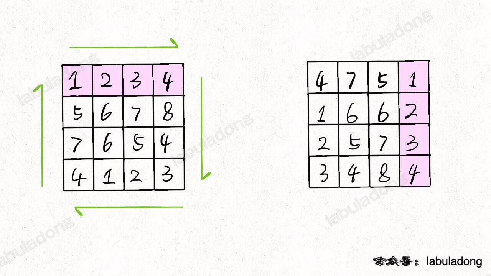

# labuladong算法学习笔记

labuladong文档中代码没有使用js，故这篇学习笔记主要用于记录使用js/ts实现对应部分的代码，详细算法解析等推荐配合原著阅读[labuladong的github站](https://labuladong.github.io/algo/)|[labuladong的gitee站](https://labuladong.gitee.io/algo/)

## 二叉树

二叉树既可以递归(前中后序遍历)也可以遍历(层序遍历)，其中递归的三种方式对应这三个处理问题的不同节点：前序位置仅能获取从父节点传来的参数，后序位置还能获取子树函数返回值  

另外，二叉树的递归还可从遍历一遍二叉树(回溯法)和分解问题(动态规划)两个角度来看待  

设计例题：leetcode 的104题二叉树的最大深度

```ts
// 分解问题的解法
function maxDepth(root: TreeNode | null): number {
  if(root === null) return 0;
  let leftMax:number = maxDepth(root.left);
  let rightMax:number = maxDepth(root.right);
  let res = Math.max(leftMax, rightMax) + 1;
  return res;
};
// 遍历或者说回溯的解法
class Solution {
  res:number = 0;
  deep:number = 0;
  maxDepth(root: TreeNode | null):number{
    this.traverse(root);
    return this.res;
  }
  traverse(root: TreeNode | null):void {
    if(root === null) return;
    this.deep++;
    if(root.left === null && root.right === null) {
      this.res = Math.max(this.deep, this.res);
    }
    this.traverse(root.left);
    this.traverse(root.right);
    this.deep--;
  }
  static test(root){
    let demo = new Solution();
    let res = demo.maxDepth(root);
    return res;
  }
}
```

- leetcode 144题：二叉树的前序遍历

```ts
// 由于分解问题的方式代码看起来简洁
function preorderTraversal(root: TreeNode | null): number[] {
  if(!root || root.val===undefined) return [];
  let left:number[] = preorderTraversal(root.left);
  let right:number[] = preorderTraversal(root.right);
  return [].concat(root.val, left, right);
};
// 遍历的做法
class Solution {
  private res:number[] = [];

  preorderTraversal(root: TreeNode | null): number[]{
    this.traverse(root);
    return this.res;
  }

  traverse(root: TreeNode | null):void{
    if(!root || root.val ===undefined) return;
    this.res.push(root.val);
    this.traverse(root.left);
    this.traverse(root.right);
  }
  static test(root: TreeNode | null):number[]{
    let demo = new Solution();
    return demo.preorderTraversal(root);
  }
}
```

- leetcode 543题：二叉树的直径  
直径即节点间的距离，即两个节点之间相距一个单位，由此可得：每一条二叉树的「直径」长度，就是一个节点的左右子树的最大深度之和

```ts
class Solution {
  private MaxPath = 0;
  diameterOfBinaryTree(root:TreeNode | null):number{
    this.deepMax(root);
    return this.MaxPath;
  }
  deepMax(root:TreeNode | null):number{
    if(!root || root.val === undefined) return 0;
    let leftMax = this.deepMax(root.left);
    let rightMax = this.deepMax(root.right);
    this.MaxPath = Math.max(this.MaxPath, leftMax + rightMax); // 在后续位置计算最大直径
    return 1 + Math.max(leftMax, rightMax); // 函数返回作为子树时的最大深度
  }
  static test(root: TreeNode | null): number {
    if(!root || root.val === undefined) return 0;
    let demo = new Solution();
    return demo.diameterOfBinaryTree(root);
  }
}
```

### 二叉树思路篇

二叉树解题思路分为两类：  

1. 能否通过遍历二叉树获得答案
2. 能否通过递归(子问题)推导出答案

- leetcode 226 翻转二叉树

思路：
遍历的解法，遍历每个节点，交换左右子节点  
递归的解法，分别翻转节点的左右子树，然后交换左右子树

```ts
function invertTree(root: TreeNode | null): TreeNode | null {
  reverse(root);
  return root; // 遍历的方法
  // return recursion(root); // 递归方法
};

function reverse(root:TreeNode|null):TreeNode|null{
  if(!root) return null; // 交换左右节点，随后遍历其他节点
  let temp = root.left;
  root.left = root.right;
  root.right = temp;
  reverse(root.left);
  reverse(root.right);
}
function recursion(root:TreeNode|null):TreeNode|null{
  if(!root) return null; // 翻转左右子树
  let left = recursion(root.left);
  let right = recursion(root.right);
  root.left = right; // 交换左右子树
  root.right = left;
  return root;
}
```

- leetcode 116 填充每个二叉树节点的右侧指针

给定完美二叉树，所有叶子结点都在同一层，填充next指针指向下一个右侧节点，若无则填充为null

思路：可通过遍历的方法来解题，我们实际要遍历的是两个节点之间的空隙，可以将来相邻的两个节点看做一个，因此二叉树被抽象成了三叉树，遍历这颗“三叉树”  
此题暂无递归的解法  

```ts
function connect(root: Node | null): Node | null {
  if(root === null) return null;
  traverse(root.left, root.right); // 遍历“三叉树”，需要输入两个相邻的节点
  return root;
};

function traverse(node1:Node|null, node2:Node|null){
  if(node1 === null || node2 === null) return;
  node1.next = node2; // 连接两个相邻节点
  traverse(node1.left, node1.right); // 遍历下一个“三叉树”节点
  traverse(node2.left, node2.right);
  traverse(node1.right, node2.left);
}
```

- leetcode 114 将二叉树展开为链表

给定根节点root，展开为单链表，展开后right指向下一个节点，左子节点为null，展开后单链表与二叉树先根序遍历顺序相同  

思路：因为需要原地展开，只能使用递归的方式：先展开左子树，然后展开右子树，将右子树连接到左子树下方，然后将整个左子树作为右子树

```ts
function flatten(root: TreeNode | null): void {
  if(root === null) return;
  flatten(root.left); // 展开左右子树
  flatten(root.right);
  let left = root.left; // 缓存左右子树节点
  let right = root.right;
  root.left = null; // 连接root节点
  root.right = left;
  let p = root; // 循环遍历到拉伸后左子树的末尾节点
  while(p.right !== null){
    p = p.right;
  }
  p.right = right; // 连接右子树
};
```

### 二叉树构造篇

构造问题一般使用分解问题的思路，即根节点+构造左子树+构造右子树

- leetcode 654 最大二叉树

给定无重复元素的整数数组，根节点为最大元素，左子树为最大元素左边的部分构造的最大二叉树，右子树为有部分  

思路：遍历数组找到最大值及其索引，分别取左右部分递归构造左右子树

```ts
function constructMaximumBinaryTree(nums: number[]): TreeNode | null {
  return build(nums, 0, nums.length - 1);
};
function build(nums:number[], start:number, end:number):TreeNode|null{
  if(start > end) return null;
  let maxVal = Number.MIN_SAFE_INTEGER;
  let index = -1;
  for(let i = start; i <= end; i++){ // 遍历查找最大值
    if(maxVal > nums[i]) continue;
    maxVal = nums[i];
    index = i;
  }
  let root = new TreeNode(maxVal); // 递归构造左右子树
  root.left = build(nums, start, index - 1);
  root.right = build(nums, index+1, end);
  return root;
}
```

- leetcode 105 从前序和中序遍历结果构造二叉树(无重复元素)

思路：前序遍历第一个元素即为根节点，在中序中找到对应节点，其左边对应即为左子树，右边为右子树，在前序序列中找到对应的左右子树，递归构造左右子树

```ts
function buildTree(preorder: number[], inorder: number[]): TreeNode | null {
  return build(preorder, inorder , [0, preorder.length - 1, 0, inorder.length - 1]);
};
function build(preorder:number[], inorder:number[], [pStart, pEnd, iStart, iEnd]:number[]){
  if(pStart > pEnd || iStart > iEnd) return null;
  let root = new TreeNode(preorder[pStart]); // 构造根节点
  let iRootIndex = -1; // 查找根节点在中序序列中的索引
  for(let i = iStart; i <= iEnd; i++){
    if(preorder[pStart] === inorder[i]) iRootIndex = i;
  }
  if(iRootIndex === -1) return null;
  let leftLength = iRootIndex - iStart; // 计算左子序列长度， PS：单闭区间长度
  root.left = build(preorder, inorder, [pStart+1, pStart+leftLength, iStart, iStart + leftLength - 1]); // 递归构造左右子树
  root.right = build(preorder, inorder, [pStart + leftLength + 1, pEnd, iRootIndex+1, iEnd]);
  return root;
}
```

- leetcode 106 通过中序和后序遍历结果构造二叉树(无重复，与上题类似)

```ts
function buildTree(inorder: number[], postorder: number[]): TreeNode | null {
  return build(inorder, postorder, [0, inorder.length-1, 0, postorder.length-1]);
};
function build(inorder:number[], postorder:number[], [iStart, iEnd, pStart, pEnd]:number[]):TreeNode |null {
  if(iStart > iEnd || pStart > pEnd) return null;
  let root = new TreeNode(postorder[pEnd]);
  let iRootIndex = -1;
  for(let i = iStart; i <= iEnd; i++){
    if(postorder[pEnd] === inorder[i]) iRootIndex = i;
  }
  if(iRootIndex === -1) return null;
  let leftLength = iRootIndex - iStart;
  root.left = build(inorder, postorder, [iStart, iRootIndex - 1, pStart, pStart + leftLength - 1]);
  root.right = build(inorder, postorder, [iRootIndex+1, iEnd, pStart + leftLength, pEnd - 1]);
  return root;
}
```

- leetcode 889 通过后序和前序遍历结果构造二叉树

与上题类似，但通过后序和前序无法确定唯一一颗二叉树，因此返回任意一种结果即可  

思路：与上题区别在于左右子树范围的确定方式，首先取前序序列第一个元素为根节点，第二个元素为左子树的根节点，遍历后序序列找到左子树根节点，确定左右子树边界，递归构造左右子树即可

```ts
function constructFromPrePost(preorder: number[], postorder: number[]): TreeNode | null {
  return build(preorder, postorder, [0, preorder.length - 1, 0, postorder.length - 1]);
};

function build(preorder:number[], postorder:number[], [pStart, pEnd, bStart, bEnd]:number[]):TreeNode|null{
  if(pStart > pEnd || bStart > bEnd) return null;
  let root = new TreeNode(preorder[pStart]);
  if(pStart === pEnd) return root;
  let boundIndex = -1;
  for(let i = bStart; i < bEnd; i++){
    if(preorder[pStart+1] === postorder[i]) boundIndex = i;
  }
  if(boundIndex === -1) return null;
  let leftLength = boundIndex - bStart; // 半闭区间，但此时应包含root，故左区间终点+1
  root.left = build(preorder, postorder, [pStart+1, pStart+leftLength+1, bStart, boundIndex]); // 右子树起点对应调整
  root.right = build(preorder, postorder, [pStart+leftLength+2, pEnd, boundIndex+1, bEnd - 1]);
  return root;
}
```

### 二叉树序列化与反序列化

- leetcode 297 二叉树的序列化与反序列化

类似与json的序列化与反序列化，只要两个函数自洽即可；  
通常将二叉树序列化为字符串，可采用前序遍历、中序遍历、后序遍历、层序遍历的方式，空节点采用特殊占位符'#'占位便于反序列化  
其中由于中序遍历无法确定根节点位置，故无法进行反序列化

```ts
function serialize(root: TreeNode | null): string {
  return Solution.layerSerialize(root);
};
function deserialize(data: string): TreeNode | null {
  let strArr = data.split(','); // 去掉分隔符，转换为数组方便处理
  return Solution.layerDeserialize(strArr);
};

class Solution {
  // 前序遍历实现
  static preSerialize(root:TreeNode|null):string{
    if(root === null) return '#';
    let res:string[] = []; // 先收集字符串，返回时使用分隔符拼接
    res.push(root.val.toString());
    res.push(Solution.preSerialize(root.left))
    res.push(Solution.preSerialize(root.right))
    return res.join(',');
  }
  static preDeserialize(strArr:string[]):TreeNode|null{
    if(strArr.length < 1) return null;
    let val = strArr.shift();
    if(val === '#') return null;
    let root = new TreeNode(Number(val));
    root.left = Solution.preDeserialize(strArr);
    root.right = Solution.preDeserialize(strArr);
    return root;
  }
  // 后序遍历实现
  static postSerialize(root:TreeNode|null):string{
    if(root === null) return '#';
    let res:string[] = [];
    res.push(Solution.postSerialize(root.left));
    res.push(Solution.postSerialize(root.right));
    res.push(root.val.toString());
    return res.join(',')
  }
  static postDeserialize(strArr:string[]):TreeNode|null{
    if(strArr.length < 1) return null;
    let val = strArr.pop();
    if(val === '#') return null;
    let root = new TreeNode(Number(val)); // 为了确定根节点，需要从右子树开始反序列化
    root.right = Solution.postDeserialize(strArr);
    root.left = Solution.postDeserialize(strArr);
    return root;
  }
  // 层序遍历实现
  static layerSerialize(root:TreeNode|null):string{
    let dp:Array<TreeNode|null> = [root]; // 队列存储节点
    let res:string[] = []; // 收集结果
    while(dp.length>0){
      let curNode = dp.shift();
      if(curNode === null){ // 遇到空节点收集结果，但不推入队列
        res.push('#');
        continue;
      };
      res.push(curNode.val.toString());
      dp.push(curNode.left, curNode.right); // 将左右子节点推入队列
    }
    return res.join(',');
  }
  static layerDeserialize(strArr:string[]):TreeNode|null{
    if(strArr.length < 1) return null;
    let val = strArr.shift();
    if(val === '#') return null;
    let root = new TreeNode(Number(val)); // 确定根节点
    let dp:TreeNode[] = [root]; // 使用队列存储节点
    while(dp.length > 0){
      let curNode = dp.shift();
      let leftVal = strArr.shift(); // 分别获取左右子节点的值进行判断
      let rightVal = strArr.shift();
      if(leftVal !== '#') { // 左子节点不为空则恢复节点并推入队列，若为空则不用处理
        curNode.left = new TreeNode(Number(leftVal));
        dp.push(curNode.left);
      }
      if(rightVal !== '#') {
        curNode.right = new TreeNode(Number(rightVal));
        dp.push(curNode.right);
      }
    }
    return root;
  }
}
```

### 二叉树巧用后序遍历

- leetcode 652 寻找重复的子树

如果两棵树具有 相同的结构和相同的结点值 ，则认为二者是重复的。

思路：对于子树可使用序列化的方式描述，遍历二叉树，使用哈希表存储子树的描述，发现重复则将对应根节点推入结果收集器中  
可选用前序、后序、层序的方式，但遍历过程中就是在遍历各子树，因此可以同时查重，而查重需要完整的子树序列(即包含当前根节点)，故后序遍历最为合适

```ts
function findDuplicateSubtrees(root: TreeNode | null): Array<TreeNode | null> {
  let soluton = new Solution();
  soluton.traverse(root);
  return soluton.res;
};
class Solution {
  cacheMap = new Map<string, number>();
  res:TreeNode[] = [];
  traverse(subRoot:TreeNode|null):string{
    if(subRoot === null) return '#';
    let res:string[] = [];
    res.push(this.traverse(subRoot.left));
    res.push(this.traverse(subRoot.right));
    res.push(subRoot.val.toString());
    let strTree = res.join(','); // 后序遍历序列化的过程会递归序列化子树，在此过程可查重
    if(this.cacheMap.get(strTree) === 1){ // 第二次出现，加入结果数组，增加次数
      this.res.push(subRoot);
      this.cacheMap.set(strTree, 2);
      // 首次出现，记录次数，出现次数>=2则不做记录，放置多次记录重复的子树
    } else if(!this.cacheMap.get(strTree)) this.cacheMap.set(strTree, 1);
    return strTree;
  }
}
```

### 二叉树之归并排序

- leetcode 912 排序数组 给定整数数组按升序排列

思路：虽然题目没有规定使用的排序算法，但此处尝试结合二叉树使用归并排序  
归并排序本质是将排序问题拆分为子问题，然后合并两个排序好的序列，类似于二叉树的后序遍历框架

```ts
function sortArray(nums: number[]): number[] {
  merge(nums, 0, nums.length - 1)
  return nums;
};
function merge(nums:number[], start, end):number[]{ // 选取闭区间[start, end]
  if(start >= end) return [] // 单个元素则直接返回
  let mid = start + Math.floor((end - start) / 2); // 确定分隔点
  merge(nums, start, mid); // 递归左右序列
  merge(nums, mid + 1, end); // 在后序遍历位置合并序列
  let left = start, right = mid + 1; // 双指针合并左右子数组(类似双指针合并链表)
  let res = new Array(end - start + 1).fill(-999);
  for(let i = 0; i <= end - start + 1; i++){
    if(left > mid){
      res.splice(i, end - right + 1, ...nums.slice(right, end+1))
      break;
    } else if (right > end){
      res.splice(i, mid - left + 1, ...nums.slice(left, mid+1))
      break;
    } else if (nums[left] > nums[right]){
      res[i] = nums[right];
      right++;
    } else if (nums[left] <= nums[right]){
      res[i] = nums[left];
      left++;
    }
  }
  nums.splice(start, end - start + 1, ...res);
  return nums;
}
```

- leetcode 315 计算右侧小于当前元素的个数

给定整数数组 nums ，返回新数组 counts，其中`counts[i]`的值是`nums[i]`右侧小于`nums[i]`的元素的数量。

思路：遍历nums，对与每个值i想知道其后有多少小于i的值，旧必须遍历完成整个数组，这就类似与后序遍历框架，先完成子问题，然后解决当前问题  
直接应用后序遍历框架则复杂度与暴力遍历解法没有区别，观察归并排序过程发现，当将某元素i填充至res临时数组中时,左子树中比i小的元素数量为右子序列已填充的元素数(right - mid - 1)，而对于右子树中的元素，因为已经排序，右侧不存在比当前元素小的数  
因此可以对归并算法修改，递归累计计数

```ts
function countSmaller(nums: number[]): number[] {
  let count = new Array(nums.length).fill(0);
  let tempArr = nums.map((val, index) => ({val, index})); // 辅助排序数组，记录到count的索引映射
  const mergeCount = (nums:{val:number, index:number}[], start, end) => {
    if(start >= end) return; // 对辅助数组进行归并排序
    let mid = start + Math.floor((end - start) / 2);
    mergeCount(nums, start, mid);
    mergeCount(nums, mid + 1, end);
    let left = start, right = mid + 1;
    let res = new Array(end - start + 1).fill(-999);
    for(let i = 0; i < end - start + 1; i++){
      if(left > mid){
        res[i] = nums[right++];
      } else if (right > end){ // 右侧序列全部填充，左侧剩余的元素都大于右侧序列
        res[i] = nums[left]; // 收集剩余的左侧元素，对每个左侧元素累计计数
        count[nums[left].index] += end - mid
        left++
      } else if (nums[left].val > nums[right].val){
        res[i] = nums[right++];
      } else if(nums[left].val <= nums[right].val){
        res[i] = nums[left]; // 收集左侧元素，统计此前已填充的右侧元素
        count[nums[left].index] += right - mid - 1
        left++
      }
    }
    nums.splice(start, end - start + 1, ...res);
  }
  mergeCount(tempArr, 0, tempArr.length - 1);
  return count;
};
```

- leetcode 493 翻转对

给定一个数组 nums ，如果 i < j 且 `nums[i] > 2*nums[j]` 我们就将 (i, j) 称作一个重要翻转对。返回翻转对的数量

思路：与315题类似相当于查找条件变为`nums[i] > 2*nums[j]`,因此同样可以使用归并排序来解题，但与315题不同，统计数量的时机不能与排序判断的代码融合，因此考虑增加一个循环来独立统计反转对的数量  
使用左右指针同时遍历左右排好序的子序列，固定左指针，移动右指针到刚好不满足`nums[i] > 2*nums[j]`条件，即此时i处元素均与`[mid + 1, j)`构成翻转对  

```ts
function reversePairs(nums: number[]): number {
  let solution = new Solution();
  solution.merge(nums, 0, nums.length - 1);
  return solution.count;
};

class Solution {
  count:number = 0;
  merge(nums:number[], start:number, end:number){
    if(start >= end) return;
    let mid = start + Math.floor((end - start) / 2);
    this.merge(nums, start, mid);
    this.merge(nums, mid+1, end);
    let right = mid + 1;
    for(let left = start; left <= mid; left++){ // 对左序列的每个元素统计翻转对
      while(right <= end && nums[left]/2 > nums[right]) right++;
      this.count += right - (mid + 1); // 恰好不满足条件时，统计左闭右开区间元素数量
    } // 随后进行就地修改的归并排序
    let left = start, res = new Array(end - start + 1).fill(-999);
    right = mid + 1;
    for(let i = 0; i < end - start + 1; i++){
      if(left > mid){
        res.splice(i, end - right + 1, ...nums.slice(right, end + 1));
        break;
      } else if(right > end){
        res.splice(i, mid - left + 1, ...nums.slice(left, mid + 1));
        break;
      } else if(nums[left] > nums[right]){
        res[i] = nums[right++];
      } else if(nums[left] <= nums[right]){
        res[i] = nums[left++];
      }
    }
    nums.splice(start, end - start + 1, ...res);
    return nums;
  }
}
```

- leetcode 327 区间和的个数

给定数组nums，及整数lower、upper，求有多少个区间求和后在`[lower, upper]`范围内

思路：利用之前的前缀和数组，可以求得任意区间的和，因此同样可以利用索引i,j计算区间，表述成数学语言即为:`count[i] = COUNT(j) where lower <= preSum[j] - preSum[i] <= upper`,  
题目仅要求统计不要求索引，因此可以对前缀和数组进行归并排序，并在归并过程中比较区间和是否在目标范围  
每次和并左右序列时，可在左序列中遍历固定左边界left，在右序列中使用双指针找到刚好满足范围的下届minRight，和刚好不满足范围的上届maxRight,因此maxRight - minRight就是固定左边界left后满足目标范围的区间数  

```ts
function countRangeSum(nums: number[], lower: number, upper: number): number {
  let demo = new Solution(nums, lower, upper);
  return demo.count;
};

class Solution {
  count:number = 0;
  preSum:number[] = [];
  lower:number;
  upper:number;
  constructor(nums:number[], lower:number, upper:number){
    this.lower = lower;
    this.upper = upper
    // 构造前缀和数组
    this.preSum = new Array(nums.length+1).fill(0);
    for(let i = 0; i < nums.length; i++){
      this.preSum[i+1] = nums[i] + this.preSum[i];
    }
    this.merge(this.preSum, 0, this.preSum.length - 1)

  }
  merge(nums:number[], start:number, end:number){
    if(start >= end) return;
    let mid = start + Math.floor((end - start)/2);
    this.merge(nums, start, mid);
    this.merge(nums, mid + 1, end);
    let minRight = mid + 1, maxRight = mid + 1; // 初始化最小/最大右边界
    for(let left = start; left <= mid; left++){ // 遍历左子序列作为左边界
      // 找到恰好满足条件的右边界(最小右边界)
      while(minRight <= end && nums[minRight] - nums[left] < this.lower) minRight++;
      // 找到恰好不满足的右边界(最大右边界)
      while(maxRight <= end && nums[maxRight] - nums[left] <= this.upper) maxRight++;
      this.count += maxRight - minRight; //统计满足条件的区间数量[minRight, maxRight）
    }
    let res = new Array(end - start + 1).fill(-999); // 归并排序
    let left = start, right = mid + 1;
    for(let i = 0; i < end - start + 1; i++){
      if(left > mid) {
        res.splice(i, end - right + 1, ...nums.slice(right, end + 1));
        break;
      } else if(right > end) {
        res.splice(i, mid - left + 1, ...nums.slice(left, mid + 1));
        break;
      } else if(nums[left] > nums[right]) res[i] = nums[right++];
      else if(nums[left] <= nums[right]) res[i] = nums[left++];
    }
    nums.splice(start, end - start +1, ...res);
  }
}
```

### 二叉搜索树特性篇

- leetcode 230 二叉搜索树中第K小的元素

给定二叉搜索树，找出其中第k小的元素

思路：中序遍历展开，定义变量在中序遍历时计数，并比对计数是否为k，若等于k则返回对应元素即可

```ts
function kthSmallest(root: TreeNode | null, k: number): number {
  let solution = new Solution();
  solution.traverse(root, k);
  return solution.res;
};
class Solution {
  count:number = 0;
  res:number;
  traverse(root:TreeNode|null, k:number){
    if(root === null) return;
    this.traverse(root.left, k);
    this.count++; // 中序位置计数并判断是否为第k个
    if(this.count === k){
      this.res = root.val;
      return;
    }
    this.traverse(root.right, k);
  }
}
```

- leetcode 538 把二叉搜索树转换为累加树

给定根节点，该树节点值各不相同，将其转换为累加树，每个节点的新值为树中所有大于等于该节点原来值的节点值之和(包括自己),如：
某节点值为4, 树中节点值大于4的节点有 5, 6, 7, 8，再加上节点本身，因此该节点新值为4+5+6+7+8=30

思路：可利用中序遍历有序的属性，维护sum累加值，并降序遍历(右根左)，累加每个节点的值，并赋给当前节点即可实现累加树的转换

```ts
function convertBST(root: TreeNode | null): TreeNode | null {
  let solution = new Solution();
  solution.traverse(root);
  return root;
};
class Solution {
  sum:number = 0;
  traverse(root:TreeNode|null){
    if(root === null) return;
    this.traverse(root.right); // 先遍历右子树，即满足大于该节点的值先累加
    this.sum += root.val; // 中序位置累加，并更新节点值
    root.val = this.sum;
    this.traverse(root.left);
  }
}
```

- leetcode 1038 从二叉搜索树到更大和树

与上题相同，直接采用上题解法即可

### 二叉搜索树基操篇

- 98. 验证二叉搜索树

给定根节点，判断是否为一个有效的二叉搜索树  
每个节点应该小于右边子树的所有节点，大于左边子树的左右节点  

```ts
function isValidBST(root: TreeNode | null): boolean {
  return Solution.isValidBST(root, null, null); // 初始判断将任务交由边界重叠的左右递归
};

class Solution {
  static isValidBST(root: TreeNode, min:TreeNode, max:TreeNode){
    if(root === null) return true;
    // 判断大小与递归条件判断有部分重叠，这样才能保证能进行连续递归
    if(min != null && root.val <= min.val) return false;
    if(max != null && root.val >= max.val) return false;
    // 左子树的最大值即为root.val， 右子树的最小值为root.val
    return Solution.isValidBST(root.left, min, root) && Solution.isValidBST(root.right, root, max);
  }
}
```

- 700. 二叉搜索树中的搜索

给定二叉搜索树的根节点root和目标数值val，找到val在树中的位置并返回对应的子树根节点

```ts
function searchBST(root: TreeNode | null, val: number): TreeNode | null {
  if(root === null) return null;
  if(root.val > val) return searchBST(root.left, val);
  if(root.val < val) return searchBST(root.right, val);
  return root;
};
```

- 701. 二叉搜索树中的插入操作

```ts
function insertIntoBST(root: TreeNode | null, val: number): TreeNode | null {
  if(root === null) return new TreeNode(val);
  if(root.val > val){ // 为了链接创建的node，需要接收递归函数的返回节点
    root.left = insertIntoBST(root.left, val);
  } else if(root.val < val){
    root.right = insertIntoBST(root.right, val);
  }
  return root;
};
```

- leetcode 450. 删除二叉搜索树中的节点

删除给定二叉搜索树root中的值为key的节点(需要同时保证二叉搜索树的性质)

思路：先找到对应节点，删除节点需要断开链接，因此需要接收递归函数的返回值  
找到要删除的节点后，对应3种情况：

1. 节点为叶子节点，返回null，若将root赋值为null，均可删除
2. 节点只有左子树或右子树，则将左子树或右子树节点直接返回或赋值给root即可安全删除root
3. 节点有左右子树，则需要将左子树中的最大值或右子树中的最小值与root对调，并在对应的子树中删除之前最小值或最大值对应的节点

```ts
function deleteNode(root: TreeNode | null, key: number): TreeNode | null {
  if(root === null) return null;
  // 先找到要刪除节点的位置
  if(root.val === key){
    // 若该节点为叶子结点，则直接删除，返回null即可
    if(root.left === null && root.right === null) return null;
    // 若该节点仅有一个子节点，则返回对应子节点即相当于删除当前节点
    if(root.left === null) return root.right;
    if(root.right === null) return root.left;
    // 若该节点有左右子节点，则需要找到左子树中最大值或右子树中的最小值来替换当前节点
    let min:TreeNode = getMin(root.right); // 以右子树中的最小值为例
    root.right = deleteNode(root.right, min.val); // 从右子树中删除找到的最小值
    // 将最小值替换为当前节点，即相当于删除了当前节点
    min.left = root.left;
    min.right = root.right;
    root = min;
  } else if(root.val > key){
    root.left = deleteNode(root.left, key);
  } else if(root.val < key){
    root.right = deleteNode(root.right, key);
  }
  return root;
};
function getMin(node:TreeNode):TreeNode{ // 循环查找右子树中的最小值
  while(node.left !== null) node = node.left;
  return node;
}
```

### 二叉搜索树构造篇

[微信文档](https://mp.weixin.qq.com/s?__biz=MzAxODQxMDM0Mw==&mid=2247490696&idx=1&sn=798a350fcca16c89572caf65323dbec7&chksm=9bd7e280aca06b961613987e49b59cfc0faa67276b732c2ed664a8bb81daf8487a103ac0d0ce&mpshare=1&scene=1&srcid=0215YXvxGddJsWficBrwbPej&sharer_sharetime=1676472487897&sharer_shareid=7c8b9b306ef0d4ec2ab85fd7032f2a98&exportkey=n_ChQIAhIQNydoTKn3L3iXxpf7Y64kbhKJAgIE97dBBAEAAAAAACy6FDRrUVAAAAAOpnltbLcz9gKNyK89dVj0V%2FqG2kmLTI706Hp9c4mVtAEWw1%2FPpZ%2FTQX4e0oq56urQykvIY5huS7meXR2F8GRW1Q9Y7SUmq7f8V19Se9mK4x7ogFG09ahotOa%2FGDrojmDengoE0u6C%2FSoohA4Do4ITxU1%2BUeEqkj33V3e5I7Ai57VOyE5bekCc8%2BSntu6okoucv7gMceIukVIVyMFv9W4%2FIz2iz8jf7b0W51LBm8Xja2XW5jQKGWg1PzzqvIGYZlq2BDMgOXsobReQtWDRhGkmnPvAiq78zSy%2BkC0u4iYWzSwPRcX9Tbab5wo6UwjMcZhMos4%3D&acctmode=0&pass_ticket=XdTtQGuDnTawHkShWtgXBzSXfE3o%2FQ58rxJGUNhnI9KfJtyvvZmWdihREjXyue8%2Bs5l6My46FwmUguPjNziAVw%3D%3D&wx_header=0#rd)

- leetcode 96 不同的二叉搜索树

给定整数n，求值为1到n的节点能组成多少种互不相同的二叉搜索树

思路：循环固定单一节点，则能组合的数量为左右子树组合数相乘，因此可以实现函数count，用于计算闭区间`[left, right]`能组成的互不相同的二叉搜索树的数量，函数中循环固定每个节点，并递归计算每个节点固定后左右区间(即左右子树)能构成的组合数，累加整个循环即可得当前区间能组成的组合数；  
对于空区间，则对应这null节点，因此可记为组合数1，并作为base条件返回  
计算区间的过程拆分成了子问题，因此可以通过“打表”的方式，添加cache避免重复计算  

```ts
function numTrees(n: number): number {
  let demo = new Solution(n);
  return demo.count(1, n);
};

class Solution {
  cache:number[][]; // 缓存已经计算过的组合，加速计算过程
  constructor(n:number){
    this.cache = new Array(n+1).fill(0).map(i => new Array(n+1).fill(0));
  }
  count(left:number, right:number):number{
    if(left > right) return 1; // 空区间节点为null ，组合数为1
    let res = 0; // 初始化本区间组合数，查表有值则直接返回
    if(this.cache[left][right] != 0) return this.cache[left][right];
    for(let i = left; i <= right; i++){ // 循环固定区间中的i节点
      let nLeft = this.count(left, i - 1); // 每轮循环中计算左右子树的组合数
      let nRight = this.count(i+1, right);
      res += nLeft * nRight; // 左右子树相乘即为本轮循环的组合数，累计记录
    }
    this.cache[left][right] = res; // 将对应区间的组合数存入表中，并返回对应的值
    return res;
  }
}
```

- leetcode 95 不同的二叉搜索树 二

给定整数n，返回值为1到n的节点能组成的所有互不相同的二叉搜索树根节点组成的列表

思路：与上题类似，转换为区间子问题，在组装结果时则需要双重循环，将左右子树的不同组合组装到根节点上，并用结果数组记录即可

```ts
function generateTrees(n: number): Array<TreeNode | null> {
  if(n === 0) return [];
  return build(1, n);
};

function build(left:number, right:number):Array<TreeNode|null>{
  let res:Array<TreeNode|null> = []
  if(left > right){
    res.push(null);
    return res;
  }

  for(let i = left; i <= right; i++){
    let NLeft = build(left, i - 1);
    let NRight = build(i+1, right);

    for( let NL of NLeft){
      for(let NR of NRight){
        let root = new TreeNode(i);
        root.left = NL;
        root.right = NR;
        res.push(root);
      }
    }
  }
  return res;
}
```

### 快速排序详解及应用

[微信文档](https://mp.weixin.qq.com/s/8ZTMhvHJK_He48PpSt_AmQ)  

- leetcode 912 排序数组

之前的通过归并排序解过此题，这次通过快速排序法解题  
思路：快速排序法通过选定基准数，将小于基准的移动到左边，大于基准的移动到右边，再对左右子区间递归快速排序  
这个过程为二叉树的前序遍历，并同时也在构造二叉搜索树的过程  
数组长度为N，则partition需要执行N次，时间复杂度为O(N)，节点分布均匀的理想状态下树的层数为logN，最坏的情况为N, 所以算法时间复杂度为O(NlogN)，最坏为O(N^2)  

```ts
function sortArray(nums: number[]): number[] {
  if(nums.length <= 1) return nums;
  quickSort(nums, 0, nums.length - 1);
  return nums;
};

function quickSort(nums:number[], left:number, right:number):void{
  if(left >= right) return;
  let p = partition(nums, left, right);
  quickSort(nums, left, p-1);
  quickSort(nums, p+1, right);
}

function partition(nums:number[], left:number, right:number):number{
  let mid = nums[left];
  let i = left + 1, j = right;
  while(i <= j){
    while(i < right && nums[i] <= mid) i++;
    while(j > left && nums[j] > mid) j--;
    if(i >= j) break;
    let temp = nums[i];
    nums[i] = nums[j];
    nums[j] = temp;
  }
  let temp = nums[left];
  nums[left] = nums[j];
  nums[j] = temp;
  return j;
}
```

- leetcode 215 数组中的第k个最大元素

即寻找数组中第k大的元素  
思路：两种解法：二叉堆(优先队列)的解法和快速排序的变体，快速选择算法  
快速选择算法：
在快速排序算法中，通过选定基准mid，获取了左右子区间，而子区间长度则表示了mid在数组中的正确位置，因此可以考虑降序排序数组，当左子区间长度为`k - 1`时，mid则为第k大元素  
或升序排序数组求取第N - k小的元素，即为第k大元素  

```ts
function findKthLargest(nums: number[], k: number): number {
  let i = 0, j = nums.length - 1;
  k = nums.length - k;
  while(i <= j){
    let p = partition(nums, i, j);
    if(p < k) i = p+1;
    else if(p > k) j = p - 1;
    else return nums[p]
  }
  return -1
};

function partition(nums:number[], left:number, right:number):number{
  if(left >= right) return right;
  let mid = nums[left];
  let i = left + 1, j = right;
  while(i <= j){
    while(i < right && nums[i] <= mid) i++;
    while(j > left && nums[j] > mid) j--;
    if(i >= j) break;
    let temp = nums[i];
    nums[i] = nums[j];
    nums[j] = temp;
  }
  let temp = nums[j];
  nums[j] = nums[left];
  nums[left] = temp;
  return j;
}
```

### 最近公共祖先问题

文章地址[GIT原理之最近公共祖先](https://mp.weixin.qq.com/s/njl6nuid0aalZdH5tuDpqQ)  

- leetcode 236 二叉树的最近公共祖先

给定一颗不含重复元素的二叉树以及其中两个节点p和q计算两节点最近的公共祖先节点

思路：公共祖先节点必定在其左右子树中分别发现p和q，或该节点为p或q  

```ts
function lowestCommonAncestor(root: TreeNode | null, p: TreeNode | null, q: TreeNode | null): TreeNode | null {
  if(!root) return null;
  if(root.val === p.val || root.val === q.val) return root; // 为当前节点
  let left = lowestCommonAncestor(root.left, p, q); // 遍历左子树查找
  let right = lowestCommonAncestor(root.right, p, q);
  if(left !== null && right !== null) return root; // 收集左右子树节点并判断
  return left !== null ? left : right; // 返回不为空的节点，若都为空则返回空节点
};
```

- leetcode 1644 二叉树的最近公共祖先 二

与236题类似，但p和q不一定存在于二叉树中，若p或q不存在于二叉树中，则返回null
此题被加锁，因此代码未被验证，但解题思路与236类似  
因为p和q不一定存在于树中，因此需要对树进行完整遍历，需要将root节点的判断放到后序位置，同时记录是否发现p或q节点，在获取结果后，判断过p或q不再树中则返回null  

```ts
let foundP = false, foundQ = false;

function lowestCommonAncestor(root: TreeNode | null, p:TreeNode|null, q:TreeNode|null): TreeNode | null {
  let res = find(root, p.val, q.val);
  if(!foundP || !foundQ) return null;
  return res;
};

function find(root:TreeNode|null, val1:number, val2:number):TreeNode|null{
  if(root === null) return null;
  let left = find(root.left, val1, val2);
  let right = find(root.right, val1, val2);
  if(left !== null && right !== null) return root;
  if(root.val === val1 || root.val === val2){
    if(root.val === val1) foundP = true;
    if(root.val === val2) foundQ = true;
    return root;
  }
  return left !== null ? left : right;
}
```

- leetcode 1650 二叉树的最近公共祖先 三

这次二叉树节点中包含指向父节点的指针parent  
由于存在父节点指针，因此可以不输入根节点，问题将装换为单链表的交点  
此题解法思路与[双指针之链表](#双指针之链表)中leetcode 160题相同  

- leetcode 1676 二叉树的最近公共祖先 四

与236题类似，但给定nodes节点列表，查找列表中节点的最近公共祖先  
此题被加锁，因此代码未被验证，但解题思路与236类似  

```ts
function lowestCommonAncestor(root: TreeNode | null, nodes:TreeNode[]): TreeNode | null {
  let valueHash = new Set();
  nodes.forEach(i => {
    valueHash.add(i.val);
  })
  return find(root, valueHash);
};

function find(root:TreeNode|null, values:Set<typeof root.val>):TreeNode|null{
  if(!root) return null;
  if(values.has(root.val)) return root;
  let left = find(root.left, values);
  let right = find(root.right, values);
  if(left !== null && right !== null) return root;
  return left !== null ? left : right;
}
```

- leetcode 235 二叉搜索树的最近公共祖先

与236题类似，但二叉树换成二叉搜索树，假设p.val < q.val， 则只有满足 p.val <= root <= q.val的节点才是最近的公共祖先，因此可以根据此条件对二叉搜索树进行搜索  

```ts
function lowestCommonAncestor(root: TreeNode | null, p:TreeNode|null, q:TreeNode|null): TreeNode | null {
  let val1 = Math.min(p.val, q.val);
  let val2 = Math.max(p.val, q.val);
  return find(root, val1, val2);
};

function find(root:TreeNode|null, val1:number, val2:number):TreeNode|null{
  if(root === null) return null;
  if(root.val > val2) return find(root.left, val1, val2); // 节点过大，在左子树中找
  if(root.val < val1) return find(root.right, val1, val2);
  return root;
}
```

### 其他二叉树相关问题

- leetcode 341 扁平化嵌套列表迭代器

给你一个嵌套的整数列表 nestedList， 每个元素要么是一个整数，要么是一个列表， 列表中可能是整数也可能是其他列表，实现迭代器类NestedIterator,会先被调用hasNext()方法，然后时next方法输出整数  

思路：分析nestedList结构可知，其对应着多叉树，当存储元素为整数时，表示叶子节点，对应列表时表示其他节点集合，因此可以通过遍历多叉树，缓存叶子节点的方式对列表进行迭代实现迭代器。  

这种方法在面对大数据量时可能会有性能问题，可以考虑在hasNext时迭代多叉树，使缓存数组的首个元素为叶子节点，调用next时直接返回整数即可  

文章地址[题目不让我做什么，我就偏要去做什么](https://mp.weixin.qq.com/s/uEmD5YVGG5LHQEmJQ2GSfw)  

```ts
class NestedIterator {
  list: Array<NestedInteger>
  constructor(nestedList: NestedInteger[]) {
    this.list = nestedList;
  }

  hasNext(): boolean { // 在hasNext中迭代保证this.list第一个元素为整数
    while (this.list.length > 0 && !this.list[0].isInteger()) {
      let temp = this.list.shift().getList();
      for (let i = temp.length - 1; i >= 0; i--) { // 倒序遍历，保持节点拍平顺序
        this.list.unshift(temp[i]);
      }
    }
    return this.list.length > 0;
  }

  next(): number {
    return this.list.shift().getInteger();
  }
}
```

- leetcode 222 完全二叉树的节点个数

完全二叉树的定义为每层都紧凑的靠左排列，对比于满二叉树(每层都是满的)，则是完全二叉树的一种特殊情况  
对于一颗普通的二叉树节点数可通过遍历每个节点统计获得  
若为满二叉树则节点数与高度呈指数关系：2^h - 1  
完全二叉树中一定有一大部分子树是满二叉树，因此可以考虑结合两种树节点的计算方法来计算完全二叉树的节点个数  

```ts
function countNodes(root: TreeNode | null): number {
  let left = root, right = root;
  let hLeft = 0, hRight = 0; // 沿着左侧和右侧分别计算高度
  while(left != null){
    left = left.left;
    hLeft++;
  }
  while(right != null){
    right = right.right;
    hRight++;
  } // 若高度相同则使用满二叉树的计算方法，否则使用普通二叉树的递归统计方法
  if(hLeft === hRight) return Math.pow(2, hLeft) - 1;
  return 1 + countNodes(root.left) + countNodes(root.right);
};
```

## 动态规划

动态规划三要素：重叠子问题、最优子结构、状态转移方程  
动态规划离不开递归算法(自顶向下分解问题)/递推算法(自底向上递推结果)  
ps:递归算法的时间复杂度怎么计算？就是用子问题个数乘以解决一个子问题需要的时间。

- 重叠子问题:通常使用备忘录(即打表)的方式避免重复的计算
- 状态转移方程：递推，确定状态转移方程的基本模式是：`明确 base case -> 明确「状态」-> 明确「选择」 -> 定义 dp 数组/函数的含义。`
- 最优子结构：子问题间相互独立，不相互影响

关联题：

- leetcode 322 零钱兑换  
如对于目标金额 amount=11 ，coins=[1, 2, 5], 分解问题可由 10+1, 9+2, 5+6的方式凑成，因此记`dp[i]`为凑成金额i的最少硬币数，仅此`dp[11] = min(dp[10], dp[9], dp[6]) + 1`, 初始base `dp[0] = 0`, 部分不能凑成的数额则记为-1，因此上述例子即可抽象出状态转移方程

```ts
function coinChange(coins: number[], amount: number): number {
  // 初始化dp为amount+1，就因为凑成amount最多使用amount个硬币
  let dp:number[] = new Array(amount+1).fill(amount+1);
  dp[0] = 0; // 初始话起始值
  for(let i = 0; i < dp.length; i++){ // 循环计算每个金额所需要的最少硬币数
    for(let coin of coins){ // 遍历尝试每个硬币组合
      if(i - coin < 0) continue; // 若遇到无法达成的组合则直接跳过
      dp[i] = Math.min(dp[i], 1 + dp[i - coin]); // 比较与更新硬币组合数
    }
  }
  // 若目标金额仍等于初始值，则返回无法凑成的结果
  return (dp[amount] === amount + 1) ? -1 : dp[amount]; 
};
```

- leetcode 509 斐波那契数
取初始值`dp[1] = 1`, `dp[2] = 1`,则从第3个数开始循环,计算`dp[n] = dp[n-1] + dp[n-2]`，并更新响应的两个缓存值，直到`i=n`则，返回此时的最新缓存值即可

```ts
function fib(n: number): number {
  let dp:[number, number] = [1, 1];
  if(n <= 0) return 0;
  if(n === 1 || n === 2) return dp[0];
  for(let i = 3; i <= n; i++) {
    let tmp = dp[0] + dp[1];
    dp[0] = dp[1];
    dp[1] = tmp;
  }
  return dp[1];
};
```

## 回溯法

回溯法需要考虑三个要素：路径、选择列表、结束条件;其本质是多叉树的遍历，在前序位置操作记录，在后续位置操作删除

- leetcode 46 全排列

```ts
interface Visited {[key:number]: boolean};

function permute(nums: number[]): number[][] {
  if(nums.length === 0) return [[]];
  if(nums.length === 1) return [nums];
  let demo = new Solution();
  return demo.permute(nums);
};

class Solution {
  res:number[][] = [];
  permute(nums: number[]): number[][] {
    // 主函数中初始化visited记录访问过的数字，track记录访问路径，即排列
    let visited:Visited = {};
    let track:number[] = [];
    this.backtrack(nums, track, visited);
    return this.res;
  }
  backtrack(nums:number[], track:number[], visited:Visited){
    if(track.length === nums.length){ // 终止条件，存储一种排列并返回
      this.res.push([...track]);
      return
    }
    for(let i = 0; i < nums.length; i++) {
      const val = nums[i];
      if(visited[val]) continue; // 跳过已访问的数字
      visited[val] = true; // 递归前标记访问，并记录节点
      track.push(val)
      this.backtrack(nums, track, visited);
      visited[val] = false; // 递归返回后，删除标记，并删除节点
      track.pop();
    }
  }
}
```

- leetcode 51 N皇后问题

```ts
function solveNQueens(n: number): string[][] {
  let demo = new Solution();
  return demo.solveNQueens(n);
};

class Solution {
  res:string[][] = [];
  solveNQueens(n: number): string[][] {
    let solve:string[][] = new Array(n).fill(0).map(item => new Array(n).fill('.'))
    solve[0][0] = 'Q';
    this.backtrack(solve, 0)
    return this.res;
  }
  backtrack(track:string[][], row:number){
    if(row === track.length){ // 本轮递归超过最后一行，因此收集结果结束递归
      this.res.push(track.map(item => item.join('')));
      return;
    }
    for(let col = 0; col < track.length; col++){ // 遍历当前列
      if(!this.isValid(col, row, track)) continue;
      track[row][col] = 'Q'; // 递归前标记
      this.backtrack(track, row+1); // 递归新的行
      track[row][col] = '.'; // 递归后回溯
    }

  }
  isValid(col:number, row:number, track:string[][]):boolean {
    let n = track.length; // 判断该位置是否能放置一个皇后
    for(let i = 0; i < row; i++){
      if(track[i][col] === 'Q') return false;
    }
    for(let i = row - 1, j = col - 1; i >=0 && j >= 0; i--, j--){
      if(track[i][j] === 'Q') return false;
    }
    for(let i = row - 1, j = col + 1; i >= 0 && j < n; i--, j++){
      if(track[i][j] === 'Q') return false
    }
     return true;
  }
}
```

## BFS算法框架

其核心思想是，把问题抽象成图，从一个点向四周扩散，使用队列暂存扩散点，方便进行下一轮迭代

- leetcode 111题 二叉树的最小深度

```ts
function minDepth(root: TreeNode | null): number {
  if(root == null) return 0;
  let queue:TreeNode[] = [];
  queue.push(root);
  let deep = 1; // 初始化层数
  while(queue.length > 0){
    let length = queue.length;
    for(let i = 0; i < length; i++) { // 仅对长度进行循环，不使用索引
      let cur:TreeNode = queue.shift(); // 每次从队头推出一个节点
      if(cur.left === null && cur.right === null) return deep; // 找到叶子节点则直接返回
      if(cur.left !== null) queue.push(cur.left); // 依次推入左右节点
      if(cur.right !== null) queue.push(cur.right);
    }
    deep++; // 遍历完一层更新层数
  }
  return deep;
};
```

- leetcode 752 打开转盘锁  
每次只能转动一个轮盘且轮盘只能转动一个数组，即当前状态下一步可能有8种转法(4个数字，上下2中转法)，使用最少的步骤转动轮盘到target组合，且过程中须避开deadends

```ts
function openLock(deadends: string[], target: string): number {
  let visited:Set<string> = new Set(); // 使用set记录访问记录，在visited中的组合不会被分析
  for(let key of deadends) visited.add(key); // 将deadends加入到visited中便于跳过
  let queue:string[] = ['0000']; // 初始化队列
  let step = 0;
  while(queue.length > 0) { // 队列不为空时进行遍历
    let len = queue.length;
    for(let i = 0; i < len; i++) { // 取当前层剩余的节点数作为遍历次数，而不用做索引
      let cur = queue.shift(); // 从队头中推出当前组合(节点)
      if(visited.has(cur)) continue // 当前节点已访问过或在deadends中则跳过该组合分析
      else visited.add(cur); // 将当前节点加入到visited中，避免后续重复分析
      if(cur == target) return step; // 若当前节点刚好等于目标密码，则直接返回步数
      for(let j = 0; j < 4; j++){ // 收集该组合(节点)的下一步可能状态，8种
        let tmp = plusOne(cur, j); // j position add number
        if(!visited.has(tmp)){ // node  visited then add to queue
          queue.push(tmp);
        }
        tmp = minusOne(cur, j); // j position minus number
        if(!visited.has(tmp)){
          queue.push(tmp);
        }
      }
    }
    step++; // analyze one node then add step
  }
  return -1; // not found solution then return -1
};
// circular add one
function plusOne(s:string, j:number):string{
  let tmp = Array.from(s);
  if(tmp[j] == '9') tmp[j] = '0'
  else tmp[j] = String(Number(tmp[j]) + 1)
  return tmp.join('');
}
// circular minus one
function minusOne(s:string, j:number):string{
  let tmp = Array.from(s);
  if(tmp[j] == '0') tmp[j] = '9'
  else tmp[j] = String(Number(tmp[j]) - 1);
  return tmp.join('');
}
```

## 回溯法解排列/组合/子集问题

排列/组合/子集问题可以归结为从nums数组中取出若干元素，对应情形有a：无重复不可复选，b：有重复不可复选，c:无重复可复选，按排列/组合/子集进行划分，则总共有9种情况

算法框架使用两种回溯递归树即可，子集/组合可归为一类递归树，而排列则单独一类，所有情况均在这两种树上进行剪枝/扩增

### 子集(元素无重复不可复选)

- leetcode 78 子集:返回nums中能组合出的所有子集  
子集与顺序无关，因此遵循递归树1

```ts
function subsets(nums: number[]): number[][] {
  let demo = new Solution();
  return demo.subsets(nums);
};

class Solution {
  res:number[][] = [];
  subsets(nums: number[]): number[][] {
    let trace:number[] = [];
    this.backtracks(nums, trace, 0);
    return this.res;
  }
  backtracks(nums: number[], trace:number[] , start:number) {
    this.res.push([...trace]); // every iteration collect the trace(every node)
    for(let i = start; i < nums.length; i++) { 
      // use start control end of recursion
      trace.push(nums[i]); // pre-order push to trace
      // next recursion start from i+1 to avoid duplicates subsets
      this.backtracks(nums, trace, i+1); 
      // when i+1 equals nums.length,the recursion will stopped
      trace.pop(); // backtracking
    }
  }
}
```

### 组合(元素无重复不可复选)

- leetcode 77 组合:给定两个整数 n 和 k，返回范围 [1, n] 中所有可能的 k 个数的组合。  

解题思路接上题，大小为k的组合就是大小为k的子集，因此仅需在上题算法中取大小为k的结果进行输出即可  

```ts
function combine(n: number, k: number): number[][] {
  let demo = new Solution();
  return demo.subCombine(n, k);
};
class Solution {
  res:number[][] = [];
  subCombine(n: number, k: number): number[][] {
    let trace:number[] = [];
    this.backtrack(n, trace, 1, k);
    return this.res;
  }
  backtrack(n:number, trace:number[], start:number, k:number){
    if(k === trace.length){
      this.res.push([...trace]);
      return;
    }
    for(let i = start; i <= n; i++) {
      trace.push(i);
      this.backtrack(n, trace, i+1, k);
      trace.pop();
    }
  }
}
```

### 排列(元素无重复不可复选)

- leetcode 46 全排列 给定不重复的数组nums输出其元素的全排列，不可复选  

由于是全排列，则不可类似上述算法一样使用start限制后续的元素选择，因此采用used辅助数组用于记录已访问的元素，用于避免重复选择， 算法主体与上述类似  

```ts
function permute(nums: number[]): number[][] {
  let demo = new Solution();
  return demo.permuteUnique(nums);
};
class Solution {
  res:number[][] = [];
  permuteUnique(nums:number[]):number[][]{
    let used:boolean[] = new Array(nums.length).fill(false);
    let trace:number[] = [];
    this.traceback(nums, trace, used);
    return this.res;
  }
  traceback(nums:number[], trace:number[], used:boolean[]){
    if(trace.length === nums.length){
      this.res.push([...trace]);
      return;
    }
    for(let i = 0; i < nums.length; i++){
      if(used[i]) continue;
      used[i] = true;
      trace.push(nums[i]);
      this.traceback(nums, trace, used);
      used[i] = false;
      trace.pop();
    }
  }
}
```

### 子集(元素重复不可复选)

- leetcode 90 子集(二) 整数数组 nums ，其中可能包含重复元素，请你返回该数组所有可能的子集（幂集）。  
解集 不能 包含重复的子集。返回的解集中，子集可以按 任意顺序 排列。

```ts
function subsetsWithDup(nums: number[]): number[][] {
  let demo = new Solution();
  return demo.subsetsWithDup(nums);
};
class Solution {
  res:number[][] = [];
  subsetsWithDup(nums:number[]):number[][]{
    nums.sort(); // 先排序，保证相同的元素在相邻的位置
    let trace:number[] = [];
    this.traceback(nums, trace, 0);
    return this.res;
  }
  traceback(nums:number[], trace:number[], start:number){
    this.res.push([...trace]);
    for(let i = start; i < nums.length; i++){
      // 遍历时跳过相同的元素，避免产生重复的组合
      if(i > start && nums[i] === nums[i-1]) continue;
      trace.push(nums[i]);
      this.traceback(nums, trace, i +1);
      trace.pop();
    }
  }
}
```

### 组合(元素重复不可复选)

- leetcode 40 组合总数(二) 给定一个候选人编号的集合 candidates(有重复编号) 和一个目标数 target ，找出 candidates 中所有可以使数字和为 target 的无重复组合。  
candidates 中的每个数字在每个组合中只能使用 一次 。

```ts
function combinationSum2(candidates: number[], target: number): number[][] {
  let demo = new Solution();
  return demo.combinationSum2(candidates, target);
};
class Solution {
  res:number[][] = [];
  curSum = 0;
  target:undefined|number = undefined;
  combinationSum2(cand:number[], target:number):number[][]{
    cand.sort();
    this.target = target;
    let trace:number[] = [];
    this.traceback(cand, trace, 0);
    return this.res;
  }
  traceback(cand:number[], trace:number[], start:number){
    if(this.curSum === this.target) {
      this.res.push([...trace]);
      return;
    }
    if(this.curSum > this.target) return;
    for(let i = start; i < cand.length; i++){
      if(i > start && cand[i] === cand[i-1]) continue;
      this.curSum += cand[i];
      trace.push(cand[i]);
      this.traceback(cand, trace, i+1);
      this.curSum -= cand[i];
      trace.pop();
    }
  }
}
```

### 排列(元素重复不可复选)

- leetcode 47 全排列 给定一个可包含重复数字的序列 nums ，按任意顺序 返回所有不重复的全排列。  

```ts
function permuteUnique(nums: number[]): number[][] {
  let demo = new Solution();
  return demo.permuteUnique(nums);
};
class Solution {
  res:number[][] = [];
  permuteUnique(nums:number[]):number[][]{
    nums.sort(); // 同样需要先进行排序
    let used:boolean[] = new Array(nums.length).fill(false);
    let trace:number[] = [];
    this.traceback(nums, trace, used);
    return this.res;
  }
  traceback(nums:number[], trace:number[], used:boolean[]){
    if(trace.length === nums.length){
      this.res.push([...trace]);
      return;
    }
    for(let i = 0; i < nums.length; i++){
      if(used[i]) continue;
      // 新增去重条件，跳过重复的元素，!used[i-1]保证了相同的元素位置相对固定
      // 元素相同时，当前一个元素未被选中，则当前元素不可越过前一个元素进行排列
      if(i > 0 && nums[i] === nums[i-1] && !used[i-1]) continue;
      used[i] = true;
      trace.push(nums[i]);
      this.traceback(nums, trace, used);
      used[i] = false;
      trace.pop();
    }
  }
}
```

### 子集/组合(元素无重复可复选)

- leetcode 39 组合总数 无重复元素 的整数数组 candidates 和一个目标整数 target ，找出 candidates 中可以使数字和为目标数 target 的 所有 不同组合 ，并以列表形式返回  
candidates 中的 同一个 数字可以 无限制重复被选取 。如果至少一个数字的被选数量不同，则两种组合是不同的。  

```ts
function combinationSum(candidates: number[], target: number): number[][] {
  let demo = new Solution();
  return demo.combinationSum(candidates, target);
};
class Solution {
  res:number[][] = [];
  curSum = 0;
  target:undefined|number = undefined;
  combinationSum(cand:number[], target:number):number[][]{
    let trace:number[] = [];
    this.target = target;
    this.traceback(cand, trace, 0);
    return this.res;
  }
  traceback(cand:number[], trace:number[], start:number){
    if(this.curSum === this.target) {
      this.res.push([...trace]);
      return;
    }
    // 增加跳出条件，当前和大于目标时结束本次递归
    if(this.curSum > this.target) return;
    for(let i = start; i < cand.length; i++){
      this.curSum += cand[i];
      trace.push(cand[i]);
      // 递归传入起点i 而不是i+1 可重复使用i位置的元素
      this.traceback(cand, trace, i);
      this.curSum -= cand[i];
      trace.pop();
    }
  }
}
```

### 排列(元素无重复可复选)

- leetcode上没有对应的题目，长度为3的数组全排列为3^3=27种，之前的算法使用了used数组进行剪枝，现在可重复选在元素，去掉used数组即可  

```ts
class Solution {
  res:number[][] = [];
  permuteUnique(nums:number[]):number[][]{
    let trace:number[] = [];
    this.traceback(nums, trace);
    return this.res;
  }
  traceback(nums:number[], trace:number[]){
    if(trace.length === nums.length){
      this.res.push([...trace]);
      return;
    }
    for(let i = 0; i < nums.length; i++){
      trace.push(nums[i]);
      this.traceback(nums, trace);
      trace.pop();
    }
  }
}
```

子集与组合问题本质相同，仅递归终止条件不同

## 二分搜索算法

二分搜索算法适用于有序的数组查找，选择中间点，确定目标所在区间，再次缩小范围，直到找到目标或触发边界条件。  
通常有三种场景1、找到目标；2、确定目标出现左边界；3、确定目标出现右边界。  
而算法的左右指针边界选择又可分为全闭区间、左闭右开区间两种，不同的开闭方法，对应了不同的边界条件，但本质是相同的，为了便于理解，推荐使用全闭区间  

- leetcode 34题 给你一个按照非递减顺序排列的整数数组 nums，和一个目标值 target。请你找出给定目标值在数组中的开始位置和结束位置。

```ts
function searchRange(nums: number[], target: number): number[] {
  let demo = new Solution();
  return [demo.left_bound(nums, target), demo.right_bound(nums, target)];
};
class Solution {
  // 二分查找左边界
  left_bound(nums:number[], target: number): number {
    let left = 0, right = nums.length - 1; // 确定左右闭区间
    while(left <= right) { // 当区间长度为0时退出循环，即此时left > right
      let mid = left + Math.floor((right - left) / 2); // 确定中间点
      if(nums[mid] < target) left = mid + 1; // 目标在右区间，收缩左边界
      else if(nums[mid] > target) right = mid - 1; // 目标在左区间，收缩右边界
      // 发现目标固定左边界，收缩右边界，结合循环退出条件；将刚好位于第一个不为target的数上
      else if(nums[mid] === target) right = mid - 1;
    }
    if(left === nums.length) return -1; // left若溢出索引则直接返回
    return nums[left] === target ? left : -1; // left位置即首次出现的位置
  }
  // 二分查找右边界，原理与left_bound类似
  right_bound(nums:number[], target:number): number {
    let left = 0, right = nums.length - 1;
    while(left <= right) {
      let mid = left + Math.floor((right - left))
      if(nums[mid] < target) left = mid + 1;
      else if(nums[mid] > target) right = mid - 1;
      else if(nums[mid] === target) left = mid + 1;
    }
    if(left - 1 < 0) return -1;
    return nums[left - 1] === target ? left - 1 : -1;
  }
}
```

- leetcode 704题 二分查找 给定一个 n 个元素有序的（升序）整型数组 nums 和一个目标值 target  ，写一个函数搜索 nums 中的 target，如果目标值存在返回下标，否则返回 -1。

```ts
// 二分搜索
function search(nums: number[], target: number): number {
  let left = 0, right = nums.length - 1;
  while(left <= right) {
    let mid = left + Math.floor((right - left) / 2);
    if(nums[mid] == target) return mid;
    else if(nums[mid] < target) left = mid + 1;
    else if(nums[mid] > target) right = mid - 1;
  }
  return -1;
};
```

- leetcode 1011 在D天内送达包裹的能力(付费题)
- leetcode 410 分割数组的最大值
- leetcode 875 爱吃香蕉的珂珂

TODO:本篇为付费文章，暂时跳过(https://labuladong.gitee.io/algo/2/20/31/)

## 双指针之链表

- leetcode 21 合并两个有序链表

```ts
function mergeTwoLists(list1: ListNode | null, list2: ListNode | null): ListNode | null {
  // tempHead设置tempHead来简化逻辑
  let tempHead = new ListNode(-1), p = tempHead;
  let p1 = list1, p2 = list2;
  while (p1 !== null && p2 !== null) {
    if(p1.val > p2.val) { // 将较小的节点合并到结果中
      p.next = p2;
      p2 = p2.next;
    } else {
      p.next = p1;
      p1 = p1.next;
    }
    p = p.next;
  }
  if(p1 !== null) p.next = p1;
  if(p2 !== null) p.next = p2;
  return tempHead.next;
}
```

- leetcode 86 分隔链表 给你一个链表的头节点 head 和一个特定值 x ，请你对链表进行分隔，使得所有 小于 x 的节点都出现在 大于或等于 x 的节点之前。

与leetcode 21 相反，相当于分链表

```ts
function partition(head: ListNode | null, x: number): ListNode | null {
  let tempHead1 = new ListNode(-1);
  let tempHead2 = new ListNode(-1);
  let p1 = tempHead1;
  let p2 = tempHead2;
  let p = head;
  while (p !== null) {
    if(p.val >= x) {
      p2.next = p;
      p2 = p2.next;
    } else {
      p1.next = p;
      p1 = p1.next;
    }
    let temp = p.next;
    p.next = null;
    p = temp;
  }
  p1.next = tempHead2.next;
  return tempHead1.next;
};
```

- leetcode 23 合并K个升序链表：给你一个链表数组，每个链表都已经按升序排列。
请你将所有链表合并到一个升序链表中，返回合并后的链表。

考虑各链表为升序，此题仅需迭代比较各链表头部，取出较小的节点  
利用[最小堆Heap](./common/#最小大堆), 存储每个链表头部，每次弹出最小的节点，放入结果链表中  
同时将弹出节点的下一个非空节点推入数组，最小堆每次都能保证弹出堆中的最小节点  

```ts
function mergeKLists(lists: Array<ListNode | null>): ListNode | null {
  if(lists.length === 0) return null;
  let tmpNode:ListNode = new ListNode(-1); // 虚拟头节点
  let p = tmpNode; // 操作指针
  // 传入比较函数，实例化最小堆，最小堆取自公共方法中的最小堆类，详细代码点击上方链接  
  let minHeap = new Heap<ListNode>((a,b) => a.val > b.val ? true : false);
  for(let i = 0; i < lists.length; i++) { // 初始化头节点
    if(lists[i] !== null) minHeap.push(lists[i]);
  }
  // 迭代的比较，取出最小节点
  while(minHeap.size > 0) {
    let swapNode = minHeap.pop();
    p.next = swapNode;
    // 推入弹出节点的下一个非空节点
    if(swapNode.next) minHeap.push(swapNode.next);
    p = p.next; // 移动操作指针
  }
  return tmpNode.next;
};
```

- leetcode 19 删除链表的倒数第N个节点

此题与找到倒数第N个节点类似，使用快慢双指针，先找到倒数第N+1个节点，然后删除节点即可

```ts
function removeNthFromEnd(head: ListNode | null, n: number): ListNode | null {
  let tmpNode = new ListNode(-1); // 使用虚拟头节点，在n大于等于链表长度时默认删除head节点
  tmpNode.next = head;
  let p1 = tmpNode;
  for(let i = 0; i <= n; i++) { // p1先走n+1步
    p1 = p1.next;
  }
  let p2 = tmpNode;
  while(p1 !== null) {
    p2 = p2.next;
    p1 = p1.next;
  }
  p2.next = p2.next.next;
  return tmpNode.next;
};
```

- leetcode 876 链表的中间节点

使用快慢双指针，当快指针走到末尾时，慢指针正好指向中间节点，若节点数为偶数时，则指向中间节点中靠后的一个

```ts
function middleNode(head: ListNode | null): ListNode | null {
  let fast = head, slow = head;
  // fast快指针不可走出链表，即fast本身不可为null
  while(fast !==null && fast.next !==null){
    fast = fast.next.next;
    slow = slow.next;
  }
  return slow;
};
```

::: tip 环形链表问题
链表中是否包含环问题：
同样可以使用快慢指针，当两指针相遇时即说明链表中包含环  
衍生问题：查找环的起点  
首先需要判断链表中是否存在环，当相遇时，重置slow指针指向头部，同步移动fast和slow，当两指针相遇时，即为环起点  
:::

- leetcode 141 环形链表 判断链表中是否包含环

```ts
function hasCycle(head: ListNode | null): boolean {
  let fast = head, slow = head;
  while(fast !== null && fast.next !== null){
    fast = fast.next.next;
    slow = slow.next;
    if(fast === slow) return true;
  }
  return false;
};
```

- leetcode 142 环形链表2 查找环形链表的起点

```ts
function detectCycle(head: ListNode | null): ListNode | null {
  let fast = head, slow = head;
  while(fast !== null && fast.next !== null){
    fast = fast.next.next;
    slow = slow.next;
    if(fast === slow) break;
  }
  if(fast === null || fast.next === null) return null;
  slow = head;
  while(slow !== fast){
    fast = fast.next;
    slow = slow.next;
  }
  return slow;
};
```

- leetcode 160 判断两条链表是否相交

设两链表长度为m, n则让两指针在遍历完一侧链表后再遍历另一侧链表，则两指针一定能指向同一节点，即为两条链表的交点；若不存在交点，即p1, p2指向null时退出

```ts
function getIntersectionNode(headA: ListNode | null, headB: ListNode | null): ListNode | null {
  let p1 = headA, p2 = headB;
  while(p1 !==p2) {
    if(p1 === null) p1 = headB;
    else p1 = p1.next;
    if(p2 === null) p2 = headA;
    else p2 = p2.next;
  }
  return p1;
};
```

## 双指针之数组

将数组索引视为指针，则数组问题与链表类似

- leetcode 26 删除有序数组中的重复项，原地删除，并保持元素顺序不变  
思路：使用快慢指针fast和slow，slow始终指向不重复的最后一项，用fast遍历数组  
当slow和fast不同时，则发现一个新的不重复项，slow向后移一位，fast的不重复项复制到slow位置  
保持slow始终指向不重复的最后一项  

```ts
function removeDuplicates(nums: number[]): number {
  if(nums.length === 0) return 0;
  let fast = 0, slow = 0;
  while(fast < nums.length){ // fast 遍历数组
    if(nums[fast] !== nums[slow]) { // 发现不重复项
      slow++; // 移动slow指针，复制到slow移动后的位置
      nums[slow] = nums[fast];
    };
    fast++;
  }
  return slow+1; // slow从0开始，因此返回长度需要+1
};
```

- leetcode 83 删除排序链表中的重复元素  
思路： 此题与上题思路相同，依然是快慢指针

```ts
function deleteDuplicates(head: ListNode | null): ListNode | null {
  if(head === null) return null;
  let fast = head, slow = head;
  while(fast !== null){
    if(fast.val !== slow.val) {
      slow.next = fast;
      slow = slow.next;
    }
    fast = fast.next;
  }
  slow.next = null; // 与上题不同，链表遍历完成后需要断开slow后续的所有节点
  return head;
};
```

- leetcode 27 原地移除数组nums中指定的值val，并返回移除后数组的新长度  
思路：与上题类似，依然时快慢指针，但在细节上fast要与val比较，当发现不同的元素时需要先赋值，然后移动slow  
保证数组的val出现在0位置时也能被删除，此时slow保持指向无val子数组末尾一位，遍历完成后slow即为长度  

```ts
function removeElement(nums: number[], val: number): number {
  let fast = 0, slow = 0;
  while (fast < nums.length) {
    if(nums[fast] !== val) {
      nums[slow] = nums[fast];
      slow++;
    }
    fast++;
  }
  return slow;
};
```

- leetcode 283 移动零 原地移动数组nums中的0到nums末尾，同时其他元素相对位置保持不变  
思路：与上题类似，可以先删除，然后将剩余元素赋值为0  
发现非0元素，交换fast和slow也可实现  

```ts
function moveZeroes(nums: number[]): void {
  if(nums.length <= 1) return;
  let fast = 0, slow = 0;
  while(fast < nums.length){
    if(nums[fast] !== 0){
      nums[slow] = nums[fast];
      slow++;
    }
    fast++;
  }
  while(slow < nums.length){
    nums[slow] = 0;
    slow++;
  }
  return;
};
```

- leetcode 167 两数之和2，非递减数组numbers中找到两个数，其和为target  
思路：两数之和通用解法可以使用map映射辅助存储与target的差值，数字匹配对应差值从而找到满足条件的两个数  
由于数组有序，因此可以使用left和right指针对撞的方式进行查找的算法效率更高  

```ts
function twoSum(numbers: number[], target: number): number[] {
  let left = 0, right = numbers.length - 1;
  while(left < right) { // TODO: 注意终止条件与初始化区间的关系
    let sum = numbers[left] + numbers[right];
    if(sum > target) right--;
    else if(sum < target) left++;
    else return [left+1, right+1]; // 题目返回要求从1开始的索引
  }
  return [-1, -1]
};
```

- leetcode 344 反转字符串  
思路：同样利用left和right指针对撞，每次交换left和right对应位置字符，随后右移left左移right即可  

```ts
function reverseString(s: string[]): void {
  let left = 0, right = s.length - 1;
  while(left < right){
    let temp = s[right];
    s[right] = s[left];
    s[left] = temp;
    left++;
    right--;
  }
  return;
};
```

- leetcode 5 最长回文子串

回文串左右对称，为偶数时中心对应两个相同的元素，为奇数时中心对应一个元素  
先实现一个函数使用双指针从中心向外部扩散，返回指针能够遍历到的最长回文串  
依次遍历每个字符，尝试以该字符为中心进行扩散，并把得到的回文串与前序结果result比较，保持result始终为最长的回文串  

```ts
function longestPalindrome(s: string): string {
  let demo = new Solution();
  return demo.longestPalindrome(s);
};
class Solution {
  // 输入左右指针，扩散获取最长回文串
  palindrome(s:string, left:number, right:number):string{
    // 保证不越界，同时传入left === right时表示为奇数的情况
    while(left >= 0 && right < s.length && s[left] === s[right]){
      left--;
      right++;
    }
    // 遍历退出时，left和right刚好指向不满足的一对字符，因此返回子串范围为[left+1, right)
    return s.substring(left+1, right);
  }
  longestPalindrome(s:string):string{
    let result = '';
    for(let i = 0; i < s.length; i++){ // 遍历s中的每个元素，获取该元素为中心的最长子串
      let s1 = this.palindrome(s, i, i); // 尝试奇数子串
      let s2 = this.palindrome(s, i, i+1); // 尝试偶数子串
      result = s1.length > result.length ? s1 : result; // 更新result，保持其最长
      result = s2.length > result.length ? s2 : result;
    }
    return result;
  }
}
```

## 双指针之滑动窗口

双指针还常用来表示滑动窗口，通常取left, right为0，表示区间`[left, right)`, 这样依赖初始状态下区间内元素个数为0  
当right向右边滑动时扩大窗口，区间长度为`right - left = 1`，随后做相应的数据更新，  
再进行窗口缩小条件判断，对称的右滑left，更新数据；最后根据不同的需要在不同的阶段返回或记录结果  

- leetcode 3 无重复字符的最长子串

```ts
function lengthOfLongestSubstring(s: string): number {
  // 初始化滑动窗口
  let left = 0, right = 0;
  let window = {}; // 初始化窗口map
  let len = 0; // 用于记录符合条件的长度
  while(right < s.length){
    let c = s[right]; // 取出进入窗口的元素
    right++;
    window[c] = (window[c] || 1) + 1; // 若没有c元素则赋值为1，否则对应计数+1
    while(window[c] > 1){ // 发现重复元素, 反复判断并缩小窗口,刚进入窗口的元素不重复
      let c = s[left]; // 块内变量，与while条件判断的c值不同
      left++;
      if(window[c]) window[c]--; // 将对应离开窗口的元素的计数-1
    }
    len = right - left > len ? right - left : len; // 一轮循环完成保证了无重复子串，比较记录长度中的较大者
  }
  return len;
};
```

- leetcode 76 最小覆盖子串 给定字符串s, t 返回s中涵盖t所有字符的最小子串  

```ts
function minWindow(s: string, t: string): string {
  let left = 0, right = 0;
  let need = {}, window = {}; // 初始化目标字符串map及窗口map
  for(let i = 0; i < t.length; i++) need[t[i]] = (need[t[i]] || 0) + 1;
  // 初始化记录长度和起点的索引，初始化符合条件的字符数
  let len = Number.MAX_SAFE_INTEGER, count = 0, start = 0;
  while(right < s.length){ // 扩大窗口
    let c = s[right];
    right++;
    if(need[c]){ // 进入窗口元素命中目标元素
      window[c] = (window[c]||0) + 1; // 统计窗口中命中的元素
      if(window[c] === need[c]) count++; // 若该字符命中数和窗口中命中数相同则，符合条件的字符数+1
    }
    while(count === Object.keys(need).length){ // 符合条件的字符数与目标need字符数相等则缩小窗口
      // 在缩小窗口前更新结果
      if(right - left < len){
        len = right - left;
        start = left;
      }
      let c = s[left]; // 执行窗口缩小堆成逻辑
      left++;
      if(need[c]){
        if(window[c] === need[c]) count--;
        window[c]--;
      }
    }
  }
  // 与初始长度比较并返回对应状态的子串
  return len < Number.MAX_SAFE_INTEGER ? s.substring(start, start + len) : '';
};
```

- leetcode 567 字符串的排列 判断 s2 是否包含 s1 的排列  

```ts
function checkInclusion(s1: string, s2: string): boolean {
  let left = 0, right = 0, count = 0;
  let window = {}, need = {}; // 初始化窗口和目标字符串map
  for(let i of s1) need[i] = (need[i] || 0) + 1;
  while(right < s2.length){
    let c = s2[right];
    right++;
    if(need[c]){ // 当前字符在目标内，更新数据
      window[c] = (window[c] || 0) + 1;
      if(need[c] === window[c]) count++; // 统计有效的字符种类
    }
    while(right - left >= s1.length){ // 窗口大小达到目标长度则开始缩小窗口
      if(count === Object.keys(need).length) return true; // 有效种类等于目标种类则可以返回
      let c = s2[left]; // 缩小窗口
      left++;
      if(need[c]){
        if(need[c] === window[c]) count--;
        window[c]--;
      }
    }
  }
  return false;
};
```

- leetcode 438 找到字符串中所有字母异位词 找到 s 中所有 p 的 异位词(全排列) 的子串，返回所有结果的起始索引  

代码与上题类似，尽在发现结果时，收集结果

```ts
function findAnagrams(s: string, p: string): number[] {
  let left = 0, right = 0, count = 0;
  let window = {}, need = {}, res:number[] = [];
  for(let i of p) need[i] = (need[i] || 0) + 1;
  while(right < s.length){
    let c = s[right];
    right++;
    if(need[c]){
      window[c] = (window[c] || 0) + 1;
      if(window[c] === need[c]) count++;
    }
    while(right - left >= p.length){
      if(count === Object.keys(need).length) res.push(left);
      let c = s[left];
      left++;
      if(need[c]){
        if(window[c] === need[c]) count--;
        window[c]--;
      }
    }
  }
  return res;
};
```

## 动态规划之股票买卖问题

使用[动态规划三要素](#动态规划)来判断当前问题是否适合使用动态规划来解题  
股票问题中每天都要需要选择买入、卖出、持有操作，而每次操作与前一天的持有和累计已执行操作次数有关，当天不考虑即操作买入又操作卖出的情况(即不考虑当日内价格波动，也无相关数据)  
因此满足重叠子问题，存在状态转移方程，子问题间相互独立三要素，可以使用动态规划进行解题  

动态规划本质是在穷举状态，对应状态有当天天数、允许交易的最大次数(一次交易包含买和卖)、当前持有情况；  
因此使用三维数组表示这三种状态的组件`dp[i][k][s]`,如`dp[2][3][0]`表示第二天，至今最多进行3次交易，当前没有持有股票  
其中i取`[0, n)`, k取`[1, K]`, s取0或1，表示没有股票或持有股票  
要返回的状态是`dp[n-1][K][0]`,即最后一天，最多允许K次交易，且当前不持有股票(相同状态下不持有股票利润较高)  

状态转义方程：  
`dp[i][k][0] = max(dp[i-1][k][0], dp[i-1][k][1]+prices[i])`  
今天不持有股票的状态下的利润是：昨天不持有，今天不选择买入的利润 与 昨天持有，但今天卖出的利润中的较大者；  
ps：昨天不持有则今天无法卖出，若选择买入则利润不如不操作的情况，昨天持有的情况同理  
`dp[i][k][1] = max(dp[i-1][k][1], dp[i-1][k-1][0] - prices[i])`  
今天持有股票状态下的利润是：昨天持有，今天选择继续持有的利润 与 昨天不持有，今天选择买入的利润中的较大者；  
与上类似：昨天持有选择卖出，则今天就无法持有股票，而继续买入的利润不如继续持有，昨天若无持有，则今天必须买入；  
k为交易次数上限，为保证今天的次数上限为k，昨天无持有状态下的交易上限应为k-1(即截止昨天最多执行交易次数不得超过k-1)  

初始状态  
`dp[-1][*][0] = 0` i从0开始，因此-1意味着还没开始，利润为0；  
`dp[-1][*][1] = -infinity` 未开始时不可能只有股票，由于求最大利润，因此初始值设置为最小值，表示从该状态出发的转移无效  
`dp[*][0][0] = 0` k=0 意味着不可操作，所以利润为0  
`dp[*][0][1] = -infinity` k=0 意味着不可操作，也不可能持有股票，因此设置为最小值

- leetcode 121 买卖股票的最佳时机  
给定一个数组 prices ，它的第 i 个元素 prices[i] 表示一支给定股票第 i 天的价格。  
选择 某一天 买入这只股票，并选择在 未来的某一个不同的日子 卖出该股票，返回能获取的最大利润  

对于本题相当于k=1，状态转移方程：  
`dp[i][1][0] = max(dp[i-1][1][0], dp[i-1][1][1]+prices[i])`  
`dp[i][1][1] = max(dp[i-1][1][1], dp[i-1][0][0] - prices[i]) = max(dp[i-1][1][1], -prices[i])`, k=0时利润为0  
因此可以简化取到k这一项，对于i = -1时需要进行额外处理

```ts
function maxProfit(prices: number[]): number {
  let len = prices.length;
  let dp = new Array(len).fill('').map(item => [0, 0]);
  for(let i = 0; i < len; i++) {
    if(i - 1 == -1){ // 对索引为-1的起始状态进行特殊处理，此时k取1，以下两值均需根据转移方程进行推导
      dp[i][0] = 0; // dp[i][0] = max(dp[-1][0], dp[-1][1]+prices[i]) = max(0, -infinity + prices[i])
      dp[i][1] = -prices[i]; // dp[i][1] = max(dp[-1][1], dp[-1][0] - prices[i]) = max(-infinity, 0 - prices[i])
      continue;
    }
    // 根据转移方程更新当天的利润
    dp[i][0] = Math.max(dp[i-1][0], dp[i-1][1]+prices[i]);
    dp[i][1] = Math.max(dp[i-1][1], -prices[i]);
  }
  return dp[len-1][0];
};
```

```ts
// 由于新状态只和相邻的一个状态有关，因此可以压缩dp，不需要用到数据
function maxProfit(prices: number[]): number {
  let len = prices.length;
  let dp_i_0 = 0, dp_i_1 = Number.MIN_SAFE_INTEGER;
  for(let i = 0; i < len; i++) {
    dp_i_0 = Math.max(dp_i_0, dp_i_1 + prices[i]);
    dp_i_1 = Math.max(dp_i_1, -prices[i])
  }
  return dp_i_0;
};
```

- leetcode 122 买卖股票的最佳时机2  

`prices[i]`表示某只股票的第i天的价格,每天可以决定否购买和/或出售股票，最多只能持有一只股票；  

此题套用框架，相当于K无限大，即没有记录k的必要，转移方程可退化为二维,其他情况与121题类似，以下仅展示优化空间后的解法

```ts
function maxProfit(prices: number[]): number {
  let len = prices.length;
  let dp_i_0 = 0, dp_i_1 = Number.MIN_SAFE_INTEGER;
  for(let i = 0; i < len; i++) {
    dp_i_0 = Math.max(dp_i_0, dp_i_1 + prices[i]);
    dp_i_1 = Math.max(dp_i_1, dp_i_0 - prices[i]);
  }
  return dp_i_0;
};
```

- leetcode 309 最佳买卖股票时机含冷冻期

对比上面的题型，本题多了限制条件：卖出股票后，无法在第二天买入股票 (即冷冻期为 1 天)。

分析：同理，由于k无限制可以省略，同时多了冷冻期，在买入股票的状态转移方程需要做出调整  
原有的：`dp[i][1] = Math.max(dp[i-1][1], dp[i-1][0] - prices[i])`  
需要调整为：`dp[i][1] = Math.max(dp[i-1][1], dp[i-2][0] - prices[i])`  
即i-1天不持有，i天买入的情况需要调整，买入需要考虑冷冻期  
i-1天不持有的情况可以由i-2天不持有i-1天无操作和i-2天持有i-1天卖出状态转移过来  
如果i-1天选择了卖出，i天则无法买入，因此要i天买入只能由i-2天不持有且i-1天无操作状态转移而来  

```ts
function maxProfit(prices: number[]): number {
  let len = prices.length;
  let dp = new Array(len).fill('').map(i => [0, 0]);
  for(let i = 0; i < len; i++) {
    if(i - 1 === -1){
      dp[i][0] = 0;
      dp[i][1] = -prices[i];
      continue;
    }
    if(i - 2 === -1){ // 保证i-2在安全索引范围内
      dp[i][0] = Math.max(dp[i-1][0], dp[i-1][1] + prices[i]);
      dp[i][1] = Math.max(dp[i-1][1], - prices[i]);
      continue;
    }
    dp[i][0] = Math.max(dp[i-1][0], dp[i-1][1] + prices[i]);
    dp[i][1] = Math.max(dp[i-1][1], dp[i-2][0] - prices[i]);
  }
  return dp[len-1][0];
};
```

- leetcode 714 买卖股票的最佳时机含手续费

与122题类似，忽略k，每次的交易手续费fee，根据题目提供的案例得知，一买一卖为一次交易，仅收取一次手续费  
由于最终状态处于卖出，因此可在买入或卖出时减去手续费，选用买入时扣除手续非改写状态转移方程如下  
`dp[i][1] = Math.max(dp[i-1][1], dp[i-1][0] - prices[i] - fee)`  

```ts
function maxProfit(prices: number[], fee: number): number {
  let len = prices.length;
  let dp_i_0 = 0, dp_i_1 = Number.MIN_SAFE_INTEGER;
  for (let i = 0; i < len; i++) {
    if(i - 1 === -1){
      dp_i_0 = 0;
      dp_i_1 = -prices[i] - fee;
      continue;
    }
    dp_i_0 = Math.max(dp_i_0, dp_i_1 + prices[i]);
    dp_i_1 = Math.max(dp_i_1, dp_i_0 - prices[i] - fee);
  }
  return dp_i_0;
};
```

- leetcode 123 买卖股票的最佳时机 III

与122题类似，但交易限制K为2次，因此不可忽略K，根据状态转移方程，变量有i和k需要双重循环  
k可以从最大值开始循环，也可从最小值开始循环；从最大值开始循环更符合日常逻辑  
由于k仅有2中取值，也可全部列举出来对空间复杂度进行优化  

```ts
function maxProfit(prices: number[]): number {
  let len = prices.length, K = 2;
  let dp = new Array(len).fill('').map(i => new Array(K+1).fill('').map(k => [0,0]));
  for(let i = 0; i < len; i++) {
    for(let k = K; k >= 1; k--){
      if(i - 1 === -1){
        dp[i][k][0] = 0;
        dp[i][k][1] = -prices[i];
        continue;
      }
      dp[i][k][0] = Math.max(dp[i-1][k][0], dp[i-1][k][1] + prices[i]);
      dp[i][k][1] = Math.max(dp[i-1][k][1], dp[i-1][k - 1][0] - prices[i]);
    }
  }
  return dp[len-1][K][0];
};
```

- leetcode 188 买卖股票的最佳时机 IV

相比于上题，此题的K为外部传入，因此需要考虑K的取值范围，由于一买一卖算做一次交易，且不能同时持有多只股票，所以当K大于prices长度的一半后失去了意义，可不考虑或进行特殊处理  

```ts
function maxProfit(k: number, prices: number[]): number {
  let len = prices.length;
  let limitK = k > len / 2 ? Math.floor(len / 2) : k; // 当超过一半时取一半向下取整作为限制后的k
  let dp = new Array(len).fill("").map(i =>new Array(limitK+1).fill(0).map(k => [0, 0]));
  for(let i = 0; i < len; i++){
    for(let k = limitK; k >= 1; k--){
      if(i - 1 === -1){
        dp[i][k][0] = 0;
        dp[i][k][1] = -prices[i];
        continue;
      }
      if(k - 1 === 0){ // 为方便索引，dp初始化时使用了limitK + 1，因此当k-1===0时需要对k-1索引值根据初始状态特殊处理
        dp[i][k][0] = Math.max(dp[i-1][k][0], dp[i-1][k][1] + prices[i]);
        dp[i][k][1] = Math.max(dp[i-1][k][1], -prices[i]);
        continue;
      }
      dp[i][k][0] = Math.max(dp[i-1][k][0], dp[i-1][k][1] + prices[i]);
      dp[i][k][1] = Math.max(dp[i-1][k][1], dp[i-1][k-1][0] - prices[i]);
    }
  }
  return dp[len-1][limitK][0];
};
// 由于K>len/2失去意义，则可在此处调用122题中的算法，以此简化复杂度
```

## 动态规划之打家劫舍

- leetcode 198 打家劫舍 给定一个代表每个房屋存放金额的非负整数数组，在不可连续偷的情况下 ，能够偷窃到的最高金额  

第i天状态`dp[i]`：可以选择不偷，总金额为`dp[i+1]`，即i+1天能偷的最高金额  
或选择偷，总金额为`nums[i] + dp[i+2]`，即偷的金额加上i+2天能偷到的最高金额  
因此i天能偷得的最高金额为`dp[i] = max(dp[i+1], nums[i] + dp[i+2])`，即为状态转移方程  

偷与不偷的选择需要根据其后的天数中能偷得的最高金额来决定，因此想要递推只能从数组末尾开始循环  
对于超出范围的n+1和n+2天不存在，对应初始状态，能偷得的金额为0，因此可以根据初始状态和状态转移方程写出如下代码：

```ts
function rob(nums: number[]): number {
  let len = nums.length;
  let dp_i_1 = 0, dp_i_2 = 0;
  let dp_i = 0;
  for(let i = len - 1; i >= 0; i--){
    dp_i = Math.max(dp_i_1, nums[i] + dp_i_2);
    dp_i_2 = dp_i_1;
    dp_i_1 = dp_i;
  }
  return dp_i;
};
```

- leetcode 213 打家劫舍II 与上题基本一致，但房屋围成一个圈，即首尾不能同时被偷

首尾不能同时被偷，对应情况为a、首尾都没有被偷；b、不偷尾；c、不偷首；  
而后应用上题算法取最大值即可  

```ts
function rob(nums: number[]): number {
  let demo = new Solution();
  return demo.rob(nums);
};

class Solution {
  robRange(nums:number[], start:number, end:number):number{
    let dp_i_1 = 0, dp_i_2 = 0, dp_i = 0;
    for(let i = end; i >= start; i--){
      dp_i = Math.max(dp_i_1, nums[i] + dp_i_2);
      dp_i_2 = dp_i_1;
      dp_i_1 = dp_i;
    }
    return dp_i;
  }
  rob(nums:number[]):number{
    let len = nums.length;
    if(len === 1) return nums[0]; // 取不偷首和不偷尾中的较大值，因为首尾这两种情况可以包含首尾都不偷
    return Math.max(this.robRange(nums, 1, len - 1), this.robRange(nums, 0, len - 2));
  }
}
```

- leetcode 337 打家劫舍III 与198题基本一致但房子在二叉树上，输入为树的根节点

这次该用自顶向下的思路，每个节点上可选择偷或不偷，对应的着不同的收益  
同时递归计算其子节点对应的两种情况的收益，若选择偷，则左右节点均不可偷，选择左右节点不可偷的收益情况与当前节点相加即可  
若选择不偷，则左右节点可选偷或不偷，选取收益的较大组合即可，返回当前节点偷与不偷的两种情况的收益  
递归终止条件为当前节点为null，返回收益为0的数组即可  
求取根节点的收益，返回收益较大的情况即可得最终结果  

```ts
function rob(root: TreeNode | null): number {
  if(root === null) return 0;
  let res = robCore(root);
  return Math.max(res[0], res[1]);
};
function robCore(root:TreeNode | null):number[]{
  if(root === null) return [0,0];
  let left:number[] = robCore(root.left);
  let right:number[] = robCore(root.right);
  let doIt = root.val + left[0] + right[0]; // 偷root，则左右均不可偷
  let notDo = Math.max(left[0], left[1]) + Math.max(right[0], right[1]);
  return [notDo, doIt];
}
```

## 指针对撞之N数之和

从两数之和到三数之和再到N数之和可套用相同的指针对撞框架  
以两数之和为例：
首先需要对输入数组进行排序，随后使用start和end两指针对撞比对与target的大小  
同时可跳过相同的元素，两指针相遇时，即搜索完所有可能的组合返回结果即可  

三数之和同理，先固定一个元素，再调用两数之和  
n数之和则，递归的固定一个元素，将问题转换为两数之和进行求解(ps：排序不可放入递归函数)  

对应leetcode 题目

- leetcode 1(两数之和), 15(三数之和), 18(四数之和)

此处仅给出N数之和的解题代码，即可套用到上述leetcode题中

[N数之和](./common.md#n数之和)

## 算法复杂度分析框架

算法时空复杂度通常使用大O表示法，用于表示时空复杂度的上限，表示算法时间和空间消耗随输入变化的趋势  
O表示一组函数集合`O(g(n))`，`g(n)`表示上限，即只保留增长速率最快的项，其他项可以省略  

- 非递归算法

非递归类算法的时间复杂度一般与其嵌套循环层数有关，大部分场景将其嵌套层数的复杂度相乘即可。  
但像指针对撞去重等场景的循环嵌套，则其总遍历数不变，嵌套循环层数不增加复杂度  
对于空间复杂度需要看存储空间申请  

- 数据结构分析

在内存中顺序存储的数组在尾部添加元素的时间复杂度为O(1)，但连续存储空间不足，需要扩容时数据迁移的复杂度又是O(N)。  
类似情况需要看数据结构的平均时间复杂度，如一次插入数据到长度为N的数组，前N-1个元素操作时间复杂度总和为N-1*O(1)，最后一个元素需要扩容时间复杂度为O(N)  
则每个元素插入平均时间复杂度为`(N-1*O(1)+O(N))/N=O(1)`

- 递归算法

时间复杂度=递归次数×函数本身时间复杂度=递归树节点个数×每个节点时间复杂度  
空间复杂度=递归栈深度×函数申请的存储空间=递归树高度×算法申请的存储空间  

递归算法复杂度分析在于，部分算法中有进行剪枝(打dp表备忘录或固定条件判断)，因此递归树的节点通常不是满N叉树，需要注意甄别  

## 机试上分套路

- 避实就虚：机试需要自己处理数据然后放程序打印输出时,以解出题目为准，直接表达出算法思想，而无需按照题目规定使用复杂的数据结构，如，直接使用内置的排序算法等
- 巧用随机数：在遇到题目不会做，而输出为固定的几种值时，可通过输出固定值看通过率，然后根据通过率设置随机概率输出对应的结果
- 代码分层：即不要把代码放在一个函数中，适当分层分解为多个函数，有利于理清思路
- debug：算法出错时可以先检查下代码，然后print出一些关键变量，对于递归算法，在关键变量前打印缩进方便观察每轮递归对应的变量

机试前最好把各题型都过一遍，避免死磕某道题  

## 递归之反转链表

对于仅反转链表中指定部分问题，可使用递归来解决

- leetcode 206 反转整个链表

```ts
function reverseList(head: ListNode | null): ListNode | null {
  if(head === null || head.next === null) return head;
  const last:ListNode|null = reverseList(head.next); // 递归返回新的链表头
  head.next.next = head; // 此时head.next指向反转后链表末尾,将head添加为新末尾
  head.next = null; // 新链表尾部清空
  return last; // 返回新链表头部
};
```

在此基础上，反转链表的前N个节点  

```ts
successor:ListNode|null = null;
function reverseList(head: ListNode | null, n:number): ListNode | null {
  if(n === 1){ // 递归终点，暂存范围外的头结点，便于恢复剩余的节点
    successor = head.next;
    return head;
  }
  const last:ListNode|null = reverseList(head.next, n-1); // 递归返回新的链表头，并将递归计数减1
  head.next.next = head; // 此时head.next指向反转后链表末尾,将head添加为新末尾
  head.next = successor; // 新的链表尾部连接successor，反转过程中为清空，递归结束时修复剩余节点了连接
  return last; // 返回新链表头部
};
```

- leetcode 92 反转链表2 反转链表指定范围的节点

```ts
// 在上面反转前N个节点的基础上
function reverseBetween(head: ListNode | null, left: number, right: number): ListNode | null {
  // 当起点为1时，则相当于反转前right个节点
  if(left === 1) return reverseList(head, right);
  // 起点不为1时，递归转换为起点为1的情况，即对以head.next为新起点
  head.next = reverseBetween(head.next, left - 1, right - 1);
  return head;
};
```

- leetcode 25 k个一组反转链表

以k个节点为一组，反转链表，若剩余节点不足k则不进行反转

思路：进行问题拆分，首先实现反转链表函数，并通过传入终点节点，完成指定范围的节点反转reverseRange  
循环移动终点指针b，调用reverseRange对指定范围的链表进行反转，获取反转后的头结点last，此时起点a即为反转链表的末尾节点,将a与剩余节点(起点为b)递归反转后的结果相连  
返回新的头节点last即可

```ts
function reverseRange(a:ListNode|null, b:ListNode|null):ListNode|null{
  let pre:ListNode|null = null, cur:ListNode|null = a, next:ListNode|null = a;
  while(cur !== b){ 
    next = cur.next; // 移动next
    cur.next = pre; // 断开并反转cur
    pre = cur; // 移动pre和cur，准备下次迭代
    cur = next;
  }
  return pre; // 返回的pre头节点并未与b主链相连
}

function reverseKGroup(head: ListNode | null, k: number): ListNode | null {
  let a:ListNode|null = head, b:ListNode|null = head;
  for(let i = 0; i < k; i++){
    if(b === null) return a; // 不满k无需反转，则返回head
    b = b.next;
  }
  let last = reverseRange(a, b); // 反转[a, b)，获取反转后的头指针
  a.next = reverseKGroup(b, k); // 从b开始递归，上一个已反转子链末尾a
  return last;
};
```

- leetcode 234 回文链表 判断一个链表是否是回文链表

分析：通常查找回文串是指针由中心向两边扩散，判断是否是回文串时由指针从两边向中间对撞  
对于链表，因为只能单向遍历的特性无法直接应用双指针，但可以有以下思路进行解题  

思路1：创建一个反转的链表再比较是否相同  
思路2：借助二叉树的后序遍历思路，在递归的遍历链表算法中可类比二叉树的遍历:

```js
function traverse(head){
  // 前序遍历代码， 此处可打印val
  traverse(head.next);
  // 后序遍历代码， 此处可倒序遍历链表
}
```

其本质是在利用递归栈存储之前的部分“right右子树”, 递归版双指针题解：

```ts
function isPalindrome(head: ListNode | null): boolean {
  let left = head;
  return reverse(head);
  function reverse(right: ListNode | null):boolean {
    // 前序位置代码
    if(right === null) return true; // 递归终止条件
    let res = reverse(right.next); // res记录递归的双端指针比较结果，初始值为true
    // 后序遍历位置执行比较逻辑
    res = res && right.val === left.val; // 上一步比较结果res为true则进行本次比较
    left = left.next; // 向右移动左指针，右指针由递归栈自动移动
    return res; // 递归的返回比较结果
  }
};
```

思路3：先通过快慢指针找到链表中点，再反转后半部分并与前半部分进行比较

```ts
function reserve(head: ListNode | null):ListNode|null {
  let pre:ListNode|null = null, cur = head, next = head;
  while(next !== null){
    next = next.next;
    cur.next = pre;
    pre = cur;
    cur = next;
  }
  return pre;
}

function isPalindrome(head: ListNode | null): boolean {
  let fast = head, slow = head;
  while(fast !== null && fast.next !== null){
    slow = slow.next;
    fast = fast.next.next;
  }
  if(fast) slow = slow.next; // fast不为null说明链表长度为奇数，slow需要向后移一步
  let left = head, right = reserve(slow); // 反转后半部分
  while(left !== null && right !== null){
    if(left.val !== right.val) return false;
    left = left.next;
    right = right.next;
  }
  return true;
};
```

## 前缀和数组

“前缀和”数组可以用于快速频繁的计算数组的指定区间内的元素和  

- leetcode 303 区域和检索-数组不可变，计算数组指定区间内的元素和

通常计算数组指定区间内的元素和可以通过循环遍历指定区间累加求和得出，但面对频繁查询指定区间元素和的需求，每次重新计算则性能消耗过大  
“前缀和”数组正是用来解决这个问题，数组preSum的第i个位置记录了前i个元素的和，因此查询区间left到right的元素和可直接返回`preSum[right+1] - preSum[left]`  

```ts
class NumArray {
  preSum:number[];
  constructor(nums: number[]) {
    let preSum = new Array<number>(nums.length + 1).fill(0);
    for (let i = 1; i <= nums.length; i++) {
      preSum[i] = nums[i - 1] + preSum[i - 1]; // nums[i-1]与preSum[i]对齐
    }
    this.preSum = preSum;
  }
  sumRange(left: number, right: number): number {
    // preSum 从1开始对齐nums 的0
    return this.preSum[right + 1] - this.preSum[left];
  }
}
```

- leetcode 304 二维区域和检索-矩阵不可变，计算指定子矩阵区间内元素之和

思路与上题类似，维护以原点为定点，任意坐标为终点的“前缀和”矩阵，返回  
`preSum[x2+1][y2+1] - preSum[x1][y2+1] - preSum[x2+1][y1] + preSum[x1][y1]`即可

```ts
class NumMatrix {
  preSum: number[][];
  constructor(matrix: number[][]) {
    let preSum: number[][] = new Array(matrix.length + 1).fill(0).map(() => 
      new Array(matrix[0].length + 1).fill(0)
    ); // 构造m+1*n+1的二维前缀和矩阵
    for(let i = 1; i <= matrix.length; i++) {
      for(let j = 1; j <= matrix[0].length; j++) {
        preSum[i][j] = matrix[i-1][j-1] + preSum[i-1][j] + preSum[i][j-1] - preSum[i-1][j-1];
      }
    }
    this.preSum = preSum;
  }
  sumRegion(row1: number, col1: number, row2: number, col2: number): number {
    return this.preSum[row2+1][col2+1] - this.preSum[row2+1][col1] - this.preSum[row1][col2+1] + this.preSum[row1][col1];
  }
}
```

## 差分数组

与上节前缀和数组类似，差分数组也是通过构造辅助数组来解决频繁对原始数组某个区间的元素进行增减问题的  
如：对`num[2,6]`区间的元素全部加1，差分数组`diff[i]`记录了`nums[i]`和`nums[i-1]`之差  
对区间进行增减操作即，对差分数组`diff[i] += n`， 然后再让`diff[j+1] -= n`即可  
取出数组时，通过diff反推nums数组  

- leetcode 370 区间加法(会员题，因此算法未进行验证)

长度为n的数组，初始数字都为0，给出k个更新操作，每次操作会选定区间`[startIndex, endIndex]`的数字增加inc，返回k次操作后的数组  

```ts
class Difference {
  diff:number[];
  constructor(nums:number[]){
    this.diff = new Array(nums.length).fill(0);
    if(nums.length < 1) return;
    this.diff[0] = nums[0];
    for(let i = 1; i < nums.length; i++){
      this.diff[i] = nums[i] - nums[i-1];
    }
  }
  increment(i:number, j:number, val:number):void{
    this.diff[i] += val;
    if(j+1 < this.diff.length) this.diff[j+1] -= val;
  }
  result():number[]{
    let res = new Array(this.diff.length).fill(0);
    res[0] = this.diff[0];
    for(let i = 0; i < this.diff.length; i++) res[i] = res[i-1] + this.diff[i];
    return res;
  }
}
// 入口算法
function getModifiedArray(length:number, updates:number[][]){
  let nums = new Array(length).fill(0); // 生成目标数组
  let df = new Difference(nums);
  for(let i = 0; i < updates.length; i++){
    let [start, end, val] = updates[i];
    df.increment(start, end, val);
  }
  return df.result();
}
```

- leetcode 1109 航班预定统计

n个航班，从1到n编号； 航班预定表第i条`bookings[i] = [i,j,k]`表示从i到j的每个航班预定了k个座位  
返回长度为n的数组answer，按航班编号顺序返回每个航班预定的座位数  

思路：问题本质也可通过差分数组来解决

```ts
// 需要用到上面的Difference类
function corpFlightBookings(bookings: number[][], n: number): number[] {
  let nums = new Array(n).fill(0); // 初始航班座位预定数为0，索引从0开始
  let diff = new Difference(nums); // 构造差分类
  for(let i = 0; i < bookings.length; i++){ // 循环应用预定座位
    let start = bookings[i][0] - 1; // 航班号转换为索引因此减1
    let end = bookings[i][1]; // 闭区间，结束航班号转换为索引则不必减1
    let val = bookings[i][2]; // 预定数量
    diff.increase(start, end, val);
  }
  return diff.result();
};
```

- leetcode 1094 拼车

公交车最大载客量capacity沿途需要经过若干车站，乘客行程表trips， `trips[i] = [num, start, end]`表示有num个乘客从start站上车，end站下车，计能否一次把所有乘客运完(即不能超过最大载客量capacity)  

```ts
// 需要用到上面的Difference类
function carPooling(trips: number[][], capacity: number): boolean {
  let actualCount = new Array(1001).fill(0);
  let diff = new Difference(actualCount);
  for(let i = 0; i < trips.length; i++){
    let val = trips[i][0];
    let start = trips[i][1]; // 此站上车
    let end = trips[i][2]; // 
    diff.increase(start, end, val);
  }
  let res = diff.result();
  for(let n of res){
    if(n > capacity) return false
  }
  return true;
};
```

## 二维数组的遍历技巧

- leetcode 48 旋转图像

给定n*n矩阵matrix表示一个图像，将图像顺时针旋转90度(必须原地修改)  
思路：直观去旋转二维矩阵，操作十分麻烦；将其拆分为行变列，列边行，然后反转操作则较为简单  
针对本题即，将矩阵沿(0,0)和(n,n)对角线镜像翻转。然后对每一行进行反转即可

如图：
沿对角线进行旋转  
  
再对矩阵的每一行进行反转  
  
所得结果即为顺时针旋转90度  
  

若要逆时针旋转，则镜像另一条对角线即可  

```ts
function rotate(matrix: number[][]): void {
  let n = matrix.length;
  for(let i = 0; i < n; i++){ // 镜像矩阵
    for(let j = i + 1; j < n; j++){
      let temp = matrix[i][j]
      matrix[i][j] = matrix[j][i];
      matrix[j][i] = temp;
    }
  }
  for(let i = 0; i < n; i++){
    reverse(matrix[i]);
  }
};
function reverse(nums:number[]):void{ // 双指针就地反转数组
  let start = 0, end = nums.length - 1;
  while(start < end){
    let temp = nums[start];
    nums[start] = nums[end];
    nums[end] = temp;
    start++;
    end--;
  }
}
```

- leetcode 151 颠倒字符串中的单词

反转字符串中的单词，并且单词间空格仅保留一个，如"the sky  is blue " --> "blue i sky the"

```ts
function reverseWords(s: string): string {
  let strs = Array.from(s.trim()); // 生成数组，便于就地修改字符串
  reverse(strs, 0, strs.length - 1); // 先对整体进行翻转
  let start = 0, end = 0, n = strs.length; // 初始化区间双指针
  while(end < n){
    end++;
    if(strs[start] === ' '){ // 保证start指针始终指向非空格字符
      // 若同时指向空格，则使用空字符替代，表示删除,保证删除后字符数组索引正常
      if(strs[end] === ' ') strs[start] = '';
      start = end; // 更新start指针位置，并直接进入下一轮循环
      continue;
    }
    if(strs[end] === ' '){ // 在保证了start指向字符的前提下，发现end指向空格，指定反转
      reverse(strs, start, end - 1); // 对单个单词，即区间[start, end)进行反转
      start = end;
    }
  }
  // 若不以空格结尾，则对最后一个单词进行反转
  if(start !== end) reverse(strs, start, end-1);
  return strs.join('')
};
function reverse(s:string[], start:number, end:number){
  while(start < end){
    let temp = s[start];
    s[start] = s[end];
    s[end] = temp;
    start++;
    end--;
  }
}
```

- leetcode 54 螺旋矩阵

给定m*n的矩阵matrix，按顺时针螺旋遍历矩阵  

思路：设定上下左右四个动态边界，当结果数组res长度小于m*n时，循环判断四个边界是否收缩完成，若没有完成则在边界内遍历对应的行或列，最后返回res数组即可

```ts
function spiralOrder(matrix: number[][]): number[] {
  let m = matrix.length, n = matrix[0].length;
  let upper_bound = 0, lower_bound = m - 1;
  let left_bound = 0, right_bound = n - 1;
  let res = [];
  while(res.length < m*n){
    if(upper_bound <= lower_bound){
      for(let j = left_bound; j <= right_bound; j++){
        res.push(matrix[upper_bound][j]);
      }
      upper_bound++;
    }
    if(left_bound <= right_bound){
      for(let i = upper_bound; i <= lower_bound; i++){
        res.push(matrix[i][right_bound])
      }
      right_bound--;
    }
    if(upper_bound <= lower_bound){
      for(let j = right_bound; j >= left_bound; j--){
        res.push(matrix[lower_bound][j]);
      }
      lower_bound--;
    }
    if(left_bound <= right_bound){
      for(let i = lower_bound; i >= upper_bound; i--){
        res.push(matrix[i][left_bound]);
      }
      left_bound++
    }
  }
  return res;
};
```

- leetcode 59 螺旋矩阵2

给定整数n，生成包含1到n^2所有元素，且按顺时针螺旋排列的n*n矩阵matrix

思路：原理同上

```ts
function generateMatrix(n: number): number[][] {
  let matrix:number[][] = new Array(n).fill(0).map(i=>{
    return new Array(n).fill(0);
  })
  let upper_bound = 0, lower_bound = n - 1;
  let left_bound = 0, right_bound = n - 1;
  let num = 1
  while(num <= n*n){
    if(upper_bound <= lower_bound){
      for(let j = left_bound; j <= right_bound; j++) matrix[upper_bound][j] = num++;
    upper_bound++;
    }
    if(left_bound <= right_bound){
      for(let i = upper_bound; i <= lower_bound; i++){
        matrix[i][right_bound] = num++;
      }
      right_bound--;
    }
    if(upper_bound <= lower_bound){
      for(let j = right_bound; j >= left_bound; j--){
        matrix[lower_bound][j] = num++;
      }
      lower_bound--;
    }
    if(left_bound <= right_bound){
      for(let i = lower_bound; i >= upper_bound; i--){
        matrix[i][left_bound] = num++;
      }
      left_bound++;
    }
  }
  return matrix
};
```

## 滑动窗口算法扩展: RABIN KARP字符匹配算法

- leetcode 187 重复的DNA序列

DNA序列仅包含ACGT字符，给定一个表示 DNA序列 的字符串 s ，返回所有在 DNA 分子中出现不止一次的 长度为 10 的序列(子字符串)。你可以按 任意顺序 返回答案。  

思路：首先想到的时暴力解法，取出s中长度为10的子串放入哈希表中，遍历s取出并与哈希表进行比较，发现重复则放入结果数组中，不重复则加入哈希表中，遍历完成后返回结果即可  

优化解法，取出长度为10的子串操作类似于滑动窗口，而取出子串操作可以优化为动态哈希，时间复杂度为`O(1)`  
动态哈希：将四种字符编码为4进制数，窗口滑动时仅需要增加最低位，删除最高位操作即可获取新的4进制编码数，同时10位4进制数可以用8位10进制完成表示，因此不存在溢出问题  

```ts
function findRepeatedDnaSequences(s: string): string[] {
  let n = s.length;
  let sNums = Array.from(s).map(i => { // 将字符串转换为数组便于索引，同时进行4进制编码
    if(i === 'A') return 0;
    if(i === 'C') return 1;
    if(i === 'G') return 2;
    if(i === 'T') return 3;
    else throw new Error(`unexpected char ${i}`);
  })  // 使用set收集重复的字符串，避免出现3次及以上的字符串被多次收集
  let res = new Set<string>();
  let L = 10, R = 4, windowHash = 0; // 初始化位数，进制数，以及当前窗口哈希状态
  const cacheLR = Math.pow(R, L-1); // 计算最高位乘数
  let left = 0, right = 0, hashList = new Set<number>(); // 初始化左右指针和查重表
  while(right < n){ // 当右指针遍历到末尾时退出，right从0开始包含了初始窗口哈希值的计算
    windowHash = windowHash*R + sNums[right]; // 计算当前窗口哈希值
    right++; // 向右扩大窗口，此前窗口区间[left, right)
    if(right - left === L){ // 窗口扩大前的大小等于L时进行哈希判断
      if(hashList.has(windowHash)){ // 发现重复字符串
        res.add(s.substring(left, right)) // right已经扩大，因此不必加1
      } else { // 不重复则将哈希添加到查重表
        hashList.add(windowHash);
      } // 收缩窗口，删除最高位字符
      windowHash = windowHash - sNums[left] * cacheLR;
      left++;
    }
  }
  return Array.from(res); // 返回Array
};
```

- leetcode 28  找出字符串中第一个匹配项的下标

给你两个字符串 haystack 和 needle ，请你在 haystack 字符串中找出 needle 字符串的第一个匹配项的下标（下标从 0 开始）。如果 needle 不是 haystack 的一部分，则返回  -1 。

思路：有了上述经验，暴力解法可以是从haystack中取出needle长度的子串，然后逐一比较，返回第一个匹配的索引  

借鉴上题思路，可以使用滑动庄口和自定义动态哈希也即Rabin-Karp指纹字符串查找算法；  
由于字符对应的ASCII码为256进制，直接编码很可能造成整型溢出，因此可以采用除Q取余的方式约束在`[0, Q-1]`范围， 若发生哈希冲突，则手动调用一次暴力比较即可。其中Q应取尽可能大的素数  

```ts
function strStr(haystack: string, needle: string): number {
  let L = needle.length, R = 256, Q = 1658598167;
  let RL = 1;
  for(let i = 1; i <= L - 1; i++){ // 对最高位乘数防溢出
    RL = (RL * R) % Q;
  }
  let needleHash = 0; // 计算目标字符串hash
  for(let i = 0; i < needle.length; i++){
    needleHash = (R*needleHash + needle.charCodeAt(i)) % Q;
  }
  let windowHash = 0, left = 0, right = 0;
  while(right < haystack.length){
    windowHash = (R * windowHash) % Q + haystack.charCodeAt(right) % Q;
    right++;
    if(right - left === L){
      if(windowHash === needleHash){ // 哈希匹配还需进一步比较
        if(needle === haystack.substring(left, right)){
          return left; // 发现目标则直接返回
        }
      } // 删除高位数，缩小窗口
      windowHash = ( windowHash - (haystack.charCodeAt(left)* RL)%Q + Q) % Q;
      left++;
    }
  }
  return -1;
};
```

## 带权重的随机算法

- leetcode 528 按权重随机选择

给你一个 下标从 0 开始 的正整数数组 w ，其中 w[i] 代表第 i 个下标的权重。

请你实现一个函数 pickIndex ，它可以 随机地 从范围 [0, w.length - 1] 内（含 0 和 w.length - 1）选出并返回一个下标。选取下标 i 的 概率 为 w[i] / sum(w) 。  

思路：此题可使用前缀和数组和二分查找法，首先利用前缀和数组preSum模拟权重概率区域，生成范围为`[0,preSum[n-1])`的随机数rand，通过二分查找法，在preSum中找到刚好大于rand的元素的索引，而后根据索引即可取出对应权重的数字

```ts
class Solution {
  preSum: number[]; // 声明前缀和数组
  constructor(w: number[]) { // 构造前缀和数组
    let n = w.length;
    this.preSum = new Array(n + 1).fill(0);
    for(let i = 1; i <= n; i++){
      this.preSum[i] = this.preSum[i-1] + w[i-1];
    }
  }

  pickIndex(): number {
    let n = this.preSum.length;
    let target = Math.floor(Math.random()*this.preSum[n-1] + 1); // 生成随机数
    // 二分查找，返回下标，因为preSum下标从0开始，1对齐，需要减1后返回
    return this.left_bound(this.preSum, target) - 1;
  }
  left_bound(nums:number[], target:number):number{ // 左边界的二分查找
    if(nums.length === 0) return -1;
    let left = 0, right = nums.length;
    while(left < right){
      let mid = left + Math.floor((right - left) / 2); // 查找左边界，因此向下取整
      if(nums[mid] === target) right = mid;
      else if(nums[mid] < target) left = mid + 1;
      else if(nums[mid] > target) right = mid;
    }
    return left;
  }
}
```

## 特殊算法

### 田忌赛马中的决策算法

- leetcode 870 优势洗牌

类似于田忌赛马，输入长度相等的数组nums1和nums2，重新组织nums1元素的位置，使nums1中的优势最大化

思路：对数组进行排序，若双方最强对决优势，则直接派出即可，若劣势，则派出最弱顶替

```ts
function advantageCount(nums1: number[], nums2: number[]): number[] {
  let n = nums1.length;
  let nums2Cache = nums2.map((val, i) => [val, i]).sort((a, b) => a[0] < b[0] ? 1 : -1); // 不可修改nums2，故生成[val, index]数组，并降序排序
  nums1.sort((a, b) => a < b ? -1 : 1); // 升序排序nums1
  let left = 0, right = n - 1; // 初始化双指针
  let res:number[] = new Array(n).fill(0);
  for(let i = 0; i < n; i++){ // 遍历排序后的nums2
    let [val, index] = nums2Cache[i]; // 取出nums2当前最大值和对应的索引位置
    if(val < nums1[right]){ // “最强马对决优势”，则直接在对应索引处填入值(列入对战位置)
      res[index] = nums1[right];
      right--; // 收缩右边界
    } else { // “当前最强马劣势，将最弱的马列入对战位”
      res[index] = nums1[left];
      left++;
    }
  }
  return res;
};
```

### 常量取随机数

- leetcode 380 O(1)时间插入、删除、获取随机元素

设计平均时间复杂度为O(1)执行插入、删除，获取随机元素的数据结构

思路：常量时间获取随机元素只能由紧凑型数组来存储数字，而数组仅能在末尾实现常量时间的插入和删除操作，因此可以增加辅助哈希表用于记录每个元素对应索引，将数组中间的元素搬运到尾部实现常量时间的插入和删除

```ts
class RandomizedSet {
  nums: number[] = []; // 声明并初始化数组和辅助hash
  indexMap = new Map<number, number>();
  constructor() {

  }

  insert(val: number): boolean { // 插入时在数组末尾插入，并更新辅助hash
    if(this.indexMap.has(val)) return false;
    this.nums.push(val);
    this.indexMap.set(val,this.nums.length - 1);
    return true;
  }

  remove(val: number): boolean {
    if(!this.indexMap.has(val)) return false;
    let index = this.indexMap.get(val); // 获取要删除值对应的索引
    // 在辅助hash中与数组末尾交换索引位置，并删除val的辅助hash
    this.indexMap.set(this.nums[this.nums.length - 1], index);
    this.indexMap.delete(val); // val可直接删除无需执行交换动作，删除值时同理
    // 在存储数组中与数组末尾交换值，并从数组末尾删除val
    this.nums[index] = this.nums[this.nums.length - 1];
    this.nums.pop()
    return true;
  }

  getRandom(): number { // 生成区间内随机索引，返回随机数
    return this.nums[Math.floor(Math.random()*this.nums.length)];
  }
}
```

- leetcode 710 黑名单中的随机数

给定整数n和黑名单数组blacklist，等概率的选取[0, n)范围内且不包含blacklist的整数

思路：与上题类似，通过辅助hash将blacklist索引映射到范围末尾，然后随机选取前方数据即可

```ts
class Solution {
  indexMap = new Map<number, number>();
  sz:number;
  constructor(n: number, blacklist: number[]) {
    this.sz = n - blacklist.length; // 有效数字区间[0, this.sz)
    for(let i = 0; i < blacklist.length; i++){
      this.indexMap.set(blacklist[i],-999); // 先将黑名单都标记，添加到辅助hash中
    }
    let last = n - 1; // last指针始终指向不为非黑名单中的末尾元素
    for(let i = 0; i < blacklist.length; i++){
      if(blacklist[i] >= this.sz) continue; // 黑名单在范围外，不用做任何处理
      while(this.indexMap.has(last)) last--; // 移动last直到不指向黑名单
      this.indexMap.set(blacklist[i], last); // 设置黑名单索引映射
      last--; // 移动last指针
    }
  }

  pick(): number { // 在区间[0,this.sz)生成随机索引, 本题中既是索引也是值
    let index = Math.floor(Math.random() * this.sz);
    if(this.indexMap.has(index)) return this.indexMap.get(index);
    return index;
  }
}
```

### 单调栈数组去重

- leetcode 316 去除重复的字母

给定仅包含小写字母的字符串，去除字符串中的重复字母，保证返回结果中字典序最小，也不能打乱其他字符的相对位置

思路：利用两个辅助hash分别用于标记去重和count次数保证字典序，同时通过栈承接结果，组合起来即为单调栈
先利用辅助hash数组count记录每个字符出现的次数  
遍历字符串，每次遍历时将字符出现次数减1，判断字符是否出现在hash数组inStack中，若有则跳过，若无则进一步处理。  
循环比较，当当前字符c字典序小于结果栈res栈顶且计数大于0时(即其后还有相同元素)，弹出栈顶，并清除inStack中对应的标记，此步用于去重的同时保证字典序  
将c推入结果栈，并在inStack中标记  
组合结果栈res中的字符即可获得结果

```ts
function removeDuplicateLetters(s: string): string {
  let res:string[] = [];
  let count:number[] = new Array(256).fill(0); // count辅助hash声明
  let inStack:boolean[] = new Array(256).fill(false); // inStack去重hash声明
  for(let i = 0; i < s.length; i++) count[s.charCodeAt(i)]++; // count初始化
  for(let i = 0; i < s.length; i++){ // 遍历字符串，每次需先将对应count减1
    count[s.charCodeAt(i)]--; // 更新i处之后相同的字符串数量
    if(inStack[s.charCodeAt(i)]) continue; // 字符串已被标记过则跳过本轮循环
    while(res.length > 0 && res[res.length - 1].charCodeAt(0) > s.charCodeAt(i)){ // 当前字符字典序小于栈顶字符时，处理最小字典序
      // 往后再无栈顶相同元素时，则不做调整跳出循环
      if(count[res[res.length - 1].charCodeAt(0)] === 0) break;
      // 往后有栈顶相同元素时，栈顶出栈，同时将对应元素标记清除
      inStack[res.pop().charCodeAt(0)] = false;
    }
    res.push(s.charAt(i)); // 当前元素无重复，入栈并清除标记
    inStack[s.charCodeAt(i)] = true;
  }
  return res.join(''); // 组合并返回去重后的字符串
};
```

- leetcode 1081 不同字符的最小子序列

此题与上题相同复制粘贴代码即可通过  

## 图算法

### 图论基础及遍历算法

推荐先观看[原文](https://labuladong.gitee.io/algo/di-yi-zhan-da78c/shou-ba-sh-03a72/tu-lun-ji--d55b2/)对图的分析，然后再开始解题  

- leetcode 797 所有可能的路径

给定n个节点的有向无环图，找到从节点0到节点n-1的所有路径，并输出  

输入：`graph = [[1,2],[3],[3],[]]`  
输出：`[[0,1,3],[0,2,3]]`  
解释：有两条路径 `0 -> 1 -> 3` 和 `0 -> 2 -> 3`  

```ts
function allPathsSourceTarget(graph: number[][]): number[][] {
  let demo  = new Solution();
  demo.traverse(graph, 0, []);
  return demo.res;
};

class Solution {
  res:number[][] = [] // 收集结果
  traverse(graph:number[][], s:number, path:number[]){ // DFS
    path.push(s); // 收集路径
    let n = graph.length;
    if(s == n -1){ // 到达终点，收集结果
      this.res.push([...path]);
    }
    for(let i = 0; i < graph[s].length; i++) {
      this.traverse(graph, graph[s][i], path) // 对每个相邻的节点迭代DFS
    }
    path.pop(); // 退出路径
  }
}
```

### 环检测及拓扑排序算法

- leetcode 207 课程表
- leetcode 210 课程表 二

## 动态规划汇总

### 最长递增子序列

- leetcode 300 最长递增子序列
- leetcode 354 俄罗斯套娃信封问题
