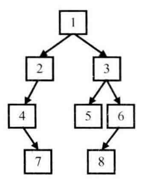
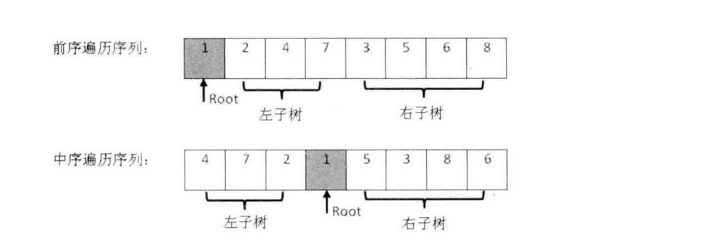
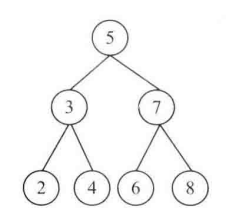
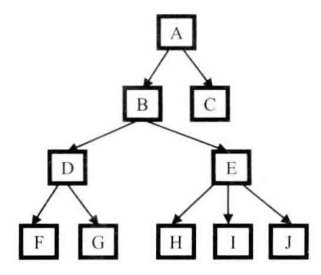

# 剑指offer代码Python实现

<center> ***前言*** </center>  
    _以下代码块结合了 [剑指offer][1] 和 [牛客网][2] 来编写，部分代码将在牛客网上进行测试，为了还原剑指offer的算法思想，代码完全仿照C++版进行编写，因此针对python语言还有一定的改进空间_  
[1]https://pan.baidu.com/s/1pavnkxcIRgwR1sKmjosVAQ  
提取码:za5n  
[2]https://www.nowcode.com/ta/coding-interviews

```python
# 示例 快速排序法
import random
class Solution:
    def Partition(self, data, start, end):
        """随机选择基准数，将较小数移到前方，返回基准数在调整顺序后的索引位置"""
        if not data:
            raise Exception("Invalid Parameters")
        index = random.randrange(start, end)

        temp = data[index]
        data[index] = data[end]
        data[end] = temp

        small = start - 1
        for index in range(start, end):
            if data[index] < data[end]:
                small += 1
                if small != index:
                    temp = data[index]
                    data[index] = data[small]
                    data[small] = temp
        small += 1

        temp = data[small]
        data[small] = data[end]
        data[end] = temp

        return small
    def QuickSort(self, data, start, end):
        """快速排序法，输入需要排序的范围"""
        if start == end:
            return
        index = self.Partition(data, start, end)
        if index > start:
            self.QuickSort(data, start, index - 1)
        if index < end:
            self.QuickSort(data, index + 1, end)
# test code
a = Solution()
data = [1,3,5,76,3,2,6,4]
a.QuickSort(data, 0, len(data)- 1)
data
```

## NO.3 数组中重复的数字

### 题目一：找出数组中重复的数字  

在一个长度为n的数组中素有的数字都在[0, n-1]范围内。  
请找出数组中任意一个重复的数字。  
例如，输入长度为7的数组{2,3,1,0,2,5,3}，那么对应输出的重复数字是2或3，若没有重复的元素则直接返回-1.

+ 解题思路：利用列表下标作为哈希表，通过元素互换逐步构建哈希表，若遇到相等的数字则通过下标索引key必然能检测到重复数字
+ 步骤：

1. 遍历数组，若i位置的值`arr[i]`不等于i，则进行步骤2
2. 以该值为索引判断`arr[i]`是否与`arr[arr[i]]`位置的值相等,若相等则说明找到重复的元素，否则进行值交换。
3. 交换后再次判断，重复步骤2，直到`arr[i] = i`，继续进行遍历
4. 遍历完成还没有找到重复的元素则直接返回-1

+ 总结
算法利用了哈希表思想，利用数组的索引作为key，每个数字最多交换两次就能放到合适的位置，因此时间复杂度为O(n)

```python
def duplicate(nums:list):
    """
    
    Arg(Argument参数): nums:list[int]
    Re(return): 若未找到重复数字，或者列表元素不符合要求将返回bool False，否则返回检索到的重复数字
    算法分析：尽管有两重循环，但每个数字最多只要交换两次就能找到属于它的位置，所以总体算法复杂度为O(n)空间复杂度为O(1)
    """
    length = len(nums)
    if length < 2:
        return False
    for i in range(length):
        if nums[i] < 0 or nums[i] > length - 1:
            return False
        while nums[i] != i:
            if nums[i] != nums[nums[i]]:#如果不相等就互换位置
                temp = nums[nums[i]]
                nums[nums[i]] = nums[i]
                nums[i] = temp
#                 nums[i], nums[nums[i]] = nums[nums[i] - 1], nums[i] 逗号赋值并非同时进行，在这种情况下无法得到正确结果
            else:
                return nums[i]
    return False
#测试用例
nums = [2,3,1,0,2,5,3]
print(duplicate(nums))
```

    2

```python
# 牛客网版代码
class Solution:
    def duplicate(self, nums, duplication):
        """利用列表下标作为哈希表，通过元素互换逐步构建哈希表，若遇到相等的数字则通过下标索引key必然能检测到重复数字
        Arg(Argument参数): nums:list[int]
        Re(return): 若未找到重复数字，或者列表元素不符合要求将返回bool False，否则返回检索到的重复数字
        算法分析：尽管有两重循环，但每个数字最多只要交换两次就能找到属于它的位置，所以总体算法复杂度为O(n)空间复杂度为O(1)
        """
        length = len(nums)
        if length < 2:
            return False
        for i in range(length):
            if nums[i] < 0 or nums[i] > length - 1:
                return False
            while nums[i] != i:
                if nums[i] != nums[nums[i]]:  # 如果不相等就互换位置
                    temp = nums[nums[i]]
                    nums[nums[i]] = nums[i]
                    nums[i] = temp
                else:
                    duplication[0] = nums[i]
                    return True
        return False
# test code
# 代码已在牛客网通过测试
```

+ 题目二：(接题目一中)增加限定条件：不修改数组找出重复的数字  
解题思路：利用二分查找法原理，确定中值，统计数组中比中值小或者比中值大的数字的个数，以此确定重复的数字在中值左侧还是右侧

```python
def countRange(nums, start, end):
    """统计nums中所有元素值在区间[start, end]中的数的个数
    """
    if not nums:
        return 0
    count = 0
    for i in range(len(nums)):
        if nums[i] >= start and nums[i] <= end:
            count += 1
    return count

def getDuplication(nums):
    """利用二分查找法来找出数组中任意一重复数字 (注意，此方法不能很好的解决此类问题，偶尔会出现错误)"""
    length = len(nums)
    if length < 2:
        return False
    start = 0
    end = length - 1
    while end >= start:
        middle = (end + start) >> 1  # 利用右移操作除二取整
        count = countRange(nums, start, middle)
        if end == start:
            if count > 1:
                return start
            else:
                break
        # 如果count的数量大于该值区间长度，则此区间中必有重复数值，反之类似
        if count > (middle - start + 1):
            end = middle
        else:
            start = middle + 1
    return False
#测试用例
nums = [2,4,5,4,3,2,6,7]
nums = [2,3,5,4,3,2,6,7]
print(getDuplication(nums))
```

## NO.4 二维数组中的查找

在一个二维数组中，每一行都按照从左到右的递增顺序排列，每一列都按照从上到下递增的顺序排列，请完成一个函数，输入这样的二维数组和一个整数，判断数组中是否含有该整数.  

+ 解题思路:

1. 首先选取数组右上角的数字，如果该数字大于目标数字则排除该列，小于则排除该行
2. 向下或向左移动指针，直到等于目标或者范围为空停止

+ 总结
其本质是二分查找法的变体，时间复杂度为O(m+n)

```python
def Find(nums, target):
    if len(nums) <= 0 or len(nums[0]) <= 0:
        return False
    i = 0
    j = len(nums[0]) - 1
    while i <= len(nums) - 1 and j >= 0:
        if nums[i][j] > target:
            j -= 1
        elif nums[i][j] < target:
            i += 1
        else:
            return True
    return False
```

## NO.5 替换空格

题目：请实现一个函数，把字符串中的每个空格替换成"%20"。例如，输入"We are happy."，则输出"We%20are%20happy."。  

+ 解题思路：

1. 先遍历一遍字符串统计空格的个数
2. 然后分配足够的存储空间
3. 从后向前的依次替换空格
(算法时间效率O(n))

+ 总结
此题考察数组合并，从后向前填充数组可减少移动次数，时间复杂度为O(n)

```python
def ReplaceBlank(string:list):
    """使用字符型列表来替换str类型，更好的诠释算法思想。若用str类型来做:string.replace(' ', '%20')即可
    输入：string:list[char]
    输出：string：str
    """
    if not string:
        return ''
    numOfBlank = 0
    for i in string:
        if i == ' ':
            numOfBlank += 1
    originalLength = len(string)
    newlength = originalLength + 2*numOfBlank
    string = string + ['']*2*numOfBlank
    while originalLength >= 0 and newlength > originalLength:
        #  从后往前替换空格
        if string[originalLength - 1] == ' ':
            string[newlength - 1] = '0'
            string[newlength - 2] = '2'
            string[newlength - 3] = '%'
            newlength -= 3
        else:
            string[newlength - 1] = string[originalLength - 1]
            newlength -= 1
        originalLength -= 1
    return ''.join(string)

string = ['W', 'e', ' ', 'a', 'r', 'e', ' ', 'h', 'a', 'p', 'p', 'y', '.']
print(ReplaceBlank(string))
```

## NO.6  从尾到头打印链表

题目：输入一个链表的头节点，从尾到头反过来打印出每个节点的值。  
解题思路：利用栈的先进后出特性存储链表然后再输出(或者利用递归函数)

```python
#创建链表类
class ListNode:
    """创建链表类"""
    def __init__(self, x):
        self.val = x
        self.next = None
#反转打印函数
def PrintListReversingly_Iteratively(phead):
    """利用栈来实现反向打印链表"""
    pNode = phead
    stack = []
    if pNode.val == None:
        print("None！")
    while pNode != None:
        stack.append(pNode.val)
        pNode = pNode.next
    while stack != []:
        print(stack.pop(-1))

def PrintListReversingly_Recursively(phead):
    """使用递归函数进行反向打印"""
    if phead is not None:
        if phead.next is not None:
            PrintListReversingly_Recursively(phead.next)
        print(phead.val)
#测试用例代码
##创建链表
head = ListNode('head->')
pnode = head
valueList = list('abcdefg')
for i in valueList:
    pnode.next = ListNode(i)
    pnode = pnode.next
#验证链表用代码
'''
pnode = head
while pnode != None:
    print(pnode.val)
    pnode = pnode.next
print(head.val)
'''
#测试打印函数
PrintListReversingly_Iteratively(head)
PrintListReversingly_Recursively(head)
```

```python
#牛客网解题对应函数(不要在此cell中运行)
def printListFromTailToHead(self, listNode):
    '''利用栈实现反向输出链表'''
    pNode = listNode
    stack = []
    if pNode is None:
        return stack
    while pNode is not None:
        stack.append(pNode.val)
        pNode = pNode.next
    stack.reverse()
    return stack

def printListFromTailToHead(self, listNode):
    '''利用递归函数反向输出链表'''
    if listNode is None:
        return []
    else:
        return self.printListFromTailToHead(listNode.next) + [listNode.val]
```

## NO.7 重建二叉树

题目：输入某二叉树的前序遍历和中序遍历的结果，请重建该二叉树。假设输入的前序遍历和中序遍历的结果中都不含重复数字。例如输入前序遍历序列{1,2,4,7,3,5,6,8}和中序遍历序列{4,7,2,1,5,3,8,6}，则重建如下入的二叉树并输出它的头节点。  

+ 解析
前序遍历:根左右；中序遍历：左根右；后序遍历：左右根
+ 思路
  1. 前序序列中第一个数为根节点parent
  2. 找到中序序列中parent的位置，其前方为左子树，后方为右子树
  3. 根据中序序列中左右子树的长度在前序序列中分割左右子树
  4. 重复1-3步骤，递归的重建左右子树  
+ 图例
  

  

```python
class BinaryTreeNode:
    '''创建二叉树节点'''
    def __init__(self, x=None):
        self.val = x
        self.left = None
        self.right = None
def preTree(treehead):
    """递归的先根序遍历二叉树，返回列表序列"""
    if treehead is None:
        return []
    return [treehead.val] + preTree(treehead.left) + preTree(treehead.right)
def tinTree(treehead):
    """递归的中根序遍历二叉树，返回列表序列"""
    if treehead is None:
        return []
    return tinTree(treehead.left) + [treehead.val] + tinTree(treehead.right)

def _ConstructBinaryTree(pre,tin):
    """递归调用构造子二叉树"""
    root = BinaryTreeNode(pre[0])
    #递归终止条件
    if len(pre) == 1:
        if len(tin) == 1 and pre[0] == tin[0]:
            return root
        else:
            raise Exception("input error")
    rootInorderIndex = tin.index(pre[0])
    if len(tin) == 1 and tin[rootInorderIndex] != root.val:
        raise Exception("input error")
    left = tin[0:rootInorderIndex]
    right = tin[rootInorderIndex+1:]
    if len(left) > 0:
        root.left = _ConstructBinaryTree(pre[1:len(left) + 1], left)
    if len(right) > 0:
        root.right = _ConstructBinaryTree(pre[len(left)+1:], right)
    return root
def reConstructBinaryTree(pre, tin):
    """初始判断输入是否合法，并递归调用构造函数"""
    if not pre or not tin:
        raise Exception("input error")
    return _ConstructBinaryTree(pre, tin)
#测试代码
prelist = [1,2,4,7,3,5,6,8]
tinlist = [4,7,2,1,5,3,8,6]
treehead = reConstructBinaryTree(prelist, tinlist)
#验证prelist和tinlist
print(tinTree(treehead))
```

```python
#牛客网通过代码   (#####!!不要运行此段代码!!#####)
def _ConstructBinaryTree(self,pre,tin):
    root = TreeNode(pre[0])
    if len(pre) == 1:
        if len(tin) == 1 and pre[0] == tin[0]:
            return root
        else:
            return False
    rootInorderIndex = tin.index(pre[0])
    if len(tin) == 1 and tin[rootInorderIndex] != root.val:
        return False
    left = tin[0:rootInorderIndex]
    right = tin[rootInorderIndex+1:]
    if len(left) > 0:
        root.left = self._ConstructBinaryTree(pre[1:len(left) + 1], left)
    if len(right) > 0:
        root.right = self._ConstructBinaryTree(pre[len(left)+1:],right)
    return root
def reConstructBinaryTree(self, pre, tin):
    if not pre or not tin:
        return None
    return self._ConstructBinaryTree(pre, tin)
```

## NO.8 二叉树的下一个节点

题目：给定一颗二叉树和其中的一个节点，如何找出中序遍历序列的下一个节点？树中的节点除了有两个分别指向左、右子节点的指针，还有一个指向父节点的指针。

+ 思路：
  1. 若该子节点有右子树，则右子树的中序遍历序列第一个节点即为下一个节点
  2. 若无右子树，且是其父节点的左子节点，则下一个节点为父节点
  3. 若无右子树，且为父节点的右节点，则向上遍历，直到找到一个节点为其父节点的左子节点，则该节点的父节点为下一个节点

```python
class BinaryTreeNode:
    '''创建二叉树节点'''
    def __init__(self, x=None):
        self.val = x
        self.parent = None
        self.left = None
        self.right = None

def GetNext(pNode):
    """获取"""
    if pNode == None:
        return None
    pNext = BinaryTreeNode()
    if pNode.right != None:
        #若存在右子树，则右子树中最左侧的节点是下一节点
        pRight = pNode.right
        while pRight.left != None:
            pRight = pRight.left
        pNext = pRight
    elif pNode.parent != None:
        #若右子树不存在，则父节点中是左子树的父节点是下一节点
        pCurrent = pNode
        pParent = pNode.parent
        while pParent != None and pCurrent == pParent.right:
            pCurrent = pParent
            pParent = pParent.parent
        pNext = pParent
    return pNext
#test code
#tin=list('dbheiafcg')
#pre=list('abdehicfg')
headNode = BinaryTreeNode('a')
headNode.left = BinaryTreeNode('b')
headNode.left.parent = headNode
pNode = headNode.left
pNode.left = BinaryTreeNode('d')
pNode.right = BinaryTreeNode('e')
pNode.left.parent = pNode
pNode.right.parent = pNode
pNode = pNode.right
pNode.left = BinaryTreeNode('h')
pNode.right = BinaryTreeNode('i')
pNode.left.parent = pNode
pNode.right.parent = pNode
headNode.right = BinaryTreeNode('c')
headNode.right.parent = headNode
pNode = headNode.right
pNode.left = BinaryTreeNode('f')
pNode.right = BinaryTreeNode('g')
pNode.left.parent = pNode
pNode.right.parent = pNode


result = GetNext(pNode)
print(result.val)
```

```python
# 牛客网版代码
class Solution:
    def GetNext(self, pNode):
        if pNode == None:
            return None
        pNext = None
        if pNode.right != None:
            # 若存在右子树，则右子树中最左侧的节点是下一节点
            pRight = pNode.right
            while pRight.left != None:
                pRight = pRight.left
            pNext = pRight
        elif pNode.next != None:
            # 若右子树不存在，则父节点中是左子树的父节点是下一节点
            pCurrent = pNode
            pParent = pNode.next
            while pParent != None and pCurrent == pParent.right:
                pCurrent = pParent
                pParent = pParent.next
            pNext = pParent
        return pNext
# test code
# 代码已在牛客网通过测试
```

## NO.9 用两个栈实现队列

题目：用两个栈实现一个队列。队列的声明如下，请实现它的两个函数appendTail和deleteHead，分别完成在队列尾部插入节点在队列头部删除节点的功能。  

+ 解题思路：
  1. 利用栈1入队，在栈2为空时将栈1中的元素通过出栈，再入栈的方式转移到栈2中实现反序

```python
class Solution:
    def __init__(self):
        self.stack1 = []
        self.stack2 = []
    def push(self, node):
        self.stack1.append(node)
    def pop(self):
        if len(self.stack2) <= 0:
            #若栈2为空则转移已入栈元素
            while len(self.stack1) > 0:
                self.stack2.append(self.stack1.pop())
        if len(self.stack2) == 0:
            #若已转移元素之后栈2还是空，则说明队列为空
            raise Exception('queue is empty')
        return self.stack2.pop()
#测试代码
inqueue = [1,2,3,4,5,6,7,8,9]
testqueue = Solution()
for i in inqueue:
    testqueue.push(i)
while testqueue.stack1 or testqueue.stack2:
    print(testqueue.pop())
```

## NO.10 斐波拉契数列

### 题目1：求斐波拉契数列的第n项  

[斐波拉契数列定义] f(n) = f(n-1) + f(n-2)、f(0) = 0、f(1) = 1  

+ 解题思路：
  1. 可以用递归的方式来实现，但算法效率低，使用循环来代替递归会更好，循环的方式时间复杂度为O(n)
  2. 还可通过矩阵快速求幂的方式计算时间复杂度为O(log(n))，进一步的可通过矩阵特征值及特征向量求出数列通项，从而实现O(1)时间复杂度

### 题目2：青蛙跳台阶问题  

一只青蛙一次可以跳上一级台阶，也可以跳上2级台阶。求该青蛙跳上一个n级台阶总共有多少种跳法。  

解题思路：

1. 设有f(n)种方法，
2. n=1时f(1) = 1,
3. n=2时f(2) = 2，
4. n>2时，先跳一级，剩余还有f(n-1)种方法，先跳2级，剩余还有f(n-2)种方法，所以f(n) = f(n-1) + f(n-2)，因此与斐波拉契数列相似
5. 为保证大数相加时整数不溢出，通常需要先对相加结果1e9+7取余

```python
def Fibonacci(n):
    """从小到大计算，类推出第n项，时间复杂度O(n)比递归小"""
    result = [0,1]
    if n < 2:
        return result[n]
    fibOne = 1
    fibTwo = 0
    temp = None
    for i in range(2,n+1):
        temp = fibOne + fibTwo
        fibTwo = fibOne
        fibOne = temp
    return temp
Fibonacci(10)

def FibonacciM():
    """利用数学公式[[f(n), f(n-1)], [f(n-1), f(n-2)]] = [[1, 1], [1,0]]^(n-1)。此方法时间复杂度为O(log(n))"""
    print("此函数待实现，留作练习")
    pass

"""函数Fibonacci在牛客网上测试通过"""

class Solution:
    """青蛙台阶问题、矩形覆盖问题"""
    def jumpFloor(self, number):
        result = [0,1,2]
        if number < 3:
            return result[number]
        fibOne = 2
        fibTwo = 1
        fibN = None
        for i in range(3,number+1):
            fibN = fibOne + fibTwo
            fibTwo = fibOne
            fibOne = fibN
        return fibN
    
class Solution:
    """青蛙跳台阶变态版：青蛙每次可以跳任意级"""
    def jumpFloorII(self, number):
        if number == 0:
            return 0
        return 2**(number - 1)
```

## NO.11 旋转数组中的最小数字

题目：把一个数组最开始的若干个元素搬到数组的末尾，我们称之为数组的旋转。输入一个递增排序的数组的一个旋转，输出旋转数组的最小元素。例如，数组[3,4,5,1,2]为[1,2,3,4,5]的一个旋转，该数组的最小值为1.

+ 解题思路：
旋转后的排序数组是由两个已排好序的子数组组成，
利用对撞指针的二分查找法逐步缩小查找范围，
但若遇上大量重复数字时，需要遍历子数组进行查找(算法基于二分查找，时间复杂度为O(log(n)))
  1. 定义start、mid、end三个指针，分别指向数组的起始、中间、末尾
  2. 若剩余序列长度为2，则end一定为最小的元素，mid指向end，跳出循环
  3. 取mid = start + (end - start) / 2 即正中间位置
  4. 若start、mid、end所指向的元素都相等，则无法判断最小值位于左子序列还是右子序列，只能对序列进行遍历取得最小值
  5. 若start的元素小于或等于mid的元素，则说明最小元素在右子序列，若end的元素大于或等于mid则说明最小元素在左子序列
  6. 递归的重复2-5步骤，直到start的元素大于或等于end不成立，最后能保证mid指向最小元素

```python
def MinInorder(nums):
    """顺序查找最小数字子函数"""
    result = nums[0]
    for i in nums:
        if i < result:
            result = i
    return result

def Min(nums):
    if not nums:
        raise Exception("无效的输入")
    length = len(nums)
    if length < 2:
        return nums[0]
    start = 0
    end = length - 1
    mid = start
    while nums[start] >= nums[end]:
        if end - start == 1:
            mid = end
            break
        mid = (end + start) / 2
        if nums[start] == nums[end] and nums[mid] == nums[start]:
            return MinInorder(nums[start:end])
        if nums[mid] >= nums[start]:
            start = mid
        elif nums[mid] <= nums[end]:
            end = mid
    return nums[mid]


# test code
"""在牛客网上通过测试"""
```

## NO.12 矩阵中的路径

题目：
请设计一个函数，用来判断在一个矩阵中是否存在一条包含某字符串的所有字符的路径。  
路径可以从矩阵中的任意一格开始，每一步可以在矩阵中向左、右、上、下移动一格。  
如果一条路径经过了矩阵的某一格，那么该路径不能再次进入该格子。  
例如，在下面的3*4的矩阵中包含一条字符串“bfce”的路径(路径中的字母用大写标出)。  
但矩阵中不包含字符串“abfb”的路径，因为字符串的第一个字符b占据了矩阵中的第一行第二个格子后，路径不能再次进入这个格子。
$$\begin{matrix}
a&B&t&g\\
c&F&C&s\\
j&d&E&h\\
\end{matrix}$$

+ 解题思路：利用回溯法，若当前路径不通，则回溯上一节点，尝试未尝试过的路径
  1. 维护一个访问矩阵visited，若对应位置被占据则记为true，遍历目标矩阵matrix，
  2. 指针p所指向的str中的字符，若等于遍历位置的字符，则将指针p移动一个位置，并标记visited，递归判断字符上下左右位置是否存在移动后的p指向的字符
  3. 若不存在则回溯，p指针回退一步，并还原标记visited，结束该节点的递归
  4. 若一直满足步骤2中的条件，则递归结束条件为p大于str长度，并返回true表示找到路径

```python
def hasPathCore(matrix, i, j, strs, visited, pathLength):
    """递归调用自己，探索每一个节点"""
    if pathLength >= len(strs):
        return True
    result = False
    if i >= 0 and i < len(matrix) and j >= 0 and j < len(matrix[0]) and matrix[i][j] == strs[pathLength] and not visited[i][j]:
        # 索引范围正确且此时矩阵的值和字符串的值相匹配，并且此点未被占据过，则递归探索下一符合要求的点
        pathLength += 1
        visited[i][j] = True
        result = hasPathCore(matrix,i,j-1,strs,visited,pathLength) or hasPathCore(matrix,i-1,j,strs,visited,pathLength) \
        or hasPathCore(matrix,i,j+1,strs,visited,pathLength) or hasPathCore(matrix,i+1,j,strs,visited,pathLength)
        # 递归探索四个方向的下一节点是否符合要求，若不符合要求则退回上一节点
        if not result:
            pathLength -= 1
            visited[i][j] = False
    return result

def hasPath(matrix,strs):
    if not matrix or not strs:
        return False
    rows = len(matrix)
    clos = len(matrix[0])
    # visited = [[False]*clos]*rows 
    # 这样构造矩阵，其行将会是第一行的浅拷贝，修改任一元素，将引起整列元素同时被改，因此采用下面的循环进行构造
    visited = [[False]*clos for _ in range(rows)]
    pathLength = 0
    for i in range(rows):
        for j in range(clos):
            #双循环遍历每一个点作为起点
            if hasPathCore(matrix,i,j,strs,visited,pathLength):
                return True
    return False

#test code
a = [[None]]*3
a[0] = list('abtg')
a[1] = list('cfcs')
a[2] = list('jdeh')
strs = 'tegsc'
print(hasPath(a, strs))
```

```python
# 牛客网版代码
class Solution:
    def hasPathCore(self, matrix, i, j, strs, visited, pathLength):
        """递归调用自己，探索每一个节点"""
        if pathLength >= len(strs):
            return True
        result = False
        if i >= 0 and i < len(matrix) and j >= 0 and j < len(matrix[0]) and matrix[i][j] == strs[pathLength] and not visited[i][j]:
            # 索引范围正确且此时矩阵的值和字符串的值相匹配，并且此点未被占据过，则递归探索下一符合要求的点
            pathLength += 1
            visited[i][j] = True
            result = self.hasPathCore(matrix,i,j-1,strs,visited,pathLength) or self.hasPathCore(matrix,i-1,j,strs,visited,pathLength) or self.hasPathCore(matrix,i,j+1,strs,visited,pathLength) or self.hasPathCore(matrix,i+1,j,strs,visited,pathLength)
            # 递归探索四个方向的下一节点是否符合要求，若不符合要求则退回上一节点
            if not result:
                pathLength -= 1
                visited[i][j] = False
        return result
    
    def hasPath(self, matrix, rows, cols, strs):
        if not matrix or not strs:
            return False
        temp = [list(matrix[i:i+cols]) for i in range(0, len(matrix), cols)]
        # visited = [[False]*clos]*rows
        # 这样构造矩阵，其行将会是第一行的浅拷贝，修改任一元素，将引起整列元素同时被改，因此采用下面的循环进行构造
        visited = [[False]*cols for _ in range(rows)]
        pathLength = 0
        for i in range(rows):
            for j in range(cols):
                #双循环遍历每一个点作为起点
                if self.hasPathCore(temp,i,j,strs,visited,pathLength):
                    return True
        return False
# test code
# 代码已在牛客网通过测试
```

## NO.13 机器人的运动范围

题目：地上有一个m×n的方格。一个机器人从坐标(0, 0)的格子开始移动，它每次可以向左、右、上、下移动一格，但不能进入行坐标和列坐标的位数之和大于k的格子。例如，当k=18时，机器人能够进入方格(35,37),因为3+5+3+7=18。但它不能进入方格(35, 38)，因为3+5+3+8=19。请问该机器人能够到达多少个格子？

+ 解题思路：因为机器人每次只能移动一格，同样可以利用回溯法逐步遍历能够到达哪些格子
  1. 使用map记录机器人已访问的格子，模拟visited
  2. 设定起点为`[0,0]`，若当前节点满足条件k及visited中不存在，则将节点坐标为key，加入visited中，并将count加1，否则返回count的初始值0
  3. 递归的将节点上下左右位置进行判断，重复2步骤，并将返回值加入到count中
  4. 判断是否满足条件k需要判断左边是否溢出，并计算位数和是否不大于k

```python
def getDigitSum(number):
    """计算数字和函数"""
    sumResult = 0
    while number > 0:
        sumResult += number % 10
        number /= 10
    return sumResult


def check(threshold, rows, cols, row, col, visited):
    """条件判断函数"""
    if row >= 0 and row < rows and col >= 0 and col < cols and getDigitSum(row) + getDigitSum(col)\
    <= threshold and not visited[row][col]:
        return True
    return False


def movingCountCroe(threshold, rows, cols, row, col, visited):
    """递归探索每一个可能的格子"""
    count = 0
    if check(threshold, rows, cols, row, col, visited):
        visited[row][col] = True
        count = 1 + movingCountCroe(threshold, rows, cols, row - 1, col, visited) \
            + movingCountCroe(threshold, rows, cols, row, col - 1, visited)\
            + movingCountCroe(threshold, rows, cols, row + 1, col, visited)\
            + movingCountCroe(threshold, rows, cols, row, col + 1, visited)
    return count


def movingCount(threshold, rows, cols):
    """主函数，初始化visited方便核心函数递归调用"""
    if threshold <= 0 or rows <= 0 or cols <= 0:
        return 0
    visited = [[False]*cols for _ in range(rows)]
    count = movingCountCroe(threshold, rows, cols, 0, 0, visited)
    return count


# test code
print(movingCount(18, 35, 35))
```

```python
# 牛客网版代码
class Solution:
    def getDigitSum(self, number):
        """计算数字和函数"""
        sumResult = 0
        while number > 0:
            sumResult += number % 10
            number /= 10
        return sumResult

    def check(self, threshold, rows, cols, row, col, visited):
        """条件判断函数"""
        if row >= 0 and row < rows and col >= 0 and col < cols and self.getDigitSum(row) + self.getDigitSum(col) \
                <= threshold and not visited[row][col]:
            return True
        return False

    def movingCountCroe(self, threshold, rows, cols, row, col, visited):
        """递归探索每一个可能的格子"""
        count = 0
        if self.check(threshold, rows, cols, row, col, visited):
            visited[row][col] = True
            count = 1 + self.movingCountCroe(threshold, rows, cols, row - 1, col, visited) \
                    + self.movingCountCroe(threshold, rows, cols, row, col - 1, visited) \
                    + self.movingCountCroe(threshold, rows, cols, row + 1, col, visited) \
                    + self.movingCountCroe(threshold, rows, cols, row, col + 1, visited)
        return count

    def movingCount(self, threshold, rows, cols):
        """主函数，初始化visited方便核心函数递归调用"""
        if threshold <= 0 or rows <= 0 or cols <= 0:
            return 0
        visited = [[False] * cols for _ in range(rows)]
        count = self.movingCountCroe(threshold, rows, cols, 0, 0, visited)
        return count
# test code
# 代码已在牛客网通过测试
```

## NO.14 剪绳子

题目：给你一根长度为n的绳子，请把绳子剪成m段(m,n都是整数，n>1并且m>1)，每段绳子的长度记为k[0],k[1],...,k[m]。请问k[0]*k[1]*...*k[m]可能的最大乘积是多少？例如，当绳子的长度为8时，我们把他剪成长度分别为2,3,3的三段，此时得到的最大乘积是18.

+ 解题思路：因为是最优化问题，且问题可分，可考虑使用动态规划或者贪婪法，详细见代码文档或剑指offer（注：题目中需补充条件，m为任意整数，且切成的绳子长度必须为整数）
  + 动态规划解法
    1. 创建长度为n的数组maxLens用于存储对应索引i长度的绳子剪断最大乘积，则maxLens[n - 1]程序返回值
    2. 可尝试先剪下一段长度j，然后剩余长度可剪可不剪，
    3. 记长度为n的绳子剪断后的乘积为f(n),则f(n)=j*(n-j)或f(n)=j*f(n-j),可取其中的最大值记为FMax
    4. 从2开始遍历j，直到不满足j <= Math.floor(n / 2)，每次遍历中将较大的FmMx存入`maxLens[i]`
    5. 定义maxLens = [0, 1, 2, 4]为初始值分别表示绳子长度为[1, 2, 3, 4]时绳子剪断后最大乘积，从长度为5开始遍历绳子长度i，直到i <= n，每次遍历执行步骤4,遍历完成后返回maxLens[n - 1]即为长度为n的绳子剪断后的最大乘积

+ 贪婪算法解法
   1. 尽可能的将绳子分为长度为3的段，并且剩余长度尽可能为2或4，不可为1

```python
def maxProductAfterCutting_solution(length):
    """动态规划法，从上而下的分析分解问题，自下而上的顺序计算问题"""
    result = [0, 1, 2, 3]
    if length < 2:
        return 0
    elif length < 4:
        return result[length - 1]
    products = [None]*(length + 1)
    for i in result:
        products[i] = i
    maxValue = 0
    for i in range(4, length + 1):
        maxValue = 0
        j = 1
        while j <= i/2:
            product = products[j]*products[i-j]
            if maxValue < product:
                maxValue = product
            products[i] = maxValue
            j += 1
    maxValue = products[length]
    return maxValue


def maxProductAfterCutting_solution2(length):
    """贪婪算法，尽可能多的剪长度为3的绳子，当剩下的绳子长度为4时，把绳子剪成两段为2的绳子。
    解释：当n>=5时,3*(n-3)>=2*(n-2)>n,故选用上述策略"""
    result = [0, 1, 2, 3]
    if length < 2:
        return 0
    elif length < 4:
        return result[length - 1]
    timesOf3 = length / 3
    if length - timesOf3 * 3 == 1:
        timesOf3 -= 1
    timesOf2 = (length - timesOf3 * 3) / 2
    return int(pow(3, timesOf3))*int(pow(2, timesOf2))


# test code
print(maxProductAfterCutting_solution(8))
print(maxProductAfterCutting_solution2(8))
```

## NO.15 二进制中1的个数

题目：请实现一个函数，输入一个整数，输出该数的二进制表示中1的个数。例如，把9表示成二进制是1001，有2位是1，因此，输入9，则函数输出2.

+ 解题思路
  + 逐位扫描
    1. 将数与flag=1进行与操作，每次flag按位左移，遍历整型的二进制位数(32或64)后即可统计出1的个数

  + 减1算法
    1. 将一个整数减1，都是把二进制中最右边的1变成0，并且把它右边的所有0变成1(即：最右边的数为1时，直接变成0，最右边的数为0时，将其前方最近的一个1变为0，其后的所有0变为1)
    2. 因此，将整数n做n&(n-1)相当于将其最右边的1去掉，因此n>0时，可以反复进行此操作，并统计1的个数
    3. n中有多少个1就需要循环多少次

```python
# 方法一
def NumberOf1Croe(n):
    """将1逐位与n按位与，检测该二进制位是否有1，若有则计数。该算法需要循环sizeof(int)次"""
    count =0
    flag = 1
    while flag <= abs(n):
        if n&flag:
            count += 1
        flag = flag << 1
    return count
def NumberOf1(n):
    """计算整数的二进制数中1的个数，由于在python中负数没有用补码表示，故在主函数中另行处理"""
    if n < 0:
        return 32 - NumberOf1Croe(abs(n) -1)
    else:
        return NumberOf1Croe(n)
# 方法二
def numberOf1Croe(n):
    """将一个整数减1，都是把二进制中最右边的1变成0，并且把它右边的所有0变成1，将此数再与原数按位与，相当于将原数二进制数中最右
    边的1变成0，整数中有多少个1就可以做多少次这种操作。基于这种思想写出类的算法需要循环count次，即有多少个1循环多少次"""
    count =0
    while n:
        count += 1
        n = (n-1)&n
    return count
def numberOf1(n):
    """计算整数的二进制数中1的个数，由于在python中负数没有用补码表示，故在主函数中另行处理"""
    if n <0:
        return 32 - numberOf1Croe(abs(n) -1)
    else:
        return numberOf1Croe(n)

#test code
print(NumberOf1(-3))
print(numberOf1(-3))

"""
#将int类型转为补码表示的函数
def int2Bin32(i):
    return (bin(((1<<32) - 1) & i)[2:]).zfill(32)
"""
```

## NO.16 数值的整数次方

题目：实现函数double Power(double base, int exponent)，求base的exponent次方。不得使用库函数，同时不需要考虑大数问题。

+ 解题思路：利用二分法，对exponent进行分解，每次除2取整，同时对base使用自乘，利用已计算好的值，算法复杂度为O(log2(n))
+ 流程
  1. 判断base，exponent是否为0，若为0则直接分别返回0和1
  2. 若exponent < 0 则将base设置为 1 / base，exponent设置为-exponent转换为正数的情况
  3. 设置res=1用于缓存奇数的结果，pow=base用于自乘，遍历结束后返回res*pow，即默认结果为exponent=1的情况
  4. exponent > 1时进行遍历，每次判断若为奇数，则执行res*=base累乘base，并将exponent/2取整，进行二分，并执行pow*=pow累积自乘，循环结束后返回res*pow

```python
def PowerWithUnsignedExponent(base, exponent):
    """使用循环连乘来计算无符号指数"""
    result = 1.0
    for i in range(exponent):
        result *= base
    return result
def PowerWithUnsignedExponent2(base, exponent):
    """递归的将指数拆分成平方，减少乘法的次数，并用右移运算符代替除2，利用按位与运算符来判断函数奇偶"""
    if exponent ==0:
        return 1
    if exponent == 1:
        return base
    result = PowerWithUnsignedExponent2(base, exponent >> 1)
    result *= result #平方
    if exponent & 0x1 == 1:
        result *=base
    return result

g_InvalidInput = False
#错误输入指示，在牛客网python编程中，请删除此功能，否则不能通过测试
def Power(base, exponent):
    """主函数。浮点型数据类型不可直接用‘==’判断是否为0，可借助比较较小数1.0e-9来判断"""
    g_InvalidInput = False
    if abs(base) < 1.0e-9 and exponent < 0:
        g_InvalidInput = True
        return 0.0
    absExponent = abs(exponent)
    result = PowerWithUnsignedExponent2(base, absExponent)
    if exponent < 0:
        result = 1.0/result
    return result

#test code 
base = 2
exponent = 10
print(Power(base, exponent))
```

## NO.17 打印从1到最大的n位数

题目：输入数字n，按顺序打印出从1到最大的n位十进制数。比如输入3，则打印输出1,2,3一直到最大的3为数999.

解题思路：此题涉及到大数问题，python内置类型智能支持大数，但为了表现算法思想不使用python内置大数，转而使用list[str]来表示大数

```python
def PrintNumber(nums):
    """打印函数，从第一个非零数字开始打印，循环查找第一个非零数字打印并跳出循环
    nums必须是list类型"""
    isBeginning = True
    for i in range(len(nums)):
        if isBeginning and nums[i] != '0':
            isBeginning = False
        if not isBeginning:
            print(''.join(nums[i:]))
            break
def Increment(nums):
    """数字自增函数，并判断是否溢出，返回溢出标志，nums必须是list[str]类型，list是可变类型，在传参的时候类似于c++
    中传指针，所以无需返回即可修改传入nums中的元素"""
    isOverflow = False
    nTakeOver = 0 # 进位
    nLength = len(nums)
    for i in range(nLength - 1,-1,-1):
        #反向循环[nLength,0]，设置步长为-1即反向
        nSum = ord(nums[i]) - ord('0') + nTakeOver
        if i == nLength - 1:
            nSum += 1
        if nSum >= 10:
            if i == 0:
                isOverflow = True
            else:
                nSum -= 10
                nTakeOver = 1
                nums[i] = chr(ord('0') + nSum)
        else:
            nums[i] = chr(ord('0') + nSum)
            break
    return isOverflow
def PrintToMaxOfNDigits(n):
    """打印主函数，生成长度为n的list[str]来表示n位数字，可表示任意大的数字"""
    if n <= 0:
        return
    nums = ['0']*n
    while not Increment(nums):
        PrintNumber(nums)

        
def PrintToMaxOfNDigitsRecursively(nums, length, index):
    """利用排列组合的思想，递归的循环调用函数，打印不同的数字组合"""
    if index == length - 1:
        PrintNumber(nums)
        return
    for i in range(10):
        nums[index+1] = chr(ord('0') + i)
        PrintToMaxOfNDigitsRecursively(nums, length, index + 1)
def PrintToMaxOfNDigits2(n):
    """打印数字，递归调用版"""
    if n <=0:
        return
    nums = ['0']*n
    for i in range(10):
        nums[0] = chr(i+ord('0'))
        PrintToMaxOfNDigitsRecursively(nums, len(nums), 0)
#test code
PrintToMaxOfNDigits(1)
PrintToMaxOfNDigits2(-1)
```

    1
    2
    3
    4
    5
    6
    7
    8
    9

## NO.18 删除链表的节点

### 题目一：在O(1)时间内删除链表节点  

给定单向链表的头指针和一个节点指针，定义一个函数在O(1)时间内删除该节点。

+ 思路：
通过复制下一个节点的内容到当前节点的方式删除当前节点，并保存下一个节点的下一个节点，断开链接并重新连上当前节点即可做到删除，  
若要删除的节点没有下一个节点则需要从头指针开始遍历链表  
若要删除的节点就是头指针，则直接将头指针置空即可

```python
class ListNode:
    """创建链表类"""
    def __init__(self, x=None):
        self.val = x
        self.next = None
def DeleteNode(pListHead, pToBeDelete):
    """通过复制的方式删除指定节点，若要删除尾节点，则只能遍历再删除。平均时间复杂度[(n-1)*O(1)+O(n)]/n=O(1)"""
#     print("pListHead's id is: "+str(id(pListHead)))
#     print("pToBeDelete's id is: "+str(id(pToBeDelete)))
    if not pListHead or not pToBeDelete:
        return
    if pToBeDelete.next != None:
        pNext = pToBeDelete.next
        pToBeDelete.val = pNext.val
#         print("pToBeDelete.val's id is: "+str(id(pToBeDelete.val)))
        pToBeDelete.next = pNext.next
    elif pListHead == pToBeDelete:
        pListHead.val = None
        pListHead.next = None
#         pListHead = ListNode()
#         print("pListHead's id is: "+str(id(pListHead)))
    else:
        pNode = pListHead
        while pNode.next != pToBeDelete:
            pNode = pNode.next
        pNode.next = None
#     return pListHead
##创建链表
head = ListNode('head->')
# print("head's id is: "+str(id(head)))
#可变对象直接赋值就是浅拷贝，相当于c++中传递地址
pnode = head
# print("pnode's id is: "+str(id(pnode)))
valueList = list('')
for i in valueList:
    pnode.next = ListNode(i)
    pnode = pnode.next
#     print("pnode's id is: "+str(id(pnode)))
# gnode = ListNode('1')
DeleteNode(head, pnode)    
#验证链表用代码
# print(gnode.val)
rnode = head
while rnode != None:
    print(rnode.val)
    rnode = rnode.next

"""
！！！注：python传参与c++中常引用传参相似，对于可变对象，不可直接改变对象本身，但可改变对象内置的值,如直接
改链表头不可行，但可以改链表头的值及其他未传入的节点，若一定要改链表头则只能通过返回值的方式进行，例如list对象
"""
```

+ 题目二：删除链表中重复的节点。

```python
#该算法仅能删除相邻重复节点，比如[1,2,3,4,1]首位节点重复就不会被删除，故不作深入测试
class Solution:
    def deleteDuplication(self, phead):
        if phead == None:
            return phead
        pPreNode = None
        pNode = phead
        while pNode != None:
            pNext = pNode.next
            needDelete = False
            if pNext != None and pNext.val == pNode.val:
                needDelete = True
            if not needDelete:
                pPreNode = pNode
                pNode = pNode.next
            else:
                value = pNode.val
                pToBeDel = pNode
                while pToBeDel != None and pToBeDel.val == value:
                    pNext = pToBeDel.next
                    del pToBeDel
                    pToBeDel = pNext
                if pPreNode == None:
                    phead = pNext
                else:
                    pPreNode.next = pNext
                pNode = pNext
        return phead
# test code
# 代码已在牛客网通过测试
```

## NO.19 正则表达式匹配

题目：请实现一个函数用来匹配包含"."和"\*"的正则表达式。模式中的字符"."表示任意一个字符，而"\*"表示它前面的字符可以出现任意次(含0次)。在本题中，匹配是指字符串的所有字符匹配整个模式。例如，字符串"aaa"与模式"a.a"和"ab\*ac\*a"匹配，但与"aa.a"和"ab\*a"均不匹配。

+ 解题思路：
+ 步骤：

```python
class Solution:
    def matchCore(self, strs, pattern):
        """递归探索每一种情况"""
        if not strs and not pattern:
            return True
        if strs and not pattern:
            return False
        if len(pattern) > 1 and pattern[1] == '*':
            if strs and (pattern[0] == strs[0] or pattern[0] == '.'):
                return self.matchCore(strs[1:],pattern[2:]) or self.matchCore(strs[1:],pattern) or self.matchCore(strs, pattern[2:])
            else:
                return self.matchCore(strs, pattern[2:])
        if strs and (strs[0] == pattern[0] or pattern[0] == '.'):
            return self.matchCore(strs[1:], pattern[1:])
        return False
    def match(self, s, pattern):
        if s == None or pattern == None:
            return False
        return self.matchCore(s, pattern)
a = Solution()
print(a.match('aaa', 'a.a'))
```

## NO.20 表示数值的字符串

题目：请实现一个函数用来判断字符串是否表示数值(包括整数和小数)。例如，字符串"+100","5e2","-123","3.1416","-1E-16"都表示数值，但"12e","1a3.14","1.2.3","+-5","12e+5.4"都不是

```python
class Solution:
    def scanUnsignedInterger(self, strs):
        """对传入字符串从头计算是无符号数字的长度，返回长度"""
        if not strs:
            return 0
        i = 0
        while i >= 0 and i < len(strs) and strs[i] >= '0' and strs[i] <= '9':
            i += 1
        return i
    def scanInteger(self, strs):
        """对传入字符串从头计算有符号数字的长度，返回长度"""
        if not strs:
            return 0
        if strs[0] in '-+':
            return 1 + self.scanUnsignedInterger(strs[1:])
        return self.scanUnsignedInterger(strs)
    def isNumeric(self, s):
        """使用index表示首个未进行遍历的字符的索引，使用temp变量表示上一个匹配的长度，为应对index有可能超出字符串长度，
        每次进行判断之前先进行判断是否溢出"""
        if not s:
            return False
        index = 0
        temp = self.scanInteger(s)
        numeric = temp > 0
        index += temp
        if index < len(s) and s[index] == '.':
            index += 1
            temp = self.scanUnsignedInterger(s[index:])
            numeric = temp or numeric
            index += temp
        if index < len(s) and (s[index] == 'e' or s[index] == 'E'):
            index += 1
            temp = self.scanInteger(s[index:])
            numeric = numeric and temp
            index += temp
        return bool(numeric) and index == len(s)
#test code 
a_test = Solution()
print(a_test.isNumeric('+100'))
```

## NO.21 调整数组顺序使奇数位于偶数前面

题目：输入一个整数数组，实现一个函数来调整该数组中数字的顺序，使得所有的奇数位于数组的前半部分，所有的偶数位于数组的后半部分。

```python
class Solution:
    def reOrderArray(self, array):
        """对撞指针法，发现不符合要求的元素则与另一不符合要求的元素调换顺序"""
        if not array:
            return
        pBegin = 0
        pEnd = len(array) - 1
        while pBegin < pEnd:
            while pBegin < pEnd and array[pBegin] & 0x1 != 0:
                pBegin += 1
            while pBegin < pEnd and array[pEnd] & 0x1 == 0:
                pEnd -= 1
            if pBegin < pEnd:
                temp = array[pBegin]
                array[pBegin] = array[pEnd]
                array[pEnd] = temp
#test code
a_test = Solution()
b_list = [1,2,3,4,5,6,7,8,9]
a_test.reOrderArray(b_list)
print(b_list)
```

```python
class Solution:
    """将判断函数解耦分离出来，可以让程序具有更好的通用性"""
    def _isEven(self, n):
        """判断函数"""
        return (n&1) == 0
    def reOrderArray(self, array):
        """主函数，指针对撞，交换不符合条件的值"""
        if not array:
            return
        pBegin = 0
        pEnd = len(array) - 1
        while pBegin < pEnd:
            while pBegin < pEnd and not self._isEven(array[pBegin]):
                pBegin += 1
            while pBegin < pEnd and self._isEven(array[pEnd]):
                pEnd -= 1
            if pBegin < pEnd:
                temp = array[pBegin]
                array[pBegin] = array[pEnd]
                array[pEnd] = temp
#test code
a_test = Solution()
b_list = [1,2,3,4,5,6,7,8,9]
a_test.reOrderArray(b_list)
print(b_list)
```

```python
#注意牛客网上增加了附加条件，奇数与奇数之间，偶数与偶数之间的相对位置不能改变，目前暂无较好的解法
class Solution:
    def reOrderArray(self, array):
        # write code here
        count = 0
        for i in range(0,len(array)):
            for j in range(len(array)-1,i,-1):
                if array[j-1]%2 ==0 and array[j]%2==1:
                    array[j], array[j-1]= array[j-1], array[j]
        return array
```

## NO.22 链表中倒数第K个节点

题目：输入一个链表，输出该链表中倒数第k个节点。为了符合大多数人的习惯，本题从1开始计数，即链表的尾节点是倒数第一个节点。例如，一个链表有6个节点，从头结点开始，它们的值依次是1,2,3,4,5,6。这个链表的倒数第三个节点是值为4的节点。

```python
class ListNode:
    """创建链表类"""
    def __init__(self, x=None):
        self.val = x
        self.next = None
class Solution:
    def FindKthToTail(self, head, k):
        if head is None or k <= 0:
            return None
        pAHead = head
        for i in range(k-1):
            if pAHead.next != None:
                pAHead = pAHead.next
            else:
                return None
        pBHead = head
        while pAHead.next != None:
            pAHead = pAHead.next
            pBHead = pBHead.next
        return pBHead
#test code
#牛客网已通过测试
```

## NO.23 链表中环的入口节点

题目：如果一个链表中包含环，如何找出环的入口节点？例如在如图3.8所示的链表中，环的入口节点是3  
1->2->3->4->5->6 and 6->3

```python
class Solution:
    def MeetingNode(self, pHead):
        """利用速度不同的双指针，检查链表中是否包含环，若包含则返回环中的节点"""
        if pHead == None:
            return None
        pSlow = pHead.next
        if pSlow == None:
            return None
        pFast = pSlow.next
        while pFast != None and pSlow != None:
            if pFast == pSlow:
                return pFast
            pSlow = pSlow.next
            pFast = pFast.next
            if pFast != None:
                pFast = pFast.next
        return None
    def EntryNodeOfLoop(self, pHead):
        """获取环中的节点，并循环统计环中包含节点的个数nodesInLoop，再利用间隔nodesInLoop个节点的指针对撞，判断入口"""
        meetingNode = self.MeetingNode(pHead)
        if meetingNode == None:
            return None
        nodesInLoop = 1
        pNode1 = meetingNode
        while pNode1.next != meetingNode:
            pNode1 = pNode1.next
            nodesInLoop += 1
        pNode1 = pHead
        for i in range(nodesInLoop):
            pNode1 = pNode1.next
        pNode2 = pHead
        while pNode1 != pNode2:
            pNode1 = pNode1.next
            pNode2 = pNode2.next
        return pNode1
    
#test code 
#牛客网上已通过测试
```

## NO.24 反转链表

题目：定义一个函数，输入一个链表的头节点，反转该链表并输出反转后的链表的头结点。

+ 解题思路：使用三个指针，从左到右依次保存反转后的结果result，待添加到反转结果中的节点指针left，链表中下一个节点的指针right，遍历一次链表即可将链表反转；

```python
class Solution:
    # 返回ListNode
    def ReverseList(self, pHead):
        """利用三个指针分别指向当前指针的前和后节点，以防止链表反转时断裂，并初始化反转后链表的头节点和前节点，
        以防返回出错"""
        pReversedHead = None
        pNode = pHead
        pPrev = None
        while pNode != None:
            pNext = pNode.next
            if pNext == None:
                pReversedHead = pNode
            pNode.next = pPrev
            pPrev = pNode
            pNode = pNext
        return pReversedHead
#test code
#代码通过牛客网测试
```

## NO.25 合并两个排序的链表

题目：输入两个递增排序的链表，合并这两个链表并使新链表中的节点仍然是递增排序的。

+ 解题思路：
  1. 使用p1，p2两个指针来遍历两个链表，初始时，保证p1指向较小的那个；
  2. 即合并后结果头指针为p1初始指向，遍历将最先从p1所在链表开始，记flag为true，则p2链表为false
  3. 使用指针pre设为null，其后该指针始终指向正在遍历的链接p指针的前一个节点，方便断开节点并重连
  4. 若p1、p2都不为null时，对较小的链表进行遍历，若判断flag不为要遍历的链表时，pre即时要合并的一个节点，将p指针赋值给pre，并翻转flag，开始遍历对应的链表
  5. 遍历结束后判断flag若为true，则表明p1先遍历完成，将p2剩下的节点链接到pre上即可，反之一样

```python
class Solution:
    # 返回合并后列表
    def Merge(self, pHead1, pHead2):
        """递归比较每一个节点的值，并将较小的节点加入新的链表中"""
        if pHead1 == None:
            return pHead2
        elif pHead2 == None:
            return pHead1
        pMergedHead = None
        if pHead1.val < pHead2.val:
            pMergedHead = pHead1
            pMergedHead.next = self.Merge(pHead1.next, pHead2)
        else:
            pMergedHead = pHead2
            pMergedHead.next = self.Merge(pHead1, pHead2.next)
        return pMergedHead
#test code
#牛客网已通过测试
```

## NO.26 树的子结构

题目：输入两颗二叉树A和B，判断B是不是A的子结构。

+ 解题思路：先递归的判断A中是否包含B的根子节点，若包含，则开始比较其子结构是否相同，递归终止条件为A或B遍历完成
+ 步骤：
  1. 设置默认结果result为false，当两根节点存在时，先递归查找A树中与B根节点相同的点，并递归判断其子结构是否相同，将比较结果保存在result中，便于后续判断是否还要继续遍历A树
  2. 判断子结构时，先判断B树的节点是否为空，若为空表示前置匹配都正确直接返回true，否则A树节点为空或不相等时直接返回false，若相同则递归的判断其左右子树是相同

```python
class Solution:
    def Equal(self, num1, num2):
        """定义通用的比较函数，可以兼容更多不同类型的存储值"""
        if abs(num1 - num2) < 1E-7:
            return True
        else:
            return False
    def DoesTree1HaveTree2(self, pRoot1, pRoot2):
        """递归比较，两颗子树的值"""
        if pRoot2 == None:
            return True
        if pRoot1 == None:
            return False
        if not self.Equal(pRoot1.val, pRoot2.val):
            return False
        return self.DoesTree1HaveTree2(pRoot1.left, pRoot2.left) and \
    self.DoesTree1HaveTree2(pRoot1.right, pRoot2.right)
    
    def HasSubtree(self, pRoot1, pRoot2):
        """递归的进行先根序遍历，从根节点开始对值进行比较"""
        result = False
        if pRoot1 != None and pRoot2 != None:
            if self.Equal(pRoot1.val, pRoot2.val):
                result = self.DoesTree1HaveTree2(pRoot1, pRoot2)
            if not result:
                result = self.HasSubtree(pRoot1.left, pRoot2)
            if not result:
                result = self.HasSubtree(pRoot1.right, pRoot2)
        return result
# test code
# 已在牛客网通过测试
```

## NO.27 二叉树的镜像

题目：请完成一个函数，输入一颗二叉树，输出它的镜像。

+ 解题思路：利用递归，当节点为叶子节点时停止递归，否则不断交换该节点的左右节点

```python
class Solution:
    def Mirror(self, root):
        """递归的交换二叉树的左右子树，遇叶子节点停止递归"""
        if root == None:
            return
        if root.left == None and root.right == None:
            return
        pTemp = root.left
        root.left = root.right
        root.right = pTemp
        if root.left:
            self.Mirror(root.left)
        if root.right:
            self.Mirror(root.right)
# test code
# 已在牛客网通过测试
```

## NO.28 对称的二叉树

题目：请实现一个函数，用来判断一颗二叉树是不是对称的。如果一颗二叉树和它的镜像一样，那么它是对称的。

+ 解题思路：前序遍历为 左->根->右，定义右序遍历为 右->根->左，则对称二叉树的前序遍历必然与其镜像的右序遍历相等，因此可以写出前序遍历时，同时判断右序遍历对应节点是否相同

```python
class Solution:
    def isSymmetricalCore(self, pRoot1, pRoot2):
        """递归比较前序遍历和对称前序遍历序列的值，若相同，则为对称二叉树"""
        if pRoot1 == None and pRoot2 == None:
            return True
        if pRoot1 == None or pRoot2 == None:
            return False
        if pRoot1.val != pRoot2.val:
            return False
        return self.isSymmetricalCore(pRoot1.left,pRoot2.right) and self.isSymmetricalCore(pRoot1.right, pRoot2.left)
    def isSymmetrical(self, pRoot):
        """调用核心函数，利用传参避免指向同一个对象"""
        return self.isSymmetricalCore(pRoot, pRoot)
    
# test code
# 已在牛客网上通过测试
```

## NO.29 顺时针打印矩阵

题目：输入一个举着，按照从外向里以顺时针的顺序依次打印出每一个数字。例如：
[[1,2,3,4]  
[5,6,7,8]  
[9,10,11,12]  
[13,14,15,16]]  
则依次打印出数字1,2,3,4,8,12,16,15,14,13,9,5,6,7,11,10。

+ 解题思路：可先顺时针打印完一圈，再对内圈的数字继续打印，层层嵌套
+ 步骤：
  1. 定义start表示顺时针打印的起点，每次打印一圈start加1，递归打印终点为2*start小于矩阵mat的最小的维度(`2*start < mat.length && 2*start < mat[0].length`)
  2. 顺时针打印可采取贪婪打印方法，打印矩阵范围为`start`向右至`endX = mat[0].length - 1 - start`，向下至`endY = mat.length - 1 - start`从左到右尽量打印完一行，从上到下打印时，则起点为start+1，同样尽量打印完一列。
  3. 从右至左打印时需要先判断是否仅有一行，避免重复打印，起点为endX - 1，终点为start
  4. 从下至上也需要先判断是否只有一列，避免重复打印,起点为endY - 1,终点为start+1

```python
class Solution:
    def PrintMatrixInCircle(self, matrix, start, result):
        """根据给定的start打印二维矩阵的一圈，并将其存入result中，因为result是列表、可变类型，函数不返回
        任何参数也可对传入的result中的元素进行修改"""
        endX = len(matrix[0]) - 1 - start
        endY = len(matrix) - 1 - start
        #从左到右打印一行
        for i in range(start, endX + 1):
            number = matrix[start][i]
            result.append(number)
        #从上到下打印一列
        if start < endY:
            for i in range(start + 1, endY + 1):
                number = matrix[i][endX]
                result.append(number)
        #从右到左打印一行
        if start < endX and start < endY:
            for i in range(endX - 1, start - 1, -1):
                number = matrix[endY][i]
                result.append(number)
        #从下到上打印一列
        if start < endX and start < endY - 1:
            for i in range(endY - 1, start, -1):
                number = matrix[i][start]
                result.append(number)

    def printMatrix(self, matrix):
        """循环打印每一圈矩阵"""
        result = []
        if not matrix or len(matrix) < 0 or len(matrix[0]) < 0:
            return result
        start = 0
        while len(matrix[0]) > start*2 and len(matrix) > start*2:
            self.PrintMatrixInCircle(matrix, start, result)
            start += 1
        return result
# test code
# 已在牛客网通过测试
```

## NO.30 包含min函数的栈

题目：定义栈的数据结构，请在该类型中实现一个能够得到栈的最小元素的min函数。在该栈中，调用min、push、pop的时间复杂度都是O(1)。

+ 解题思路：内部增加一个辅助栈，每次push时，同时给辅助栈push最小的元素(比较辅助栈中top和传入数值，push较小的进辅助栈)，这样就能保证最小的元素始终在栈顶，每次pop时同时pop辅助栈中的元素

```python
class Solution:
    """维护一个和data相同大小的辅助栈，用来存储最小值"""
    def __init__(self):
        self.m_data = []
        self.m_min = []
    def push(self, node):
        """压入数据的同时维护辅助栈，使的辅助栈中存储的最小值始终和数据栈中具有相同的位置"""
        self.m_data.append(node)
        if len(self.m_min) == 0 or node < self.m_min[-1]:
            self.m_min.append(node)
        else:
            self.m_min.append(self.m_min[-1])
    def pop(self):
        if len(self.m_min) > 0 and len(self.m_data) > 0:
            self.m_data.pop(-1)
            self.m_min.pop(-1)
        else:
            assert Exception("data is empty")
    def top(self):
        return self.m_data[-1]
    def min(self):
        return self.m_min[-1]
    
# test code
# 已在牛客网通过测试
```

## NO.31 栈的压入、弹出序列

题目：输入两个整数的序列，第一个序列表示栈的压入顺序，请判断第二个序列是否为该栈的弹出顺序。假设压入栈的所有数字均不相等。例如，序列[1,2,3,4,5]是某栈的压入序列，序列[4,5,3,2,1]是该压栈序列对应的一个弹出序列，但[4,3,5,1,2]就不可能是该压栈序列的弹出序列。

+ 解题思路：开辟一个辅助栈stack，按照入栈序列pushed，压入元素，入栈的同时判断是否与出栈序列popped的元素是否相同，若相同则出栈
+ 步骤：
  1. 判断输入序列长度是否相同，若不同则直接返回false
  2. 设置两个指针i,j分别指向两个序列pushed, popped
  3. 先循环遍历pushed序列，按顺序入栈，若判断i若指向的元素与j指向的相同，则可跳过入栈，直接右移i、j指针并跳过本轮循环，若栈顶元素与j的指向相同则先出栈右移j指针并跳过本轮循环，其次才是将i元素入栈，并右移i指针，遍历终止条件为i或j越界
  4. 判断辅助栈stack是否为空，若不为空，则说明未完全出栈，则使用j指针继续对popped进行遍历，相同元素相同则出栈，不同则表明顺序不同，不是弹出序列直接返回false
  5. 最后i、j指针应该索引应该相同，并且辅助栈stack为空，说明popped为弹出序列返回true，否则返回false

```python
class Solution:
    def IsPopOrder(self, pushV, popV):
        """利用辅助栈模拟栈的压入和弹出，与弹出序列比较若不符合则返回False"""
        bPossible = False
        if pushV != None and popV != None:
            pNextPush = 0
            pNextPop = 0
            stackData = []
            nLength = len(pushV)
            while pNextPop < nLength:
                while not stackData or stackData[-1] != popV[pNextPop]:
                    if pNextPush == nLength:
                        break
                    stackData.append(pushV[pNextPush])
                    pNextPush += 1
                if stackData[-1] != popV[pNextPop]:
                    break
                stackData.pop(-1)
                pNextPop += 1
            if not stackData and pNextPop == nLength:
                bPossible = True
        return bPossible
# test code
# 已在牛客网通过测试
```

## NO.32 从上到下打印二叉树

### 题目一：不分行从上到下打印二叉树  

从上到下打印出二叉树的每个节点，同一层的节点按照从左到右收尾顺序打印。

+ 解题思路：利用队列的先进先出特性，将节点左右节点顺序添加到队列中，判断队列长度，每次出队将节点值保存在结果中，并判断是否右左右子节点，并入队到队列中，遍历完成后返回结果即可

```python
class Solution:
    def PrintFromTopToBottom(self, root):
        """利用队列的先进先出原则，顺序存储要打印的数值"""
        result = []
        if not root:
            return result
        dequeTreeNode = []
        dequeTreeNode.append(root)
        while len(dequeTreeNode):
            pNode = dequeTreeNode.pop(0)
            result.append(pNode.val)
            if pNode.left:
                dequeTreeNode.append(pNode.left)
            if pNode.right:
                dequeTreeNode.append(pNode.right)
        return result
# test code
# 已在牛客网通过测试
```

### 题目二：分行从上到下打印二叉树  

从上到下按层打印二叉树，同一层的节点按照从左到右的顺序打印，每一层打印一行。

+ 解题思路：与上题类似，增加记录当前层剩余节点和下一层要遍历节点数的变量，在遍历中更新，并判断当前剩余节点数为0且下层节点数不为0时，将下层节点数推入当前层剩余节点数变量中，重置下层节点数，给result推入新的空数组，用于记录下一层的节点值，进入下一层遍历循环

```python
class Solution:
    # 返回二维列表[[1,2],[4,5]]
    def Print(self, pRoot):
        """在利用队列的基础上，额外加两个变量表示下一行的节点数和当前行剩余位打印节点数"""
        result = [[]]
        if not pRoot:
            return []
        nodes = []
        nodes.append(pRoot)
        nextLevel = 0
        toBePrinted = 1
        while nodes:
            pNode = nodes.pop(0)
            result[-1].append(pNode.val)
            if pNode.left:
                nodes.append(pNode.left)
                nextLevel += 1
            if pNode.right:
                nodes.append(pNode.right)
                nextLevel += 1
            toBePrinted -= 1
            if toBePrinted == 0 and nextLevel != 0:
                result.append([])
                toBePrinted = nextLevel
                nextLevel = 0
        return result
# test code
# 已在牛客网通过测试
```

### 题目三：之字形打印二叉树  

请实现一个函数按照之字形顺序打印二叉树，即第一行按照从左到右的顺序打印，第二层按照从右到左的顺序打印，第三行再按照从左到右的顺序打印，其他行以此类推。

+ 解题思路：利用栈的先进后出特性，翻转打印顺序，维持两个栈分别存储当前行和下一行，出栈时刚好可以实现反序
+ 步骤：
  1. 接上题利用变量存储当前层剩余节点数和下一层节点数，达到按层遍历
  2. 利用双端队列模拟两个栈，当从左向右遍历时，在左边取数据，右边推入数据，推入数据时先推左节点，后推右节点，这样在下一层出栈时就会先出右节点再出左节点达到反序的效果。
  3. 指定一个变量表示左右遍历顺序，当从左向右遍历时，从左边取数据，反之从右边取数据，推入数据时依次类推，当该层遍历完成时翻转该变量

```python
class Solution:
    # 返回二维列表[[1,2],[4,5]]
    def Print(self, pRoot):
        """利用栈的先进后出原则，使用两个栈分别存储当前行和下一行，在弹出元素的同时压入下一行元素到另一个栈中"""
        if not pRoot:
            return []
        result = [[]]
        levels = [[],[]]
        current = 0
        next = 1
        levels[current].append(pRoot)
        while levels[0] or levels[1]:
            pNode = levels[current].pop()
            result[-1].append(pNode.val)
            if current == 0:
                if pNode.left:
                    levels[next].append(pNode.left)
                if pNode.right:
                    levels[next].append(pNode.right)
            else:
                if pNode.right:
                    levels[next].append(pNode.right)
                if pNode.left:
                    levels[next].append(pNode.left)
            if not levels[current] and levels[next]:
                result.append([])
                current = 1 - current
                next = 1 - next
        return result
# test code
# 代码已在牛客网通过测试
```

## NO.33 二叉搜索树的后序遍历序列

题目：输入一个整数数组，判断该数组是不是某二叉搜索树的后序遍历结果。如果是则返回true，否则返回false。假设输入的数组的任意两个数字互不相同。

+ 解题思路：利用二叉搜索树的特性。后序遍历序列的最后一个值为根节点，其左子树都小于根节点，右子树都大于根节点，可以找到左右子树后序序列，再递归的判断左右子树是否满足条件
+ 步骤
  1. 约定空数组直接返回true，设定p指针指向第一个右子树的节点
  2. 循环遍历数组，直到p大于根节点root，表明0-p为左子树，遍历右子树，若发现小于root的元素则直接返回false
  3. 若左子树存在则递归判断左子树序列是否满足，右子树同理
  4. 最后合并左右判断结果并返回

```python
class Solution:
    def VerifySquenceOfBST(self, sequence):
        """先提取末尾元素作为根节点，然后递归验证左右子树"""
        if not sequence:
            return False
        root = sequence[-1]
        i = 0
        #使用while循环使的i总是指向第一个非左子树元素
        while i < len(sequence) - 1:
            if sequence[i] > root:
                break
            i += 1
        for j in range(i, len(sequence) - 1):
            if sequence[j] < root:
                return False
        left = True
        if i > 0:
            left = self.VerifySquenceOfBST(sequence[:i])
        right = True
        if i < len(sequence) - 1:
            right = self.VerifySquenceOfBST(sequence[i:-1])
        return left and right
# test code
# 代码已在牛客网测试通过
```

## NO.34 二叉树中和为某一值的路径

题目：输入一颗二叉树和一个整数，打印出二叉树中节点值的和为输入整数的所有路径。从树的根节点开始往下一直到叶节点所经过的节点形成一条路径

+ 解题思路：定义path数组用于存储路径，result用于存储符合条件的路径，对节点进行递归遍历，将该节点的值推入path中，若该节点没有左右子节点则为叶子节点，计算路径和，并与目标数进行比较，若相同则推入result数组中，最后回溯出栈结束该节点的遍历

```python
class Solution:
    # 返回二维列表，内部每个列表表示找到的路径
    def FindPathCore(self,root, expectNumber, path, result):
        """递归遍历左子树、右子树，path列表记录一次遍历路径，result列表记录符合条件的路径，因path，result都是可变类型
        故，函数中可不设返回值就能进行参数传递。另由于二叉树一般填满左子树再填充右子树，故先检查左子数，再检查右子树即可满足
        牛客网中较长的路径在前，较短路径在后的要求，但此方法对一般二叉树不适用，还有改进空间"""
        path.append(root.val)
        if sum(path) == expectNumber and (root.left == None and root.right == None):
            #找到一个匹配的路径
            #使用path[:]的方式浅拷贝列表到result中，避免直接使用path(引用)造成后续path发生变化，引起result也改变。
            #注：path中元素为基本常量类型时可采用此方法，否侧需要使用深拷贝
            result.append(path[:])
        if root.left != None:
            self.FindPathCore(root.left,expectNumber,path, result)
        if root.right != None:
            self.FindPathCore(root.right,expectNumber,path,result)
        path.pop()
    def FindPath(self, root, expectNumber):
        """主函数，检查输入节点是否为空"""
        if not root:
            return []
        path = []
        result = []
        self.FindPathCore(root, expectNumber,path, result)
        return result
# test code
# 代码已在牛客网通过测试
```

## NO.35 复杂链表的复制

题目：请实现函数，复制一个复杂链表。在复杂链表中，每个节点除了有一个next指针指向下一个节点，还有一个pSibling指针指向链表中的任意节点或者nullptr

+ 解题思路：在原链表的基础上，每个节N点后面复制一个节点N',如`1->2->3`变为`1->1'->2->2'->3->3'`。遍历复制后的链表，修复N'节点上的pSibling指针，分离N和N'节点组成两个链表，N'节点所在的链表即为复制好的链表

```python
class Solution:
    # 返回 RandomListNode
    def CloneNodes(self,phead):
        """在原有的链表基础上进行赋值，即将每个节点沿着next链复制一个"""
        pNode = phead
        while pNode != None:
            pCloned = RandomListNode(None)
            pCloned.label = pNode.label
            pCloned.next = pNode.next
            pCloned.random = None
            pNode.next = pCloned
            pNode = pCloned.next
    def ConnetSiblingNodes(self, pHead):
        """修复复制后链表节点的random链接"""
        pNode = pHead
        while pNode != None:
            pClone = pNode.next
            if pNode.random != None:
                pClone.random = pNode.random.next
            pNode = pClone.next
    def ReconnectNodes(self, pHead):
        """将复制好的链表拆分成两个链表，奇数位为原链表，偶数位为赋值好的链表"""
        pNode = pHead
        pCloneHead = None
        pCloneNode = None
        if pNode != None:
            pCloneHead = pCloneNode = pNode.next
            pNode.next = pCloneNode.next
            pNode = pNode.next
        while pNode != None:
            pCloneNode.next = pNode.next
            pCloneNode = pCloneNode.next
            pNode.next = pCloneNode.next
            pNode = pNode.next
        return pCloneHead
    def Clone(self, pHead):
        """在原链表基础上进行复制，再拆分，分成三个步骤，三个函数依次进行处理"""
        self.CloneNodes(pHead)
        self.ConnetSiblingNodes(pHead)
        return self.ReconnectNodes(pHead)
# test code
# 代码已在牛客网通过测试
```

## NO.36 二叉搜索树与双向链表

题目：输入一颗二叉搜索树，将该二叉搜索树转换成一个排序的双向链表。要求不能创建任何新的节点，只能调整树中节点指针的指向

+ 解题思路：利用二叉搜索树的：左<根<右的特性，递归遍历各节点，传入链表的最后一个节点，对于当前节点，链表的最后一个节点与其左子树中的左叶子节点相连，如果最后一个节点不为空，则修复双向链接，此时该节点就被添加到了链表中，移动最后一个节点指针，递归判断其右子树，返回最后一个节点指针，最后向前回溯，直到找到链表头指针即可
+ 步骤：
  1. 设置链表尾部指针pTail，初始值为null，若当前节点存在左子节点，递归判断左子树,将左子树转换结果与当前节点相连(pCur.left = pTail)
  2. 若pTail不为空，则修复双向链接，移动pTail指向当前节点，表示已将当前节点添加到链表中
  3. 若pCur.right存在，则遍历右子树，此过程右子树中会自动将链表结果相连
  4. 对根节点的遍历会返回链表的末尾节点，向前遍历链表找到链表头指针，返回即可

```python
class Solution:
    def ConvertNode(self,pNode, pLastNodeInList):
        """递归的转换节点的左子树和右子树，返回转换成链表后的最后一个节点
        注意：pLastNodeList对象本身在函数中是不可更改的，若强行修改相当于定义了同名的局部变量，因此必须用return的方式返回修改值"""
        if pNode == None:
            return
        pCurrent = pNode
        if pCurrent.left != None:
            pLastNodeInList = self.ConvertNode(pCurrent.left, pLastNodeInList)
        pCurrent.left = pLastNodeInList
        if pLastNodeInList != None:
            pLastNodeInList.right = pCurrent
        pLastNodeInList = pCurrent
        if pCurrent.right != None:
            pLastNodeInList = self.ConvertNode(pCurrent.right, pLastNodeInList)
        return pLastNodeInList
    def Convert(self, pRootOfTree):
        """通过调用转换函数，并调整返回的末尾节点，返回头节点"""
        pLastNodeInList = None
        pLastNodeInList = self.ConvertNode(pRootOfTree,pLastNodeInList)
        pHeadOfList = pLastNodeInList
        while pHeadOfList != None and pHeadOfList.left != None:
            pHeadOfList = pHeadOfList.left
        return pHeadOfList
```

## NO.37 序列化二叉树

题目：请实现两个函数，分别用来序列化和反序列化二叉树

+ 解题思路：[面试题7](#no7-重建二叉树)中利用了前序和中序序列来重建二叉树，因此可以使用前序方法来序列化二叉树，为了能反序列化，对于空节点使用null表示，因此根节点后即为其左子树的根节点，若值为null则表示没有左子树，若其后跟两个null则表示到达叶子节点，因此可以利用递归的方式对其序列化和反序列化

```python
class Solution:
    def Serialize(self, root):
        """递归的前序遍历二叉树，遇空节点使用特殊字符代替"""
        result = []
        if root == None:
            result.append(None)
            return result
        result.append(root.val)
        result = result + (self.Serialize(root.left))
        result = result + (self.Serialize(root.right))
        return result
        
    def Deserialize(self, s):
        """递归的读取序列生成节点"""
        if not s:
            return None
        value = s.pop(0)
        pRoot = None
        if value:
            pRoot = TreeNode(value)
            pRoot.left = self.Deserialize(s)
            pRoot.right = self.Deserialize(s)
        return pRoot
```

## NO.38 字符串的排列

题目：输入一个字符串，打印出该字符串中字符的所有排列。例如，输入字符abc，则打印出由字符a,b,c所能排列出来的所有字符串abc,acb,bac,bca,cab,cba。

+ 解题思路：对字符串进行排列，在考虑有重复字符的情况下，固定一位字符，剩下的字符f(n-1)种排列方法，而固定字符的选取可以有n种选择，因此长度为n的字符串有n*f(n-1)中排列方法，可采取递归的方式求得f(n-1)的组合，在将第一个固定位的字符与后面的字符依次交换，分别求f(n-1)即可得到全排列，在有重复字符的情况下，每次保存交换过的字符，对重复的字符仅交换一次，即可避免继续重复排列。
+ 步骤
  1. 设置结果容器result，判断当前固定位pCur是否是最后一位，若是则直接将当前字符数组拼接，推入result中，并返回result
  2. 设置charSet集合临时变量，从当前固定位开始遍历，若charSet中存储有该字符则，跳过本次遍历，若没有则加入charSet中，进行步骤3
  3. 交换当前索引i和pCur处的字符，向后移动pCur，递归子串的排列，重复步骤1-3
  4. 将递归的返回结果与result连接起来，复原交换的字符(回溯)
  5. 遍历完成后返回result即可

```python
class Solution:
    """依照剑指offer中C++代码思路修改的python算法，原C++代码中无法保证输入重复字符时，输出不重复的组合，也无法保证按字典序输出。
    本算法中在循环中添加if判断是否字符是否重复，并在Permutation函数返回时，调用sorted函数进行排序，因此有很大的算法改进空间"""
    def PermutationCore(self, ss, i):
        """递归的从左到右调换列表中的元素位置，返回调换后的组合，i为调换的起始位置"""
        result = []
        if i >= len(ss) - 1:
            # 当起始位置到达列表末尾时，直接返回该列表组合成的字符串即可
            result.append(''.join(ss))
            return result
        else:
            for j in range(i, len(ss)):
                # 循环中依次将每个字符和起始字符交换，递归返回剩余部分组合的字符串
                if ss[j] == ss[i] and j != i:
                    # 若两字符相同，则没有交换的必要(首字符交换的情况除外)
                    continue
                temp = ss[j]
                ss[j] = ss[i]
                ss[i] = temp
                result = result + self.PermutationCore(ss, i+1)
                # 还原交换过的字符
                temp = ss[j]
                ss[j] = ss[i]
                ss[i] = temp
        return result

    def Permutation(self, ss):
        """主函数，传入列表，使用sorted函数按字典序重新排序返回的字符串组合"""
        if not ss:
            return ''
        return sorted(self.PermutationCore(list(ss), 0))
    
# test code
# 已在牛客网通过测试
```

## NO.39 数组中出现次数超过一半的数字

题目：数组中有一个数字出现的次数超过数组长度的一半，请找出这个数字。例如，输入一个长度为9的数组[1,2,3,2,2,2,5,4,2]。由于数组2在数组中出现了5次，超过数组长度的一半，因此输出2.

+ 解题思路：
  1. 次数超过一般的数字一定位于排序后数组的n/2处，可以利用快速排序法，选择比较基数，若左边的序列长度超过一半，则该数字在左边序列中，递归判断子序列累积长度，即可找到该数字
  2. 遍历数组，对数字出现次数进行统计，num初始次数为1，若下一个数字相同则次数times++，否则times--，若times为0时，则改变num为当前遍历的数字，重置times为1，遍历完成后，times不为0，num一定是数组中出现次数最多的数字，验证其次数超过一半时即可返回

```python
class Solution:
    def CheckMoreThanHalf(self, numbers , number):
        """检查输入数字重复次数是否超过数组长度的一半"""
        times = 0
        for i in range(len(numbers)):
            if numbers[i] == number:
                times += 1
        isMoreThanHalf = True
        if times *2 <= len(numbers):
            isMoreThanHalf = False
        return isMoreThanHalf

    def MoreThanHalfNum_Solution(self, numbers):
        """通过加减法统计数字在数组中出现的次数，得到次数最高的数字，最终判断其次数是否超过数组长度的一半，算法复杂度O(n)"""
        if not numbers:
            return 0
        result = numbers[0]
        times = 1
        for i in range(len(numbers)):
            if times == 0:
                result = numbers[i]
                times = 1
            elif numbers[i] == result:
                times += 1
            else:
                times -= 1
        if not self.CheckMoreThanHalf(numbers, result):
            result = 0
        return result
# test code
# 已在牛客网通过测试
```

```python
# 另一个思路，利用快速排序法的思想，(此代码尚存在bug通过牛客网测试)
class Solution:
    def __init__(self):
        """初始化全局错误指针，为了能使用random标准库，用self.random去应用导入后的该库"""
        self.g_bInputInvalid = False
        import random
        self.random = random

    def Partition(self, data, start, end):
        """随机选择基准数，将较小数移到前方，返回基准数在调整顺序后的索引位置"""
        if not data:
            raise Exception("Invalid Parameters")
        # 在快速排序法基础上额外添加的防止错误出入代码
        if start == end:
            return start
        
        index = self.random.randrange(start, end)

        temp = data[index]
        data[index] = data[end]
        data[end] = temp

        small = start - 1
        for index in range(start, end):
            if data[index] < data[end]:
                small += 1
                if small != index:
                    temp = data[index]
                    data[index] = data[small]
                    data[small] = temp
        small += 1

        temp = data[small]
        data[small] = data[end]
        data[end] = temp

        return small

    def CheckMoreThanHalf(self, numbers, number):
        """同上一cell方法的检查函数"""
        times = 0
        for i in range(len(numbers)):
            if numbers[i] == number:
                times += 1
        isMoreThanHalf = True
        if times * 2 <= len(numbers):
            isMoreThanHalf = False
            self.g_bInputInvalid = True
        return isMoreThanHalf

    def CheckInvalidArray(self, numbers):
        """检查输入是否合法"""
        self.g_bInputInvalid = False
        if not numbers:
            self.g_bInputInvalid = True
        return self.g_bInputInvalid

    def MoreThanHalfNum_Solution(self, numbers):
        """基于快速排序法，重复次数超过数组长度一半时该元素必定位于排序后数组的中间位置，因此基于快速排序法查找排序后位于中间位置
        的元素，并检查该元素是否符合要求"""
        if self.CheckInvalidArray(numbers):
            return 0
        middle = len(numbers) // 2
        start = 0
        end = len(numbers) - 1
        index = self.Partition(numbers,start, end)
        while index != middle:
            if index > middle:
                end = index - 1
                index = self.Partition(numbers,start, end)
            else:
                start = index + 1
                index = self.Partition(numbers, start, end)
        result = numbers[middle]
        if not self.CheckMoreThanHalf(numbers, result):
            result = 0
        return result
```

## NO.40 最小的k个数

题目：输入n个整数，找出其中最小的k个数。例如，输入4,5,1,6,2,7,3,8这8个数，则最小的四个数是1,2,3,4.

+ 解题思路：
  1. 利用快速排序法，选定基数，将较小的数移到数组前方，返回基数所在位置索引。若索引小于目标k-1(索引从0开始)，则说明最小的k个数有一部分在右边序列中，并对右方范围序列再进行快排比较，如此反复直到返回索引为k-1,则该数组前k项即为最小的k个数。时间复杂度为O(n)
  2. 利用容量为k个数的最大堆或红黑树容器，对数组进行一次遍历比较，较小的存入/交换到容器中，遍历完成后容器中即为最小的k个数，时间复杂度为O(nlogk)

```python
class Solution:
    """时间复杂度为O(n)的算法，需要修改数组，且输出的k个数不一定是排序的，此算法虽能满足题目要求，但不能通过牛客网测试"""

    def Partition(self, data, start, end):
        """随机选择基准数，将较小数移到前方，返回基准数在调整顺序后的索引位置"""
        if not data:
            raise Exception("Invalid Parameters")
        # 在快速排序法基础上额外添加的防止错误出入代码
        if start == end:
            return start

        index = random.randrange(start, end)

        temp = data[index]
        data[index] = data[end]
        data[end] = temp

        small = start - 1
        for index in range(start, end):
            if data[index] < data[end]:
                small += 1
                if small != index:  # 此时index指向较小数，small指向较大数，交换两者的位置
                    temp = data[index]
                    data[index] = data[small]
                    data[small] = temp
        small += 1

        temp = data[small]
        data[small] = data[end]
        data[end] = temp

        return small

    def GetLeastNumbers_Solution(self, tinput, k):
        if not tinput or k <= 0:
            return
        start = 0
        end = len(tinput) - 1
        index = self.Partition(tinput, start, end)
        while index != k - 1:  # 若基准为不为k，大于则递归其前方的位置，小于则递归后方，直到找到k所在的位置，其前方均为小于k的数
            if index > k - 1:
                end = index - 1
                index = self.Partition(tinput, start, end)
            else:
                start = index + 1
                index = self.Partition(tinput, start, end)
        return tinput[:k]
#test code
a = Solution()
print(a.GetLeastNumbers_Solution([4,5,1,6,2,7,3,8], 1))
```

```python
class Solution:
    """解法二：时间复杂度为O(nlogK)的算法，利用红黑树来维护最大值，适合用来处理海量数据"""
    def GetLeastNumbers_Solution(self, tinput, k):
        if not tinput or len(tinput) < k or k <= 0:
            return []
        result = []
        for i in tinput:
            if len(result) < k:
                result.append(i)
            else:
                result.sort()
                if i < result[-1]:
                    result[-1] = i
        return sorted(result)
```

## NO.41 数据流中的中位数

题目：如何得到一个数据流中的中位数？如果从数据流中读出奇数个数值，那么中位数就是所有数值排序之后位于中间的数值，若果从数据流中读出偶数个数值，那么中位数就是所有数值排序后中间两个数的平均值

```python
class Solution:
    """使用最大堆和最小堆来存储排好序后的中位数左边和右边，根据两堆的总元素两即可判断中位数的数值"""
    def __init__(self):
        """利用对象的初始化功能，导入heapq优先队列堆标准库，并初始化最大堆和最小堆"""
        import heapq
        self.hq = heapq
        self.max_hq = []
        self.min_hq = []
    def Insert(self, num):
        """数据流的个数是偶数个则在最小堆中插入，同时判断新输入的数据流插入后是否符合最大堆的最大元素小于最小堆的最小元素。
        由于heapq标准库中只有最小堆，所以采用所有数据取反存储的方式实现最大堆"""
        if ((len(self.min_hq) + len(self.max_hq)) & 1) == 0:
            if len(self.max_hq) > 0 and num < -self.max_hq[0]:
                self.hq.heappush(self.max_hq, -num)
                num = -self.hq.heappop(self.max_hq)
            self.hq.heappush(self.min_hq, num)
        else:
            if len(self.min_hq) > 0 and self.min_hq[0] < num:
                self.hq.heappush(self.min_hq, num)
                num = self.hq.heappop(self.min_hq)
            self.hq.heappush(self.max_hq, -num)
                
    def GetMedian(self, fuck):
        """判断数据流的大小，按照奇偶规则从堆中返回中位数,另外由于牛客网bug，此函数必须额外增加一个参数，遂用fuck代替"""
        size = len(self.max_hq) + len(self.min_hq)
        if size == 0:
            raise Exception("No number are available!")
        median = 0
        if (size & 1) == 1:
            median = self.min_hq[0]
        else:
            median = float(self.min_hq[0] - self.max_hq[0]) / 2
        return median
# test code
# 已在牛客网通过测试
```

## NO.42 连续子数组的最大和

题目：输入一个整形数组，数组中有正数也有负数。数组中的一个或连续多个整数组成一个子数组。求所有子数组的和的最大值。要求时间复杂度为O(n)

```python
class Solution:
    def FindGreatestSumOfSubArray(self, array):
        """一次遍历，逐个比较累加子数组之和，若当前和小于等于0则重新选择下一值为新起点"""
        if not array:
            return False
        nCurSum = 0
        nGreatSum = -0x80000000 # python中数值溢出会自动使用大数表示法，因此要表示最小整型数字只能在前方加‘-’号
        for i in array:
            if nCurSum <= 0:
                nCurSum = i
            else:
                nCurSum += i
            if nCurSum > nGreatSum:
                nGreatSum = nCurSum
        return nGreatSum
# test code
# 代码已在牛客网通过测试
```

## NO.43 [1,n]整数中1出现的次数

题目：输入一个整数n，求[1,n]这n个整数的十进制表示中1出现的次数。例如，输入12，则[1,12]这些整数中包含1的数字有1，10,11和12,1一共出现了5次

```python
class Solution:
    def NumberOf1(self,strN):
        """递归的计算含有1的数量"""
        if not strN:
            return 0
        first = ord(strN[0]) - ord('0')
        length = len(strN)
        if length == 1 and first == 0:
            return 0
        if length == 1 and first > 0:
            return 1
        numFirstDigit = 0
        if first > 1:
            numFirstDigit = pow(10, length - 1)
        elif first == 1:
            numFirstDigit = int(''.join(strN[1:])) + 1
        numOtherDigts = first*(length - 1)*pow(10, length - 2)
        numRecursive = self.NumberOf1(strN[1:])
        return numFirstDigit + numOtherDigts + numRecursive
    def NumberOf1Between1AndN_Solution(self, n):
        """主函数，判断输入数字是否有效，并将其转换成字符型列表，算法复杂度O(logn)"""
        if n <= 0:
            return 0
        return self.NumberOf1(list(str(n)))
# test code
# 代码已在牛客网通过测试
```

## NO.44 数字序列中某一位的数字

题目：数字以0123456789101112131415...的格式序列化到一个字符序列中。在这个序列中，第5位(从0开始计数)是5，第13位是1，第19为是4，等等。请写一个函数，求任意第n位对应的数字

```python
class Solution:
    def beginNumber(self, digits):
        if digits == 1:
            return 0
        return pow(10, digits - 1)
    def digitsAtIndex(self,index, digits):
        number = self.beginNumber(digits) + index / digits
        indexFromRight = digits - index % digits
        for i in range(1,indexFromRight):
            number /= 10
        return int(number % 10)
    def countOfIntegers(self, digits):
        if digits == 1:
            return 10
        count = pow(10, digits - 1)
        return 9*count
    def digitsAtIndex_main(self, index):
        if index < 0:
            return -1
        digits = 1
        while True:
            number = self.countOfIntegers(digits)
            if index < number * digits:
                return self.digitsAtIndex(index, digits)
            index -= digits * number
            digits += 1
        return -1
# test code
a = Solution()
data = 10
print(a.digitsAtIndex_main(data))
```

## NO.45 把数组排成最小的数

题目：输入一个正整数数组，把数组里所有数字拼接起来排成一个数，打印能拼接出的所有数组中最小的一个。例如，输入数组{3,32,321}，则打印出这三个数字能排成的最小数字321323

```python
class Solution:
    """定义一种新的比较大小数字大小的方法，使用该方法对数组进行排序，同时考虑大数问题"""
    def PrintMinNumber(self, numbers):
        if not numbers:
            return ''
        strNumber = [str(i) for i in numbers]

        def compare(str1, str2):
            """新的比较方法，尝试拼接两字符串然后比较大小"""
            if str1+str2 > str2+str1:
                return 1
            elif str1 + str2 < str2 + str1:
                return -1
            else:
                return 0
        # python3中取消了cmp参数，但牛客网中使用的是python2.7故能通过测试代码，python3中的解决代码如下;
#         import functools
#         strNumber = sorted(strNumber, key=functools.cmp_to_key(compare))
        strNumber = sorted(strNumber, cmp=lambda x,y:compare(x, y))
        return ''.join(strNumber)
# test code 
# 已在牛客网通过测试
```

## NO.46 把数字翻译成字符串

题目：给定一个数字，我们按照如下规则把它翻译为字符串：0翻译成'a'，1翻译为'b'，....，11翻译为'l'，...，25翻译为'z'。一个数字可能有多个翻译。例如，12258有5中不同的翻译，分别是'bccfi','bwfi','bczi','mcfi','mzi'。请编程实现一个函数，用来计算一个数字有多少种不同的翻译方法。

```python
class Solution:
    """从右向左的依次计算可组合翻译的种类，避免重复计算了拆分的小问题"""
    def GetTranslationCount(self,number):
        if number < 0:
            return 0
        strNumber = str(number)
        length = len(strNumber)
        counts = [None] * length
        count = 0
        for i in range(length - 1, -1, -1):
            count = 0
            if i < length - 1: # 避免counts在未初始化时对count进行了赋值
                count = counts[i+1] # count初始值总是前面可组合的次数，在此基础上进行累积
            else:
                count = 1
            if i < length - 1:
                digit1 = ord(strNumber[i]) - ord('0')
                digit2 = ord(strNumber[i+1]) - ord('0')
                converted = digit1 * 10 + digit2
                if converted >= 10 and converted <= 25: # 可合并翻译的情况
                    if i < length - 2:
                        count += counts[i+2]
                    else:
                        count += 1
            counts[i] = count
        return count
# test code
a = Solution()
data = 12258
print(a.GetTranslationCount(data))
```

## NO.47 礼物的最大价值

题目:在一个m*n的棋盘的每一格都放有一个礼物，每个礼物都有一定的价值(价值大于0).你可以从棋盘的左上角开始拿格子里的礼物，并每次向右或者向下移动一格，直到达到棋盘的右下角。给定一个棋盘及其上面的礼物，请计算你最多能拿到多少价值的礼物？

```python
class Solution:
    def getMaxValue_solution(self,values):
        """解决方案一，使用辅助的二维矩阵记录路径上能得到的最大价值"""
        if not values:
            return 0
        rows = len(values)
        clos = len(values[0])
        maxValue = [[None] * clos for _ in range(rows)]
        for i in range(rows):
            for j in range(clos):
                left = 0
                up = 0
                if i > 0:
                    up = maxValue[i-1][j]
                if j > 0:
                    left = maxValue[i][j-1]
                maxValue[i][j] = max(left, up) + values[i][j]
        maxValue = maxValue[rows-1][clos-1]
        return maxValue
    def getMaxValue_solution2(self,values):
        """优化方案，使用一维数组记录路径上能得到的最大价值"""
        if not values:
            return 0
        rows = len(values)
        clos = len(values[0])
        maxValues = [None] * clos
        for i in range(rows):
            for j in range(clos):
                left = 0
                up = 0
                if i > 0 :
                    up = maxValues[j]
                if j > 0:
                    left = maxValues[j-1]
                maxValues[j] = max(up, left) + values[i][j]
        maxValues = maxValues[clos - 1]
        return maxValues
# test code
a = Solution()
data = [[1,10,3,8],[12,2,9,6],[5,7,4,11],[3,7,16,5]]
print(a.getMaxValue_solution2(data))
```

## NO.48 最长不含重复字符的字符串

题目：请从字符串中找出一个最长的不包含重复字符的子字符串，计算该最长子字符串的长度。假设字符串中只包含'a'-'z'的字符。例如，在字符串"arabcacfr"中，最长的不含重复字符的子字符串是"acfr"，长度为4.

```python
class Solution:
    def longestSubstringWithoutDuplication(self, strs):
        """position用来存储上一次对应位置字符出现的索引值"""
        curLength = 0
        maxLength = 0
        position = [-1] * 26
        for i in range(len(strs)):
            prevIndex = position[ord(strs[i]) - ord('a')]
            if prevIndex < 0 or i - prevIndex > curLength: # 计算距离d是否大于当前长度
                curLength += 1
            else:
                if curLength > maxLength:
                    maxLength = curLength
                curLength = i - prevIndex
            position[ord(strs[i]) - ord('a')] = i
        if curLength > maxLength:
            maxLength = curLength
        return maxLength
# test code
a = Solution()
data = 'arabcacfr'
print(a.longestSubstringWithoutDuplication(data))
```

## NO.49 丑数

题目：我们把只包含因子2,3,5的数成为丑数，求从小到大的顺序的第1500个丑数。例如，6,8都是丑数，但14不是，因为它包含因子7.习惯上我们把1当做第一个丑数。

```python
class Solution:
    def GetUglyNumber_Solution(self, index):
        """利用丑数产生丑数，相比于直接判断每一个整数的方法计算速度要快，但同时将使用O(n)复杂度的存储空间"""
        if index <= 0:
            return 0
        pUglyNumbers = [None] * index
        pUglyNumbers[0] = 1
        nextUglyIndex = 1
        # pMultiply's Index in pUglyNumbers 记录第一个乘以因子比当前最大丑数大的基丑数的索引位置
        pMultiply2 = 0
        pMultiply3 = 0
        pMultiply5 = 0
        while nextUglyIndex < index:
            minNumber = min([pUglyNumbers[pMultiply2] * 2, pUglyNumbers[pMultiply3] * 3, 
                             pUglyNumbers[pMultiply5] * 5])
            pUglyNumbers[nextUglyIndex] = minNumber
            # update T2,T3,T5
            while pUglyNumbers[pMultiply2] * 2 <= pUglyNumbers[nextUglyIndex]:
                pMultiply2 += 1
            while pUglyNumbers[pMultiply3] * 3 <= pUglyNumbers[nextUglyIndex]:
                pMultiply3 += 1
            while pUglyNumbers[pMultiply5] * 5 <= pUglyNumbers[nextUglyIndex]:
                pMultiply5 += 1
            nextUglyIndex += 1
        ugly = pUglyNumbers[nextUglyIndex - 1]
        return ugly
# test code
# 代码已在牛客网通过测试
```

## NO.50 第一个只出现一次的字符

+ 题目一：字符串中第一个只出现一次的字符。  
如输入"abaccdeff"则输出'b'

```python
class Solution:
    def FirstNotRepeatingChar(self, s):
        """使用长度为256的列表表示ASCII码，列表中的值表示对应字符出现的次数，模拟哈希表，统计字符出现的次数，
        再依照字符出现的顺序检查哈希表，找出第一次只出现一次的字符"""
        if not s:
            return ''
        tableSize = 256
        hashTable = [0] * tableSize
        for i in range(len(s)):
            hashTable[ord(s[i])] += 1
        for i in range(len(s)):
            if hashTable[ord(s[i])] == 1:
                return s[i]
        return ''
# test code
a = Solution()
data = 'abaccdeff'
print(a.FirstNotRepeatingChar(data))
```

```python
# 牛客网对应代码
"""在一个字符串(0<=字符串长度<=10000，全部由字母组成)中找到第一个只出现一次的字符,并返回它的位置, 
如果没有则返回 -1（需要区分大小写）"""
class Solution:
    def FirstNotRepeatingChar(self, s):
        """使用长度为256的列表表示ASCII码，列表中的值表示对应字符出现的次数，模拟哈希表，统计字符出现的次数，
        再依照字符出现的顺序检查哈希表，找出第一次只出现一次的字符，并在第一题的基础上返回字符改为范围该索引，
        并将返回空字符的代码改为返回-1"""
        if not s:
            return -1
        tableSize = 256
        hashTable = [0] * tableSize
        for i in range(len(s)):
            hashTable[ord(s[i])] += 1
        for i in range(len(s)):
            if hashTable[ord(s[i])] == 1:
                return i
        return -1
# test code
# 代码已在牛客网测试通过
```

+ 题目二：字符流中第一个只出现一次的字符  
请实现一个函数，用来找出字符流中的第一个只出现一次的字符。例如，当从字符流中只读出两个字符"go"时，第一个只出现一次的字符是"g"；当从该字符流中读出前6个字符"google"时，第一个只出现一次的字符是"I"。

```python
class Solution:
    def __init__(self):
        """初始化哈希表和索引,其中
        occurrence[i] = -1 表示元素尚未找到
        occurrence[i] = -2 表示元素被找到多次
        occurrence[i] >= 0 表示元素仅被找到一次"""
        self.occurrence = [-1] * 256
        self.index = 0
    def Insert(self,ch):
        if self.occurrence[ord(ch)] == -1:
            self.occurrence[ord(ch)] = self.index
        elif self.occurrence[ord(ch)] >= 0:
            self.occurrence[ord(ch)] = -2
        self.index += 1
    def FirstAppearingOnce(self):
        """若元素不存在，或未被找到则输出#"""
        ch = '#'
        minIndex = 0xffffffff
        for i in range(256):
            if self.occurrence[i] >= 0 and self.occurrence[i] < minIndex:
                ch = chr(i)
                minIndex = self.occurrence[i]
        return ch
# test code
# 代码已在牛客网通过测试
a = Solution()
data = 'abaccdebff'
for i in range(len(data)):
    a.Insert(data[i])
    print(a.FirstAppearingOnce())
```

```python
# 存储数据版代码，上述算法并未在插入时存储有效的插入数据，此版本利用存储的数据对字符进行索引
class Solution:
    def __init__(self):
        """初始化数据存储列表，散列表，和索引值"""
        self.data = []
        self.countNumber = [0]*256
        self.once = 0
    def FirstAppearingOnce(self):
        """利用始终指向第一个只出现一次的字符的索引值返回对应字符"""
        return self.data[self.once] if self.once < len(self.data) else '#'
    def Insert(self, char):
        """存储插入的字符并更新散列表中的次数，检查索引值是否始终指向第一次只出现一次的字符，若此字符不存在，则索引值指向界外"""
        self.data.append(char)
        self.countNumber[ord(char)] += 1
        while self.once < len(self.data) and self.countNumber[ord(self.data[self.once])] != 1:
            self.once += 1
# test code
# 代码已在牛客网通过测试
```

## NO.51 数组中的逆序对

题目：在数组中有两个数字，如果前面一个数字大于后面的数字，则两个数字组成一个逆序对。输入一个数组，求出这个数组中的逆序对的总数。例如在数组{7,5,6,4}中，一共存在5个逆序对，分别是(7,6),(7,5),(7,4),(6,4),(5,4).

```python
class Solution:
    def InverseParisCroe(self,data, copy, start, end):
        """利用归并排序原理，递归的将数组进行拆分，在拆分的内部进行比较计算逆序对数，再比较分组之间的大小和逆序对数合并分组"""
        if start == end:
            copy[start] = data[start]
            return 0
        length = (end - start) // 2
        left = self.InverseParisCroe(copy,data,start,start + length)
        right = self.InverseParisCroe(copy,data, start + length + 1, end)
        i = start + length
        j = end
        indexCopy = end
        count = 0
        while i >= start and j >= start + length + 1:
            if data[i] > data[j]:
                copy[indexCopy] = data[i]
                indexCopy -= 1
                i -= 1
                count += j - start - length
            else:
                copy[indexCopy] = data[j]
                indexCopy -= 1
                j -= 1
        while i >= start:
            copy[indexCopy] = data[i]
            indexCopy -= 1
            i -= 1
        while j >= start + length + 1:
            copy[indexCopy] = data[j]
            indexCopy -= 1
            j -= 1
        return left + right + count
    def InversePairs(self, data):
        if not data:
            return 0
        copy = data[:]
        count = self.InverseParisCroe(data, copy, 0, len(data) - 1)
        return count
# test code
a = Solution()
data = [1,2,3,4,5,6,7,0]
print(a.InversePairs(data))
```

```python
class Solution:
    """由于牛客网的原因，上个cell中的归并排序代码在算法复杂度上无法通过测试，但同样使用归并排序的以下算法可以
    一下算法和上述归并排序原理的算法的区别在于，该算法在数组上从左到右的进行比较和统计逆序对数"""
    def InversePairs(self, data):
        return self.sort(data[:], 0, len(data)-1, data[:]) % 1000000007

    def sort(self, temp, left, right, data):
        if right - left < 1:
            return 0
        if right - left == 1:
            if data[left] < data[right]:
                return 0
            else:
                temp[left], temp[right] = data[right], data[left]
                return 1
        mid = (left + right) // 2
        res = self.sort(data, left, mid, temp) + self.sort(data, mid+1, right, temp)
        # 合并
        i = left
        j = mid + 1
        index = left

        while i <= mid and j <= right:
            if data[i] <= data[j]:
                temp[index] = data[i]
                i += 1
            else:
                temp[index] = data[j]
                res += mid - i + 1
                j += 1
            index += 1
        while i <= mid:
            temp[index] = data[i]
            i += 1
            index += 1
        while j <= right:
            temp[index] = data[j]
            j += 1
            index += 1
        return res
# test code
# 已在牛客网通过测试
```

## NO.52 两个链表的第一个公共节点

题目：输入两个链表，找出它们的第一个公共节点。

```python
class Solution:
    """由于是单向链表，公共节点及其后的节点一定都相同，不会出现分叉。基于此算法先求出两链表的长度，让较长的链表先遍历多出的节点，
    然后两链表再一起遍历，通过比较找出公共节点，若无公共节点返回None"""
    def GetListLength(self,phaed):
        nLength = 0
        pNode = phaed
        while pNode != None:
            nLength += 1
            pNode = pNode.next
        return nLength
    def FindFirstCommonNode(self, pHead1, pHead2):
        nLength1 = self.GetListLength(pHead1)
        nLength2 = self.GetListLength(pHead2)
        nLengthDif = nLength1 - nLength2
        
        pListHeadLong = pHead1
        pListHeadShort = pHead2
        
        if nLength2 > nLength1:
            pListHeadLong = pHead2
            pListHeadShort = pHead1
            nLengthDif = nLength2 - nLength1
        for i in range(nLengthDif):
            pListHeadLong = pListHeadLong.next
        while pListHeadLong != None and pListHeadShort != None and pListHeadLong != pListHeadShort:
            pListHeadLong = pListHeadLong.next
            pListHeadShort = pListHeadShort.next
        return pListHeadLong
# test code
# 代码已在牛客网通过测试
```

## NO.53 在排序数组中查找数字

+ 题目一：数字在排序数字中出现的次数  
统计一个数字在排序数组中出现的次数。例如，输入排序数组{1,2,3,3,3,3,4,5}和数字3，由于3在这个数组中出现了4次，因此输出4

```python
class Solution:
    def GetFirstK(self,data, k, start, end):
        """利用二分查找法原理查找第一个k出现的位置，二分法找到k之后再尝试判断前一位数值，用与判断当前找到的k是否是第一个k"""
        if start > end:
            return -1
        middleIndex = (start + end) // 2
        middleData = data[middleIndex]
        if middleData == k:
            if (middleIndex > 0 and data[middleIndex - 1] != k) or middleIndex == 0:
                return middleIndex
            else:
                end = middleIndex - 1
        elif middleData > k:
            end = middleIndex - 1
        else:
            start = middleIndex + 1
        return self.GetFirstK(data, k, start, end)
    def GetLastK(self, data, k, start, end):
        """利用二分查找法原理查找最后一个k出现的位置，二分法找到k之后再尝试判断后一位数值，用与判断当前找到的k是否是最后一个k"""
        if start > end:
            return -1
        middleIndex = (start + end) // 2
        middleData = data[middleIndex]
        if middleData == k:
            if (middleIndex < len(data) - 1 and data[middleIndex + 1] != k) or middleIndex == len(data) - 1:
                return middleIndex
            else:
                start = middleIndex + 1
        elif middleData < k:
            start = middleIndex + 1
        else:
            end = middleIndex - 1
        return self.GetLastK(data, k, start, end)
    def GetNumberOfK(self, data, k):
        """主函数，调用二分法原理的子函数，找到第一个k和最后一个k出现的位置，从而计算出k在数组中出现的次数"""
        number = 0
        if data:
            first = self.GetFirstK(data, k, 0, len(data) - 1)
            last = self.GetLastK(data, k, 0, len(data) - 1)
            if first > -1 and last > -1:
                number = last - first + 1
        return number
```

+ 题目二：[0,n-1]中缺失的数字  
一个长度为n-1的递增排序数组中的所有数字都是唯一的，并且每一个数字都在范围[0,n-1]之内。在范围[0,n-1]之内的n个数字有且只有一个数字不在该数组中，请找出该数字。

```python
class Solution:
    def GetMissingNumber(self,numbers):
        """问题转换为找到第一个下标和值不等的元素，利用二分查找法原理对排序数组进行查找"""
        if not numbers:
            return -1
        left = 0
        right = len(numbers) - 1
        while left <= right:
            middle = (right + left) >> 1
            if numbers[middle] != middle:
                if middle == 0 or numbers[middle-1] == middle - 1:
                    return middle
                right = middle - 1
            else:
                left = middle + 1
        if left == len(numbers):
            return len(numbers)
        return -1
# test code
a = Solution()
data = [0,1,2,4,5]
print(a.GetMissingNumber(data))
```

+ 题目三：数组中数值和下标相等的元素  
假设一个单调递增的数组里每个元素都是整数并且唯一。请实现一个函数，找出数组中任意一个数值等于其下标的元素。例如，在数组{-3,-1,1,3,5}中，数字3和它的下标相等。

```python
class Solution:
    def GetNumberSameAsIndex(self,numbers):
        if not numbers:
            return -1
        length = len(numbers)
        left = 0
        right = length - 1
        while left <= right:
            middle = (left + right) >> 1
            if numbers[middle] == middle:
                return middle
            if numbers[middle] > middle:
                right = middle - 1
            else:
                left = middle + 1
        return -1
# test code
a = Solution()
data = [-3,-3,1,3,5]
print(a.GetNumberSameAsIndex(data))
```

## NO.54 二叉搜索树的第K大节点

题目：给定一个二叉搜索数，请找出其中第k大的节点。例如，在下图中的二叉搜索树里，按节点数值大小顺序，第3大节点的值是4  


```python
class TreeNode:
    def __init__(self, x):
        self.val = x
        self.left = None
        self.right = None

class Solution:
    """中根序遍历一遍二叉搜索树相当于按节点数值大小顺遍历二叉树，遍历k次即可找到第k大的节点"""
    def KthNodeCroe(self,pRoot, k):
        target = None
        if pRoot.left != None:
            target = self.KthNodeCroe(pRoot.left, k)
        if target == None:
            if k[0] == 1:
                target = pRoot
            k[0] -= 1
        if target == None and pRoot.right != None:
            target = self.KthNodeCroe(pRoot.right, k)
        return target
    def KthNode(self,pRoot, k):
        if pRoot == None or k == 0:
            return None
        return self.KthNodeCroe(pRoot, [k])
# test code
# 代码已在牛客网通过测试
pRoot = TreeNode(5)
pRoot.left = TreeNode(3)
pRoot.right = TreeNode(7)
pRoot.left.left = TreeNode(2)
pRoot.left.right = TreeNode(4)
pRoot.right.left = TreeNode(6)
pRoot.right.right = TreeNode(8)
a = Solution()
print(a.KthNode(pRoot, 7).val)
```

## NO.55 二叉树的深度

+ 题目一：二叉树的深度  
输入一颗二叉树的根节点，求该树的深度。从根节点到叶节点依次经过的节点(含根、叶节点)形成树的一条路径，最长路径的长度为树的深度

```python
class Solution:
    def TreeDepth(self, pRoot):
        """递归的计算左右子树的深度，其中较大者加1就是本树的深度"""
        if pRoot == None:
            return 0
        nLeft = self.TreeDepth(pRoot.left)
        nRight = self.TreeDepth(pRoot.right)
        return nLeft + 1 if nLeft > nRight else nRight + 1
# test code
# 代码已在牛客网通过测试
```

+ 题目二：平衡二叉树  
输入一颗二叉树的根节点，判断该树是不是平衡二叉树。如果某二叉树中任意节点的左、右子树的深度相差不超过1，那么它就是一颗平衡二叉树。

```python
class Solution:
    """利用后根序遍历原理，遍历的同时比较两颗子树的深度，判断是否平衡，利用可变类型list传入递归函数取得被递归的左右子树的最大深度"""
    def IsBalancedCroe(self, pRoot, pDepth):
        if not pRoot:
            pDepth[0] = 0
            return True
        left, right = [None], [None]
        if self.IsBalancedCroe(pRoot.left, left) and self.IsBalancedCroe(pRoot.right, right):
            diff = left[0] - right[0]
            if diff <= 1 and diff >= -1:
                pDepth[0] = 1 + (left[0] if left[0] > right[0] else right[0])
                return True
        return False
    def IsBalanced_Solution(self, pRoot):
        depth = [None]
        return self.IsBalancedCroe(pRoot, depth)
# test code
# 代码已通过牛客网测试
```

## NO.56 数组中数字出现的次数

+ 题目－：数组中只出现一次的两个数字  
一个整型数组里除了两个数字之外，其他数字都出现了两次。请写程序找出这两个只出现一次的数字。要求时间复杂度O(n)，空间复杂度O(1)。

```python
class Solution:
    def IsBit1(self,num,indexBit):
        """判断num的从右到左第indexBit位是否是1"""
        num = num >> indexBit
        return (num & 1)
    def FindFirstBitIs1(self,num):
        """检查num二进制中1位于从左到右的第几位，并返回位数"""
        indexBit = 0
        while (num & 1 == 0) and indexBit < 8*4:
            num = num >> 1
            indexBit += 1
        return indexBit
    def FindNumsAppearOnce(self, array):
        """用0作为初始值，从左到右连续对array每个元素进行异或，出现两次的元素最终会相互抵消，剩下的就是两个只出现一次的元素的
        异或的结果resultExclusiveOR，调用函数获取结果二进制中最低位的位置indexOf1，并再次连续异或利用该位置对另一个只出现
        一次的元素进行排除，从而获得的两个结果就是array中两个只出现一次的元素"""
        if not array:
            return
        resultExclusiveOr = 0
        for i in array:
            resultExclusiveOr = resultExclusiveOr ^ i
        indexOf1 = self.FindFirstBitIs1(resultExclusiveOr)
        result = [0,0]
        for i in array:
            if self.IsBit1(i,indexOf1):
                result[0] = result[0] ^ i
            else:
                result[1] = result[1] ^ i
        return result
# test code
# 代码已在牛客网通过测试
```

+ 题目二：数组中唯一只出现一次的数字  
在一个数组中除一个数字只出现一次之外，其他数字都出现了三次，请找出那个只出现一次的数字

```python
class Solution:
    def FindNumsAppearOnce(self, numbers):
        """将数组中所有元素的二进制数的每一位相加，若能被3整除则只出现一次的数字在此位一定为0，否则为1，收集这些1即可得到该数"""
        if not numbers:
            return None
        bitSum = [0]*32
        for i in range(len(numbers)):
            bitMask = 1
            for j in range(31,-1,-1):
                bit = numbers[i] & bitMask
                if bit != 0:
                    bitSum[j] += 1
                bitMask = bitMask << 1
        result = 0
        for i in range(32):
            result = result << 1
            result += bitSum[i] % 3
        return result
# test code
a = Solution()
data = [2,4,3,6,3,2,5,5,2,5,3,4,4]
print(a.FindNumsAppearOnce(data))
```

## NO.57 和为s的数字

+ 题目一：和为s的数字  
输入一个递增排序的数组和一个数字s，在数组中查找两个数，使得它们的和正好是s。如果有多对数字的和等于s，则输出任意一对即可

```python
class Solution:
    """使用两个索引分别指向数组的首尾，指针向中间对撞查找符合要求的数字，对于有多个符合要求的数字对来说，这种方法第一个找到的
    必定是两数字只差最大的，因此也是乘积最小的，符合牛客网的附加条件，此外result还具备收集多对符合要求的数字的潜力"""
    def FindNumbersWithSum(self, array, tsum):
        if not array:
            return []
        result = []
        ahead = len(array) - 1
        behind = 0
        while ahead > behind:
            curSum = array[ahead] + array[behind]
            if curSum == tsum:
                result.append(array[behind])
                result.append(array[ahead])
                break
            elif curSum > tsum:
                ahead -= 1
            else:
                behind += 1
        return result
# test code
# 代码已在牛客网通过测试
```

+ 题目二：和为s的连续正数序列  
输入一个正数s，打印出所有和为s的连续正数序列(至少含有两个数)。例如，输入15，由于1+2+3+4+5=4+5+6=7+8=15，所以打印出3个连续序列1~5,4~6,7~8。

```python
class Solution:
    def FindContinuousSequence(self, tsum):
        """和上题相同的思路，指针扩散，设置一个比较小数和较大数，判断其中间的序列和是否符合条件，其中当前序列和的计算参考了
        前一序列和，在前一序列和基础上增加big或减少small，这样可以减少计算量"""
        result = []
        if tsum < 3:
            return result
        small = 1
        big = 2
        middle = (1 + tsum) // 2
        curSum = small + big
        while small < middle:
            if curSum == tsum:
                result.append([i for i in range(small, big+1)])
            while curSum > tsum and small < middle:
                curSum -= small
                small += 1
                if curSum == tsum:
                    result.append([i for i in range(small, big + 1)])
            big += 1
            curSum += big
        return result
# test code
# 代码已在牛客网通过测试
```

## NO.58 翻转字符串

+ 题目一：翻转单词顺序  
输入一个英文句子，翻转句子中单词的顺序，但单词内字符的顺序不变。为简单起见，标点符号和普通字母一样处理。例如输入字符串"I am a student"，则输出"student a am I"。

```python
class Solution:
    """先使用reverse翻转整个句子，再将单词逐个恢复过来"""
    def Reverse(self,data, pBegin, pEnd):
        if not data:
            raise Exception("输入数据为空")
        while pBegin < pEnd and pEnd < len(data):
            temp = data[pBegin]
            data[pBegin] = data[pEnd]
            data[pEnd] = temp
            pBegin += 1
            pEnd -= 1
    def ReverseSentence(self, s):
        if not s:
            return ''
        data = list(s)
        pBegin = 0
        pEnd = 0
        self.Reverse(data, pBegin, len(data) - 1)
        while pBegin < len(data):
            if data[pBegin] == ' ':
                pBegin += 1
                pEnd += 1
            elif pEnd == len(data) or data[pEnd] == ' ':
                self.Reverse(data, pBegin, pEnd - 1)
                pBegin = pEnd
            else:
                pEnd += 1
        return ''.join(data)
# test code
# 代码已在牛客网通过测试
```

+ 题目二：左旋字符串。　　
字符串的左旋转操作是把字符串的前面若干个字符转移到字符串的尾部。请定义一个函数实现字符串左旋转操作的功能。比如，输入字符串"abcdefg"和数字２，该函数将返回左旋转两位得到的结果"cdefgab"

```python
class Solution:
    """和题目一的思路一致，将字符串按ｎ分成两段，先分别翻转，在整体翻转即可达到效果"""
    def Reverse(self,data, pBegin, pEnd):
        if not data:
            raise Exception("输入数据为空")
        while pBegin < pEnd and pEnd < len(data):
            temp = data[pBegin]
            data[pBegin] = data[pEnd]
            data[pEnd] = temp
            pBegin += 1
            pEnd -= 1
    def LeftRotateString(self, s, n):
        data = s
        if s:
            length = len(s)
            if length > 0 and n > 0 and n < length:
                data = list(s)
                pFirstStart = 0
                pFirstEnd = n - 1
                pSecondStart = n
                pSecondEnd = length - 1
                self.Reverse(data, pFirstStart, pFirstEnd)
                self.Reverse(data, pSecondStart, pSecondEnd)
                self.Reverse(data, pFirstStart, pSecondEnd)
        return ''.join(data)
# test code
# 代码已在牛客网通过测试
```

## NO.59 队列的最大值

+ 题目一：滑动窗口的最大值  
给定一个数组和滑动窗口的大小，请找出所有滑动窗口里的最大值。例如，如果输入数组{2,3,4,2,6,2,5,1}以及滑动窗口大小3，那么一共存在6个滑动窗口，他们的最大值分别是{4,4,6,6,6,5}。

```python
class Solution:
    def maxInWindows(self, num, size):
        """使用双端队列，维持队列顶端始终是滑动窗口的最大值的索引位置"""
        result = []
        if len(num) >= size and size >= 1:
            index = []
            for i in range(size):  # 第一段循环填充满第一个滑动窗口
                while index and num[i] >= num[index[-1]]:
                    index.pop(-1)
                index.append(i)
            for i in range(size, len(num)):  # 第二段循环开始记录每个滑动窗口的最大值
                result.append(num[index[0]])
                while index and num[i] >= num[index[-1]]:
                    index.pop(-1)
                if index and index[0] <= int(i - size):  # 若当前最大值已滑出窗口，则将其删除
                    index.pop(0)
                index.append(i)
            result.append(num[index[0]])
        return result
# test code
# 代码已在牛客网通过测试
```

+ 题目二：队列的最大值  
请定义一个队列并实现函数max得到队列里的最大值，要求函数max，push_back和pop_front的时间复杂度都是O(1)。

```python
class Solution:
    """思路类似题目一"""
    def __init__(self):
        self.data = []
        self.maximums = []
        self.currentIndex = 0
    def push_back(self, number):
        while self.maximums and number >= self.maximums[-1][0]:
            self.maximums.pop(-1)
        self.data.append([number, self.currentIndex])
        self.maximums.append([number, self.currentIndex])
        self.currentIndex += 1
    def pop_front(self):
        if not self.maximums:
            raise Exception('queue is empty')
        if self.maximums[0][1] == self.data[0][1]:
            self.maximums.pop(0)
        self.data.pop(0)
    def maxNumber(self):
        if not self.maximums:
            raise Exception("queue is empty")
        return self.maximums[0][0]
# test code
a = Solution()
data = [2,3,4,2,6,2,5,1]
for i in data:
    a.push_back(i)
    print(a.maxNumber())
    if len(a.data) >= 3:
        a.pop_front()
```

## NO.60 n个骰子的点数

题目：把n个骰子仍在地上，所有骰子朝上一面的点数之和为s。输入n，打印出s所有可能的值出现的概率。

```python
class Solution:
    """递归的实现算法思路虽然清晰，但算法复杂度高，故而仅实现基于循环的算法，使用两个辅助数组来存储中间结果，多出一个骰子，其增加
    的结果的频次是数组前6个数字之和，基于此利用循环来模拟实现"""
    def __init__(self):
        self.g_maxValue = 6
    def probability(self, number):
        if number < 1:
            return
        pProbabilities = [[0]*(self.g_maxValue * number + 1),[0]*(self.g_maxValue * number + 1)]
        flag = 0
        for i in range(1,self.g_maxValue + 1):
            pProbabilities[flag][i] = 1
        for j in range(2, number + 1):
            for i in range(j):
                pProbabilities[1-flag][i] = 0
            for i in range(j, self.g_maxValue*j + 1):
                pProbabilities[1-flag][i] = 0
                k = 1
                while k <= i and k <= self.g_maxValue:
                    pProbabilities[1-flag][i] += pProbabilities[flag][i-k]
                    k += 1
            flag = 1 - flag
        total = pow(self.g_maxValue, number)
        return [pProbabilities[flag][i]/total for i in range(number, self.g_maxValue*number + 1)]
# test code
a = Solution()
result = a.probability(3)
print(result)
```

## NO.61 扑克牌中的顺子

题目：从扑克牌中随机抽出5张牌，判断是不是一个顺子，即这5张牌是不是连续的。2~10为数字本身，A为1，J为11，Q为12，K为13，而大、小王可以看成任意数字。

```python
class Solution:
    def IsContinuous(self, numbers):
        """先将数组进行排序，计算0的个数和间隔的长度，若间隔的长度大于0的个数，则说明使用大小王也无法将五张牌连成顺子，
        另外检测到对子则直接判断不是顺子"""
        if not numbers:
            return False
        numbers.sort()
        numberOfZero = 0
        numberOfGap = 0
        for i in numbers:
            if i > 0:
                break
            numberOfZero += 1
        small = numberOfZero
        big = small + 1
        while big < len(numbers):
            if numbers[small] == numbers[big]:
                return False
            numberOfGap += numbers[big] - numbers[small] - 1
            small = big
            big += 1
        return False if numberOfGap > numberOfZero else True
# test code
# 代码已在牛客网通过测试
```

## NO.62 圆圈中最后剩下的数字

题目：0,1,...,n-1这n个数字排成一个圆圈，从数字0开始，每次从这一个圆圈里删除第m个数字。求出这个圆圈里剩下的最后一个数字。

```python
class Solution:
    """此为经典的约瑟夫环问题，可以采用环形链表模拟圆圈进行求解，但此方法时间复杂度为O(mn),空间复杂度O(n)算法效率不高。
    另一种方法是找出被删数字的规律，直接计算圆圈中剩下的数字，此方法需要进行数学分析建模，过程较为复杂，但算法效率一般比较高
    以下代码根据数学建模后的递归公式写成，算法时间复杂度为O(n),空间复杂度O(1)，具体建模过程详见剑指offer，P302-303。"""
    def LastRemaining_Solution(self, n, m):
        if n < 1 or m < 1:
            return -1
        last = 0
        for i in range(2, n+1):
            last = (last + m) % i
        return last
# test code
# 代码已在牛客网通过测试
```

## NO.63 股票的最大利润

题目：假设把某股票的价格按照时间先后顺序存储在数组中，请问买卖该股票一次可能获得的最大利润是多少？例如，一只股票在某些时间节点的价格为{9,11,8,5,7,12,16,14}。如果我们能在价格为5的时候买入，并在价格为16时卖出，则能收获最大的利润11.

```python
class Solution:
    def MaxDiff(self, numbers):
        """maxdiff存储扫描过的数字中最大利润，minNumber存储扫描过的数字中的最小数字，循环遍历整个数组，
        最后得到的必定是最大的差值，即最大利润"""
        if len(numbers) < 2:
            return 0
        minNumber = numbers[0]
        maxDiff = numbers[1] - minNumber
        for i in range(2, len(numbers)):
            if numbers[i-1] < minNumber:
                minNumber = numbers[i-1]
            currentDiff = numbers[i] - minNumber
            if currentDiff > maxDiff:
                maxDiff = currentDiff
        return maxDiff
# test code
a = Solution()
data = [9,11,8,5,7,12,16,14]
a.MaxDiff(data)
```

## NO.64 求1+2+...+n

题目：求1+2+...+n，要求不能使用乘除法，for，while，if，else，switch，case等关键字及条件判断语句。

```python
class Solution:
    """通过构造函数绕过绕过条件判断，构造出递归终止条件，通过递归实现循环相加。剑指offer中四种方法(构造函数，虚函数，函数指针，
    模板类型)都是绕开循环递归相加的思路"""
    def __init__(self):
        def sum_stop(n):
            return 0
        self.fun_list = [sum_stop]

    def Sum_Solution(self, n):
        self.fun_list.append(self.Sum_Solution)
        return self.fun_list[bool(n)](n-1) + n
# test code
# 代码已在牛客网通过测试
```

## NO.65 不用加减乘除做加法

题目：写一个函数，求两整数之和，要求在函数体内不得使用+-*/四则运算符号

```python
class Solution:
    """使用异或运算，计算无进位时的结果，使用按位与和左移运算来计算进位数字。由于python在数字即将溢出时会自动使用大数表示，因此
    需要对求和结果判断溢出"""
    def Add(self, num1, num2):
        while num2 != 0:
            temp = num1 ^ num2
            num2 = (num1 & num2) << 1
            num1 = temp & 0xFFFFFFFF 
        return num1 if num1 >> 31 == 0 else ~(num1 ^ 0xffffffff)
# test code
# 代码已在牛客网通过测试
```

## NO.66 构建乘积数组

题目：给定一个数组A[0,1,...,n-1],请构建一个数组B[0,1,...,n-1]，其中B中的元素$$ B[i]=A[0]\times A[1]\times ...\times A[i-1] \times A[i+1] \times ... \times A[n-1] $$不能使用除法

```python
class Solution:
    """将B[i]按照A[i-1]和A[i+1]分成前面乘积C[i]和后面乘积D[i]两部分，对于C[i]=C[i-1]*A[i-1]，D[i]=D[i+1]*A[i+1]，
    因此可以采用从沿着i增加的方向循环计算C[i]，再沿着i减少的方向计算D[i]，最终获得B"""
    def multiply(self, A):
        length = len(A)
        result = [None]*length
        if length <= 1:
            return []
        # calculate C[i]
        result[0] = 1
        for i in range(1,length):
            result[i] = result[i-1] * A[i-1]
        # calculate D[i]*C[i]
        temp = 1
        for i in range(length-2, -1, -1):
            temp *= A[i+1]
            result[i] *= temp
        return result
# test code
# 代码已在牛客网通过测试
```

## NO.67 把字符串转换成整数

题目：将一个字符串转换成一个整数(实现Integer.valueOf(string)的功能，但是string不符合数字要求时返回0)，要求不能使用字符串转换整数的库函数。 数值为0或者字符串不是一个合法的数值则返回0。

```python
class Solution:
    def __init__(self):
        """设置输入是否符合要求指示标志"""
        self.g_nStatus = True
    def StrToInt(self, s):
        self.g_nStatus = False
        num = 0
        if s:
            minus = False
            i = 0
            if s[i] == '+':
                i += 1
            elif s[i] == '-':
                i += 1
                minus = True
            if i < len(s):
                num = self.StrToIntCore(s, i, minus)
        return int(num)
    def StrToIntCore(self, s, i, minus):
        num = 0
        while i < len(s):
            if s[i] >= '0' and s[i] <= '9':
                flag = -1 if minus else 1
                num = num * 10 + flag * (ord(s[i]) - ord('0'))
                if (not minus and num > 0x7fffffff) or (minus and num < -0x80000000):　# 判断是否溢出
                    num = 0
                    break
                i += 1
            else:
                num = 0
                break
        if i == len(s):
            self.g_nStatus = True
        return num
# test code
#代码已在牛客网通过测试
```

## NO.68 树中两个节点的最低公共祖先

题目：输入树的根节点和之中两个节点，求两个节点的最低公共祖先  

+ 思路一：判定为二叉搜索树  
若是二叉搜索树，则通过比较两节点和根节点值的大小，来判断其位于根节点的左子树或右子树，递归判断根节点的子节点，若两节点分别位于子节点(包括根节点)的两侧，则该节点为两节点的最低公共祖先  
+ 思路二：若不是二叉搜索树，且有指向父节点的指针  
若有指向父节点的指针，该问题可转换为求两个链表的第一个公共节点，该链表的尾节点都是指向根节点，可参考两链表的第一个公共节点的解法  
+ 思路三：若只是普通树，且没有指向父节点的指针  
若只是普通树，则可采用深度优先遍历，找到两节点到根节点的路径，将其转换为求两链表的第一个公共节点。以下为此思路的代码(其中测试代码以下图为例)：  


```python
class TreeNode:
    def __init__(self, x):
        self.val = x
        self.children = []
class Solution:
    def GetNodePath(self, pRoot, pNode, path):
        """获取pNode到pRoot的路径，通过修改list类型path返回值"""
        if pRoot == pNode:
            return True
        path.append(pRoot)
        found = False
        i = 0
        while not found and i < len(pRoot.children):
            found = self.GetNodePath(pRoot.children[i], pNode, path)
            i += 1
        if not found:
            path.pop(-1)
        return found
    def GetLastCommonNode(self, path1, path2):
        """遍历两个list模拟的链表，找出最后一个相同的节点"""
        i = 0
        pLast = None
        while i < len(path1) and i < len(path2):
            if path1[i] == path2[i]:
                pLast = path1[i]
            i += 1
        return pLast
    def GetLastCommonParent(self, pRoot, pNode1, pNode2):
        if pRoot == None or pNode1 == None or pNode2 == None:
            return None
        path1 = []
        path2 = []
        self.GetNodePath(pRoot, pNode1, path1)
        self.GetNodePath(pRoot, pNode2, path2)
        return self.GetLastCommonNode(path1, path2)
# test code
pRoot = TreeNode('a')
pRoot.children.append(TreeNode('b'))
pRoot.children.append(TreeNode('c'))
temp = pRoot.children[0]
temp.children.append(TreeNode('d'))
temp.children.append(TreeNode('e'))
temp = temp.children[0]
temp.children.append(TreeNode('f'))
temp.children.append(TreeNode('g'))
temp = pRoot.children[0].children[1]
temp.children.append(TreeNode('h'))
temp.children.append(TreeNode('i'))
temp.children.append(TreeNode('j'))
a = Solution()
reuslt = a.GetLastCommonParent(pRoot, temp.children[0], pRoot.children[0].children[0].children[0])
print(reuslt.val if reuslt != None else reuslt)
```
