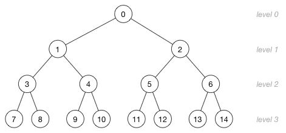
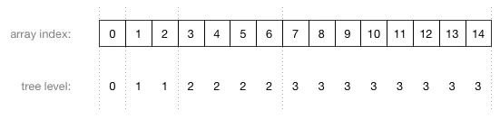

# ts实现十大经典排序算法

## NO.1 冒泡排序法(bubbleSort)

1. 遍历长度为n的数组，比较相邻位置的大小
2. 将较大的放置右边，保证了第一次遍历后数组末尾为最大
3. 将遍历长度减1，重复上述操作，直到遍历长度为2即可得到从小到大的排序的数组  

若想要从大到小排序，则将较小的放置在右边即可  

+ 图解：

+ ts实现:

```ts
/**
 * @description: 定义比较函数接口
 * @param {T} 泛型T
 * @return {boolean}
 */
interface COMPARE<T> {
  (left:T, right:T):boolean;
}
class SortAlgorithm {
  static bubbleSort<T>(arr:T[], fn:COMPARE<T>):T[] {
    let length = arr.length;
    let exchangeFlag:boolean = false; // 是否发生交换的标志
    if(length >1){
      for(let i = 0; i < length; i++){
        exchangeFlag = false; // 每轮循环开始时，初始化是否交换标志
        for(let j = 1; j < length - i; j++){
          if(!fn(arr[j-1], arr[j])){
            let temp = arr[j-1];
            arr[j-1] = arr[j];
            arr[j] = temp;
            exchangeFlag = true;
          }
        }
        if(!exchangeFlag){ // 若未发生交换，则此轮循环已排好序，直接跳出即可
          break;
        }
      }
    }
    return arr;
  }
  // 内置数字比较函数
  static NumberLE(left:number, right:number):boolean{
    if(left > right){
      return false;
    }
    return true;
  }

  static NumberGE(left:number, right:number):boolean{
    if(left < right){
      return false;
    }
    return true;
  }

  /**
   * @description: 测试用例
   * @param {*}
   * @return {*}
   */
  static test() {
    let nums:number[] = [5,5,5,2,3,8,1];
    // nums = [];
    let result:number[] = [1, 2, 3, 5, 5, 5, 8];
    console.log(...SortAlgorithm.bubbleSort(nums, SortAlgorithm.NumberLE))
    console.log(...result)
  }
}

SortAlgorithm.test();
```

## NO.2 选择排序法(SelectionSort)

每次从未排序序列中选择一个最小值(最大值)放入已排序序列的末尾  

+ 图解：  

+ ts实现：

```ts
// 接上述类的静态方法
static selectionSort<T>(arr:T[], fn:COMPARE<T>):T[] {
  let length:number = arr.length;
  for(let i = 0; i < length -1; i++){
    let targetIndex = i;
    for(let j = i+1; j < length; j++){
      if(fn(arr[j], arr[targetIndex])){
        targetIndex = j;
      }
    }
    let temp:T = arr[i];
    arr[i] = arr[targetIndex];
    arr[targetIndex] = temp;
  }
  return arr
}
```

## NO.3 插入排序法(InsertionSort)

通过构建有序序列，对未排序的数据，在已排序数列中从后向前扫描  
记当前位置为temp，若扫描位的元素比temp大，则将该元素后移一位  
直到找到比temp小的元素为止，把temp插入到该元素的后一位。  

+ 步骤：

1. 将列表看做排好序的前半部分和没排序的后半部分，使用target指针从第二个元素起遍历列表
2. 使用compare指针，将排好序的前半部分从后向前进行遍历
3. 若target < compare则交换所指向的值
4. 向左移动target指针(target指向compare的指向的位置)，保持target始终指向本次遍历初始指向的元素
5. 继续compare的下一次遍历，若不满足步骤3则说明target大于compare前面的元素，直接跳出内层循环，执行步骤2

+ 图解：  

+ ts实现:

```ts
static insertionSort<T>(arr:T[], fn:COMPARE<T>):T[]{
  // 该算法对元素操作太多，仅适合用于链表类数组排序
  let length:number = arr.length;
  for(let i = 1; i < length; i++){
    let target = i;
    for(let compare = i - 1; compare >= 0; compare--){
      if(fn(arr[target], arr[compare])){
        let temp = arr[compare];
        arr[compare] = arr[target];
        arr[target] = temp;
        target = compare;
      }else{
        break;
      }
    }
  }
  return arr;
}
```

## NO.4 希尔排序(shellSort)

shellSort是insertionSort的升级版，算法假定大小不同的数字为均匀分布，  
通过间距插入排序法在每次迭代中尽可能的将数字插入到其大小合适的位置，  
最后可得到精确的位置，即排序好的数组。  

通常shellSort的比较次数和数字交换次数会小于insertionSort  
因此性能表现更好即平均算法复杂度更小O( n^1.3 )，但其最坏算法复杂度相同O( n^2 )  

+ 步骤

1. 设置间距gap，通过gap间距将数组分割gap个组，通常gap取length/2仅保留整数
2. 对组内使用插入排序法
3. 将gap除2重复步骤1，直到gap等于1再进行最后一次插入排序即可获得排序好的数组

+ 图解

+ ts实现

```ts
static shellSort<T>(arr:T[], fn:COMPARE<T>):T[]{
  let length = arr.length;
  let gap = Math.floor(length/2);
  while(gap>0){
    for(let i = 0; i< gap; i++){ // 分gap组进行插入排序
      // j指向组内第二个元素，向后遍历
      for(let j = i + gap; j < length; j += gap){
        let target = j; // 初始化目标指针,compare指针指向前一个排序好的元素
        for(let compare = j - gap; compare >= 0;compare -= gap){
          if(fn(arr[target], arr[compare])){
            let temp = arr[target];
            arr[target] = arr[compare];
            arr[compare] = temp;
            target = compare;
          }else{
            break;
          }
        }
      }
    }
    gap = Math.floor(gap/2);
  }
  return arr;
}
```

## NO.5 归并排序(mergeSort)

+ 步骤

1. 把长度为n的输入序列分成两个长度为n/2的子序列
2. 对着两个子序列分别采用归并排序，将两个排序好的子序列合并成一个最终的排序序列
3. 反复递归直到子序列不可分

+ 图解

+ ts实现

```ts
/**
 * @description: 归并排序中用于合并左右两个数组
 * @param {T[]} left 存储T类型的左数组
 * @param {T[]} right 存储T类型的左数组
 * @param {COMPARE} fn 用于比较的函数
 * @return {T[]} 返回值也是T类型的数组
 */
static mergeArray<T>(left:T[], right:T[], fn:COMPARE<T>):T[]{
  let result:T[] = [];
  let l = 0, r = 0;
  while(l< left.length && r < right.length){
    if(fn(left[l], right[r])){
      result.push(left[l]);
      l++;
    }else{
      result.push(right[r]);
      r++
    }
  }
  result.push(...left.slice(l));
  result.push(...right.slice(r));
  return result;
}

/**
 * @description: 递归调用此方法，将数组左右细分下去，并调用mergeArray合并两数组
 * @param {T[]} arr 传入存储T类型的数组
 * @param {COMPARE} fn 用于比较的方法
 * @return {T[]} 返回排好序的T类型的数组
 */
static mergeSort<T>(arr:T[], fn:COMPARE<T>):T[]{
  let length = arr.length;
  if(length<2){
    return arr;
  }
  let num = Math.ceil(length/2);
  let left = SortAlgorithm.mergeSort(arr.slice(0, num), fn);
  let right = SortAlgorithm.mergeSort(arr.slice(num), fn);
  return SortAlgorithm.mergeArray(left, right, fn);
}
```

## NO.6 快速排序(quickSort)

+ 步骤

1. 从数列中挑出一个元素作为基准，比基准小的元素全部排在左边，反之在右边。
2. 递归的对基准左右两边的数列进行快速排序。
3. 合并左边序列、基准和右边序列并返回

+ 图解

+ ts实现

```ts
static quickSort<T>(arr:T[], fn:COMPARE<T>):T[]{
  let length = arr.length;
  if(length<2) return arr;
  let base = arr[0];
  let leftArr:T[] = [];
  let rightArr:T[] = [];
  for(let i = 1; i < length; i++){
    if(fn(arr[i], base)){
      leftArr.push(arr[i])
    }else{
      rightArr.push(arr[i])
    }
  }
  leftArr = SortAlgorithm.quickSort(leftArr, fn);
  rightArr = SortAlgorithm.quickSort(rightArr, fn);
  leftArr.push(base)
  return leftArr.concat(rightArr);
}
```

## NO.7 堆排序(heapSort)

利用堆数据结构所设计的排序算法，通过每次弹出堆顶元素实现排序

+ 堆数据结构
堆是一种二叉树，子节点从左到右填充，父节点必定大于/小于其子节点，对应最大堆/最小堆  
堆通常使用数组的方式存储，数组节点索引和堆节点对应如下：  
parent(i)=floor((i - 1) / 2)  
left(i)=2i+1  
right(i)=2i+2  
超出索引的表示没有子节点，其层级和数组表示范例如下图：  

  

  

高度为h的堆有h+1层，n个节点的堆高度为h=floor(log2(n))，层数为h+1，倒数第二层的索引为2^h-2

+ 步骤

1. 对数组进行建堆buildHeap
  1). 从倒数第二层的最后一个节点是 2^h - 2 向前遍历到根节点0
  2). 对每个节点进行heapify
2. heapify算法：
   1). 比较父节点、左右子节点之间的大小，将符合条件的与父节点交换位置
   2). 对进行了交换的子节点递归的进行heapify，保证该支子树满足最大或最小堆条件
3. heapSort算法：
   1). 对步骤1中的堆，堆顶与堆尾交换位置，记堆长度减1，数组末尾为已排好序的序列
   2). 将交换后的堆顶进行heapify，维持最大堆或最小堆条件
   3). 遍历数组到倒数第二个节点，每次重复1)~2)步骤，完成后即可获得排序好的数组

+ 图解

+ ts实现

```ts
/**
 * @description: 对任意数组进行建堆
 * @param {T} arr
 * @param {COMPARE} fn
 * @return {*}
 */
static buildHeap<T>(arr:T[], fn:COMPARE<T>):T[] {
  let length = arr.length;
  let end = Math.pow(2,Math.floor(Math.log2(length))) - 2;
  // debugger
  for(let i = end; i >= 0; i--){
    SortAlgorithm.heapify(arr, fn, i, arr.length - 1);
  }
  return arr;
}
/**
 * @description: 堆化函数，对传入的数组及给定的父节点以下的各级子节点进行堆化，保证
 * @param {T[]} arr 传入数组
 * @param {COMPARE} fn 用于比较的函数
 * @param {number} parent 父节点索引值
 * @param {number} end 限定进行堆化的范围0-end
 * @return {boolean} 
 */
static heapify<T>(arr:T[], fn:COMPARE<T>, parent:number, end:number):boolean {
  if(parent > end || parent < 0) return true;
  let left = parent * 2 + 1;
  let right = left + 1;
  let target = parent; // 最小值或最大值指针，默认指向父节点
  if(left <= end&&fn(arr[target], arr[left])){
    target = left; // 若左子节点没越界，不满足排序条件则将target指向左子节点
  }
  if(right <= end && fn(arr[target], arr[right])){
    target = right;
  }
  if(target !== parent){ // 若target不指向当前parent，则交换parent和target的值
    let temp = arr[target];
    arr[target] = arr[parent];
    arr[parent] = temp;
    SortAlgorithm.heapify(arr, fn, target, end); // 交换后向下传播heapify
    // SortAlgorithm.heapify(arr, fn, Math.floor((parent - 1) / 2), end); // 向上传播heapify
  }
  return true;
}
static heapSort<T>(arr:T[], fn:COMPARE<T>):T[] {
  let length = arr.length;
  if(length>1){
    SortAlgorithm.buildHeap(arr, fn); // 先对数组建堆
    for(let i = 0; i < length - 1; i++){
      let temp = arr[0];
      arr[0] = arr[length - 1 - i];
      arr[length - 1 - i] = temp; // 将堆顶的最大或最小值与堆尾交换，并标记为已排序的学历，缩短堆的节点长度
      SortAlgorithm.heapify(arr, fn, 0, length - 2 -i); // 堆剩余的堆元素进行堆化维持最大堆或最小堆
    }
  }
  return arr;
}
```

## NO.8 计数排序法(countingSort)

计数排序法将输入的数据值转化为键存储在额外开辟的数组空间中，是一种线性复杂度的排序算法，计数排序要求输入的数据必须是有确定范围的整数

+ 步骤

1. 找出待排序的数组arr中最大max和最小min的元素，开辟长度为max-min的数组C
2. 统计arr中每个值为i的元素出现的次数，存入数组C的第i项
3. 对所有的计数累加（从C中的第一个元素开始，每一项和前一项相加）
4. 反向填充目标数组：将每个元素i放在新数组的第C(i)项，每放一个元素就将C(i)减去1

+ 图解

+ ts实现

```ts
// TODO:待实现
```
