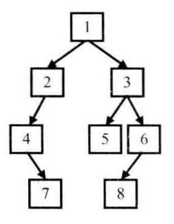
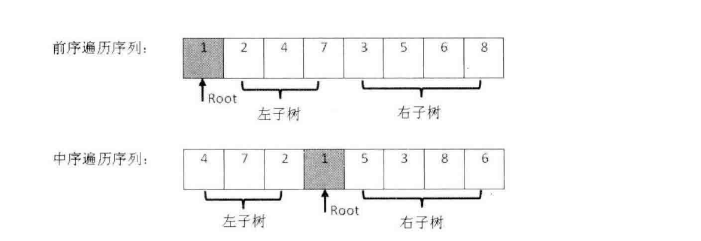

# 基于typescript实现剑指offer中的算法

## 单例模式(singleton)实现

```ts
// 利用闭包或静态变量等方式存储instance，分离构造器和单例判断函数
class singleton {
  private static instance:singleton;
  public name:string;
  constructor(name:string) {
    this.name = name;
  }

  /**
   * @description: 单例判断函数，通过此函数获取单例
   * @param {*}
   * @return {*}
   */
  static getSingleton(name:string):singleton {
    return this.instance || (this.instance = new singleton(name));
  }

  /**
   * @description: 测试用例
   * @param {*}
   * @return {*}
   */
  static test() {
    let obj1 = new singleton('obj1');
    let obj2 = singleton.getSingleton('obj2');
    let obj3 = singleton.getSingleton('obj3');
    console.log(obj1 === obj2);
    console.log(obj2 === obj3);
  }
}
singleton.test(); // 运行测试用例
```

## NO. 3：数组中重复的数字

### 题目一：找出数组中重复的数字  

在一个长度为n的数组中素有的数字都在[0, n-1]范围内。  
请找出数组中任意一个重复的数字。  
例如，输入长度为7的数组{2,3,1,0,2,5,3}，那么对应输出的重复数字是2或3，若没有重复的元素则直接返回-1.

+ 解题思路：利用列表下标作为哈希表，通过元素互换逐步构建哈希表，若遇到相等的数字则通过下标索引key必然能检测到重复数字
+ 步骤：

1. 遍历数组，若i位置的值`arr[i]`不等于i，则进行步骤2
2. 以该值为索引判断`arr[i]`是否与`arr[arr[i]]`位置的值相等,若相等则说明找到重复的元素，否则进行值交换。
3. 交换后再次判断，重复步骤2，直到`arr[i] = i`，继续进行遍历
4. 遍历完成还没有找到重复的元素则直接返回-1

+ 总结
算法利用了哈希表思想，利用数组的索引作为key，每个数字最多交换两次就能放到合适的位置，因此时间复杂度为O(n)
+ ts解决方案：

```ts
class Demo {
  static duplicate(arr:number[]):number{
    let length = arr.length;
    if(length < 2) return -1;
    for(let i = 0; i < length; i++){
      // 不满足限定范围则直接返回
      if(arr[i] < 0 || arr[i] > length -1) return -1;
      // 当arr[i] !== arr[arr[i]]时，需交换值，交换后arr[i]位置满足该条件，但i位置不一定满足该条件，因此需要加入内层循环，此举并不会增加时间复杂度，因为后续的位置以基本满足该条件不会继续循环
      while(arr[i] !== i){
        if(arr[i] !== arr[arr[i]]){
          let temp = arr[arr[i]];
          arr[arr[i]] = arr[i];
          arr[i] = temp;
        }else{
          return arr[i]
        }
      }
    }
    return -1
  }
  static test() {
    let testArr = [2,3,1,0,2,5,3];
    console.log(Demo.duplicate(testArr))
  }
}

Demo.test();
```

### 题目二：(接题目一中)增加限定条件：不修改数组找出重复的数字  

+ 解题思路：
开辟一个和arr相同长度的数组，以空间换时间
<!-- 以下方法不能保证100%找到重复的数字 -->
<!-- 利用二分查找法原理，确定中值，统计数组中比中值小或者比中值大的数字的个数，以此确定重复的数字在中值左侧还是右侧 -->

## NO.4 二维数组中的查找

在一个二维数组中，每一行都按照从左到右的递增顺序排列，每一列都按照从上到下递增的顺序排列，请完成一个函数，输入这样的二维数组和一个整数，判断数组中是否含有该整数.  

+ 解题思路:

1. 首先选取数组右上角的数字，如果该数字大于目标数字则排除该列，小于则排除该行
2. 向下或向左移动指针，直到等于目标或者范围为空停止

+ 总结
其本质是二分查找法的变体，时间复杂度为O(m+n)
+ ts实现

```ts
class Demo {
  static findInArr(arr:number[][], target:number):boolean{
    if(arr.length <= 0 || arr[0].length <= 0) return false;
    let i = 0, j = arr[0].length - 1;
    while(i < arr.length && j > 0){
      if(arr[i][j] > target){
        j--;
      }else if(arr[i][j] < target){
        i++;
      }else return true;
    }
    return false
  }
  static test() {
    let testArr = [
      [1,2,8,9],
      [2,4,9,12],
      [4,7,10,13],
      [6,8,11,15]
    ];
    console.log(Demo.findInArr(testArr, 3))
  }
}
Demo.test();
```

## NO.5 替换空格

题目：请实现一个函数，把字符串中的每个空格替换成"%20"。例如，输入"We are happy."，则输出"We%20are%20happy."。  

+ 解题思路：

1. 先遍历一遍字符串统计空格的个数
2. 然后分配足够的存储空间
3. 从后向前的依次替换空格
(算法时间效率O(n))

+ 总结
此题考察数组合并，从后向前填充数组可减少移动次数，时间复杂度为O(n)
ps:使用js原生方法`str.split(' ').join('%20')`方法即可实现，但无法体现考察点
+ ts实现

```ts
class Demo {
  static replaceSpace(s:string):string {
    let data = Array.from(s);
    let length = data.length;
    let count = 0;
    for(let i = 0; i < length; i++){
      if(data[i] === ' ') count++;
    }
    data = data.concat(new Array(count*2).fill(''));
    let tail = data.length - 1, target = length -1;
    while(tail !== target){
      if(data[target] === ' '){
        data[tail--] = '0';
        data[tail--] = '2';
        data[tail--] = '%';
        target--;
      }else{
        data[tail--] = data[target--];
      }
    }
    return data.join('');
  }
  static test() {
    let testArr = 'We Are Happy.'
    console.log(Demo.replaceSpace(testArr))
  }
}
Demo.test();
```

## NO. 6： 从尾到头打印链表

题目：输入一个链表的头节点，从尾到头反过来打印出每个节点的值。  
解题思路：利用栈的先进后出特性存储链表然后再输出(或者利用递归函数)
ts实现

```ts
interface ListNode<T> {
  value:T,
  next:ListNode<T>|undefined
}
class NumberNode implements ListNode<number> {
  value:number;
  next:ListNode<number>|undefined;
  constructor(val:number, next:NumberNode|undefined = undefined){
    this.value = val;
    this.next;
  }
}
class Demo {
  static reverse<T>(head:ListNode<T>):void{
    let res:T[] = [];
    let p = head;
    while(p){
      res.push(p.value);
      p = p.next;
    }
    for(let i = res.length - 1; i >= 0; i--){
      console.log(res[i]);
    }
  }
  static test() {
    let testArr = [1,2,3,4,5]
    const head = new NumberNode(testArr[0]);
    let p = head;
    for(let i = 1; i < testArr.length; i++){
      p.next = new NumberNode(testArr[i]);
      p = p.next;
    }
    Demo.reverse(head);
  }
}
Demo.test();
```

## NO.7 重建二叉树

题目：输入某二叉树的前序遍历和中序遍历的结果，请重建该二叉树。假设输入的前序遍历和中序遍历的结果中都不含重复数字。例如输入前序遍历序列{1,2,4,7,3,5,6,8}和中序遍历序列{4,7,2,1,5,3,8,6}，则重建如下入的二叉树并输出它的头节点。  

+ 解析
前序遍历:根左右；中序遍历：左根右；后序遍历：左右根
+ 思路
  1. 前序序列中第一个数为根节点parent
  2. 找到中序序列中parent的位置，其前方为左子树，后方为右子树
  3. 根据中序序列中左右子树的长度在前序序列中分割左右子树
  4. 重复1-3步骤，递归的重建左右子树  
+ 图例
  

  

+ ts实现

```ts
class TreeNode<T> {
  val:T
  left:TreeNode<T>|undefined;
  right:TreeNode<T>|undefined;
  constructor(val:T, left:TreeNode<T>|undefined = undefined, right:TreeNode<T>|undefined = undefined){
    this.val = val;
    this.left = left;
    this.right = right;
  }
  static preRoot<T>(root:TreeNode<T>){ // 定义前序遍历算法，用于测试用例校验
    if(root) console.log(root.val);
    if(root?.left) TreeNode.preRoot(root.left);
    if(root?.right) TreeNode.preRoot(root.right);
  }
}
class Demo {
  static rebuildTree<T>(pre:T[], vin:T[], indexArr?:number[]):TreeNode<T>|undefined{
    // 若未传入索引数组，则进行初始化
    if(!indexArr) indexArr = [0, pre.length, 0, vin.length];
    // 若前序和中序长度不相等，则抛出错误
    if(indexArr[1] - indexArr[0] !== indexArr[3] - indexArr[2]) throw new Error('pre.length must eq vin.length');
    // 若长度同为0 则直接返回undefined
    if(indexArr[1] - indexArr[0] === 0 || indexArr[3] - indexArr[2] === 0) return undefined;
    // 经过前面的条件判断，确定前序和中序长度相等，且至少有一个节点，因此初始化根节点
    let root = new TreeNode(pre[indexArr[0]]);
    // 若长度为1则直接返回该根节点
    if(indexArr[1] - indexArr[0] === 1 && indexArr[3] - indexArr[2] === 1) return root;
    // 计算根节点在中序中的索引位置，然后计算左子树和右子树的长度
    let vinRoot = vin.indexOf(pre[indexArr[0]]);
    let leftLen = vinRoot - indexArr[2];
    let rightLen = indexArr[3] - vinRoot - 1; // vinRoot + 1 才是右子树起点
    // 递归的对左子树和右子树进行重建
    root.left = leftLen === 0 ? undefined :Demo.rebuildTree(
      pre, 
      vin,
      // 确定前序，中序中的左子树的起点和终点(不含终点),传入索引数组
      [
        indexArr[0] + 1, 
        indexArr[0] + 1 + leftLen,
        indexArr[2],
        indexArr[2] + leftLen
      ]
    )
    root.right = rightLen === 0 ? undefined : Demo.rebuildTree(
      pre,
      vin,
      [
        indexArr[1] - rightLen,
        indexArr[1],
        indexArr[3] - rightLen,
        indexArr[3]
      ]
    )
    return root;
  }
  static test() {
    let pre = [1,2,4,7,3,5,6,8];
    let vin = [4,7,2,1,5,3,8,6];
    let root = Demo.rebuildTree(pre, vin);
    TreeNode.preRoot(root);
    console.log('前序遍历：', ...pre);
  }
}
Demo.test();
```

## NO.8 二叉树的下一个节点

题目：给定一颗二叉树和其中的一个节点，如何找出中序遍历序列的下一个节点？树中的节点除了有两个分别指向左、右子节点的指针，还有一个指向父节点的指针。

+ 思路：
  1. 若该子节点有右子树，则右子树的中序遍历序列第一个节点即为下一个节点
  2. 若无右子树，且是其父节点的左子节点，则下一个节点为父节点
  3. 若无右子树，且为父节点的右节点，则向上遍历，直到找到一个节点为其父节点的左子节点，则该节点的父节点为下一个节点

+ ts实现

```ts
class Demo {
  static NextVinNode<T>(p:TreeNode<T>):TreeNode<T>|null {
    if(!p) return null;
    if(p.right){
      return Demo.firstVinNode(p.right)
    }else if(p.parent && p.parent.left === p) {
      return p.parent;
    }else {
      let target = p;
      while(target.parent && target.parent.left !== target){
        target = target.parent;
      }
      if(target.parent){
        return target.parent;
      }else {
        return null;
      }
    }
  }
  static firstVinNode<T>(p:TreeNode<T>):TreeNode<T>|null{
    if(!p) return null;
    if(p.left) return Demo.firstVinNode(p.left);
    return p;
  }
  static test() {
    // 本次测试用例需要重建二叉树，且二叉树中含parent父节点，不能共用NO.7中的重建方法
    // 因此暂不实现，算法已在牛客网中验证通过
  }
}
```

## NO.9 用两个栈实现队列

题目：用两个栈实现一个队列。队列的声明如下，请实现它的两个函数appendTail和deleteHead，分别完成在队列尾部插入节点在队列头部删除节点的功能。  

+ 解题思路：
  1. 利用栈1入队，在栈2为空时将栈1中的元素通过出栈，再入栈的方式转移到栈2中实现反序

+ ts实现

```ts
class Queue<T> {
  stack1:T[] = [];
  stack2:T[] = [];
  constructor() {

  }
  push(node:T) {
    if(this.stack2.length === 0&&this.stack1.length !== 0) {
      while(this.stack1.length > 0){
        this.stack2.push(this.stack1.pop())
      }
    }
    this.stack1.push(node);
  }
  pop(): T|undefined {
    if(this.stack2.length === 0&&this.stack1.length !== 0) {
      while(this.stack1.length > 0){
        this.stack2.push(this.stack1.pop())
      }
    }
    return this.stack2.pop()||undefined;
  }

  static test() {
    const queue = new Queue();
    let testData = [1,2,3,4,5];
    for(let i = 0; i < testData.length; i++){
      queue.push(testData[i]);
    }
    for(let i = 0; i < testData.length; i++){
      console.log(queue.pop());
    }
    console.log('result: ', testData);
  }
}

Queue.test();
```

## NO.10 斐波拉契数列

### 题目1：求斐波拉契数列的第n项  

[斐波拉契数列定义] f(n) = f(n-1) + f(n-2)、f(0) = 0、f(1) = 1  

+ 解题思路：
  1. 可以用递归的方式来实现，但算法效率低，使用循环来代替递归会更好，循环的方式时间复杂度为O(n)
  2. 还可通过矩阵快速求幂的方式计算时间复杂度为O(log(n))，进一步的可通过矩阵特征值及特征向量求出数列通项，从而实现O(1)时间复杂度

### 题目2：青蛙跳台阶问题  

一只青蛙一次可以跳上一级台阶，也可以跳上2级台阶。求该青蛙跳上一个n级台阶总共有多少种跳法。  

解题思路：

1. 设有f(n)种方法，
2. n=1时f(1) = 1,
3. n=2时f(2) = 2，
4. n>2时，先跳一级，剩余还有f(n-1)种方法，先跳2级，剩余还有f(n-2)种方法，所以f(n) = f(n-1) + f(n-2)，因此与斐波拉契数列相似
5. 为保证大数相加时整数不溢出，通常需要先对相加结果1e9+7取余

+ ts实现

```ts
class Demo {
  static fibonacci(n:number):number {
    let p = [1, 2]; // 数列约定初始值
    n = Math.floor(n);
    if(n <= 0) return -1;
    if(n < 3) return p[n -1];
    const mod = 1e9+7; // 对该数取余能保证大数相加时不溢出
    for(let i = 3; i <= n; i++) {
      let temp = (p[0] + p[1]) % mod;
      p[0] = p[1];
      p[1] = temp;
    }
    return p[1];
  }
  static test(){
    const testData = [1,2,3,5,8,13];
    let n = 6
    console.log(Demo.fibonacci(n) === testData[n - 1]);
  }
}
Demo.test();
```

## NO.11 旋转数组中的最小数字

题目：把一个数组最开始的若干个元素搬到数组的末尾，我们称之为数组的旋转。输入一个递增排序的数组的一个旋转，输出旋转数组的最小元素。例如，数组[3,4,5,1,2]为[1,2,3,4,5]的一个旋转，该数组的最小值为1.

+ 解题思路：
旋转后的排序数组是由两个已排好序的子数组组成，
利用对撞指针的二分查找法逐步缩小查找范围，
但若遇上大量重复数字时，需要遍历子数组进行查找(算法基于二分查找，时间复杂度为O(log(n)))
  1. 定义start、mid、end三个指针，分别指向数组的起始、中间、末尾
  2. 若剩余序列长度为2，则end一定为最小的元素，mid指向end，跳出循环
  3. 取mid = start + (end - start) / 2 即正中间位置
  4. 若start、mid、end所指向的元素都相等，则无法判断最小值位于左子序列还是右子序列，只能对序列进行遍历取得最小值
  5. 若start的元素小于或等于mid的元素，则说明最小元素在右子序列，若end的元素大于或等于mid则说明最小元素在左子序列
  6. 递归的重复2-5步骤，直到start的元素大于或等于end不成立，最后能保证mid指向最小元素

+ ts实现

```ts
class Demo {
  static Min(arr:number[]):number|undefined {
    if(arr.length < 2) return arr[0];
    let start = 0, mid = 0, end = arr.length - 1;
    while(arr[start] >= arr[end]){
      if(end - start === 1) {
        mid = end;
        break;
      }
      mid = Math.floor((end + start) / 2);
      if(arr[start] === arr[end] && arr[mid] === arr[start]){
        return Demo._MinInOrder(arr, start, end);
      }
      if(arr[start] <= arr[mid]){
        start = mid;
      }else if(arr[mid] <= arr[end]){
        end = mid
      }
    }
    return arr[mid];
  }
  static _MinInOrder(arr:number[], start:number, end:number):number {
    let result = arr[start];
    for(let i = start + 1; i <= end; i++){
      if(arr[i] < result){
        result = arr[i]
      }
    }
    return result;
  }
  static test(){
    const testData = [5,8,13,1,2,3];
    console.log(Demo.Min(testData));
  }
}
Demo.test();
```

## NO. 12：矩阵中的路径

题目：
请设计一个函数，用来判断在一个矩阵中是否存在一条包含某字符串的所有字符的路径。  
路径可以从矩阵中的任意一格开始，每一步可以在矩阵中向左、右、上、下移动一格。  
如果一条路径经过了矩阵的某一格，那么该路径不能再次进入该格子。  
例如，在下面的3*4的矩阵中包含一条字符串“bfce”的路径(路径中的字母用大写标出)。  
但矩阵中不包含字符串“abfb”的路径，因为字符串的第一个字符b占据了矩阵中的第一行第二个格子后，路径不能再次进入这个格子。
$$\begin{matrix}
a&B&t&g\\
c&F&C&s\\
j&d&E&h\\
\end{matrix}$$

+ 解题思路：利用回溯法，若当前路径不通，则回溯上一节点，尝试未尝试过的路径
  1. 维护一个访问矩阵visited，若对应位置被占据则记为true，遍历目标矩阵matrix，
  2. 指针p所指向的str中的字符，若等于遍历位置的字符，则将指针p移动一个位置，并标记visited，递归判断字符上下左右位置是否存在移动后的p指向的字符
  3. 若不存在则回溯，p指针回退一步，并还原标记visited，结束该节点的递归
  4. 若一直满足步骤2中的条件，则递归结束条件为p大于str长度，并返回true表示找到路径

+ ts实现

```ts
class Demo {
  static hasPath(mat:string[][], str:string):boolean {
    if(str.length === 0 || mat.length === 0) return false;
    // debugger
    let rows = mat.length, columns = mat[0].length;
    let pathLen = 0;
    let visited:boolean[][] = new Array(rows).fill('').map(item => 
      [...new Array(columns).fill(false)]
    );
    for(let i = 0; i < rows; i++){
      for(let j = 0; j < columns; j++){
        if(Demo._hasPathCore(mat, str, i, j, visited, pathLen)) return true;
      }
    }
    return false;
  }
  static _hasPathCore(mat:string[][], str:string, i:number, j:number, visited:boolean[][], pathLen:number):boolean {
    if(pathLen >= str.length) return true;
    let result = false;
    if(i >= 0 && i < mat.length && j >= 0 && j <mat[0].length && mat[i][j] === str[pathLen] && !visited[i][j]){
      pathLen++;
      visited[i][j] = true;
      result = Demo._hasPathCore(mat, str, i, j-1, visited, pathLen) || 
      Demo._hasPathCore(mat, str, i-1, j, visited, pathLen) || 
      Demo._hasPathCore(mat, str, i, j+1, visited, pathLen) || 
      Demo._hasPathCore(mat, str, i+1, j, visited, pathLen);
      if(!result) {
        pathLen--;
        visited[i][j] = false;
      }
    }
    return result;
  }
  static test(){
    const testData = [
      ['a', 'b', 't', 'g'],
      ['c', 'f', 'c', 's'],
      ['j', 'd', 'e', 'h']
    ];
    console.log(Demo.hasPath(testData, 'abfb'));
  }
}
Demo.test();
```

## NO.13 机器人的运动范围

题目：地上有一个m×n的方格。一个机器人从坐标(0, 0)的格子开始移动，它每次可以向左、右、上、下移动一格，但不能进入行坐标和列坐标的位数之和大于k的格子。例如，当k=18时，机器人能够进入方格(35,37),因为3+5+3+7=18。但它不能进入方格(35, 38)，因为3+5+3+8=19。请问该机器人能够到达多少个格子？

+ 解题思路：因为机器人每次只能移动一格，同样可以利用回溯法逐步遍历能够到达哪些格子
  1. 使用map记录机器人已访问的格子，模拟visited
  2. 设定起点为`[0,0]`，若当前节点满足条件k及visited中不存在，则将节点坐标为key，加入visited中，并将count加1，否则返回count的初始值0
  3. 递归的将节点上下左右位置进行判断，重复2步骤，并将返回值加入到count中
  4. 判断是否满足条件k需要判断左边是否溢出，并计算位数和是否不大于k

+ ts实现

```ts
class Demo {
  static calcSum(num:number):number{
    let result = 0;
    while(num > 0){
      result += num % 10;
      num = Math.floor(num / 10);
    }
    return result;
  }
  static inRange(matRange:number[], pos:number[], target:number) {
    let result = false;
    if(
      pos[0]<matRange[0]&&pos[0]>=0
      &&pos[1]<matRange[1]&&pos[1] >=0
      &&( Demo.calcSum(pos[0]) + Demo.calcSum(pos[1]) )<=target
    ) result = true;
    return result;
  }
  static CountBFC(matRange:number[], visited:Map<string, boolean>, pos:number[], target:number):number {
    let count = 0;
    if(Demo.inRange(matRange, pos, target)&&!visited.has(pos.toString())){
      visited.set(pos.toString(), true);
      count += 1 
        + Demo.CountBFC(matRange, visited, [pos[0]+1, pos[1]], target)
        + Demo.CountBFC(matRange, visited, [pos[0]-1, pos[1]], target)
        + Demo.CountBFC(matRange, visited, [pos[0], pos[1]+1], target)
        + Demo.CountBFC(matRange, visited, [pos[0], pos[1]-1], target);
    }
    return count;
  }
  static movingCount(target:number, rows:number, cols:number):number{
    if(target<0||rows<1||cols<1) return 0;
    // debugger
    let visited:Map<string, boolean> = new Map();
    return Demo.CountBFC([rows, cols], visited, [0,0], target);
  }
  static test(){
    console.log(Demo.movingCount(0,3,1))
  }
}
Demo.test();
```

## NO. 14：剪绳子

题目：给你一根长度为n的绳子，请把绳子剪成m段(m,n都是整数，n>1并且m>1)，每段绳子的长度记为k[0],k[1],...,k[m]。请问k[0]*k[1]*...*k[m]可能的最大乘积是多少？例如，当绳子的长度为8时，我们把他剪成长度分别为2,3,3的三段，此时得到的最大乘积是18.

+ 解题思路：因为是最优化问题，且问题可分，可考虑使用动态规划或者贪婪法，详细见代码文档或剑指offer（注：题目中需补充条件，m为任意整数，且切成的绳子长度必须为整数）
  + 动态规划解法
    1. 创建长度为n的数组maxLens用于存储对应索引i长度的绳子剪断最大乘积，则maxLens[n - 1]程序返回值
    2. 可尝试先剪下一段长度j，然后剩余长度可剪可不剪，
    3. 记长度为n的绳子剪断后的乘积为f(n),则f(n)=j*(n-j)或f(n)=j*f(n-j),可取其中的最大值记为FMax
    4. 从2开始遍历j，直到不满足j <= Math.floor(n / 2)，每次遍历中将较大的FmMx存入`maxLens[i]`
    5. 定义maxLens = [0, 1, 2, 4]为初始值分别表示绳子长度为[1, 2, 3, 4]时绳子剪断后最大乘积，从长度为5开始遍历绳子长度i，直到i <= n，每次遍历执行步骤4,遍历完成后返回maxLens[n - 1]即为长度为n的绳子剪断后的最大乘积

+ 贪婪算法解法
   1. 尽可能的将绳子分为长度为3的段，并且剩余长度尽可能为2或4，不可为1

+ ts实现

```ts
class Demo {
  // 动态规划解法
  static cuttingRope(len:number):number{
    let maxLens = [0, 1, 2, 4];
    if(len < 2) return 0;
    if(len < 5) return maxLens[len - 1];
    maxLens = maxLens.concat(new Array(len - 4).fill(0));
    for(let i = 5; i <= len; i++){
      let j = 2;
      while(j <= Math.floor(i / 2)){
        let product = j*maxLens[i-j-1];
        if(maxLens[i -1] < product) maxLens[i -1] = product;
        if(maxLens[i -1] < j*(i-j)) maxLens[i -1] = j*(i - j)
        j++;
      }
    }
    return maxLens[len - 1];
  }
  // TODO:贪婪解法
  static test(){
    console.log(Demo.cuttingRope(10))
  }
}
Demo.test();
```

## NO.15 二进制中1的个数

题目：请实现一个函数，输入一个整数，输出该数的二进制表示中1的个数。例如，把9表示成二进制是1001，有2位是1，因此，输入9，则函数输出2.

+ 解题思路
  + 逐位扫描
    1. 将数与flag=1进行与操作，每次flag按位左移，遍历整型的二进制位数(32或64)后即可统计出1的个数

  + 减1算法
    1. 将一个整数减1，都是把二进制中最右边的1变成0，并且把它右边的所有0变成1(即：最右边的数为1时，直接变成0，最右边的数为0时，将其前方最近的一个1变为0，其后的所有0变为1)
    2. 因此，将整数n做n&(n-1)相当于将其最右边的1去掉，因此n>0时，可以反复进行此操作，并统计1的个数
    3. n中有多少个1就需要循环多少次

+ ts

```ts
class Demo {
  // 减1算法实现
  static NumberOf1(n:number):number {
    let count = 0;
    while(n){ // n不为0 说明其二进制中还有1，继续遍历；
      count++;
      n = n&(n-1); // 每次减掉二进制中最右边的1
    }
    return count;
  }
  static test(){
    console.log(Demo.NumberOf1(-10));
  }
}
Demo.test();
```

## NO. 16：数值的整数次方

题目：实现函数double Power(double base, int exponent)，求base的exponent次方。不得使用库函数，同时不需要考虑大数问题。

+ 解题思路：利用二分法，对exponent进行分解，每次除2取整，同时对base使用自乘，利用已计算好的值，算法复杂度为O(log2(n))
+ 流程
  1. 判断base，exponent是否为0，若为0则直接分别返回0和1
  2. 若exponent < 0 则将base设置为 1 / base，exponent设置为-exponent转换为正数的情况
  3. 设置res=1用于缓存奇数的结果，pow=base用于自乘，遍历结束后返回res*pow，即默认结果为exponent=1的情况
  4. exponent > 1时进行遍历，每次判断若为奇数，则执行res*=base累乘base，并将exponent/2取整，进行二分，并执行pow*=pow累积自乘，循环结束后返回res*pow

+ ts实现

```ts
class Demo {
  static Power(base:number, exponent:number):number{
    if(base === 0) return 0;
    if(exponent === 0) return 1;
    if(exponent < 0) {
      base = 1 / base;
      exponent = -exponent;
    }
    let result = 1;
    let res = base;
    while(exponent > 1){
      if(exponent % 2){
        result *= base;
      }
      exponent = Math.floor(exponent / 2);
      res *= res;
    }
    return res*result;
  }
  static test(){
    console.log(Demo.Power(2.0, -2))
  }
}
Demo.test();
```

## NO.17 打印从1到最大的n位数

题目：输入数字n，按顺序打印出从1到最大的n位十进制数。比如输入3，则打印输出1,2,3一直到最大的3为数999.

解题思路：
若不涉及大数问题，则使用常规解法
若涉及到大数问题，es6内置类型智能支持大数bigint，但为了表现算法思想不使用内置大数，转而使用list[str]来表示大数

```ts
export function printNumbers(n: number): number[] {
  let number = 1;
  if(n <= 0) return [];
  while(n){
    number*=10;
    n--;
  }
  let result = new Array(number - 1);
  for(let i = 1; i < number; i++){
    result[i-1] = i
  }
  return result;
}
```

## NO.18 删除链表的节点

### 题目一：在O(1)时间内删除链表节点  

给定单向链表的头指针和一个节点指针，定义一个函数在O(1)时间内删除该节点。

+ 思路：
通过复制下一个节点的内容到当前节点的方式删除当前节点，并保存下一个节点的下一个节点，断开链接并重新连上当前节点即可做到删除，  
若要删除的节点没有下一个节点则需要从头指针开始遍历链表  
若要删除的节点就是头指针，则直接将头指针置空即可

+ ts实现

```ts
class LinkNode<T> {
  val:T;
  next:LinkNode<T>|null
  constructor(val:T, next?:LinkNode<T>) {
    this.val = val;
    this.next = next;
  }
}

class Demo {
  static deleteNode<T>(head:LinkNode<T>, p:LinkNode<T>):LinkNode<T>{
    if(head === p){
      head = head.next;
    }
    if(!p.next){
      let parent = head;
      while(parent.next !== p){
        parent = parent.next;
      }
      if(parent) parent.next = null;
    }
    p.val = p.next.val;
    p.next = p.next.next;
    return head;
  }
  static test(){
    const testData:number[] = [4,5,1,9];
    let head = new LinkNode(testData[0]);
    let p = head;
    
    for(let i = 1; i < testData.length; i++){
      p.next = new LinkNode(testData[i]);
      p = p.next;
    }
    
    p = Demo.deleteNode(head, head.next.next);
    while(p){
      console.log(p.val);
      p = p.next;
    }
  }
}
Demo.test();
```

### 题目二：删除链表中重复的节点

删除排序的链表中重复的节点
解题思路与题目1类似

## NO. 19：正则表达式匹配

题目：请实现一个函数用来匹配包含"."和"\*"的正则表达式。模式中的字符"."表示任意一个字符，而"\*"表示它前面的字符可以出现任意次(含0次)。在本题中，匹配是指字符串的所有字符匹配整个模式。例如，字符串"aaa"与模式"a.a"和"ab\*ac\*a"匹配，但与"aa.a"和"ab\*a"均不匹配。

+ 解题思路：递归的进行逐个字符比较，若模式为带'*'的组合，则综合多种匹配情况，有一种为true时，向该模式继续递归，递归结束条件较为复杂，需要分开讨论，详见算法步骤
+ 步骤：
  1. 设置两个比较指针ps和pp，先判断边界条件5，再判断pp+1在范围内且指向字符为'*'时进行步骤2，否则进行步骤4
  2. ps不在范围内或ps和pp不匹配时，说明带'*'组合匹配0次，向后移动pp两个字符，再进行递归判断，若不满足条件则跳至步骤3
  3. 此时ps一定在范围内，字符组合匹配情况如下，多种情况只要有一个能匹配到末尾，则整个表达式匹配，因此用或运算关联起来
    a. 匹配多次，此时只需向后移动ps一位，继续递归匹配
    b. 匹配一次，此时需要将ps向后移动一位，pp向后移动两位，再进行递归匹配
    c. 匹配0次，此时只需将pp向后移动两位再进行递归匹配
  4. 判断ps是否在范围内且ps与pp匹配，则将ps和pp都向后移动一位递归判断，否则说明ps指向末尾且pp其后还有不带'*'的组合，或者对应字符为直接不匹配，均需返回false表示匹配失败
  5. 边界条件：经过上一轮判断，若ps和pp同时超出范围，则说明字符串和模式完全匹配直接返回true，若pp先超出范围则字符串还有剩余直接返回false，若ps先超出范围，则会被步骤2捕获，直到pp后不再有带'*'的组合，最后会被步骤4捕获并返回相应的bool值
+ ts实现：

```ts
class Demo {
  static isMatch(str:string, p:string):boolean {
    if(!p&&str) return false; // 模式为空且字符串不为空时直接返回false
    return Demo.isMatchCore(str, p, [0, 0]);
  }
  static isMatchCore(str:string, p:string, indexes:number[]):boolean {
    if(!indexes) indexes = [0, 0];
    if(indexes[0] >= str.length && indexes[1] >= p.length) return true;
    if(indexes[1] >= p.length && indexes[0] < str.length) return false;
    if(indexes[1]+1 < p.length && p[indexes[1]+1] === '*'){
      if(indexes[0] >= str.length||(str[indexes[0]] !== p[indexes[1]] && p[indexes[1]] !== '.')){ // str已耗尽或(字符不匹配，则通配符匹配0次)，向后移动p指针
        return Demo.isMatchCore(str, p, [indexes[0], indexes[1]+2]); 
      }else {
        return Demo.isMatchCore(str, p, [indexes[0]+1, indexes[1]]) || // 匹配n次的情况
        Demo.isMatchCore(str, p, [indexes[0], indexes[1]+2]) || // 匹配0次的情况
        Demo.isMatchCore(str, p, [indexes[0]+1, indexes[1]+2]) // 只匹配一次的情况
      }
    }
    if(indexes[0] < str.length && (str[indexes[0]] === p[indexes[1]] || p[indexes[1]] === '.')){ // 正常匹配
      return Demo.isMatchCore(str, p, [indexes[0]+1, indexes[1]+1]);
    }else{
      return false;
    }
  }
  static test(){
    let data = 'a';
    let p = '.*..a*'
    console.log(Demo.isMatch(data,p));
  }
}
Demo.test();
```

## NO.20 表示数值的字符串

题目：请实现一个函数用来判断字符串是否表示数值(包括整数和小数)。例如，字符串"+100","5e2","-123","3.1416","-1E-16"都表示数值，但"12e","1a3.14","1.2.3","+-5","12e+5.4"都不是

+ 解题思路：将数字拆解为整数、无符号整数、小数、科学计数等几个部分，从前向后逐部分进行检测
  1. 无符号整数为纯数字，整数由可选的+,-号和无符号整数组成
  2. 小数：小数点前若有数字，必为有符号整数或正负号，小数点后方为无符号整数，两侧不能同时为空，相当于与前方结果或操作
  3. 科学计数法:e前方为小数或整数，后方必为整数，相当于与前方结果与操作
+ 步骤
  1. 定义辅助函数，给定索引位置判断其后无符号整数和有符号整数，返回符合条件数组的末尾索引，表示匹配到的数字长度
  2. 去掉字符串str两侧的空格，从起始位置判断其是否包含整数，并记录bool值result，移动p指针到匹配后的位置
  3. 由于小数点前可以只有符号，因此判断result为false，且p指向为'+-'号时，将p向后移动一位，跳过'+-'号，然后判断是否有小数点为，若有则进行步骤4
  4. 判断小数点后是否能匹配到无符号整数，将其bool结果与result或操作，并移动p指针到新的匹配位置
  5. 判断当前指向是否有字符'eE'，若有则判断其后是否有整数，并将bool结果与result相与，移动p指针
  6. 返回str是否检测完成(p>=str.length)和result状态的与操作结果
+ ts实现:

```ts
class Demo {
  static isNumberic(str:string):boolean {
    if(!str) return false;
    str = str.trim(); // 祛除两侧空格
    let p = 0;
    let temp = Demo.isSignInt(str, p); // 首先检测整数
    let result = temp > 0;
    p = temp;
    if(p<str.length && !result && (str[p] === '+' || str[p] === '-')){
      p = p + 1; // 若没有匹配到整数且检测到了'+-'号则跳过该符号
    }
    if(p < str.length && str[p] === '.') { // 结合前面检测的结果检测小数部分
      temp = Demo.isUnSignInt(str, p + 1);
      result = temp > p + 1 || result;
      p = temp;
    }
    if(p < str.length && (str[p] === 'e' || str[p] === 'E')){ // 结合前面的检测结果，检测科学计数法部分
      temp = Demo.isSignInt(str, p + 1);
      result = result && temp > p + 1;
      p = temp;
    }
    return result && p >= str.length;
  }
  static isSignInt(str:string, index:number):number {
    if(!str || index >= str.length || index < 0) return index;
    if(str[index] === '-' || str[index] === '+'){
      let temp = Demo.isUnSignInt(str, index + 1);
      if(temp === index + 1) return index; // 若只有'+-'号，则整数匹配失败
      return temp;
    }
    return Demo.isUnSignInt(str, index);
  }
  static isUnSignInt(str:string, index:number):number {
    if(!str || index >= str.length || index < 0) return index;
    while(index < str.length && str[index] >= '0' && str[index] <= '9'){
      index++;
    }
    return index;
  }
  static test(){
    // debugger
    let data = '-.1';
    console.log(Demo.isNumberic(data))
  }
}
Demo.test();
```

## NO.21 调整数组顺序使奇数位于偶数前面

题目：输入一个整数数组，实现一个函数来调整该数组中数字的顺序，使得所有的奇数位于数组的前半部分，所有的偶数位于数组的后半部分。

+ 解题思路：使用头尾双指针对撞法，若头指针left指向奇数则向后移动，若尾指针指向偶数则向前移动，若left和right分别指向偶数和奇数，则交换后left和right分别向后向前移动，循环终止条件为left < right不成立，最坏时间复杂度为O(n)
+ ts实现

```ts
class Demo {
  static reOrderArr<T>(arr:T[], fn:(T)=>boolean):T[]{
    if(arr.length < 2) return arr;
    let p1 = 0, p2 = arr.length - 1;
    while(p1 < p2) {
      if(fn(arr[p1])){
        p1++;
        continue;
      }
      if(!fn(arr[p2])) {
        p2--;
        continue;
      }
      if(!fn(arr[p1]) && fn(arr[p2])){
        let temp = arr[p1];
        arr[p1] = arr[p2];
        arr[p2] = temp;
        p1++;
        p2--;
      }
    }
    return arr
  }
  static _isEven(target:number):boolean{
    return (target & 1) === 1;
  }
  static test(){
    // debugger
    let data = [1,2,3,4,5,6,7,8,9]
    Demo.reOrderArr(data, Demo._isEven);
    console.log(data);
  }
}
Demo.test();
```

## NO.22 链表中倒数第K个节点

题目：输入一个链表，输出该链表中倒数第k个节点。为了符合大多数人的习惯，本题从1开始计数，即链表的尾节点是倒数第一个节点。例如，一个链表有6个节点，从头结点开始，它们的值依次是1,2,3,4,5,6。这个链表的倒数第三个节点是值为4的节点。

+ 解题思路：使用快慢指针，fast快指针先走k步，slow再走，当fast指向末尾时，slow刚好指向倒数第k个节点，注意由于从1开始计数，因此初始化时fast就相当于走了一步
+ ts实现

```ts
class ListNode<T> {
  val:T;
  next:ListNode<T>|null = null;
  constructor(val:T){
    this.val = val;
  }
}
class Demo {
  static findKthTail<T>(head:ListNode<T>, k:number):ListNode<T>|null{
    if(!head) return null
    let fast = head;
    let slow = null;
    let i = 1;
    if(i === k) slow = head;
    while(fast.next) {
      fast = fast.next;
      i++;
      if(i === k){
        slow = head;
        
      }else if(i > k) {
        slow = slow.next;
      }
    }
    return slow
  }
  static test(){
    let data = [1]
    let head = new ListNode(data[0]);
    let p = head;
    for(let i = 1; i< data.length; i++) {
      p.next = new ListNode(data[i]);
      p = p.next;
    }
    console.log(Demo.findKthTail(head, 1))
  }
}
Demo.test();
```

## NO.23 链表中环的入口节点

题目：如果一个链表中包含环，如何找出环的入口节点？例如在如图3.8所示的链表中，环的入口节点是3  
1->2->3->4->5->6 and 6->3

+ 解题思路：使用快慢指针确定链表中是否存在环，并输出环中节点数，再次使用双指针，间隔节点个数开始遍历，直到两个指针指向同一个节点，即为环的入口
+ ts实现

```ts
class ListNode<T> {
  val:T;
  next:ListNode<T>|null = null;
  constructor(val:T){
    this.val = val;
  }
}
class Demo {
  static EntryNodeOfLoop<T>(head:ListNode<T>):ListNode<T>|null {
    if(!head?.next) return null;
    let fast = head.next, slow = head;
    while(fast&&fast !== slow){
      slow = slow.next;
      fast = fast?.next?.next;
    }
    if(!fast) return null;
    let count = 1;
    fast = fast.next;
    while(fast !== slow){
      count++;
      fast = fast.next;
    }
    fast = head;
    slow = head;
    for(let i = count; i >0; i--){
      fast = fast.next;
    }
    while(fast!== slow){
      fast = fast.next;
      slow = slow.next;
    }
    return fast;
  }
  static test(){
    let data = [1,2,3,4,5,6,7];
    const target = 3;

    const head = new ListNode(data[0]);
    let p = head, targetNode:ListNode<number>;
    for(let i = 1; i < data.length; i++){
      p.next = new ListNode(data[i]);
      if(i === data.indexOf(target)){
        targetNode = p.next;
      }
      p = p.next;
    }
    p.next = targetNode;
    console.log(Demo.EntryNodeOfLoop(head));
  }
}
Demo.test();
```

## NO.24 反转链表

题目：定义一个函数，输入一个链表的头节点，反转该链表并输出反转后的链表的头结点。

+ 解题思路：使用三个指针，从左到右依次保存反转后的结果result，待添加到反转结果中的节点指针left，链表中下一个节点的指针right，遍历一次链表即可将链表反转；

+ ts实现

```ts
class ListNode<T> {
  val:T;
  next:ListNode<T>|null = null;
  constructor(val:T){
    this.val = val;
  }
}
class Demo {
  static reverseList<T>(head:ListNode<T>):ListNode<T>{
    if(!head?.next) return head;  // 头指针为空或只有一个节点时直接返回
    let result:ListNode<T>|null = head; // 初始化result指针
    let right = head.next, left = head; // 初始化right 和left指针
    result.next = null; // 完成初始化后需要将result与后面的节点断开
    while(right){ // 当下一个指针指向末尾为空时，结束遍历
      left = right; // 因为result总和left，因此向后移动left和right指针，并开始反转操作
      right = right.next;
      left.next = result; // 添加反转节点
      result = left; // 每次遍历后result总与left指向相同节点
    }
    return result;
  }
  static test(){
    let data = [1,2,3,4,5,6,7,8,9];
    let head = new ListNode(data[0]);
    let p = head;
    for(let i = 1; i < data.length; i++){
      p.next = new ListNode(data[i]);
      p = p.next;
    }
    console.log(Demo.reverseList(head));
  }
}
Demo.test();
```

## NO.25 合并两个排序的链表

题目：输入两个递增排序的链表，合并这两个链表并使新链表中的节点仍然是递增排序的。

+ 解题思路：
  1. 使用p1，p2两个指针来遍历两个链表，初始时，保证p1指向较小的那个；
  2. 即合并后结果头指针为p1初始指向，遍历将最先从p1所在链表开始，记flag为true，则p2链表为false
  3. 使用指针pre设为null，其后该指针始终指向正在遍历的链接p指针的前一个节点，方便断开节点并重连
  4. 若p1、p2都不为null时，对较小的链表进行遍历，若判断flag不为要遍历的链表时，pre即时要合并的一个节点，将p指针赋值给pre，并翻转flag，开始遍历对应的链表
  5. 遍历结束后判断flag若为true，则表明p1先遍历完成，将p2剩下的节点链接到pre上即可，反之一样

+ ts实现

```ts
class ListNode<T> {
  val:T;
  next:ListNode<T>|null = null;
  constructor(val:T){
    this.val = val;
  }
}
class Demo {
  static MergeLinkList<T>(head1:ListNode<T>, head2:ListNode<T>):ListNode<T>|null {
    if(!head1||!head2) return head1 || head2;
    let p1 = head1, p2 = head2;
    if(p1.val > p2.val){
      p1 = head2;
      p2 = head1;
    }
    let result = p1, flag = true;
    let pre:ListNode<T>|null = null;
    while(p1&&p2){
      if(p1.val > p2.val){
        if(flag) {
          pre.next = p2;
          flag = false;
        }
        pre = p2;
        p2 = p2.next;
      }else {
        if(!flag) {
          pre.next = p1;
          flag = true;
        }
        pre = p1;
        p1 = p1.next;
      }
    }
    if(flag) {
      pre.next = p2;
    }else {
      pre.next = p1;
    }
    return result
  }
  static test(){
    let data1 = [1,3];
    let data2 = [2,3,5,6];
    const head1 = new ListNode(data1[0]);
    const head2 = new ListNode(data2[0]);
    let p1 = head1, p2 = head2;
    let i = 1;
    while(i < data1.length || i < data2.length){
      if(i < data1.length){
        p1.next = new ListNode(data1[i]);
        p1 = p1.next;
      }
      if(i < data2.length){
        p2.next = new ListNode(data2[i]);
        p2 = p2.next;
      }
      i++;
    }
    console.log('h1: ', head1)
    console.log('h2: ', head2)
    // debugger
    let rhead = Demo.MergeLinkList(head1, head2);
    let result = []
    while(rhead){
      result.push(rhead.val);
      rhead = rhead.next;
    }
    console.log(result);
  }
}
Demo.test();
```

## NO.26 树的子结构

题目：输入两颗二叉树A和B，判断B是不是A的子结构。

+ 解题思路：先递归的判断A中是否包含B的根子节点，若包含，则开始比较其子结构是否相同，递归终止条件为A或B遍历完成
+ 步骤：
  1. 设置默认结果result为false，当两根节点存在时，先递归查找A树中与B根节点相同的点，并递归判断其子结构是否相同，将比较结果保存在result中，便于后续判断是否还要继续遍历A树
  2. 判断子结构时，先判断B树的节点是否为空，若为空表示前置匹配都正确直接返回true，否则A树节点为空或不相等时直接返回false，若相同则递归的判断其左右子树是相同

+ ts实现

```ts
class TreeNode<T> {
  val:T;
  left:TreeNode<T>|null = null;
  right:TreeNode<T>|null = null;
  constructor(val:T){
    this.val = val;
  }
}
class Demo {
  static isEqual(num1:number, num2:number):boolean {
    if(Math.abs(num1 - num2) < 1e-7){
      return true;
    }
    return false;
  }
  static hasSubTree<T>(RootA:TreeNode<T>, RootB:TreeNode<T>, isEqual:(n1:T, n2:T) => boolean):boolean {
    let result = false;
    if(RootA && RootB){
      if(isEqual(RootA.val, RootB.val)) result = Demo.isEqualSubTree(RootA, RootB, isEqual);
      if(!result) result = Demo.hasSubTree(RootA.left, RootB, isEqual);
      if(!result) result = Demo.hasSubTree(RootA.right, RootB, isEqual);
    } 
    return result
  }
  static isEqualSubTree<T>(p1:TreeNode<T>, p2:TreeNode<T>, isEqual:(p1:T, p2:T) => boolean):boolean {
    let result = false;
    if(!p2) return true;
    if(!p1) return false;
    if(!isEqual(p1.val, p2.val)) return false;
    return Demo.isEqualSubTree(p1.left, p2.left, isEqual) && Demo.isEqualSubTree(p1.right, p2.right, isEqual);
    
  }
  static test(){
    const rootA = new TreeNode(8);
    const rootB = new TreeNode(8);
    rootA.left = new TreeNode(8);
    rootA.right = new TreeNode(7);
    rootA.left.left = new TreeNode(9);
    rootA.left.right = new TreeNode(2);
    rootA.left.right.left = new TreeNode(4);
    rootA.left.right.right = new TreeNode(7);
    rootB.left = new TreeNode(9);
    rootB.right = new TreeNode(2);
    console.log(Demo.hasSubTree(rootA, rootB, Demo.isEqual));
  }
}
Demo.test();
```

## NO.27 二叉树的镜像

题目：请完成一个函数，输入一颗二叉树，输出它的镜像。

+ 解题思路：利用递归，当节点为叶子节点时停止递归，否则不断交换该节点的左右节点
+ ts实现

```ts
class TreeNode<T> {
  val:T;
  left:TreeNode<T>|null = null;
  right:TreeNode<T>|null = null;
  constructor(val:T){
    this.val = val;
  }
}
class Demo {
  static mirrorTree<T>(pRoot:TreeNode<T>):TreeNode<T>|null{
    if(!pRoot) return pRoot;
    if(!pRoot.left&&!pRoot.right) return pRoot;
    let temp = pRoot.left;
    pRoot.left = pRoot.right;
    pRoot.right = temp;
    Demo.mirrorTree(pRoot.right);
    Demo.mirrorTree(pRoot.left);
    return pRoot;
  }
  static test(){
    const rootA = new TreeNode(8);
    rootA.left = new TreeNode(8);
    rootA.right = new TreeNode(7);
    rootA.left.left = new TreeNode(9);
    rootA.left.right = new TreeNode(2);
    rootA.left.right.left = new TreeNode(4);
    rootA.left.right.right = new TreeNode(7);
    console.log(Demo.mirrorTree(rootA));
  }
}
Demo.test();
```

## NO.28 对称的二叉树

题目：请实现一个函数，用来判断一颗二叉树是不是对称的。如果一颗二叉树和它的镜像一样，那么它是对称的。

+ 解题思路：前序遍历为 左->根->右，定义右序遍历为 右->根->左，则对称二叉树的前序遍历必然与其镜像的右序遍历相等，因此可以写出前序遍历时，同时判断右序遍历对应节点是否相同
+ ts实现

```ts
class TreeNode<T> {
  val:T;
  left:TreeNode<T>|null = null;
  right:TreeNode<T>|null = null;
  constructor(val:T){
    this.val = val;
  }
}
class Demo {
  static isSymmetric<T>(pRoot:TreeNode<T>):boolean {
    return  Demo.isSymmetricCore(pRoot, pRoot);
  }
  static isSymmetricCore<T>(p1:TreeNode<T>, p2:TreeNode<T>):boolean {
    if(!p1&&!p2) return true;
    if(!p1||!p2) return false;
    if(p1.val !== p2.val) return false;
    return Demo.isSymmetricCore(p1.left, p2.right) && Demo.isSymmetricCore(p1.right, p2.left);
  }
  static test(){
    const rootA = new TreeNode(8);
    rootA.left = new TreeNode(8);
    rootA.right = new TreeNode(7);
    rootA.left.left = new TreeNode(9);
    rootA.left.right = new TreeNode(2);
    rootA.left.right.left = new TreeNode(4);
    rootA.left.right.right = new TreeNode(7);
    console.log(Demo.isSymmetric(rootA));
  }
}
Demo.test();
```

## NO.29 顺时针打印矩阵

题目：输入一个举着，按照从外向里以顺时针的顺序依次打印出每一个数字。例如：
[[1,2,3,4]  
[5,6,7,8]  
[9,10,11,12]  
[13,14,15,16]]  
则依次打印出数字1,2,3,4,8,12,16,15,14,13,9,5,6,7,11,10。

+ 解题思路：可先顺时针打印完一圈，再对内圈的数字继续打印，层层嵌套
+ 步骤：
  1. 定义start表示顺时针打印的起点，每次打印一圈start加1，递归打印终点为2*start小于矩阵mat的最小的维度(`2*start < mat.length && 2*start < mat[0].length`)
  2. 顺时针打印可采取贪婪打印方法，打印矩阵范围为`start`向右至`endX = mat[0].length - 1 - start`，向下至`endY = mat.length - 1 - start`从左到右尽量打印完一行，从上到下打印时，则起点为start+1，同样尽量打印完一列。
  3. 从右至左打印时需要先判断是否仅有一行，避免重复打印，起点为endX - 1，终点为start
  4. 从下至上也需要先判断是否只有一列，避免重复打印,起点为endY - 1,终点为start+1

+ ts实现

```ts
class Demo {
  static spiralOrder<T>(mat:T[][]):T[] {
    let result:T[] = [];
    if(!mat||mat.length <= 0||mat[0].length<=0) return result;
    let start = 0
    while(2*start < mat.length&&2*start < mat[0].length){
      Demo._spiralOrderCore(mat, start, result);
      start++;
    }
    return result
  }
  static _spiralOrderCore<T>(mat:T[][], start:number, res:T[]) {
    if(start >= mat.length || start >= mat[0].length) return;
    let endX = mat[0].length - 1 - start;
    let endY = mat.length - 1 - start;
    if(endX < 0 || endY < 0) return
    for(let i = start; i <= endX; i++){
      res.push(mat[start][i]);
    }
    for(let i = start+1; i <= endY; i++){
      res.push(mat[i][endX])
    }
    if(start < endY){
      for(let i = endX - 1; i >= start; i--){
        res.push(mat[endY][i])
      }
    }
    if(start < endX){
      for(let i = endY-1; i > start; i--){
        res.push(mat[i][start])
      }
    }

  }
  static test(){
    let data = [[1,2,3,4],[5,6,7,8],[9,10,11,12], [13,14,15,16]];
    console.log(...Demo.spiralOrder(data));
    console.log(...[1,2,3,4,8,12,16,15,14,13,9,5,6,7,11,10])
  }
}
Demo.test();
```

## NO.30 包含min函数的栈

题目：定义栈的数据结构，请在该类型中实现一个能够得到栈的最小元素的min函数。在该栈中，调用min、push、pop的时间复杂度都是O(1)。

+ 解题思路：内部增加一个辅助栈，每次push时，同时给辅助栈push最小的元素(比较辅助栈中top和传入数值，push较小的进辅助栈)，这样就能保证最小的元素始终在栈顶，每次pop时同时pop辅助栈中的元素
+ ts实现

```ts
class MinStack {
  stack:number[];
  minStack:number[];
  constructor(){
    this.stack = [];
    this.minStack = [];
  }
  push(x:number):void{
    this.stack.push(x);
    if(this.minStack.length <= 0 || this.minStack[this.minStack.length-1] > x){
      this.minStack.push(x);
    }else {
      this.minStack.push(this.minStack[this.minStack.length-1]);
    }
  }
  pop(){
    if(this.stack.length > 0&& this.minStack.length > 0){
      this.minStack.pop();
      return this.stack.pop();
    }else {
      throw(new Error('stack is empty'));
    }
  }
  top(){
    return this.stack[this.stack.length - 1];
  }
  min(){
    return this.minStack[this.minStack.length - 1];
  }
}
class Demo {
  static test(){
    let data = [-2, 0 , -3];
    let testStack = new MinStack();
    for(let n of data){
      testStack.push(n);
    }
    console.log(testStack.min());
    console.log(testStack.pop());
    console.log(testStack.top());
    console.log(testStack.min());
  }
}
Demo.test();
```

## NO.31 栈的压入、弹出序列

题目：输入两个整数的序列，第一个序列表示栈的压入顺序，请判断第二个序列是否为该栈的弹出顺序。假设压入栈的所有数字均不相等。例如，序列[1,2,3,4,5]是某栈的压入序列，序列[4,5,3,2,1]是该压栈序列对应的一个弹出序列，但[4,3,5,1,2]就不可能是该压栈序列的弹出序列。

+ 解题思路：开辟一个辅助栈stack，按照入栈序列pushed，压入元素，入栈的同时判断是否与出栈序列popped的元素是否相同，若相同则出栈
+ 步骤：
  1. 判断输入序列长度是否相同，若不同则直接返回false
  2. 设置两个指针i,j分别指向两个序列pushed, popped
  3. 先循环遍历pushed序列，按顺序入栈，若判断i若指向的元素与j指向的相同，则可跳过入栈，直接右移i、j指针并跳过本轮循环，若栈顶元素与j的指向相同则先出栈右移j指针并跳过本轮循环，其次才是将i元素入栈，并右移i指针，遍历终止条件为i或j越界
  4. 判断辅助栈stack是否为空，若不为空，则说明未完全出栈，则使用j指针继续对popped进行遍历，相同元素相同则出栈，不同则表明顺序不同，不是弹出序列直接返回false
  5. 最后i、j指针应该索引应该相同，并且辅助栈stack为空，说明popped为弹出序列返回true，否则返回false

+ ts实现

```ts
class Demo {
  static validateStackSequences(pushed: number[], popped: number[]): boolean {
    if(pushed.length !== popped.length) return false;
    let stack:number[] = [];
    let flag = false;
    let i = 0, j = 0;
    while(i<pushed.length&&j<popped.length){
      if(pushed[i] === popped[j]){
        i++;
        j++;
        continue;
      }
      if(popped[j] === stack[stack.length - 1]){
        stack.pop();
        j++;
        continue;
      }
      stack.push(pushed[i]);
      i++;
    }
    if(stack.length !== 0){
      while(j<popped.length){
        if(popped[j] === stack[stack.length - 1]){
          stack.pop();
          j++;
        }else{
          return false;
        }
      }
    }
    if(i === j&&stack.length === 0){
      return true;
    }else {
      return false;
    }
  }
  static test(){
    let testData = [1,2,3,4,5];
    let testData2 = [4,5,3,2,1];
    debugger
    console.log(Demo.validateStackSequences(testData, testData2));
  }
}
Demo.test();
```

## NO.32 从上到下打印二叉树

### 题目一：不分行从上到下打印二叉树  

从上到下打印出二叉树的每个节点，同一层的节点按照从左到右收尾顺序打印。

+ 解题思路：利用队列的先进先出特性，将节点左右节点顺序添加到队列中，判断队列长度，每次出队将节点值保存在结果中，并判断是否右左右子节点，并入队到队列中，遍历完成后返回结果即可
+ ts实现

```ts
class TreeNode<T> {
  val:T;
  left:TreeNode<T>|null = null;
  right:TreeNode<T>|null = null;
  constructor(val:T){
    this.val = val;
  }
}

class Demo {
  static levelOrder(root: TreeNode<number> | null): number[] {
    let result:number[] = [];
    if(root){
      let dequeCache:TreeNode<number>[] = [root];
      while(dequeCache.length){
        let p:TreeNode<number> = dequeCache.shift();
        result.push(p.val);
        if(p.left) dequeCache.push(p.left);
        if(p.right) dequeCache.push(p.right);
      }
    }
    return result
  }
  static test(){
    let head = new TreeNode(3);
    let p = head;
    p.left = new TreeNode(9);
    p.right = new TreeNode(20);
    p.right.left = new TreeNode(15);
    p.right.right = new TreeNode(7);
    console.log(Demo.levelOrder(head));
  }
}
Demo.test();
```

### 题目二：分行从上到下打印二叉树  

从上到下按层打印二叉树，同一层的节点按照从左到右的顺序打印，每一层打印一行。

+ 解题思路：与上题类似，增加记录当前层剩余节点和下一层要遍历节点数的变量，在遍历中更新，并判断当前剩余节点数为0且下层节点数不为0时，将下层节点数推入当前层剩余节点数变量中，重置下层节点数，给result推入新的空数组，用于记录下一层的节点值，进入下一层遍历循环
+ ts实现

```ts
class Demo {
  static levelOrder(root: TreeNode<number> | null): number[][] {
    if(!root) return []; // leetcode要求根节点为空时返回初始值为一维空数组
    let result:number[][] = [[]];
    let dequeCache:TreeNode<number>[] = [root];
    let leftNodes = 1, nextLevel = 0;
    while(dequeCache.length){
      let p:TreeNode<number> = dequeCache.shift();
      leftNodes--;
      result[result.length - 1].push(p.val);
      if(p.left) {
        dequeCache.push(p.left);
        nextLevel++;
      }
      if(p.right) {
        dequeCache.push(p.right);
        nextLevel++;
      }
      if(leftNodes === 0 && nextLevel!== 0){
        result.push([]);
        leftNodes = nextLevel;
        nextLevel = 0;
      }
    }
    return result;
  }
  static test(){
    let head = new TreeNode(3);
    let p = head;
    p.left = new TreeNode(9);
    p.right = new TreeNode(20);
    p.right.left = new TreeNode(15);
    p.right.right = new TreeNode(7);
    console.log(Demo.levelOrder(head));
  }
}
Demo.test();
```

### 题目三：之字形打印二叉树  

请实现一个函数按照之字形顺序打印二叉树，即第一行按照从左到右的顺序打印，第二层按照从右到左的顺序打印，第三行再按照从左到右的顺序打印，其他行以此类推。

+ 解题思路：利用栈的先进后出特性，翻转打印顺序，维持两个栈分别存储当前行和下一行，出栈时刚好可以实现反序
+ 步骤：
  1. 接上题利用变量存储当前层剩余节点数和下一层节点数，达到按层遍历
  2. 利用双端队列模拟两个栈，当从左向右遍历时，在左边取数据，右边推入数据，推入数据时先推左节点，后推右节点，这样在下一层出栈时就会先出右节点再出左节点达到反序的效果。
  3. 指定一个变量表示左右遍历顺序，当从左向右遍历时，从左边取数据，反之从右边取数据，推入数据时依次类推，当该层遍历完成时翻转该变量

+ ts实现

```ts
class Demo {
  static levelOrder(root: TreeNode<number> | null): number[][] {
    if(!root) return [];
    let result:number[][] = [[]];
    let dequeCache:TreeNode<number>[] = [root];
    let flag = true;
    let leftNodes = 1, nextLevel = 0;
    while(dequeCache.length){
      let p:TreeNode<number> = flag ? dequeCache.shift() : dequeCache.pop();
      leftNodes--;
      result[result.length - 1].push(p.val);
      if(flag){
        if(p.left) {
          dequeCache.push(p.left);
          nextLevel++;
        }
        if(p.right) {
          dequeCache.push(p.right);
          nextLevel++;
        }
      }else{
        if(p.right) {
          dequeCache.unshift(p.right);
          nextLevel++;
        }
        if(p.left) {
          dequeCache.unshift(p.left);
          nextLevel++;
        }
      }
      if(leftNodes === 0 && nextLevel!== 0){
        result.push([]);
        leftNodes = nextLevel;
        nextLevel = 0;
        flag = !flag;
      }
    }
    return result;
  }
  static test(){
    let head = new TreeNode(3);
    let p = head;
    p.left = new TreeNode(9);
    p.right = new TreeNode(20);
    p.right.left = new TreeNode(15);
    p.right.right = new TreeNode(7);
    debugger
    console.log(Demo.levelOrder(head));
  }
}
Demo.test();
```

## NO.33 二叉搜索树的后序遍历序列

题目：输入一个整数数组，判断该数组是不是某二叉搜索树的后序遍历结果。如果是则返回true，否则返回false。假设输入的数组的任意两个数字互不相同。

+ 解题思路：利用二叉搜索树的特性。后序遍历序列的最后一个值为根节点，其左子树都小于根节点，右子树都大于根节点，可以找到左右子树后序序列，再递归的判断左右子树是否满足条件
+ 步骤
  1. 约定空数组直接返回true，设定p指针指向第一个右子树的节点
  2. 循环遍历数组，直到p大于根节点root，表明0-p为左子树，遍历右子树，若发现小于root的元素则直接返回false
  3. 若左子树存在则递归判断左子树序列是否满足，右子树同理
  4. 最后合并左右判断结果并返回

+ ts实现

```ts
class Demo {
  static verifyPostorder(postorder: number[]): boolean {
    if(postorder.length <= 0) return true;
    let root = postorder[postorder.length - 1];
    let p = 0;
    while(p < postorder.length - 1){
      if(postorder[p] > root) break;
      p++;
    }
    for(let i = p; i < postorder.length - 1;i++){
      if(postorder[i] < root) return false;
    }
    let left = true, right = true;
    if(p > 0) left = Demo.verifyPostorder(postorder.slice(0, p));
    if(p < postorder.length - 1) right = Demo.verifyPostorder(postorder.slice(p, postorder.length - 1));
    return left && right;
  }
  static test(){
    let testData = [1,3,2,6,5];
    debugger
    console.log(Demo.verifyPostorder(testData));
  }
}
Demo.test();
```

## NO.34 二叉树中和为某一值的路径

题目：输入一颗二叉树和一个整数，打印出二叉树中节点值的和为输入整数的所有路径。从树的根节点开始往下一直到叶节点所经过的节点形成一条路径

+ 解题思路：定义path数组用于存储路径，result用于存储符合条件的路径，对节点进行递归遍历，将该节点的值推入path中，若该节点没有左右子节点则为叶子节点，计算路径和，并与目标数进行比较，若相同则推入result数组中，最后回溯出栈结束该节点的遍历
+ ts实现

```ts
class Demo {
  static pathSum(root: TreeNode<number> | null, target: number): number[][] {
    if(!root) return []
    let result:number[][] = [];
    let path:number[] = [];
    Demo.pathSumCore(root, target, result, path);
    return result;
  }
  static pathSumCore(root:TreeNode<number>|null, target:number, res:number[][], path:number[]){
    if(!root) return;
    path.push(root.val);
    if(root.left) Demo.pathSumCore(root.left, target, res, path);
    if(root.right) Demo.pathSumCore(root.right, target, res, path);
    if(!root.left&&!root.right){
      let sum = path.reduce((acc, cur) => acc + cur);
      if(sum === target){
        res.push([...path]);
      }
    }
    path.pop();
  }
  static test(){
    let head = new TreeNode(5);
    head.left = new TreeNode(4);
    head.right = new TreeNode(8);
    head.left.left = new TreeNode(11);
    head.left.left.left = new TreeNode(7);
    head.left.left.right = new TreeNode(2);
    head.right.left = new TreeNode(13);
    head.right.right = new TreeNode(4);
    head.right.right.left = new TreeNode(5);
    head.right.right.right = new TreeNode(1);
    let target = 22;
    console.log(Demo.pathSum(head, target));
  }
}
Demo.test();
```

## NO.35 复杂链表的复制

题目：请实现函数，复制一个复杂链表。在复杂链表中，每个节点除了有一个next指针指向下一个节点，还有一个pSibling指针指向链表中的任意节点或者nullptr

+ 解题思路：在原链表的基础上，每个节N点后面复制一个节点N',如`1->2->3`变为`1->1'->2->2'->3->3'`。遍历复制后的链表，修复N'节点上的pSibling指针，分离N和N'节点组成两个链表，N'节点所在的链表即为复制好的链表
+ js实现(由于leetcode未支持ts，改为js实现)

```js
class LinkNode {
  val;
  next = null;
  random = null;
  constructor(val, next=null, random=null){
    this.val = val;
    this.next = next;
    this.random = random;
  }
}

class Demo {
  static copyRandomList(head) {
    if(!head) return null;
    Demo._copyNode(head);
    Demo._fixRandomLink(head);
    return Demo._splitLink(head);
  }
  static _copyNode(head){
    let p = head;
    while(p){
      let next = p.next;
      p.next = new LinkNode(p.val, next, null);
      p = next;      
    }
  }
  static _fixRandomLink(head){
    let p = head;
    while(p){
      let cp = p.next;
      if(p.random){
        cp.random = p.random.next;
      }
      p = cp.next;
    }
  }
  static _splitLink(head){
    let cpHead = head.next;
    let p = head, cp = cpHead;
    let next = cpHead.next;
    while(next){
      p.next = next;
      next = next.next;
      cp.next = next;

      p = p.next;
      cp = cp.next;
      next = next.next;
    }
    p.next = next;
    return cpHead;
  }
  static test(){
    let data = [[7,null],[13,0],[11,4],[10,2],[1,0]];
    let head = new LinkNode(7, null, null);
    head.next = new LinkNode(13, null, head);
    head.next.next = new LinkNode(11, null, null);
    head.next.next.next = new LinkNode(10, null, head.next.next);
    head.next.next.next.next = new LinkNode(1, null, head)
    head.next.next.random = head.next.next.next.next;
    console.log(head);
    console.log(Demo.copyRandomList(head));
  }
}
Demo.test()
```

## NO.36 二叉搜索树与双向链表

题目：输入一颗二叉搜索树，将该二叉搜索树转换成一个排序的双向链表。要求不能创建任何新的节点，只能调整树中节点指针的指向

+ 解题思路：利用二叉搜索树的：左<根<右的特性，递归遍历各节点，传入链表的最后一个节点，对于当前节点，链表的最后一个节点与其左子树中的左叶子节点相连，如果最后一个节点不为空，则修复双向链接，此时该节点就被添加到了链表中，移动最后一个节点指针，递归判断其右子树，返回最后一个节点指针，最后向前回溯，直到找到链表头指针即可
+ 步骤：
  1. 设置链表尾部指针pTail，初始值为null，若当前节点存在左子节点，递归判断左子树,将左子树转换结果与当前节点相连(pCur.left = pTail)
  2. 若pTail不为空，则修复双向链接，移动pTail指向当前节点，表示已将当前节点添加到链表中
  3. 若pCur.right存在，则遍历右子树，此过程右子树中会自动将链表结果相连
  4. 对根节点的遍历会返回链表的末尾节点，向前遍历链表找到链表头指针，返回即可

+ js实现

```js
class TreeNode {
  val;
  left;
  right;
  constructor(val, left=null, right=null){
    this.val = val;
    this.left = left;
    this.right = right;
  }
}
class Demo {
  static convert2List(root){
    if(!root) return null;
    let pTail = null;
    pTail = Demo._convert2ListCore(pTail, root);
    let pHead = pTail;
    while(pHead&&pHead.left){
      pHead = pHead.left;
    }
    // pHead.left = pTail; // leetcode中要求循环链表
    // pTail.right = pHead;
    return pHead;
  }
  static _convert2ListCore(pTail, pCur){
    if(!pCur) return;
    let p = pCur;
    if(p.left) pTail = Demo._convert2ListCore(pTail, p.left);
    p.left = pTail;
    if(pTail) pTail.right = p;
    pTail = p;
    if(p.right) pTail = Demo._convert2ListCore(pTail, p.right);
    return pTail;
  }
  static test() { // 测试用例函数
    let head = new TreeNode(4);
    head.left = new TreeNode(2);
    head.right = new TreeNode(5);
    head.left.left = new TreeNode(1);
    head.left.right = new TreeNode(3);
    // debugger;
    console.log(Demo.convert2List(head))
  }
}
Demo.test()
```

## NO.37 序列化二叉树

题目：请实现两个函数，分别用来序列化和反序列化二叉树

+ 解题思路：[面试题7](#no7-重建二叉树)中利用了前序和中序序列来重建二叉树，因此可以使用前序方法来序列化二叉树，为了能反序列化，对于空节点使用null表示，因此根节点后即为其左子树的根节点，若值为null则表示没有左子树，若其后跟两个null则表示到达叶子节点，因此可以利用递归的方式对其序列化和反序列化
+ js实现

```js
class TreeNode{
  val;
  left = null;
  right = null;
  constructor(val){
    this.val = val;
  }
}
class Demo {
  static serialize(root){
    let result = [];
    if(!root){
      result.push(null);
      return result;
    }
    result.push(root.val);
    result = result.concat(Demo.serialize(root.left));
    result = result.concat(Demo.serialize(root.right));
    return result;
  }
  static deserialize(arr){
    if(arr.length <= 0) return null;
    let val = arr.shift();
    let pRoot = null;
    if(val !== null){
      pRoot = new TreeNode(val);
      pRoot.left = Demo.deserialize(arr);
      pRoot.right = Demo.deserialize(arr);
    }
    return pRoot;
  }
  static test(){
    let head = new TreeNode(1);
    head.left = new TreeNode(2);
    head.right = new TreeNode(3);
    head.left.left = new TreeNode(4);
    head.right.left = new TreeNode(5);
    head.right.right = new TreeNode(6);
    console.log('head', head);
    let arr = Demo.serialize(head);
    console.log('serialize:', arr);
    console.log('deserialize:', Demo.deserialize([...arr]));
  }
}
Demo.test()
```

## NO.38 字符串的排列

题目：输入一个字符串，打印出该字符串中字符的所有排列。例如，输入字符abc，则打印出由字符a,b,c所能排列出来的所有字符串abc,acb,bac,bca,cab,cba。

+ 解题思路：对字符串进行排列，在考虑有重复字符的情况下，固定一位字符，剩下的字符f(n-1)种排列方法，而固定字符的选取可以有n种选择，因此长度为n的字符串有n*f(n-1)中排列方法，可采取递归的方式求得f(n-1)的组合，在将第一个固定位的字符与后面的字符依次交换，分别求f(n-1)即可得到全排列，在有重复字符的情况下，每次保存交换过的字符，对重复的字符仅交换一次，即可避免继续重复排列。
+ 步骤
  1. 设置结果容器result，判断当前固定位pCur是否是最后一位，若是则直接将当前字符数组拼接，推入result中，并返回result
  2. 设置charSet集合临时变量，从当前固定位开始遍历，若charSet中存储有该字符则，跳过本次遍历，若没有则加入charSet中，进行步骤3
  3. 交换当前索引i和pCur处的字符，向后移动pCur，递归子串的排列，重复步骤1-3
  4. 将递归的返回结果与result连接起来，复原交换的字符(回溯)
  5. 遍历完成后返回result即可
+ js实现

```js
class Demo {
  static permutation(str){
    if(!str) return [];
    return Demo.permutationCore(Array.from(str), 0)
  }
  static permutationCore(arr, pCur){
    let result = [];
    if(pCur >= arr.length - 1){
      result.push(arr.join(''))
      return result;
    }else{
      let charSet = new Set();
      for(let i = pCur; i < arr.length; i++){
        if(charSet.has(arr[i])) continue;
        charSet.add(arr[i])
        let temp = arr[pCur];
        arr[pCur] = arr[i];
        arr[i] = temp;
        result = result.concat(Demo.permutationCore(arr, pCur+1));
        temp = arr[pCur];
        arr[pCur] = arr[i];
        arr[i] = temp;
      }
    }
    return result;
  }
  static test(){
    let data = 'abc';
    debugger
    console.log(Demo.permutation(data));
  }
}
Demo.test()
```

## NO.39 数组中出现次数超过一半的数字

题目：数组中有一个数字出现的次数超过数组长度的一半，请找出这个数字。例如，输入一个长度为9的数组[1,2,3,2,2,2,5,4,2]。由于数组2在数组中出现了5次，超过数组长度的一半，因此输出2.

+ 解题思路：
  1. 次数超过一般的数字一定位于排序后数组的n/2处，可以利用快速排序法，选择比较基数，若左边的序列长度超过一半，则该数字在左边序列中，递归判断子序列累积长度，即可找到该数字
  2. 遍历数组，对数字出现次数进行统计，num初始次数为1，若下一个数字相同则次数times++，否则times--，若times为0时，则改变num为当前遍历的数字，重置times为1，遍历完成后，times不为0，num一定是数组中出现次数最多的数字，验证其次数超过一半时即可返回

+ js实现

```js
class Demo {
  static majorityElement(nums){
    if(!nums) return null;
    let result = nums[0];
    let times = 1;
    for(let i = 1;i < nums.length; i++){
      if(times === 0){
        result = nums[i];
        times = 1;
      }else if(result === nums[i]){
        times++;
      }else{
        times--;
      }
    }
    return Demo.checkMajority(nums, result);
  }
  static checkMajority(nums, target){
    let times = 0
    for(let val of nums){
      if(val === target) times++;
    }
    return 2*times >= nums.length ? target : null;
  }
  static test(){
    let data = [1, 2, 3, 2, 2, 2, 5, 4, 2]
    console.log(Demo.majorityElement(data));
  }
}
Demo.test()
```

## NO.40 最小的k个数

题目：输入n个整数，找出其中最小的k个数。例如，输入4,5,1,6,2,7,3,8这8个数，则最小的四个数是1,2,3,4.

+ 解题思路：
  1. 利用快速排序法，选定基数，将较小的数移到数组前方，返回基数所在位置索引。若索引小于目标k-1(索引从0开始)，则说明最小的k个数有一部分在右边序列中，并对右方范围序列再进行快排比较，如此反复直到返回索引为k-1,则该数组前k项即为最小的k个数。时间复杂度为O(n)
  2. 利用容量为k个数的最大堆或红黑树容器，对数组进行一次遍历比较，较小的存入/交换到容器中，遍历完成后容器中即为最小的k个数，时间复杂度为O(nlogk)

+ js实现

```js
class Solution {
  // 基于快速排序的方法实现
  static getLeastNumbers(arr, k){
    if(arr?.length <= 0 || k <= 0) return [];
    let start = 0, end = arr.length - 1;
    let index = Solution.partition(arr, start, end);
    while(index !== k -1){
      if(index < k - 1){
        start = index + 1;
      } else {
        end = index - 1;
      }
      index = Solution.partition(arr, start, end);
    }
    return arr.slice(0, k);
  }
  static partition(arr, start, end){
    if(arr?.length <= 0) retrun -1;
    if(start === end) return start;
    let temp;
    let small = start - 1
    for(let i = start; i < end; i++){
      if(arr[i] < arr[end]){
        small++;
        if(small !== i){
          temp = arr[small];
          arr[small] = arr[i];
          arr[i] = temp;
        }
      }
    }
    small++;
    temp = arr[small];
    arr[small] = arr[end];
    arr[end] = temp;
    return small;
  }
  // TODO:基于红黑树或最大堆的实现
  static test(){
    let data = [0,1,2,1];
    console.log(Demo.getLeastNumbers(data, 1));
  }
}
```

## NO.41 数据流中的中位数

题目：如何得到一个数据流中的中位数？如果从数据流中读出奇数个数值，那么中位数就是所有数值排序之后位于中间的数值，若果从数据流中读出偶数个数值，那么中位数就是所有数值排序后中间两个数的平均值

+ 解题思路：由于输入是数据流，因此需要维护一个容器，存储每次输入的数据。要获得中位数，可以维护一个排序数组容器，每次可以从中间索引位置获得中位数。但考虑到中位数的特性，可以维护一个最大堆left和最小堆right，保证最大堆中的所有元素left小于最小堆中right中的所有元素，并且两堆的大小相差不大于1，因此取出中位数时，可以直接取堆顶元素
+ 步骤：
  1. 初始化两个辅助堆
  2. 对数据流中的数据进行入堆，若当前长度为奇数则向最小堆right中推入元素
  3. 向right中推入元素num时，先判断num是否小于left的堆顶，若小于则需要先入left堆，然后从left堆中取出堆顶元素，入堆right中，保持两堆平衡。若不小于则直接入堆right
  4. 取出中位数时，若数据流总长度为奇数，则直接取right堆顶，若为偶数，则取两堆顶元素求平均

+ js实现

```js

class Heap { // 先实现了堆数据结构
  constructor(compare, arr=[]){
    this.compare = compare; // 比较函数，用于控制生产最大堆或最小堆
    this.arr = arr; // 初始化array
    if(arr && Array.isArray(arr)){ // 建堆代码与此题无关
      this._buildDown2Top(); // 若初始化arr不为空，则对arr建堆
    }
  }
  get size() {
    return this.arr.length;
  }
  _buildDown2Top() { // 建堆代码与此题无关
    for(let i = this.size - 1; i >= 0; i--){
      this._down(i, this.size - 1);
    }
  }
  _buildTop2Down() { // 建堆代码与此题无关
    for(let i = 0; i < this.size; i++){
      this._up(i, this.size - 1);
    }
  }
  _down(parent, end) { // 向下递归堆化
    if(parent < 0 || parent > end) return;
    let left = parent * 2 + 1;
    let right = left + 1;
    this._compareNode(parent, left, right, 'down', end);
  }
  _up(child, end){ // 向上递归堆化
    if(child < 0 || child > end) return;
    let parent = Math.floor((child - 1) / 2);
    let left = parent * 2 + 1;
    let right = left + 1;
    this._compareNode(parent, left, right, 'up', end);
  }
  _compareNode(parent, left, right, type, end){ // 每个节点对通用对比函数
    let target = parent;
    if(left <= end && this.compare(this.arr[target], this.arr[left])){
      target = left;
    }
    if(right <= end && this.compare(this.arr[target], this.arr[right])){
      target = right;
    }
    if(target !== parent){
      let temp = this.arr[target];
      this.arr[target] = this.arr[parent];
      this.arr[parent] = temp;
      type === 'up' ? this._up(parent, end) : this._down(target, end);
    }
  }
  push(num) {
    this.arr.push(num);
    this._up(this.size - 1, this.size - 1);
  }
  pop() {
    if(this.size <= 0) return undefined;
    let result = this.arr[0];
    this.arr[0] = this.arr[this.size - 1];
    this.arr.pop();
    this._down(0, this.size - 1);
    return result;
  }
  peek(){
    if(this.size <= 0) return undefined;
    return this.arr[0];
  }
}

var MedianFinder = function() {
  this.arr = [];
  this.left = new Heap((a, b) => a < b); // 最大堆
  this.right = new Heap((a, b) => a > b); // 最小堆
};
MedianFinder.prototype.addNum = function(num) {
  this.arr.push(num);
  let target = num;
  if(this.arr.length & 1){ // 总长度为奇数，则插入到右边的最小堆中
    if(this.left.size > 0 && this.left.peek() > target){
      this.left.push(target); // 若推入数字小于left则先入left，在将left堆顶入right
      target = this.left.pop();
    }
    this.right.push(target);
  } else {
    if(this.right.size > 0 && this.right.peek() < target){
      this.right.push(target); // 与上方功能类似
      target = this.right.pop();
    }
    this.left.push(target);
  }
};
MedianFinder.prototype.findMedian = function() {
  let size = this.arr.length;
  if(size === 0) return undefined;
  if(size & 1) return this.right.peek();
  else return (this.left.peek() + this.right.peek()) / 2;
};
```

## NO.42 连续子数组的最大和

题目：输入一个整形数组，数组中有正数也有负数。数组中的一个或连续多个整数组成一个子数组。求所有子数组的和的最大值。要求时间复杂度为O(n)

+ 解题思路：
  + 思路1：使用sum变量存储累加和，当sum小于或等于0时再累加只能让数字更小，因此丢弃sum值，并赋予当前遍历的值item，每次遍历判断sum是否比暂存的max大，若大则将max更新为最新的sum
  + 思路2：动态规划
+ js实现思路1：

```js
class Solution {
  static maxSubArray(arr){
    if(!arr || !Array.isArray(arr)) return;
    let max = arr[0];
    let sum = 0;
    for(let item of arr){
      if(sum <=0) sum = item;
      else sum += item;
      if(sum > max) max = sum;
    }
    return max;
  }
  static test() {
    const example = [-2,1,-3,4,-1,2,1,-5,4];
    console.log(Solution.maxSubArray(example) === 6);
  }
}
Solution.test();
```

## NO.43 `[1,n]`整数中1出现的次数

题目：输入一个整数n，求`[1,n]`这n个整数的十进制表示中1出现的次数。例如，输入12，则`[1,12]`这些整数中包含1的数字有1，10,11和12,数字1一共出现了5次

+ 解题思路：此题本质可按照排列组合来处理

将1~n，个、十、百、千···等各位置出现1的次数相加，即为总次数  
设当前为i的值为cur，则高位组成的值为high、低位组成的值为low，当前为乘率为digit  

1. 当cur=0，出现1的次数为`high*digit`，以n=2304的十位为例:  

2. 当cur=1，出现1的次数为`high*digit + low + 1`，以n=2314的十位为例:  

3. 当cur>1时，出现1的次数为`(high + 1) * digit`，以n=2324的十位为例:  


循环遍历每一位，终止条件为cur和high同时为0，[参考leetcode路飞](https://leetcode.cn/problems/1nzheng-shu-zhong-1chu-xian-de-ci-shu-lcof/solution/mian-shi-ti-43-1n-zheng-shu-zhong-1-chu-xian-de-2/)
此题转换为排列组合后，关键在于确定cur出现1的数字范围，限定范围后，可按照排列组合的方式确定，组合数

```js
class Solution {
  static countDigitOne = function(n) {
    if(n <= 0) return 0;
    if(n <= 9) return 1;
    let high = Math.floor(n / 10); // 初始值
    let cur = n % 10, low = 0, digit = 1;
    let res = 0;
    while(high !== 0 || cur !== 0){ // 当不同时为0时继续遍历
      if(cur === 0) res += high * digit; // 根据不同的情况计算不同的排列
      else if(cur === 1) res += high * digit + low + 1;
      else res += (high + 1) * digit;
      low += digit * cur; // 更新各变量
      cur = high % 10;
      high = Math.floor(high / 10);
      digit *= 10;
    }
    return res;
  }
  static test() {
    console.log(Solution.countDigitOne(13));
  }
}
Solution.test();
```

## NO.44 数字序列中某一位的数字

题目：数字以0123456789101112131415...的格式序列化到一个字符序列中。在这个序列中，第5位(从0开始计数)是5，第13位是1，第19为是4，等等。请写一个函数，求任意第n位对应的数字

+ 解题思路：将数字分段按照位数，`[1-9]`,`[10-99]`,`[100-999]`···；对应位数digit分别为1,2,3,···(`digit++`)；每段起始数字start为，1,10,100,···(`start*=10`)；对应每段区间字符数count为`9*start*digit`
  1. 首先输入n是从0开始的，所以相当于序列化字符串的索引，若n > count 则对n进行遍历，直到不满足该条件，求得n所在数字区间
  2. 利用该区间的起始数字及位数，求得n所在数字num。注意：每段区间start的个位数均从0开始,因此n需减1，再除digit取整(第一段区间除外，但由于含0，所以规则同样有效)
  3. 取得n所在数字num后`((n - 1) $ digit)`即为n所在字符的索引

[思路参考路飞](./TODO)

```js
class Solution {
  static findNthDigit(n) {
    let start = 1, digit = 1, count = 9;
    while(n > count){
      n -= count;
      start *= 10;
      digit++;
      count = 9 * start * digit
    }
    let num = start + Math.floor((n - 1) / digit);
    return Number((num).toString()[(n - 1) % digit]);
  }
  static test() {
    let example = [5, 13, 19]
    example.forEach(i => {
      console.log(Solution.findNthDigit(i));
    })
  }
}
Solution.test();
```

## NO.45 把数组排成最小的数

题目：输入一个正整数数组，把数组里所有数字拼接起来排成一个数，打印能拼接出的所有数组中最小的一个。例如，输入数组{3,32,321}，则打印出这三个数字能排成的最小数字321323

+ 解题思路：定义比较大小的函数Compare，在此函数中尝试尝试拼接数字a,b，若ab > ba 则任务a > b 返回对应bool值即可；使用排序算法对数组进行排序即可获得最小数字的排列

```js
class Solution {
  static minNumber(nums) {
    return nums.sort(Solution._compare).join('');
  }
  static _compare(a, b) {
    let left = Number((a).toString() + b);
    let right = Number((b).toString() + a);
    return left - right;
  }
  static test() {
    let example = [3,30,34,5,9];
    console.log(Solution.minNumber(example));
  }
}
Solution.test();
```

## NO.46 把数字翻译成字符串

题目：给定一个数字，我们按照如下规则把它翻译为字符串：0翻译成'a'，1翻译为'b'，....，11翻译为'l'，...，25翻译为'z'。一个数字可能有多个翻译。例如，12258有5中不同的翻译，分别是'bccfi','bwfi','bczi','mcfi','mzi'。请编程实现一个函数，用来计算一个数字有多少种不同的翻译方法。

+ 解题思路：设n位数翻译方法是f(n)种,则第n位单独翻译时有f(n-1)中翻译方法，若第n位、第n-1位可以整体翻译时,翻译则可选择整体翻译或分别翻译，因此翻译方法有`f(n-2) + f(n-1)`种。可使用动态规划，从右向左遍历各位上的数字，其中n位上的数字为0时无法进行整体翻译

```js
class Solution {
  static translateNum(num) {
    let dp = [1, 1], x, y = num % 10; // 初始化y为个位数, dp初始无数字和1位数字的翻译方法均为1
    while(num !== 0) {
      num  = Math.floor(num / 10); // 从右向左遍历
      x = num % 10; // 首次遍历x为十位数
      let temp = 10 * x + y; // 计算xy组合是否在整理可翻译的范围内，并计算最近的dp值
      let target = (temp >= 10 && temp <= 25) ? dp[0] + dp[1] : dp[1];
      dp[0] = dp[1]; // 更新dp值
      dp[1] = target;
      y = x; // 更新下一轮递归的y值
    }
    return dp[1];
  }
  static test() {
    console.log(Solution.translateNum(12258));
  }
}
Solution.test();
```
