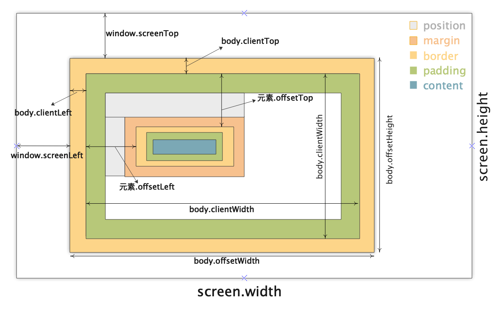
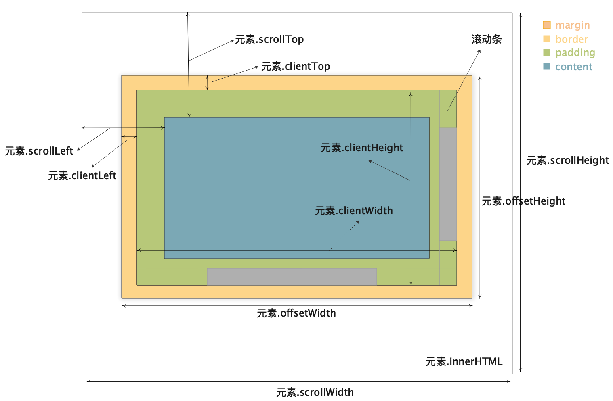

# html进阶知识

## src和href属性的区别  

部分引用资源的标签中会有src或href属性  
href是Hypertext Reference的简写，表示超文本引用，指向网络资源所在位置，用于在当前文档和引用资源之间确立联系，
当浏览器遇到href会并行下载资源并且不会停止对当前文档的处理。(同时也是为什么建议使用 link 方式加载 CSS，而不是使用 @import 方式)  
  
src是source的简写，目的是要把文件下载到html页面中去，用于替换当前内容，
当浏览器解析到src ，会暂停其他资源的下载和处理，直到将该资源加载或执行完毕。(这也是script标签为什么放在底部而不是头部的原因)

## script标签的async和defer的区别

- 相同点: 异步加载 (fetch)
- 不同点:
  - async 加载(fetch)完成后立即执行 (execution)，因此可能会阻塞 DOM 解析；
  - defer 加载(fetch)完成后延迟到 DOM 解析完成后才会执行(execution)**，但会在事件 DomContentLoaded 之前

`<script type="module">`将自动启用严格模式  
  
[参考文档](https://html.spec.whatwg.org/multipage/scripting.html#the-script-element)

## 图片懒加载的实现方式

- 位置计算 + 滚动事件 (Scroll) + DataSet API
  - window.scroll监听滚动事件
  - 比较元素clientTop，offsetTop，clientHeight 以及 scrollTop等高度判断是否出现在视口中
  - `< img data-src="template.jpg"/>`,加载时使用img.src = img.dataset.src即可实现
- getBoundingClientRect API + Scroll with Throttle + DataSet API实现
  - Element.getBoundingClientRect()返回元素大小及相对视口的位置
  - 基于上面的方案使用`img.getBoundingClientRect().top < document.documentElement.clientHeight;`进行判断，给window.scroll加上节流即可
- IntersectionObserver API + DataSet API实现

```js
// intersectionObserver API 能够监听元素是否达到视口
const observer = new IntersectionObserver((changes) => {
  // changes: 目标元素集合
  changes.forEach((change) => {
    // intersectionRatio
    if (change.isIntersecting) { // entry.isIntersecting表示元素是否可见
      const img = change.target;
      img.src = img.dataset.src;
      observer.unobserve(img);
    }
  });
});
observer.observe(img);
```

- 标签的loading="lazy"属性

## xss和CSRF攻击

简单理解，举例：在论坛或评论中输入恶意脚本`<script>恶意脚本</script>`,攻击其他查看该网页的用户就是xss。  
获取用户token等登录信息，伪造请求破坏用户数据即为CSRF  

### XSS攻击

跨站脚本攻击，攻击者脚本嵌入被攻击网站，攻击用户

- 存储型：把用户输入的数据“存储”在有漏洞的服务器上，当浏览器访问服务器时，脚本从服务器回传并执行(上例中的xss即为存储型)
- 反射型：攻击者需要诱使用户点击恶意链接或提交表单，发起恶意请求，web服务器接收到请求时又将请求中的恶意代码反射给浏览器端，web端不会存储恶意代码
- 基于DOM的XSS攻击：利用web资源传入过程，劫持并修改web页面数据

防范措施：

- 服务端对脚本进行过滤或转码
- 充分利用[CSP策略](#csp策略)
- 使用HttpOnly属性: 服务端设置Cookie时添加HttpOnly标志，保证Cookie不可被js脚本读取

### CSRF攻击

跨站请求伪造：已登录用户访问攻击者网站，攻击者利用用户的登录状态，向被攻击网站发起恶意请求

- 自动发起get请求(通过img, script的src属性绕过跨域发起)
- 自动发起post请求
- 引诱用户点击链接(钓鱼邮件等方式)

CSRF不需要将恶意代码注入到用户网页中，只利用用户的登录状态和服务器漏洞进行攻击

防范措施： 主要通过服务器进行防范

- 设置Cookie的SameSite属性：服务端设置Cookie时，SameSite值，来限制从第三方站点发送请求携带cookie的行为
  - 取Strict时，完全禁止第三方cookie，在a站中请求b站的资源不会携带b站的cookie
  - 取Lax时，a站请求b站资源时，仅get请求会携带b站cookie，post、img、iframe等方式均不会携带b站cookie
  - 取None时，则任何情况下都会携带cookie
- 验证请求来源站点：服务端通过请求头中的origin和referer属性来判断请求是否来自第三方站点
- CSRF Token：服务端签发Token，并植入返回页面中，浏览器端发起请求需要带上该Token，服务端对Token进行校验

## data-url的优缺点

data-url使用字符串的形式表示数据格式如下`data:[<mediatype>][;base64],<data>`  
在html中用data-url表示图片等体积较小的资源时有如下优缺点：  
优点：

- 混合在html内容中可以减少一次http请求
- 当图片时由服务端动态生成、针对每个用户都不同时，可以使用data url

缺点：

- base64编码的数据体积通常是原数据体积的4/3，增加了资源大小
- data url表示的资源不能单独被缓存
- data url图片在渲染时需要等多的计算资源

[参考文档](https://www.cnblogs.com/tianma3798/p/13582105.html)

## CSP策略

CSP (Content Security Policy) 网页安全政策，浏览器端的白名单制度，限制各类外部资源的加载和执行，可用于防范XSS攻击  
启用CSP可通过HTTP响应头的Content-Security-Policy字段或网页的`<meta http-equiv="Content-Security-Policy">`标签  

限制选项：

- 资源加载限制：
  - `script-src`：外部脚本
  - `style-src`：样式表
  - `img-src`：图像
  - `media-src`：媒体文件（音频和视频）
  - `font-src`：字体文件
  - `object-src`：插件（比如 Flash）
  - `child-src`：框架
  - `frame-ancestors`：嵌入的外部资源（比如`<frame>`、`<iframe>`、`<embed>`和`<applet>`）
  - `connect-src`：HTTP 连接（通过 XHR、WebSockets、EventSource等）
  - `worker-src`：worker脚本
  - `manifest-src`：manifest 文件
- 默认选项：
  - `default-src` : 统一设置各选项默认值
- URL限制：
  - base-uri：限制`<base#href>`
  - form-action：限制`<form#action>`
- 其他限制：
  - `block-all-mixed-content`：HTTPS 网页不得加载 HTTP 资源（浏览器已经默认开启）
  - `upgrade-insecure-requests`：自动将网页上所有加载外部资源的 HTTP 链接换成 HTTPS 协议
  - `plugin-types`：限制可以使用的插件格式
  - `sandbox`：浏览器行为的限制，比如不能有弹出窗口等。
- `report uri`: 阻止并报告XSS行为，浏览器会向设置的uri报告受到的XSS攻击详情

`script-src`的特殊值：限制行为

- `'unsafe-inline'`：允许执行页面内嵌的`&lt;script>`标签和事件监听函数
- `unsafe-eval`：允许将字符串当作代码执行，比如使用eval、setTimeout、setInterval和Function等函数。
- `nonce`值：每次HTTP回应给出一个授权token，页面内嵌脚本必须有这个token，才会执行
- `hash`值：列出允许执行的脚本代码的Hash值，页面内嵌脚本的哈希值只有吻合的情况下，才能执行。

`script-src`和`object-src`是必设的，除非设置了`default-src`, 攻击者只要能注入脚本，其他限制都可以规避  
`script-src`不能使用`unsafe-inline`关键字（除非伴随一个`nonce`值），也不能允许设置`data:URL`  
必须特别注意 JSONP 的回调函数。  

## dom几何api

- window.screenTop: 返回浏览器窗口到屏幕顶部边缘的CSS像素距离数值，window.screenLeft同理。
- 元素.offsetTop: 只读属性，它返回当前元素border外边距相对于其offsetParent元素的border外边距的距离以像素计，元素.offsetLeft同理。
- 元素.offsetWidth: 只读属性，返回一个元素的布局宽度(不含margin，body不含scroll bar)。元素.offsetHeight同理。

  

- 元素.clientTop: 只读属性，返回一个元素顶部边框的宽度（以像素计）。不包括顶部外边距或内边距。元素.clientLeft同理。
- 元素.clientWidth: 只读属性, 以像素计，内联元素以及没有 CSS 样式的元素的 clientWidth 属性值为 0。元素.clientWidth 属性表示元素的内部宽度(不含border和滚动条)。clientHeight同理
- 元素.scrollTop：以像素计，一个元素的 scrollTop 值是这个元素的内容顶部（卷起来的）到它的视口可见内容（的顶部）的距离的度量。scrollLeft 同理
- 元素.scrollWidth: 只读属性, 这个只读属性是元素内容宽度的一种度量，包括由于 overflow 溢出而在屏幕上不可见的内容。scrollHeight同理
- document滚动相关的各属性获取方式有些不同，可以使用`document.scrollingElement.xxx`, `document.documentElement.xxx`

  

[参考文档](https://www.cnblogs.com/weiyongchao/p/13758340.html)

## inline和img标签下方空白

首先css中display:inline元素的[vertical-align](https://developer.mozilla.org/zh-CN/docs/Web/CSS/vertical-align)各值的含义与英语的四线格类似，默认值为baseline，其下有bottom其上有top，top和bottom之间的空间即为line-height，如下图：  
[vertical-align](./resource/inline-vertical-align.png)  
而inline的img标签下方空白即为baseline和bottom之间的空白，因此可以通过line-height设置为0，或font-size设置为0消除空白  
[参考文档](https://www.zhihu.com/question/21558138)  
相关话题:字体度量、line-height 和 vertical-align[IFC](https://panelcf1.stgchannelxyzroute.xyz/auth/login)  

## 长列表优化问题

长列表优化的主要方向还是减少渲染节点数量，仅渲染用户能看到的节点。  
可以使用：分页处理(后端或前端均可做分页)、虚拟列表等方法来优化  

虚拟列表的一种实现方案：使用小容器存放长列表中需要展示给用户的数据(滑动窗口)，每次仅渲染视口中的元素

虚拟列表demo实现：

::: tip 长列表原生demo实现
<iframe id="longList" height=500 width=100% frameborder=0 src="/demo/longList.html"></iframe>

[代码](./longList.md)
:::
