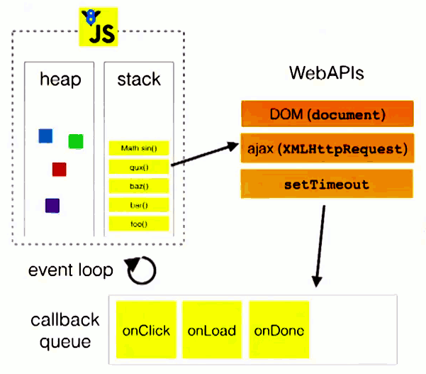
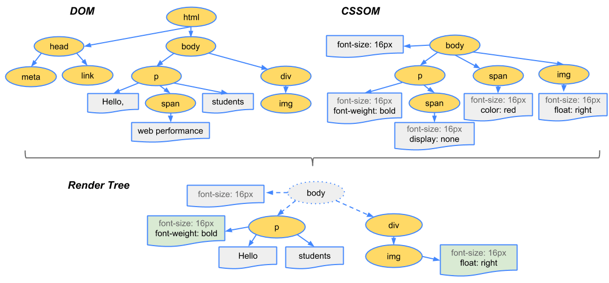

# js进阶知识梳理

本笔记中主要整理一些js的进阶知识以及一些相似的知识点整理  
  
## 数据类型  

null,undefined,string,Number,boolean;5种基本类型,es6引入了bigint,Symbol两种基本类型  
Object引用类型,  
总计8种数据类型  

### 数据类型判断与比较  

判断数据类型的方法有  

+ typeof 直接进行类型判断  
+ instanceof 借用__proto__属性(原型链)关系判断实例是否与函数的prototype相等  
+ Object.prototype.toString.call() 借用原型链进行判断  
+ constructor 该属性返回实例的构造函数  
+ === 严格比较判断  

#### 区别  

typeof能正确输出变量所属基本类型(null除外)和引用类型中的function，对null和其他引用类型输出object  
  
instanceof运算符用于检测构造函数的prototype属性是否出现在某个实例对象的原型链上,也就是顺着原型链去找，直到找到相同的原型对象，对基本类型判断都返回false  
  
constructor 则是顺着constructor属性去找  
  
区别：  

1. typeof会返回一个变量的基本类型(以字符串的形式表示)，instanceof返回的是一个布尔值  
2. instanceof 可以准确地判断复杂引用数据类型，但是不能正确判断基本数据类型  
3. typeof主要用于判断基本类型(null除外),`typeof null`输出object是js的一个遗留bug  
  
通用的判断方式是Object.prototype.toString.call()方法，该方法统一返回字符串格式`'[object Xxx]'`，  
该方法隐含对基本类型转换为包装类型然后调用toString()方法  
  
constructor通常用于示例对象访问其构造函数,相比于instanceof可用于判断基本类型  
null和undefined没有constructor属性，不能使用此方法进行判断.另外基本类型的constructor属性只读，但引用类型的则可以被修改  
  
`===`严格相等判断符，通常用于判断变量是否为null或undefined，变量被声明但未初始化(赋值)时为undefined,  
若定义一个变量将来要引用一个对象，通常将其初始化为null，在回收变量时也通常将其赋值为null  
  
以下是一些示例  

```JavaScript  
Object.prototype.toString.call(Symbol('a')) // '[object Symbol]'  
Object.prototype.toString.call(null) // [object Null]  
Object.prototype.toString.call(NaN) // [object Number]  
typeof NaN // number  
null instanceof null // 报错  
null instanceof object // false  
1.__proto__.constructor // 报错 数字后接'.'会被优先解析为小数点  
(1).__proto__.constructor === Number // true  
```  
  
### 变量与数据类型  

严格区别变量类型与数据类型?  

+ 数据的类型  
  + 基本类型  
  + 对象类型  
+ 变量的类型(变量内存值的类型)  
  + 基本类型: 保存就是基本类型的数据  
  + 引用类型: 保存的是地址值  

#### `===`, `==`的区别  

+ `==`:比较时会进行必要的类型转换，转换为同一数据类型再进行比较  
  
null与undefined相等,NaN不与任何值相等;  
字符串与数值比较,会将字符串转为数值再进行比较;  
任意值为true时转为1,false转为0再进行比较;  
对象与基本数据比较时，会调用对象的valueof或toString方法转换为基础类型进行比较  
Number,String,Boolean类型出现在等号两边时,只要类型不同,都转换为Number类型再比较;  
  
+ `===`不会进行类型转换  
  
NaN不与任何值相等(包括自身)；  
对象类型，两个值都引用同一个对象才相等；  
null和undefined与自身相等，但相互不相等  
  
+ 另外相等判断时NaN使用isNaN()判断，  
ES6中提供了Object.is(obj1,obj2)新的判断方法，该方法与`===`类似,但额外兼容了NaN,并且认为-0和+0不相等  
三种比较方法在进行引用类型之间的比较时，需引用相同的对象时才相等，如：`{a:'a'} == {a:'a'}`输出false  
[参考文档](https://developer.mozilla.org/zh-CN/docs/Web/JavaScript/Equality_comparisons_and_sameness)  

### 包装类型  

对于基本类型，严格来说是没有任何方法，  
如语句`'abc'.substring(1,2)`表达式应该报错而不是输出b，但实际上存在类似下列过程  

```js  
let temp = new String('abc')  
temp.substring(1,2)  
temp = null  
```  

这个过程中使用了string类型对应的包装类String，  
es6之前只有String(),Number(),Boolean()可以通过new创建包装类，  
es6中新增的BigInt，Symbol不可通过new操作符创建包装类  
ecma官方建议应当尽量避免显式使用包装类  

### 隐式类型转换  

#### 数学运算符中的类型转换  

+ 减、乘、除:会将非Number类型转换为Number类型，对于对象类型隐含‘拆箱’操作再转换为Number类型  
+ 加，当一侧有String时，将另一侧转换为字符串进行拼接；在此基础上，当一侧为Number，另一侧为其他基本类型，则将基本类型转换为Number类型，另一侧为引用类型时，则都转换为String进行拼接  

#### 逻辑语句中的类型转换  

+ 单个变量逻辑判断时if,while,!等直接将变量转换为Boolean,类似与Boolean()方法，只有null,undefined,'',NaN,0,false为false，其他为true，如{}, []等  
+ `==`,NaN与任何类型比较都为false;
+ Boolean与任何类型比较都转换为Number;
+ `String==Number`,String转换为Number;
+ `null==undefined`为true,与其他非值(自身除外)比较都为false;
+ 基本类型和引用类型比较时会遵循先valueof后tostring的模式转换为基本类型,再比较  
  
## 函数  

函数有四种方式：作为构造器new调用；作为对象方法调用；正常调用(在当前词法作用域中调用)；间接调用(通过call、apply、bind等方式)

### this指向问题  

函数中的this是在运行时确定的，this有4中绑定方式  

1. 默认绑定  
函数独立调用时，默认调用方为全局对象，即window对象；严格模式下为undefined；立即调用函数和函数中被直接调用的函数也是独立调用的一种形式  
2. 隐式绑定  
谁调用该函数，this就执行该对象(当前执行的上下文)  
3. 显式绑定  
使用call、apply、bind方法，这些方法绑定仅第一次有效  
4. new绑定  
使用new实例化时，this指向实例。绑定优先级为4>3>2>1  
  
箭头函数没有自己的this,因此在箭头函数中引用this是引用其父级作用域的this  

### apply、bind、call方法辨析

此三者都可以改变this指向，其中bind变更this后返回新函数，而apply,call直接运行函数

+ `fun.apply(obj, args)`：obj为this的指向，当obj为null或undefined时，默认指向window。改变fun内部this指向后立即执行一次，指向修改仅当次有效
+ `fun.call(obj, ...args)`：apply接收参数为数组，call接收多个单独的参数值，其他性质与apply相同
+ `fun.bind(obj, ...args)`：传参与call方法类似，但不会执行fun，而是返回一个新函数，并改变新函数的this指向，可传入一部分args参数，新函数调用时也可继续传入剩下的参数
  + bind是硬绑定，返回的新函数会使用obj去调用原始函数，并传递其他参数，绑定后不能通过显式或硬绑定的方式修改this，只能通过new改变
  + softBind会对指定函数进行封装，调用时首先检查this，如果this为全局对象或undefined则会使用obj调用原函数，否则不会修改this，即softBind绑定可多次修改，最后一次有效。

实现简易的call、apply、bind、softBind：  

```js
// call
Function.prototype.myCall = function (ctx = globalThis) {
  const args = Array.from(arguments).slice(1); // 从arguments收集参数更具兼容性
  const key = Symbol("key");
  ctx[key] = this; // 将调用myCall的函数fun绑定到ctx[key]属性上
  const res = ctx[key](...args); // 使用ctx调用fun方法，此次调用fun中this变为ctx
  delete ctx[key]; // 删除fun属性
  return res; // 返回运行结果
};
// apply 实现机制与call类似，不再详细注释
Function.prototype.myApply = function (ctx = globalThis) {
  const args = arguments[1];
  const key = Symbol("key");
  ctx[key] = this;
  const res = ctx[key](...args);
  delete ctx[key];
  return res;
};
// bind
Function.prototype.myBind = function (ctx = globalThis) {
  const fn = this; // 将调用myBind的函数暂存为fn
  const args = Array.from(arguments).slice(1);
  function bound() {
    if (this instanceof bound) {
      fn.apply(this, args); // 当bound的调用方是fn的实例时，则使用该实例调用，对应new操作符，改变绑定this的情况,同时该判断条件使后续的多次绑定无效
    } else {
      fn.apply(ctx, args);
    }
  }
  bound.prototype = fn.prototype;
  return bound;
};
// es6的极简实现bind
Function.prototype.fakeBind = function(obj) {
  return (...args) => this.apply(obj, args)
}
// softBind
Function.prototype.mySoftBind = function (ctx = globalThis) {
  const fn = this;
  const args = Array.from(arguments).slice(1);
  function bound() {
    if (!this || this === globalThis) {
      fn.apply(ctx, args); // 仅调用方为undefined/null或全局对象时，使用绑定的值
    } else {
      fn.apply(this, args);
    }
  }
  bound.prototype = fn.prototype;
  return bound;
};
```

### 箭头函数

+ 箭头函数无this
+ 不可当做构造函数使用new命令
+ 没有arguments对象
+ 不可使用yield命令
在其中使用this时指向的时定义是所在作用域

### 变量提升和函数提升  

使用function定义函数，和使用var定义变量时存在变量提升和函数提升，变量提升先预处理变量后处理函数  

```js  
console.log(typeof a) // function 无论变量和函数的顺序，变量提升先处理，函数提升后处理，因此函数覆盖同名变量  
console.log(typeof b) // function  
var a = 1;  
function a() {}  
function b() {}  
var b;  
console.log(a, b) // 提升后a被初始化，因此覆盖了a函数  
console.log(c) // undefined 变量提升但不会先赋值  
var c = 1;  
console.log(d) // [Function: d] 函数提升则可立即调用  
function d() {}  
```  

### 闭包

当函数可以记住并访问其所在的词法作用域，即时函数是在当前词法作用域之外执行，这就形成了闭包

闭包应用无处不在，模块化和定时器、ajax、事件监听等用到回调函数的地方
TODO：

### 节流(throttle)与防抖(debounce)

主要用于优化高频执行的js  

1. 防抖(debounce)：触发事件在n秒内只能执行一次，若n秒内重新触发，则重置计时器，多次触发只会执行最后一次；无限延后执行  
防抖常用于输入框ajax，判断scroll是否滑到底部，防止表单多次提交(类比游戏中的施法读条前摇)  
2. 节流(throttle)：连续触发事件，但n秒内只执行一次，节流会稀释函数的执行频率  
节流常用于DOM元素拖拽,resize,scroll等事件(类比游戏中的技能cd)  
  
两者最大的区别在于，指定时间内，防抖为重复触发无限延后执行，节流为重复触发仅执行一次，不重置计时器，不会无限延后  
简而言之：  
相同点：n秒内只执行一次  
不同点：n秒内重复触发，防抖无限延后执行，节流只执行一次  
  
带防抖与节流功能的第三方库：underscore,lodash,Ramda(仅用防抖与节流时不推荐引用)

+ 手写防抖节流实现:

```js
/**
 * @description: 防抖wrap函数
 * @param {Function} func 传入要包装的函数
 * @param {number} wait 防抖间隔
 * @param {boolean} immediate 可选项是否立即执行
 * @return {undefined}
 */
function debounce(func, wait, immediate=false){
  let timer = null;
  return function(){
    let _self = this;
    let args = arguments;
    if(timer) clearTimeout(timer);
    if(immediate){ // 用于首次/立即执行
      let callNow = !timer;
      timer = setTimeout(()=>timer = null, wait);
      if(callNow) func.apply(_self, args);
    } else { // 延时执行
      timer = setTimeout(()=>func.apply(_self, args), wait);
    }
  }
}
/**
 * @description: 防抖wrap异步支持版本，也支持同步任务
 * @param {} 参数与同步版本类似
 * @return {() => Promise} 返回的执行函数将返回包装好的promise对象，调用then将传入异步函数执行结果
 */
function debounceAsync(fn, delay) {
  let timer = null;
  return function() {
    let _self = this;
    let args = arguments;
    if(timer){
      clearTimeout(timer);
    }
    // 为添加对异步请求接口的支持返回promise对象，此处也可直接设置定时器，下同
    return new Promise((res, rej) => {
      timer = setTimeout(function() {
      // res接收promise对象会等待promise对象状态翻转，再返回promise对象的结果
      res(fn.apply(_self, args));
    }, delay)
    })
  }
}
/**
 * @description: 节流wrap函数异步版本，返回值与防抖类似,节流也可使用时间戳与间隔时间对比实现
 * 节流也有立即执行和非立即执行的版本，实现思路与防抖类似
 */
function throttleAsync(fn, interval) {
  let timer = null;
  let result;
  return function() {
    let _self = this;
    let args = arguments;
    if(!timer){
      result = new Promise((res, rej) => {
        // 单独拎出executor即为同步执行的版本
        timer = setTimeout(() => {
          res(fn.apply(_self, args));
          timer = null;
        }, interval);
      })
    }else result = undefined;
    return result;
  }
}
```

[参考文档](https://blog.csdn.net/Polaris_tl/article/details/99300458)

## js运行机制  
<!-- TODO：迁移到浏览器原理中 -->
js执行是会将对象放在堆(heap)中，将基础变量以及对象的引用(指针)放在栈(stack)中;  
js还维护了一个执行栈与数据栈意义不同  

### 浏览器  

js重要的运行环境之一浏览器，可能时多进程或单进程的；但浏览器都是多线程的。js是单线程的；  
不同的浏览器有不同的内核：`chrome, Safari:webkit, firefox:Gecko, IE:Trident等`，这些内核提供了html，css文档解析，dom/css模块在内存中的管理，布局和渲染以及js解释器等模块，chrome和nodejs中的js解释器为v8  

### 事件循环模型  

  
简单理解：  
先运行同步代码，绑定DOM事件监听，定时器，发送ajax请求等。其中将异步函数交给事件管理模块，当事件触发时，管理器将回调函数添加到任务队列，主线程不断从任务队列中取出任务执行。  
  
更进一步的：  
任务队列又分为宏任务(macro task)和微任务(micro task)，其中由Promise和MutationObserver传入的回调函数属于微任务，而setTimeout和setInterval属于宏任务；js的初始化代码执行完后会优先处理微任务队列中的所有事件，然后是宏任务。  
示例代码：  

```js  
console.log(1);  
setTimeout(function () {   
  console.log(2);   
}, 0);  
new Promise(resolve => {  
  console.log(3);  
  resolve();  
  console.log(4);  
}).then(() => {  
  console.log(5);  
})  
console.log(6);  
// 输出为:1 3 4 6 5 2  
// new Promise时传入的匿名函数是同步代码,then中的为回调微任务  
/**
 * 另外后面的手写promise实现章节中可以看出，
 * 使用Promise.resolve方法若参数为Promise对象
 * 则会在内部调用一次then方法，额外产生一次微任务,
 * 同理在then中传入的函数若返回为Promise对象，也会额外调用一次Promise方法产生额外的微任务；
 * 在async/await的手写实现中，对于Promise对象使用await/yield也相当与一次then方法
 */
async function p1() {
  return 3;
}
async function p2() {
  return Promise.resolve(3);
}
async function p3() {
  return await Promise.resolve(3);
}
p3().then((o) => console.log(o, "p3"));
p2().then((o) => console.log(o, "p2"));
p1().then((o) => console.log(o, "p1"));
// Output: p1、p3、p2
// 在同步代码运行完成后，p3,p2都额外提交了一个空的微任务，因此p1优先被打印

Promise.resolve()
  .then(() => {
    console.log(0);
    return Promise.resolve(4);
    // 额外产生了1个空的微任务，但具体底层实现时实际产生了两个微任务，因此延后到了3之后打印
  })
  .then((res) => { console.log(res); });

Promise.resolve()
  .then(() => { console.log(1); })
  .then(() => { console.log(2); })
  .then(() => { console.log(3); });
// 输出为 0,1,2,3,4
```  

### 事件循环与渲染、帧动画、空闲回调的关系

空闲回调requestIdleCallback维护一个队列，在浏览器空闲时执行  
帧动画requestAnimationFrame在每次重新渲染前调用  
浏览器的渲染和代码执行使用了不同的引擎，每轮事件循环不一定伴随着渲染，而微任务队列和宏任务队列也都不止一个  
微任务执行完成后会判断rendering opportunity，若需要渲染则依次执行以下方法resize、scroll、requestAnimationFrame回调、IntersectionObserver回调、执行渲染，判断宏任务和微任务队列是否为空，为空则执行requestIdleCallback回调。
详细参考文档：
[参考文档](https://juejin.cn/post/6844904165462769678)
  
### 浏览器的关键渲染路径

1. 生成DOM  


2. 解析css文件，生成cssom


3. DOM与cssom一起生成Render Tree



4. Layout 计算每一个元素在设备视口内的确切位置和大小


5. Paint 将渲染树中的每个节点转换成屏幕上的实际像素，这一步通常称为绘制或栅格化


[参考文档](https://blog.windstone.cc/browser-env/browser/how-browsers-work.html#_1-%E5%A4%84%E7%90%86%E7%94%A8%E6%88%B7%E8%BE%93%E5%85%A5)

### 重排与重绘

重排和重绘是关键渲染路径中的两步:  

+ 重排(Reflow)：元素的位置发生变动时发生重排，也叫回流。此时在关键渲染路径中的 Layout 阶段，计算每一个元素在设备视口内的确切位置和大小。当一个元素位置发生变化时，其父元素及其后边的元素位置都可能发生变化，代价极高
+ 重绘(Repaint): 元素的样式发生变动，但是位置没有改变。此时在关键渲染路径中的 Paint 阶段，将渲染树中的每个节点转换成屏幕上的实际像素，这一步通常称为绘制或栅格化

另外，重排必定会造成重绘。以下是避免过多重排重绘的方法

1. 使用 DocumentFragment 进行 DOM 操作，不过现在原生操作很少也基本上用不到
2. CSS 样式尽量批量修改
3. 避免使用 table 布局
4. 为元素提前设置好高宽，不因多次渲染改变位置

[更深的渲染原理](https://juejin.cn/post/6844903476506394638)

### v8垃圾回收机制

垃圾回收主要分为引用计数法和标记法(是否可达)  
引用计数无法解决循环引用问题；标记法通过根对象层层遍历，标记可访问到对象

v8中js的基本数据类型被保存在栈内存中，而引用数据类型在栈中保存着指针，指向堆内存中的对象，栈内存的数据是由操作系统来负责分配和回收，堆内存中由v8进行管理

分代回收：v8将堆内存分为两个区域

+ 存活周期短(经过一次垃圾回收就被销毁的)的为新生代，内存容量通常较小，使用副垃圾回收器和Scavenge算法进行垃圾回收。  

::: tip 更进一步的
新生代还进一步细分为nursery子代和intermediate子代两个区域，对象第一次分配内存时会分到nursery子代，若经过一次垃圾回收该对象还存在则移入intermediate子代，若再经过一次垃圾回收该对象还在新生代则晋升到老生代中  

任何声明的对象都会被优先分配到新生代中，Scavenge算法将新生代堆分为from-space和to-space，执行步骤如下：

  1. 标记活动对象和非活动对象
  2. from-space中标记存活的对象复制到to-space中并进行整理排序
  3. 将from-space中的非活动对象内存释放
  4. 互换from-space和to-space  

:::

+ 存活周期长(经过多次垃圾回收依然存活的)的为老生代，使用主垃圾回收器 + Mark-Sweep && Mark-Compact算法。新生代中Scavenge速度快，但内存空间消耗大，效率低，老生代空间大，使用Mark-Sweep进行标记和清理
     1. 标记阶段：对老生代对象进行第一次扫描，对活动对象进行标记
     2. 清理阶段：对老生代对象进行第二次扫描，清除未标记的对象，即非活动对象
     3. 整理阶段(Mark-Compact中特有的)：尽量保持空闲内存连续


+ 垃圾回收的性能优化：
  + 全停顿 垃圾回收也需要js引擎执行，且垃圾回收优先于普通代码的执行，此时会造成普通代码的停顿
  + Orinoco优化：orinoco为V8的垃圾回收器的项目代号
    + 增量标记(标记与js代码执行交替进行)
    + 惰性清理(需要写屏障，类似java中的锁来保证安全同步)
    + 并发
    + 并行  

[参考文档](https://www.teqng.com/2021/09/01/13%E5%BC%A0%E5%9B%BE%EF%BC%8120%E5%88%86%E9%92%9F%EF%BC%81%E8%AE%A4%E8%AF%86v8%E5%9E%83%E5%9C%BE%E5%9B%9E%E6%94%B6%E6%9C%BA%E5%88%B6/)
  
## 面向对象  

### 原型与原型链  

+ 函数类型(可以理解为工厂)独有prototype显式原型属性, 指向用于创建对应实例的原型对象(可以理解为设计图)；  
+ 原型对象中有一个属性constructor, 它指向函数对象；  
+ 实例对象(工厂照设计图生产的产品)和函数(函数本身也是对象)都有__proto__属性和constructor属性，分别指向其构造函数的原型和构造函数  
  
  
如图为Foo函数、实例、Function、Object的原型对应关系：  
矩形表示实例对象/原型对象，椭圆表示函数对象  
红色箭头即为原型链，Function函数对象的constructor指向自己，prototype和__proto__属性指向相同的原型对象  
Object的原型对象的原型对象指向null；引用对象的constructor可以被更改，而基本类型的只读  

### new操作符

new操作符用于创建一个给定构造函数的对象实例，其执行过程简单理解为：

1. 创建一个空对象obj
2. 将obj的`[[prototype]]`属性指向构造函数construct的原型,即`obj.__proto__ = construct.prototype`
3. 将construct的this绑定到obj上，执行construct为obj添加属性和方法
4. construct若无返回值，则默认返回obj，否则返回指定的返回值

实现简单的new操作符:

```js
function myNew(construct, ...args) {
    const obj = {}; // 1. 创建一个空对象
    obj.__proto__ = construct.prototype; // 2. 将obj的[[prototype]]属性指向构造函数的原型对象
    obj.constructor = construct; // 绑定构造函数属性
    construct.apply(obj, args); // 3.将construct执行的上下文this绑定到obj上，并执行
    return obj;  //4. 返回新创建的对象
}

// 使用的例子：
function Person(name, age){
    this.name = name;
    this.age = age;
}
const person1 = myNew(Person, 'Tom', 20)
console.log(person1)  // Person {name: "Tom", age: 20}
```

### 继承

es6中多使用寄生组合式继承模式  
详细[参见](./jsBase.html#继承)

## 前端性能与优化

前端性能优化主要分为两方面：

+ 网络性能优化
  + 优化资源大小：压缩、裁剪、懒加载、预加载等
  + 缓存控制：善用http缓存机制，强缓存、协商缓存等
  + 网络请求控制：减少请求，连接复用，data url等
  + 优化js代码：tree shaking，代码压缩，懒加载，code split等
  + 优化首次渲染路径：媒体查询避免不必要的css，js标签async、defer属性避免html阻塞
+ 数据处理(渲染)性能优化
  + 减少DOM查询
  + 使用requestAnimationFrame代替setTimeout和setInterval来更新视图，减少卡顿
  + 防抖与节流减少函数执行频次
  + 多线程web worker
  + 复杂度更低的class风格css选择器，flex代替float

### 性能指标

文档加载相关指标
  

+ Time to First Byte（TTFB）:浏览器从请求页面开始到接收第一字节的时间，这个时间段内包括 DNS 查找、TCP 连接和 SSL 连接。
+ DomContentLoaded(DCL): DOMContentLoaded 事件触发的时间, html 文档完全加载解析后(无需等待样式表、图像、iframe等)
+ Load（L）：onLoad 事件触发的时间。页面所有资源都加载完毕后（比如图片，CSS），onLoad 事件才被触发。

内容呈现相关

+ First Paint（FP）：从开始加载到浏览器首次绘制像素到屏幕上的时间，不包括默认的背景绘制，但包括非默认的背景绘制。
+ First Contentful Paint（FCP）：浏览器首次绘制来自 DOM 的内容的时间，内容必须是文本、图片（包含背景图）、非白色的 canvas 或 SVG，也包括带有正在加载中的 Web 字体的文本(使用网络字体时设置`font-display: swap;`可临时使用系统字体，加载完毕后使用网络字体)。
+ First Meaningful Paint（FMP）：页面的主要内容绘制到屏幕上的时间，采用布局数量最大并且 Web 字体已加载 的时刻作为主要内容绘制的近似时间
+ Largest Contentful Paint（LCP）：可视区域中最大的内容元素呈现到屏幕上的时间
+ Speed Index（SI）：页面可视区域中内容的填充速度的指标，可以通过计算页面可见区域内容显示的平均时间来衡量。
+ First Screen Paint（FSP）:页面从开始加载到首屏内容全部绘制完成的时间

交互响应相关

+ Time to Interactive（TTI）:网页第一次完全达到可交互状态的时间点(可持续交互)
+ First CPU Idle（FCI）:页面第一次可以响应用户输入的时间
+ First Input Delay（FID）：用户第一次与页面交互（例如单击链接、点击按钮等）到浏览器实际能够响应该交互的时间。
+ Frames Per Second（FPS）：每秒可以重新绘制的帧数

>其中用户体验的核心指标:
>>白屏时间为FP或FCP 也可使用window.performance.timing.domLoading - window.performance.timing.navigationStart来计算  
>>首屏时间FSP,该指标还没有同一计算标准,通常采用时间window.performance.timing.domInteractive - window.performance.timing.navigationStart来计算  
>>可交互时间FCI  
>>可流畅交互时间

在chrome中f12开发者工具中的Lighthouse可获取上述部分指标及网页性能报告，而performanc选项则用于收集webapp运行时的性能(与加载性能区别开)
[参考文档](https://serverless-action.com/fontend/fe-optimization/%E4%BB%8E%E8%BE%93%E5%85%A5%20URL%20%E5%88%B0%E9%A1%B5%E9%9D%A2%E5%8A%A0%E8%BD%BD%E5%AE%8C%E6%88%90%EF%BC%8C%E5%8F%91%E7%94%9F%E4%BA%86%E4%BB%80%E4%B9%88%EF%BC%9F.html#%E5%8F%82%E8%80%83)

### 首屏时间优化

1. 对于pv量(page view)比较高的页面，比如 b 站等流量图也比较大的，采用 ssr 采用 ssr 如何优化性能
   + 性能瓶颈在于 react-dom render/hydrate 和 server 端的 renderToString
   + 尽量减少 dom 结构， 采用流式渲染，jsonString 一个对象，而不是 literal 对象
   + server 去获取数据
   + 不同情况不同分析，减少主线程阻塞时间
   + 减少不必要的应用逻辑在服务端运行
2. 减少依赖和包的体积
   + 利用 webpack 的 contenthash 缓存
   + 重复依赖包处理，可以采用 pnpm
   + 采用 code splitting，减少首次请求体积
   + 减少第三方依赖的体积
3. 网络 prefetch cdn
  
## 异步编程

+ js中常见的异步方式：  
  1. 回调函数(如：定时器中的回调函数)；
  2. 事件监听；
  3. 发布订阅；
  4. Promise；
  5. 生成器；
  6. async/wait  

### Promise

+ Promise是js中用来替代回调的新的异步解决方案，其本质是一个构造函数，封装异步操作获取异步操作的成功或失败的结果。  

+ promise的状态改变只能是：pending=>resolved或pending=>rejected,且只能变一次。调用resolve则会将状态从当前pending改为resolved，调用reject或抛出错误则将当前状态由pending改为rejected

+ promise之前的回调方式的异步，在嵌套回调时存在无限嵌套的回调地狱问题，而promise通过链式调用能够避免该问题

+ promise可以利用then方法返回新的promise机制串联多个任务，想要结束promise链只能在回调中返回一个pending状态的promise

### 常见promiseApi

+ promise构造函数：`new Promise(executor){}`
  + executor执行器参数为函数，会在promise内部立即同步调用`(resolve, reject)=> {}`
  + resolve 成功时调用的函数
  + reject 内部失败时调用的函数
+ `Promise.prototype.then(onResolve, onReject)`方法,返回一个新的promise对象
  + onResolve成功时的回调
  + onRejected函数: 失败的回调函数
+ `Promise.prototype.catch(onReject)`，语法糖，相当于then(undefined,onReject)
+ `Promise.resolve(value)`返回一个成功的promise对象,成功的数据为value或promise对象
+ `Promise.reject(reason)`返回一个失败的 promise 对象
+ `Promise.all(promises)`返回一个新的 promise, 只有所有的promise都成功才成功,成功数据为promises成功数据组成的数组, 只要有一个失败了就直接失败，失败信息为失败的那个promise信息
+ `Promise.race(promises)`返回promises数组中最先返回的那个promise的结果状态

### 手写promise实现

```js
class MyPromise {
  status = "pending"; // promise状态
  result = null; // 返回结果
  callback = []; // 用于异步任务中缓存回调函数
  constructor(executor){ // 构造函数传入executor执行器
    const _self = this; // 保存对象的this便于在回调函数中使用

    function resolve(data){ // 成功时的状态翻转函数
      if(_self.status !== "pending") return; // 保证状态只能从pending翻转
      _self.status = "fulfilled"; // 翻转状态
      _self.result = data; // 保存回调执行结果
      setTimeout(()=>{ // 用于支持异步回调
        _self.callback.forEach(item => {
          item.onResolved(data); // 取出异步任务中缓存的回调函数并执行
        });
      })
    }

    function reject(err){ // 失败时的状态翻转函数
      if(_self.status !== "pending") return;
      _self.status = "rejected";
      _self.result = err;
      setTimeout(()=>{
        _self.callback.forEach(item => {
          item.onRejected(err);
        })
      })
    }
    try { // 执行器执行，由此看出在new promise时，executor中的同步代码是同步执行的
      executor(resolve, reject);
    } catch (error) {
      reject();
    }
  }
  then(onResolved, onRejected) { // 接受成功和失败时的回调函数
    const _self = this // 同样保存一下this方便使用
    return new MyPromise((res, rej)=>{ // then 返回一个新的promise
      function callback(fn){ // 判断回调函数的返回值是否为promise，若为promise则根据其结果返回，否则直接返回回调函数的调用结果
        try {
          let result = fn(_self.result);
          if(result instanceof MyPromise){
            result.then(r=>{
              res(r);
            }, e=>{
              rej(e);
            })
          }else {
            res(result);
          }
        } catch (err) {
          rej(err)
        }
      }

      if(this.status === "fulfilled"){ // executor中执行同步任务后翻转了状态则直接运行回调
        setTimeout(()=> { // 立即加入宏任务队列中，支持回调异步任务
          callback(onResolved);
        })
      }
      if(this.status === "rejected"){
        setTimeout(()=>{
          callback(onRejected);
        })
      }
      if(this.status === "pending"){ // 当executor中的执行的是异步任务，此时状态为pending，需要将回调函数推入缓存，待到状态翻转时再调用
        this.callback.push({
          onResolved:function() {callback(onResolved);}, 
          onRejected:function() {callback(onRejected);}
        })
      }
    })
  }
  catch(onRejected){ // catch是then的语法糖，仅接收onRejected
    return this.then(undefined, onRejected);
  }
  static resolve(data){ // 绑定在类上的resolve方法，传入promise时，根据其结果返回状态，否则返回成功的且结果为data的新promise对象
    return new MyPromise((res, rej) => {
      if(data instanceof MyPromise){
        data.then(r => {
          res(r);
        }, e => {
          rej(e);
        })
      }else{
        res(data);
      }
    })
  }
  static reject(err){ // 返回新的promise对象，状态为rejected，结果为err
    return new MyPromise((res, rej)=> {
      rej(err);
    })
  }
  
  static all(promises){ // 传入promise数组，当所有promise都成功时返回成功的promise，结果是所有promise成功结果组成的数组，当有一个promise失败时直接返回失败的结果
    return new MyPromise((res,rej) => {
      let count = 0;
      let arr = [];
      for(let i = 0;i < promises.length;i++){
        promises[i].then(r=>{
          count++;
          arr[i] = r;
          if(count === promises.length){ // 翻转数量和promise长度相同时，翻转返回新promise对象的状态
            res(arr);
          }
        }, e=>{
          rej(e);
        })
      }
    })
  }
  static race(promises){ // 当第一个promise翻转状态时直接返回相同状态的新promise对象
    return new MyPromise((res, rej) => {
      for(let i = 0; i < promises.length; i++){
        promises[i].then(r=>{
          res(r)
        }, e=>{
          rej(e)
        })
      }
    })
  }
  static map(promises, concurrency){ // map实现多个promise数组并发控制，最多同时运行concurrency个promise任务
    let curIndex = 0;
    let resolvedCount = 0;
    let result = new Array(promises.length);
    return MyPromise((res, rej) => {
      function next() {
        const index = curIndex;
        curIndex++;
        if(index < promises.length){
          promises[index].then(r => {
            result[index] = r;
          }).catch(e => {
            result[index] = e;
          }).finally(r => {
            resolvedCount++;
            if(resolvedCount === promises.length){
              res(result);
            }
            next(); //上一个promise任务执行完成后执行下一个next任务
          })
        }
      }
      for(let i = 0; i < concurrency; i++){
        next(); // 控制最多同时运行concurrency个next任务
      }
    })
  }
}
```

### async/await和generator/yield

async/await是generator/yield的语法糖，  
generator提供了新的异步方式，遇到yield时暂停程序运行，向外交出执行权，直到外部调用了next方法再回到程序内部继续执行  
async/await内置了自动执行器，自动将generator交出的执行权交还给generator

+ 手写async/await实现

```js
class Demo {
  static asyncGeneratorStep(gen, resolve, reject, _next, _throw, key, arg) {
    try{
      var info = gen[key](arg); // gen.next(arg) 或 gen.throw(arg)
      var val = info.value;
    }catch(e){
      reject(e);
      return;
    }
    if(info.done){
      resolve(val);
    }else { // 使用promise.resolve的方式能同时支持同步和异步任务val
      Promise.resolve(val).then(_next, _throw);
    }
  }
  static _asyncToGeneratorWrapper(fn) {
    return function() { // 返回包装后的函数
      const self = this;
      const args = arguments;
      return new Promise((resolve, reject) => {
        const gen = fn.apply(self, args);
        function _next(val) { // 执行器中传入_next未完成时自动循环执行
          Demo.asyncGeneratorStep(gen, resolve, reject, _next, _throw, 'next', val);
        }
        function _throw(e){
          Demo.asyncGeneratorStep(gen, resolve, reject, _next, _throw, 'throw', e);
        }
        _next(undefined); // 启动首次运行
      });
    };
  }
  static test() { // 测试用例
    function testFn(i){
      return new Promise((resolve, reject) => {
        setTimeout(()=> {
          resolve('promise resolve: '+ i);
        }, 1000)
      })
    }
    function* testGen(){
      console.log('start run gen');
      let res1 = yield testFn(1);
      console.log(res1);
      let res2 = yield testFn(2);
      console.log(res2);      
      let res3 = yield testFn(3);
      return res3;
    }
    let runner = Demo._asyncToGeneratorWrapper(testGen);
    runner().then(res => console.log(`end with: ${res}`))
  }
}
Demo.test();
```

## 补充说明  

import模块加载时，传入目录，则优先加载目录下package.json文件中main属性指定的入口，其次是index.js文件；若都没找到则报错  
