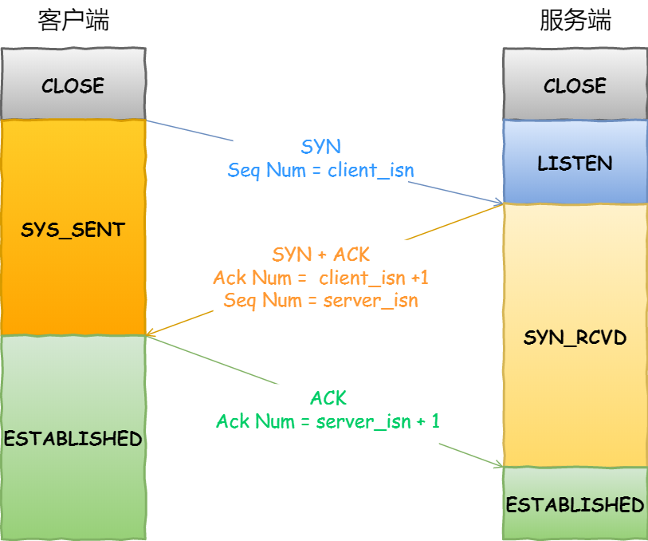
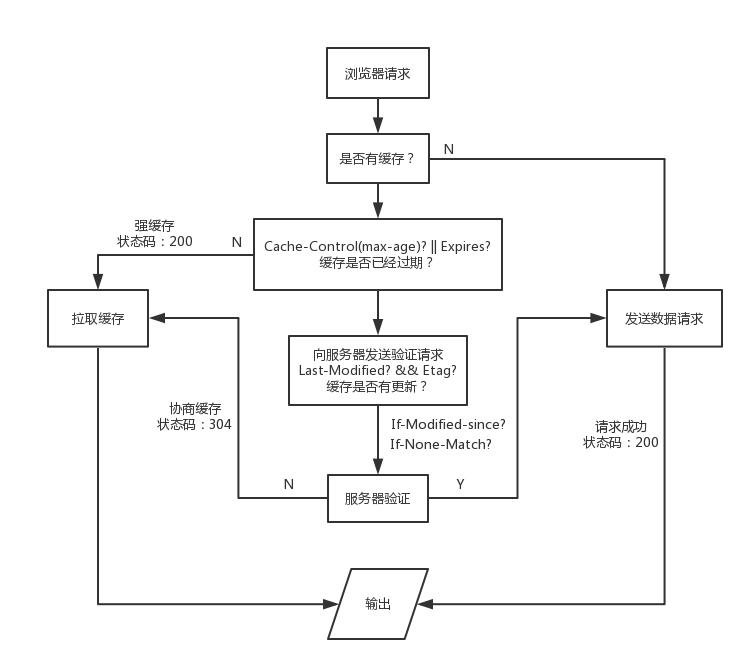

# web网络通信知识汇总

## nginx配置和相对url

当html中静态资源使用了相对url时，不同的访问方式会产生奇怪的现象  
假设html中含有以下资源  

```html
< img src="img1.png"/>
< img src="./img2.png"/>
< img src="xyz/img3.png"/>
< img src="/xyz/img4.png"/>
```  

1、访问地址为 www.abc.com/123 时  
图片地址分别会被解析为:  
www.abc.com/img1.png  
www.abc.com/img2.png  
www.abc.com/xyz/img3.png  
www.abc.com/xyz/img4.png  

2、访问地址为 www.abc.com/123/时  
图片地址会被解析为  
www.abc.com/123/img1.png  
www.abc.com/123/img2.png  
www.abc.com/123/xyz/img3.png  
www.abc.com/xyz/img4.png  

当访问的uri最后不带斜杠时，例如 www.abc.com/123 ，会先查找 123 文件，存在就返回；若存在 123 文件夹，会在末尾加上一个斜杠并产生 301 跳转www.abc.com/123/  
当访问的uri最后带斜杠时，例如 www.abc.com/123/，查找 123 下的 index 页面，存在就返回；不存在且未开启自动索引目录选项（autoindex on）则报 403 错误  

但如果nginx块未配置目录进行了转发，则不会出现301跳转，因此可能导致页面资源相对url解析错误，从而导致资源加载失败  
此时nginx配置多类似与：  

```nginx.conf
server {
  listen 80;
  server_name www.abc.com;
  location /temp {
    proxy_pass http://localhost:8090;
  }
}

server {
  listen 8090;
  server_name localhost;
  location /temp {
    alias /**/**/dist;
    index index.html index.htm;
  }
}
```

## 基础概念

TCP/IP分层：应用层、传输层、网络层和数据链路层

* 应用层：HTTP,FTP,DNS等
* 传输层：TCP,UDP
* 网络层：IP
* 数据链路层：涉及硬件部分，网卡mac地址等

URI通常的组成为：`<协议名>://<认证信息user:pass可选>@<服务器地址:端口号>:<文件路径>?<查询字符串>#<片段标识符>`

HTTP有get、post、put(上传文件)、head(类似与get，但只用于确认资源有效性)、delete、options(查询服务器支持uri的方法)、trace(追踪请求转发路径)、connect(使用隧道协议链接代理，与ssl、tsl加密有关)方法

由于一次TCP通信需要“三次握手，四次挥手”多次请求会造成不必要的时间开销，因此HTTP/1.1默认支持了持久化连接和管线化连接(可持续发送请求,不用等上一请求响应)

## cookie

由于http是无状态协议,因此引入cookie进行状态管理  
cookie本质上是一种存储与共享机制

### cookie与身份认证

session和jwt都是基于cookie的web身份认证机制

* session机制：用户登录时，服务端创建session并给浏览器返回sessionId，浏览器将sessionId存储在cookie中并与域名做好关联，下次请求时带上该sessionId，由服务端验证sessionId有效性
* token机制：流程上，token与sessionId类似，但token机制中服务端不用维护类似与session的状态
  * 简单的token由`header.payload.sign`组成，header中存储解密或签名的算法并用base64编码，payload中用户存储数据、uid、过期时间等数据同样进行base64编码，sign是用`header.payload`的base64编码和设置的密码进行加密
  * 验证时服务端利用持有的密码在进行签发过程，验证生成的签名与token中的签名是否相同，并且服务端可通过header和payload拿到用户uid和加密算法
* jwt(JSON web token)是基于token的一种解决方案，认证流程与token相同  

[参考文档](https://learnku.com/articles/30051)

## http报文

http请求报文由报文首部、报文主体构成，以空行分隔

* 报文首部，由请求行及首部字段构成
  * 请求行通常格式为`<请求方法> <uri或*> <http版本>`以空格分隔
* 通用首部字段
  * Cache-Control控制缓存机制，指令参数可选，多指令用“,”分隔。常见取值：
    * no-cache 客户端拒绝过期的缓存响应
    * no-store 禁止存储请求，相比于no-cache更严格，no-cache可以进行有效验证后进行缓存，但no-store禁止存储响应的任何一个部分
    * `max-age=(秒)`(响应的最大age值,必选)，缓存时间超过此值时，需要将请求转发至源服务器
    * `max-stale(=秒)`不超过指定时间的缓存即使过期也会被接收，若未指定值则无论过多久会会接收
    * `min-fresh=(秒)`要求返回未超过指定时间的缓存
    * no-transform 缓存服务器不可更改请求或响应主体的媒体类型
    * only-if-cached 要求获取缓存的资源
    * cache-extension 扩展指令
  * Connection字段
    * 控制不再转发给代理的首部字段，添加在Connection字段中的其他首部字段将在经过代理后不再转发给源服务器或客户端
    * 管理持久连接，http/1.1默认为持久连接即`Connection: Keep-Alive`,当明确想要断开连接时，设置`Connection: close`即可
  * Date表示创建报文的日期和时间
  * Pragma是http/1.1之前版本的遗留字段，仅存在于客户端发送的请求中，唯一形式`Pragma: no-cache`与`Cache-Control: no-cache`的作用相同，拒绝缓存的内容
  * Trailer字段声明在报文主体后记录了哪些首部字段，可在分块传输编码时使用
  * Transfer-Encoding定义传输报文时的编码方式，http/1.1中仅对分块传输编码有效
  * Upgrade 用于检测是否可以更换通信协议，需配合`Connection: Upgrade`使用
  * Via 用于追踪客户端与服务器之间报文的传送路径，代理服务器会在via中附加服务器信息，可与TRACE方法配合使用
  * Waring http/1.1之前称为Retry-After，通知用户与缓存相关的问题警告
* 请求首部字段 客户端到服务端请求中使用的字段
  * Accept 可接收的媒体类型及优先级type/subtype形式，多值以逗号分隔，如:text/html、image/png、application/zip等
  * Accept-Charset 可接收的字符集及优先级
  * Accept-Encoding 可接收的内容编码格式及优先级，取gzip、compress、deflate、identity
  * Accept-Language 可接收的自然语言集及优先级，如`Accept-Language: zh-cn,zh;q=0.7,en-us,en;q=0.3`其中q表示优先级
  * Authorization 告知服务器，用户代理(浏览器或app)的认证信息
  * Expect 期望出现某种特定的行为，如:`Expect: 100-continue`状态码100
  * From 使用用户代理的电子邮件地址，取值为邮件地址
  * Host 当主机ip对应多个域名时，指定请求资源所处的互联网主机名和端口号，该字段是http/1.1规范中唯一一个必须包含在请求头中的字段，可为空
  * If-Match、If-Modified-Since、If-None-Match、If-Range、If-Unmodified-Since为条件请求，针对ETag值或日期进行条件判断，符合条件才处理请求
  * Max-Forwards 可进行转发的次数，每转发一次减1，值为0时响应
  * Proxy-Authorization 与代理服务器之间的认证，与Authorization类似
  * Range 只获取指定范围的资源，与断点续传相关
  * Referer 表示请求发起方的uri，标准制定时Referrer单词拼写错误，此后将错就错采用Referer
  * TE 可接收的传输编码方式级优先级，与Accept-Encoding类似，但用于传输编码
  * User-Agent 传递浏览器或客户端等用户代理信息
* 实体首部字段 用于补充实体部分信息

http响应报文

* 报文首部，由状态行及首部字段构成
  * 状态行的常见格式为`<http版本> <状态码> <reason字段,可选>`同样以空格分隔
* 通用首部字段
  * Cache-Control与请求报文中的作用相同，取值不同：
    * public 表示其他用户也可使用缓存
    * private 缓存仅针对特定用户
    * no-cache 缓存服务器不可对响应资源进行缓存，该指令指定参数时，如：`Cache-Control： no-cache=Location`将禁止客户端对资源进行缓存
    * no-store 禁止存储响应，与请求报文中的no-store类似
    * no-transform 缓存服务器不可更改请求或响应主体的媒体类型
    * must-revalidate 要求代理向资源服务器再次确认响应的缓存是否有效，否则返回504，该指令将屏蔽max-stale
    * proxy-revalidate 所有的缓存服务器在响应前验证资源有效性
    * max-age 缓存服务器将不对资源进行有效性确认,其数值表示缓存保存最长时长，http/1.1版本中该字段将屏蔽Expires
    * s-maxage 与max-age类似，但仅适用于公共缓存服务器，将屏蔽Expires和max-age指令
    * cache-extension 扩展指令
* 响应首部字段
  * Accept-Range 可处理的请求范围
  * Age 表示源服务器在多久前创建了响应，单位秒
  * ETag 资源实体唯一性标识
  * Location 重定向的uri，指示新的地址
  * Proxy-Authenticate 代理服务器与客户端认证所需的字段，与WWW-Authorization字段类似
  * Retry-After 客户端应在指定时间后再次尝试
  * Server 展示服务器类型，与User-Agent对应
  * Vary 控制缓存，源服务器向代理服务器传达缓存使用方法
  * WWW-Authorization 表示http认证访问的方法及所需字段
* 实体首部字段 用于补充实体部分信息/部分字段也可用于请求报文
  * Allow 通知客户端，服务端支持的http方法，若不支持http 则返回405 Method Not Allowed
  * Content-Encoding 告知客户端，响应实体采用的内容编码方式 gzip等
  * Content-Language 响应实体所使用的自然语言
  * Content-Length 实体部分的长度，单位字节
  * Content-Location 实体部分对应的uri，与Location字段略微不同
  * Content-MD5 实体部分的MD5校验值
  * Content-Range 返回的实体范围，单位字节
  * Content-Type 实体对象媒体类型，取值与Accept类似
  * Expires 资源失效日期
  * Last-Modified 资源上次修改事件

其他首部字段：

* Set-Cookie 指定客户端要保存的cookie内容
* Cookie 客户端请求中携带的Cookie信息

此外报文还支持用户自定义字段

针对缓存代理，首部字段又可分为End-to-end首部和hop-by-hop首部  
http/1.1中hop-by-hop逐跳首部字段有8个：Connection、Keep-Alive、Proxy-Authenticate、Proxy-Authorization、Trailer、TE、Transfer-Encoding、Upgrade。其他均为end-to-end端到端首部

## 响应状态码

类别：
<table>
  <thead>
    <th>状态码</th><th>类别</th><th>原因短语</th>
  </thead>
  <tbody>
    <tr><td>1**</td><td>信息性状态码</td><td>接收到的请求正在处理</td></tr>
    <tr><td>2**</td><td>成功状态码</td><td>请求正常处理完毕</td></tr>
    <tr><td>3**</td><td>重定向状态码</td><td>需要进行附加操作以完成请求</td></tr>
    <tr><td>4**</td><td>客户端错误状态码</td><td>服务器无法处理请求</td></tr>
    <tr><td>5**</td><td>服务器错误状态码</td><td>服务器处理请求错误</td></tr>
  </tbody>
</table>

常见的状态码：

* 1** 信息响应
  * 100 continue 客户端可以继续，通常客户端想要上传较大数据量时，提前征询服务器状况是否能够接收，避免不必要的网络开销
  * 101 Switching Protocols 即将切换协议，用于响应请求头中Upgrade字段
  * 102 processing 服务器正在处理，但当前没有响应可用
* 2** 成功状态码
  * 200 OK 请求被正常处理
  * 201 Created 请求成功，并成功的创建了新资源，通常用于响应post或put请求
  * 202 Accepted 服务器已接收请求但尚未处理
  * 204 请求被接收，但返回响应中不含主体，一般用于反馈操作成功、客户端不需要做更新等情况
  * 206 客户端进行了范围请求(Content-Range指定资源范围)，而服务器成功的执行了
* 3** 重定向
  * 301 Moved Permanently 永久性重定向，资源已被分配新的uri，以后应该使用现在所指的的uri
  * 302 Found 临时性重定向
  * 303 see other 请求对应的资源存在另一个uri，应用get请求定向获取请求的资源
  * 304 Not Modified 协商缓存，客户端发送了附带条件的请求，但服务端查询发现不符合条件
  * 307 临时重定向，与302类似，但不会让post请求变为get
* 4** 客户端错误
  * 400 bad Request 请求中存在语法错误
  * 401 unauthorized 请求需要有通过http认证的认证信息或认证失败
  * 403 forbidden 请求资源的访问被服务器拒绝
  * 404 not found 无法找到请求的资源
  * 408 Request Timeout 请求超时，客户端没有在服务器预备等待的时间内完成一个请求的发送，随时可重发
* 5** 服务器错误
  * 500 Internal server error 服务器执行请求时故障
  * 503 service unavailable 服务器暂时无法处理请求
  * 504 Gateway timeout 网关超时

## 服务器类别

* web服务器：单台物理主机可对应多台服务器，部署多个服务
* 代理服务器：接收客户端的请求，转发给其他服务器。会对资源进行缓存的叫缓存代理，不对报文做任何处理的叫透明代理
* 网关：网关能给通信线路上的服务器提供非http协议的服务,提高网络通信的安全性
* 隧道：隧道可建立一条客户端到目标服务器的通信线路并使用ssl等加密手段进行加密，提供安全的通信服务

## TCP/UDP

tcp/udp通信协议位于"TCP/IP分层模型"中的传输层

### tcp

tcp是面向连接的(一对一)、可靠的、基于字节流(无边界、有序)的传输层通信协议
tcp报文头格式中包含序列号(解决网络包乱序问题)，确认应答号(解决丢包问题)、控制位(ack, rst, syn, fin等)

tcp通过：源地址，源端口，目标地址，目标端口确定一个连接，客户端的连接数受客户端的ip数和端口数限制，服务端则实际受到文件描述符(文件数，每个tcp连接都对应一个文件，而文件inode有上限)和内存限制

* 三次握手建立连接(如下图)

  * 第三次握手由于连接建立，可携带数据  
  * 通过三次握手可阻止历史连接的初始化，同步双方初始序列号，避免建立多个冗余的无效连接造成资源浪费  
  * tcp初始化序列号能够减小历史报文被下一个相同的tcp连接接收的可能性，序列号isn是通过时间和ip端口号hash生成
  * 超时重传：报文丢失时可能触发超时重传，仅包含ack的报文不会进行重传，其他报文均有可能被发送方进行重传，重传超过一定次数则会关闭连接

  

* 四次挥手断开连接(如下图)
  * 主动关闭方为保证被动方正常关闭连接，设置了2msl的time_wait状态，2msl时长表示报文在网络中存活的2倍时长
  * 被动关闭方(通常是服务端)在接收到fin关闭连接信号后，可能有数据还要处理和发送，因此先回复ack表示受到关闭信号，待处理完成后再发送fin信号表示可以继续关闭连接，这就导致断开连接比建立连接多一个挥手
  * 挥手超时重传与握手类似，若第三次挥手fin丢失则由服务端进行重传，客户端在等待60秒后仍无信号则会直接关闭连接
  * 为防止服务端收不到第四次挥手ack，客户端会等待2msl时长用于响应服务端的重传信号
  * time_wait状态能够防止历史连接中的数据，被后面相同四元组的连接错误的接收；尽量保证「被动关闭连接」的一方，能被正确的关闭；


### udp

相比于tcp，udp无需连接就能直接传输数据，udp具有一对一、一对多、多对多的通信能力，udp不保证可靠交付数据，首部小，仅有8字节，按包发送有边界限制，其分片在ip层完成  
udp多应用与包总量较小的通信dns、snmp等，音视频等多媒体通信、广播通信

[参考文档](https://www.cnblogs.com/xiaolincoding/p/12638546.html)

## https

ssl/tls、ca证书、非对称加密(公钥、私钥)
加密、认证、完整性
TODO：继续完善ssl/tls握手及证书链

## http的发展

Ajax解决了部分更新问题、Comet解决服务端向客户端推送的问题、SPDY加入了安全性、首部压缩、多路复用、请求优先级、推送、服务器提示等功能，但对一个ip多域名的情况改善有限  
webSocket是全新的协议，具备推送、减少通信量的特点，其基于http连接`Upgrade:websocket`字段，更改通信协议到ws

## http/1.1

http/1.1通过默认开启keep-alive复用已建立的TCP连接(请求头设置Connection:Keep-Alive，且服务端响应中也含此字段，表明此TCP连接可以复用,这个过程在http/1.1中时默认的)  
另外服务器通常通过响应头keep-alive：timeout=5, max=1000设置连接保持的最小时长(s)和此连接可发送的最大请求数,不同服务器默认超时时长不同nginx是75秒;  
timeout时间内没有数据传输，服务器会以75s的间隔发送10次探测报文，若仍然无响应则会关闭连接

## http2

相对于http/1.1，http2有以下几点改进

* 头部压缩
  * 索引表
  * 哈夫曼编码
* 二进制帧，帧中包含数据流等信息，标识不同的帧所属数据流，以便进行数据拼接
* 链路复用，复用同一链路，充分利用了等待响应的链路空载时间
  * 相比于http1.1的管线化，链路复用利用二进制帧的特性可乱序响应，不会存在队头阻塞问题

## 辨析

### 浏览器的强缓存和协商缓存

浏览器有三级缓存机制：

1. 先检查内存中是否有缓存资源
2. 然后检测磁盘中是否有缓存资源
3. 若还没找到则进行网络请求
4. 加载到的资源缓存到硬盘和内存

* 强缓存
  * 如果浏览器命中强缓存，则不需要给服务器发请求，状态码通常为200(实际并未发送请求)
* 协商缓存
  * 协商缓存最终由服务器来决定是否使用缓存，即客户端与服务器之间存在一次通信。若命中缓存则服务器返回304

请求流程，浏览器在第一次请求后缓存资源，再次请求时，会进行下面两个步骤：

* 浏览器获取缓存中的资源，根据缓存的响应header中expires和cache-control字段来判断缓存是否有效(是否命中)
  1. Cache-Control字段一般设置为max-age=3600,表示资源在响应报文创建时间开始3600秒内都有效，使用该字段时Expires字段将失效，字段含义[详见](#http报文)
* 若没有命中强缓存，浏览器将发送请求进行协商缓存，这次请求会带上IF-Modified-Since或IF-None-Match字段，取值分别为第一次请求或上次请求返回的Last-Modified或Etag字段
  1. 服务器将IF-None-Match字段与服务端资源的Etag对比，若不同，则表示文件被更新了，返回该资源和新的Etag，若相同则返回304，同时返回新计算好的Etag(服务器需要计算才能得到资源的Etag，不管有没有变化都会返回Etag字段)，该字段的计算通常使用hash算法
  2. 若IF-None-Match/Etag为空或不存在，则判断IF-Modified-Since，若服务器时间超过该字段指示时间，则返回资源，否则返回304表示使用资源未更新，使用缓存
  3. 若两字段都不存在或都不匹配，则缓存资源不可用，所有的返回响应都会进行新的缓存协商

优先级： Cache-Control  > expires > Etag > Last-Modified  
ctrl+f5将导致强缓存和协商缓存都失效，但仅f5刷新，协商缓存仍然有效，而强缓存则不同的浏览器中表现不一  

[参考文档](https://segmentfault.com/a/1190000021661656)

### 跨域问题

此处仅讨论ajax请求跨域，其他跨域问题(cookie,iframe,LocalStorage等跨域)暂不做讨论：  
前端调用的后端接口不属于同一个域(域名、端口号或协议不同)，就会产生跨域问题。  
浏览器考虑cookie等安全问题设置了同源策略造成了ajax请求跨域限制，发送跨域的XHR请求时，浏览器会发送options预检请求判断服务端是否设置cors允许跨域，若未设置则拦截跨域的xhr请求  

CORS是一个W3C标准，全称是”跨域资源共享”（Cross-origin resource sharing）它允许浏览器向跨源服务器，发出XMLHttpRequest请求，从而克服了AJAX只能同源使用的限制。  
cors将请求分为两类，同时满足以下两个条件即为简单请求，否则为复杂请求：

* 请求方法为:HEAD,POST,GET
* 请求头仅包含字段:Accept,Accept-Language,Content-Language,Last-Event-ID,Content-Type(取值限于application/x-www-form-urlencoded、 multipart/form-data、text/plain)  

TODO：复杂请求和简单请求在跨域的不同表现  

常见的跨域错误:  

* `No 'Access-Control-Allow-Origin' header ..., code xxx`
  * code 为404时，复杂ajax请求，发送了options预检请求，但后端未允许options请求
  * code 405，后端支持options请求，但安全配置阻止了options
  * code 200，后端对options请求头部检查，出现不匹配现象(如：不支持的字段)
* `header contains multiple values '*,*'` 后端响应字段中配置重复

解决方法：

* JSONP 通过`<script>`标签的src属性实现跨域请求，这种方式只支持get请求，因此不推荐使用
* 修改服务端(包括http服务器和应用服务器)
  * 被调用方解决，通常是在后端的api应用服务器或http服务器上添加指定字段Access-Control-Allow-Origin,Access-Control-Allow-Methods,Access-Control-Allow-Headers等
  * 调用方解决，即反向代理，将被调用方的域名代理到调用方域名下
* postMessage
* nodejs正向代理
* websocket协议跨域
* 手写JSONP实现

```js
// 在html中添加如下代码用于请求端
const url = `http://127.0.0.1:3007/`
class DemoJSONP {
  static normal(url) {
    fetch(url, {
      headers:{
        "content-type":"application/json"
      },
      method:"get"
    }).then(res => console.log('normal request data',res))
  }
  static jsp(url) {
    const script = document.createElement("script");
    const cbFnName = `JSONP_PADDING_${Math.random().toString().slice(2)}`;
    script.src = `${url}?callback=${cbFnName}`;
    window[cbFnName] = res => {
      console.log('jsonp data', res);
    }
    document.body.appendChild(script);
  }
  static test(url) { // 普通请求与jsp对比
    DemoJSONP.normal(url);
    DemoJSONP.jsp(url);
  }
}
DemoJSONP.test(url);
// 创建service.js文件用于服务端
const Koa = require('koa'); // 使用了koa框架，需要安装koa
const handleJsonP = require('./jsonp.js');
const port = 3007;
const app = new Koa();
const main = async function(ctx, next) {
  console.log('request from :',ctx.request.header.referer || ctx.request.header.origin)
  ctx.body = handleJsonP(ctx);
}
app.use(main);
app.listen(port, () => {
  console.log(`koa working on http://127.0.0.1:${port}`)
});
// 同目录下创建jsonp.js用于处理jsonp和普通请求
module.exports = function(ctx, body) {
  let params = ctx.request.query;
  const data = body || {
    user: 'jsonp',
    id: 'script'
  }
  let str = 'normal request'
  if(params.callback) {
    console.log(params.callback);
    str = `${params.callback}(${JSON.stringify(data)})`
  }
  return str;
}
// node service.js开发服务端，浏览器打开html验证jsonp跨域
```

ps1:根据同源策略，不同域不可共享cookie，但实际上浏览器实现是同一个ip下的多个端口下的cookie是共享的  
ps2:ajax请求基于XMLHttpRequest(XHR)，获取数据后无需立即展示，不会导致页面刷新；而普通http请求则会导致页面刷新

### CDN原理和优缺点

内容分发网络Content Delivery Network通过增加一层缓存层，将网站内容发布到离用户较近的边缘节点，是的用户可以就近取得所需内容；  
因此具有了优点：

1. 提升用户访问响应速度
2. 跨运营商网络加速
3. 分散了服务器及网络压力
4. 提升了抗网络攻击风险能力

缺点：

1. 实时性差
2. 缓存可能同步不及时

### DNS解析

DNS属于应用层，基于UDP协议，用于将域名转换为ip地址  
hosts文件：本机hosts解析配置  
域名：mail(三级域名).ccav(二级域名).com(顶级域名)  
域名服务器：  

* 本地域名服务器
* 根域名服务器
* 顶级域名服务器
* 权限域名服务器

从host到本地域名服务器是由客户端进行递归查询  
而本地域名服务器到根域名服务器是由本地域名服务器进行迭代查询  
TODO：
[参考文档](https://segmentfault.com/a/1190000023694985)
