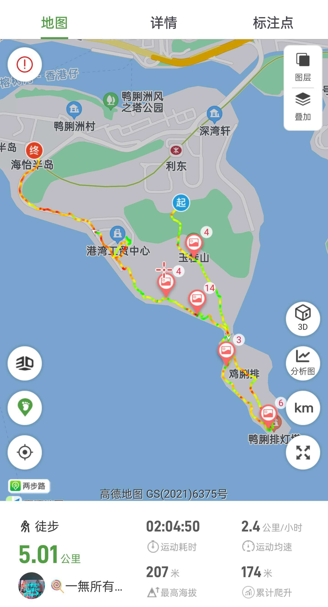
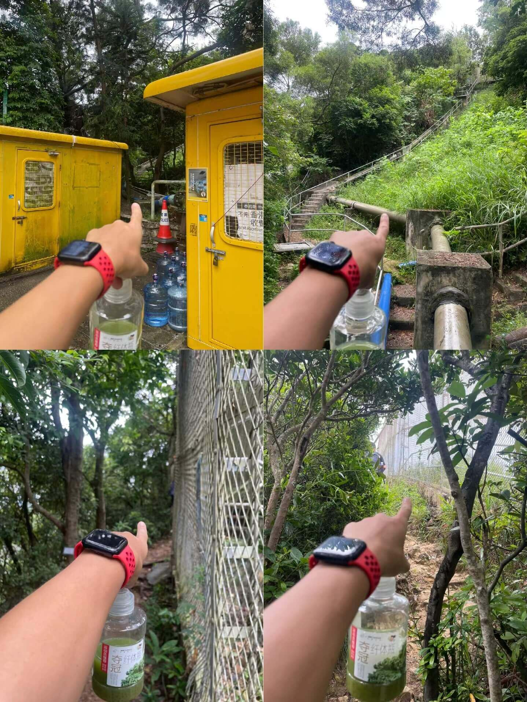

# 香港鸭脷洲玉桂山攻略

鸭脷洲的“脷”字，在粤语中是“舌头”的意思，鸭脷洲因其形状狭长像鸭的脷而得名。  
玉桂山-鸭脷排海岸线徒步路线全程5公里左右， 野路较多需要手脚并用，有绳索攀岩等路段，不适合新手  

## 装备

- 购买户外保险（可选，但推荐）

支付宝搜索户外保险，自行选购保一天一般1-2块钱  

- 身份证，港澳通行证（含有效签注），少量现金港币以备不时之需

香港地铁直达可刷支付宝乘车码  

- 手机，充电宝，香港流量卡或漫游流量包
- 2-3L水，零食干粮若干（中午一顿），垃圾袋(垃圾带走，无痕户外)
- 防晒服，长裤，帽子，遮阳伞，墨镜，防晒霜，<strong style="color:red;">手套，驱虫喷雾，防滑鞋</strong>，一次性雨衣(视天气情况而定)

<strong style="color:red;">绳索攀岩路段需要手脚并用，推荐携带背包方便腾出手来</strong>

## 深圳市内去程

- 方案1:福田口岸出发

福田口岸过关  

落马洲地铁站 --> 金钟站  
换乘南港岛线在利东站B口下车  

- 方案2：香港市区出发

导航到南港岛线利东地铁站B口下车

- 方案3：深圳北出发

高铁： 深圳北 --> 西九龙  
屯马线： 柯士甸站乌溪沙方向 --> 红磡站
东铁线： 红磡站金钟方向 --> 金钟站
南港岛线： 金钟站海怡半岛方向 --> 利东站
港铁南港岛线利东B口

## 徒步路线

1. 入口

地铁站B口出来，公交站后两个黄色小屋中间为徒步路线入口  

2. 玉桂山顶
3. 鸭脷排
4. 天然水池
5. 鸭脷排灯塔

## 返程

海岸线徒步完成后可选择返回利东B口或，海怡半岛站返程  
