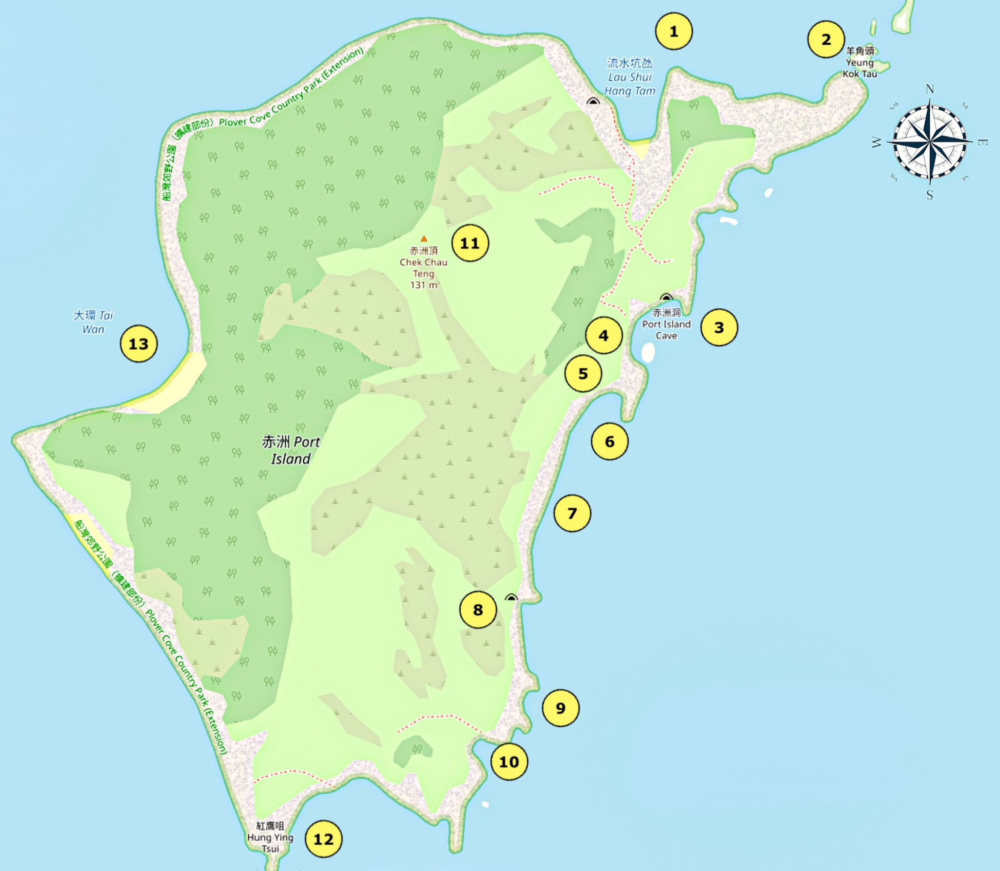

# 香港赤洲岛行攻略

赤洲岛，有着赤红色的的卵石潭，海上丹霞地貌， 香港六大浮潜珊瑚区之一

## 装备

- 购买户外保险（可选，但推荐）

支付宝搜索户外保险，自行选购保一天一般1-2块钱  

- 身份证，港澳通行证（有效签注），港币300~400现金

香港地铁可刷支付宝乘车码， 大巴、小巴大部分仅支持现金(不找零)或八达通
打车购买补给均需现金

- 手机，充电宝，香港流量卡或漫游流量包
- 3-4L水，零食干粮若干（无人岛屿，岛上无厕所，无补给），垃圾袋
- 防晒服，长裤，帽子，墨镜，防晒霜，驱虫喷雾，登山鞋， 一次性雨衣(视天气情况而定)
- 天幕或帐篷

岛上无遮挡，全程暴晒，一定一定要做好防晒

- 玩水可选装备
	- 拖鞋，纸巾或一次性毛巾
	- 防水背包
	- 手机防水袋
	- 浮潜泳衣目镜等装备
	- 浮潜鞋/溯溪鞋
	- 救生衣（水性不好必备）

<strong style="color:red;">附近海胆较多，没有救生员，下海游泳需结伴，注意防止被刺伤</strong>

## 深圳市内去程

1. 福田口岸过关前往黄石码头

打车方案(大约60min)：

绿色的士360hkd左右（凑够4人最划算）

公交方案：

a. 落马洲地铁站 --> 沙田站,转乘289R直达黄石码头
b. 西贡总站94号巴士 --> 黄石码头

- 黄石码头包船出海（20min）

9人以上包船费用大约人均100~125hkd之间
easyBook 包船电话：6938 5917 
可向船家租借救生衣5khd一件

## 路线

- 徒步路线1（难度：中等）

1 --> 3 --> 4 --> 5 --> 11 --> 12 --> 1

- 徒步路线2 （难度：简单）

1 --> 3 --> 4 --> 11 --> 1

- 浮潜路线

TODO：

  

1. [流水坑氹(小北灣)](https://booking.splitdyboat.com/wp-content/uploads/2022/02/%E8%B5%A4%E6%B4%B2%E5%8C%97%E7%81%A3-North-Bay-of-Port-Island-scaled.jpg)

废弃码头快艇登陆点，仅能容纳一人的[达摩洞(打卡点)](https://booking.splitdyboat.com/wp-content/uploads/2022/02/%E8%B5%A4%E6%B4%B2%E9%81%94%E6%91%A9%E6%B4%9E-Port-Island-Dharma-Cave-scaled.jpg)也在这里  
旁边有个小沙滩，涨潮的时候会被淹没  

2. [羊头角](/https://booking.splitdyboat.com/wp-content/uploads/2022/02/%E8%B5%A4%E6%B4%B2%E7%BE%8A%E8%A7%92%E9%A0%AD-Port-Island-Ram-Head-and-Horn-Rock-scaled.jpg)

打卡点之一，石头风化严重，有脱落风险，远观即可

3. [赤洲洞](https://booking.splitdyboat.com/wp-content/uploads/2022/02/%E8%B5%A4%E6%B4%B2%E6%B4%9E%E5%85%A7.jpg)

海蚀洞，打卡点之一

4. [水坝悬崖](https://booking.splitdyboat.com/wp-content/uploads/2022/02/%E8%B5%A4%E6%B4%B2%E5%A0%A4%E5%A3%A9%E5%B4%96-Port-Island-Dam-Cliff-scaled.jpg)

大坝旁边有条小路可以到达赤洲洞

5. [蚺蛇吐舌](https://booking.splitdyboat.com/wp-content/uploads/2022/02/%E8%9A%BA%E8%9B%87%E5%90%90%E8%88%8C-%E8%B5%A4%E6%B4%B2-Port-Island-Cobra-Climbing--2048x1536.jpg)
6. [鯊魚口石](https://booking.splitdyboat.com/wp-content/uploads/2022/02/%E9%AF%8A%E9%AD%9A%E5%8F%A3%E7%9F%B3-Shark-Rock-%E8%B5%A4%E6%B4%B2-Port-Island-scaled.jpg)
7. [红色鹅卵石海滩](https://booking.splitdyboat.com/wp-content/uploads/2022/02/DJI_0045.jpg)

鹅卵石海滩从深红色到棕色再到粉红色和紫色的渐变红色

8. [栈道奇穴](https://booking.splitdyboat.com/wp-content/uploads/2022/02/%E6%A3%A7%E9%81%93%E5%A5%87%E7%A9%B4-%E8%B5%A4%E6%B4%B2-Plank-Road-Strange-Cave.jpg)

是一个海蚀洞，上面有一条只能给一个人身位通过的栈道。

9. ？？？待探索地点

10. [赤漠迷城](https://booking.splitdyboat.com/wp-content/uploads/2022/02/DSC08949-1.jpg)

前面没有山路，必须沿着小路折返，回到港岛的小北湾与我们的快艇船夫汇合。对于那些通过海岸探险到达这里的人，你可以选择沿着远足小径徒步到港岛的顶峰 Check Chau Teng，然后返回旧码头。

11. [赤洲山顶](https://booking.splitdyboat.com/wp-content/uploads/2022/02/DSC09521.jpg)

从赤洲岛的北湾出发，沿途有一条登山步道，不久后你会发现右边有一条小路，通往赤洲岛的山顶。赤洲岛的最高点只有131米高

1.   [红鹰咀](https://static.wixstatic.com/media/4795d3_8cca21ecb33242039064bc21cc9aa18e~mv2.jpg)
2.   [大環(赤洲)](https://booking.splitdyboat.com/wp-content/uploads/2023/03/%E8%B5%A4%E6%B4%B2%EF%BC%8CPort-Island%EF%BC%8C%E8%B5%A4%E6%B4%B2%E5%A4%A7%E7%92%B0%EF%BC%8CTai-Wan-Port-Island%EF%BC%8C%E8%B5%A4%E6%B4%B2%E6%B5%AE%E6%BD%9B%EF%BC%8CPort-Island-Snorkeling%EF%BC%8C%E8%B5%A4%E6%B4%B2%E7%8F%8A%E7%91%9A%E5%8D%80%EF%BC%8CPort-Island-Coral-Area%EF%BC%8C%E9%A6%99%E6%B8%AF%E6%B5%AE%E6%BD%9B%EF%BC%8CHong-Kong-Snorkeling%EF%BC%8C%E9%A6%99%E6%B8%AF%E6%BD%9B%E6%B0%B4%EF%BC%8CHong-kong-Beach%E9%A6%99%E6%B8%AF%E6%B2%99%E7%81%98%EF%BC%8C%E7%8F%8A%E7%91%9A%E5%8D%80%EF%BC%8C%E7%9F%B3%E7%8F%8A%E7%91%9A.jpg)

著名潜水点， 有一个赤红色海滩， 不远处即为珊瑚区  
赤洲及大环(赤洲)珊瑚区主要有两个珊瑚品种，名叫扁脑珊瑚珊瑚及角孔珊瑚

## 返程

## 参考链接

[参考1](https://booking.splitdyboat.com/zh-hk/product/port-island/)
[香港潮汐预报](https://booking.splitdyboat.com/zh-hk/product/port-island/)