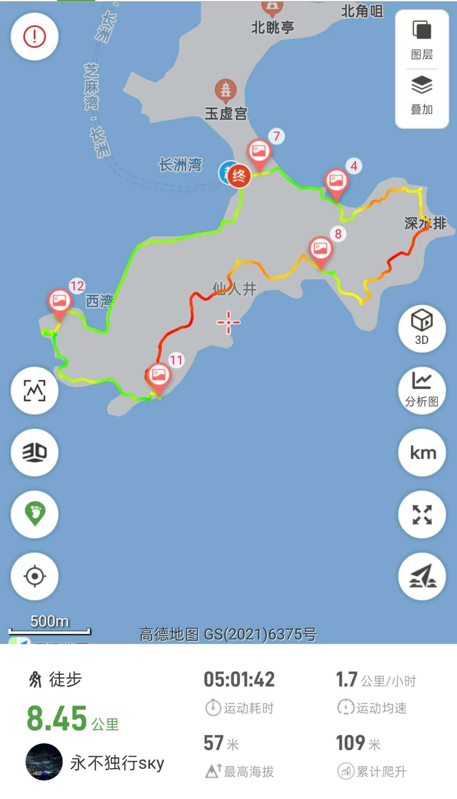
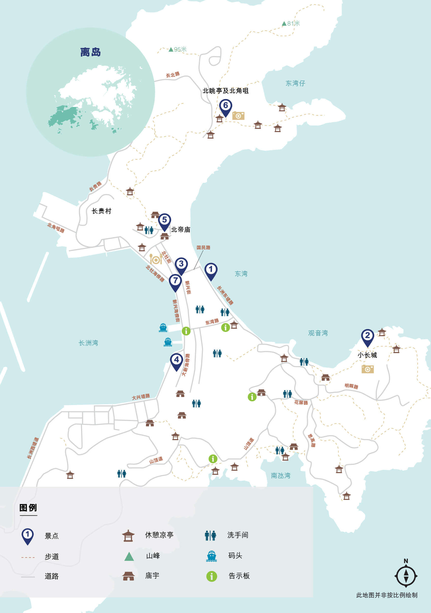

# 香港长洲岛徒步攻略

长洲岛位于离岛区，有着天使之翼(鱼翅石)，花瓶石等打卡点，是偏向于city walk的休闲徒步路线  
小环线长度约8+公里， 最高海拔57米，爬升较少，少量野路与海岸线攀爬，难度2.5⭐️  
若遇气温过高，增加1⭐️  

## 装备

- 购买户外保险（可选，但推荐）

支付宝搜索户外保险，自行选购保一天一般1-2块钱  

- 身份证，港澳通行证（含有效签注），100~200现金用于岛上商店购买补给  

香港地铁及轮渡可刷支付宝乘车码  
岛上商店需要现金或八达通  

- 手机，充电宝，香港流量卡或漫游流量包
- 2-3L水，零食干粮若干，垃圾袋(垃圾带走，无痕户外)
- 防晒服，长裤，帽子，遮阳伞，墨镜，防晒霜，<strong style="color:red;">驱虫喷雾，防滑鞋</strong>

## 去程

- 福田口岸出发

东铁线金钟方向： 落马洲站 ➡️ 金钟站  
荃湾线中环方向： 金钟站 ➡️ 中环站  

步行至中环5号码头赶10:45的班船  
船票普通船普通位单程14.8hkd或22hkd，仅现金或八达通  

详细参考[时刻表及价格](https://www.td.gov.hk/tc/transport_in_hong_kong/public_transport/ferries/service_details/index.html#o01)

## [徒步路线](https://www.2bulu.com/track/track_detail.htm?trackId=mdJCcO+/55fp/R2KBg5Tzw==)

  
  

## 返程

原路返回，需留意避免错过最后一班长洲岛开出的船23:30
