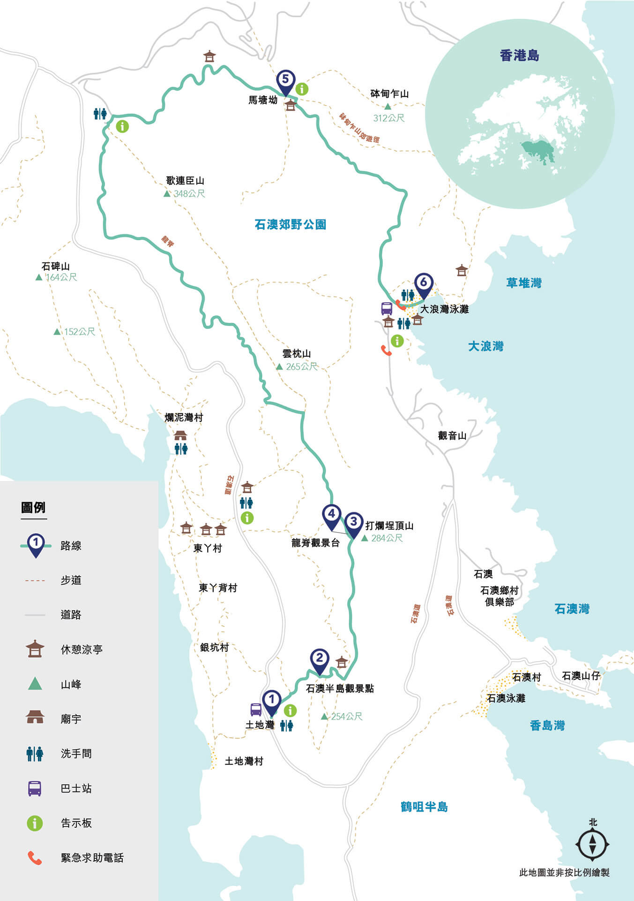
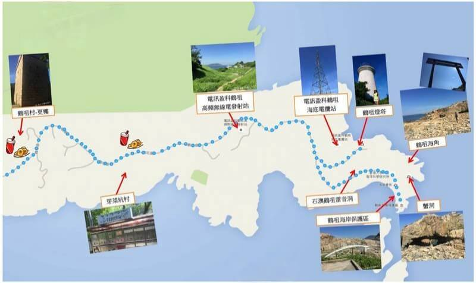

# 香港龙脊&鹤咀攻略

龙脊是一条山脊，在香港岛东南面石澳西边，由打烂埕顶山前往云枕山，横跨鹤咀半岛，乃港岛径第八段的一部分，长8.5公里

## 装备

- 购买户外保险（可选，但推荐）

支付宝搜索户外保险，自行选购保一天一般1-2块钱  

- 身份证，港澳通行证（含有效签注），港币300~400现金

香港地铁可刷支付宝乘车码， 大巴、小巴大部分仅支持现金(不找零)或八达通  
打车，补给点等需要现金

- 手机，充电宝，香港流量卡或漫游流量包
- 2-3L水，零食干粮若干（中午一顿），垃圾袋(垃圾带走，无痕户外)
- 防晒服，长裤，帽子，遮阳伞，墨镜，防晒霜，驱虫喷雾，登山鞋， 一次性雨衣(视天气情况而定)

全程50%的遮蔽路线，但也要注意防晒

如有需要玩水，建议携带拖鞋，纸巾或一次性毛巾，<strong style="color:red;">附近没有救生员，安全起见不要下海游泳</strong>

## 深圳市内去程

- 方案1 

福田口岸过关  
东铁线：金钟方向-红磡A1出口(38min)  
118路公交： 站外约200m有红隧转车公交站-乘坐118路公交蓝湾半岛巴士总站方向坐到鲤鱼门公园站(2站， 10min)  
9路公交： 同站换乘新巴9路石澳方向坐到土地湾/石澳道站（18min）  

- 方案2

高铁： 从深圳北站高铁站出发到香港西九龙站(15min)  
屯马线：过海关站内乘坐地铁屯马线柯士甸往乌溪沙方向（5min），坐到红磡A1  
118公交： 下楼梯就到公交车站找到P118路往蓝湾半岛巴士总站方向坐到鲤鱼门公园站(2站， 10min)  
9路公交： 同站换乘新巴9路石澳方向坐到土地湾/石澳道站（18min）

## 徒步路线

### 龙脊部分

1. 徒步起点土地湾

9号巴士下车附近即为龙脊登山口  
此处也可以乘坐9号巴士达到鹤咀道(坐两站，距离1公里左右)，开始鹤咀部分  
此处有厕所  

4. 龙脊观景台

此处为山顶，可由此原路返回去往鹤咀或继续前行从大浪湾下山

### 鹤咀部分

鹤咀的特色是碎石海滩和石头蟹洞，雷音洞、鲸鱼骨架等，全程为水泥路，坡度较小。  

乘坐9号巴士 到鹤咀道站下车  
鹤咀单程步行约3.5公里(往返3h左右，含休息拍照时间)  
沿着左手边水泥路, 朝着“鹤咀海底电缆站”方向走，按照指示牌前往鹤咀海岸保护区，就能到达雷音洞、蟹洞、鲸鱼骨等景点。  
蟹洞位于香港大学太古海洋科学研究所后面  

走约2公里有1个士多店(不可用支付宝)，可购买补给，附近有厕所。  

## 返程

大浪湾、鹤咀道、土地湾均可乘坐9路巴士沿原路线反方向返程
