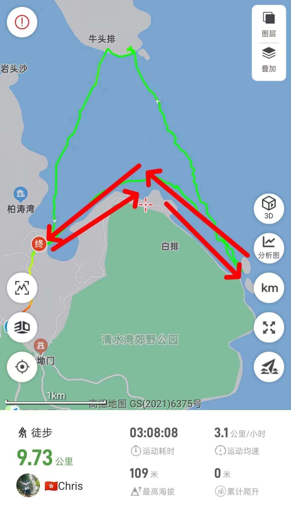

# 香港绿蛋岛独木舟浮潜攻略

相思湾皮划艇与浮潜新手友好，租用双人艇300hkd(9:00~17:00)  
船家提供救生衣，淡水冲洗  
可自行沿海岸线化至绿蛋岛，绿蛋岛海滩水很浅  
适合新手浮潜锻炼，往岛外稍远处也有水深超过2m的区域  

会游泳最好，不会游泳也能在浅水区简单浮潜，浅水区水深齐胸  

相思湾到绿蛋岛划皮划艇来回约4~5公里，单程需约1.5h，新手难度  

<strong style="color:red;">本攻略完全为自由行，没有教练带队指导，每个人需要为自己的安全负责，虽然全程有救生衣，但也要学会怎么处理紧急情况，强烈建议在会游泳的朋友陪同下游玩</strong>  

初次体验皮划艇和浮潜的朋友，建议先在视频平台搜搜教程提前练习，皮划艇练习几分钟就能学会，但也要注意皮划艇遇到紧急情况如何处理  

浮潜需要先练习使用呼吸管，在学习视频教程后，再在岸边浅水区域逐步练习后，才可进入较深的水域，<strong style="color:red;">不要沉迷于海底的景色，时刻关注自己与岸边或皮划艇之间的距离</strong>  

## 装备

- 购买户外保险（可选，但推荐）

水上运动风险较大，强烈建议购买，保险一般一天1~5块钱  

- 身份证，港澳通行证（含有效签注），200~300现金用于租船及购买补给  

香港地铁及大巴可刷支付宝乘车码  

码头商店补给、租船需要现金或八达通  

- 手机，充电宝，香港流量卡或漫游流量包
- 3-4L矿泉水/功能饮料，零食干粮若干(中午一顿)，垃圾袋(垃圾带走，无痕户外)

- 浮潜装备

船上完全无遮挡，防晒需拉满：

长袖泳裤泳衣、浮潜/防晒手套、防晒帽，防晒面罩，墨镜，溯溪鞋/防水鞋、防水背包、防水手机袋  

浮潜镜、呼吸管、泳帽(防晒)、脚蹼(非必要)等

船上多多少少会进水，因此带到船上的物资进行做好防水措施；  

手机装防水袋中也不建议带到水下拍摄，镜头会起雾，万一漏水海水对电子设备腐蚀性极强，容易损坏手机等电子设备  

- 干净的替换衣物、毛巾、防晒霜，<strong style="color:red;">驱虫喷雾，防滑鞋</strong>

## 去程

- 福田口岸出发(2h19min)
东铁线金钟方向： 落马洲站 ➡️ 九龙塘站 (9站37min)
观塘线调景岭方向： 九龙塘站 ➡️ 彩虹站C2口 (4站8min)
九巴91路清水湾总站方向： 牛池湾村站 ➡️ 相思湾站 (26站59min)

步行至相思湾村 199号(1.2公里18min)

## 路线

  

## 返程

把握好返程时间，在相思湾归还租用的皮划艇后沿原路返回  
