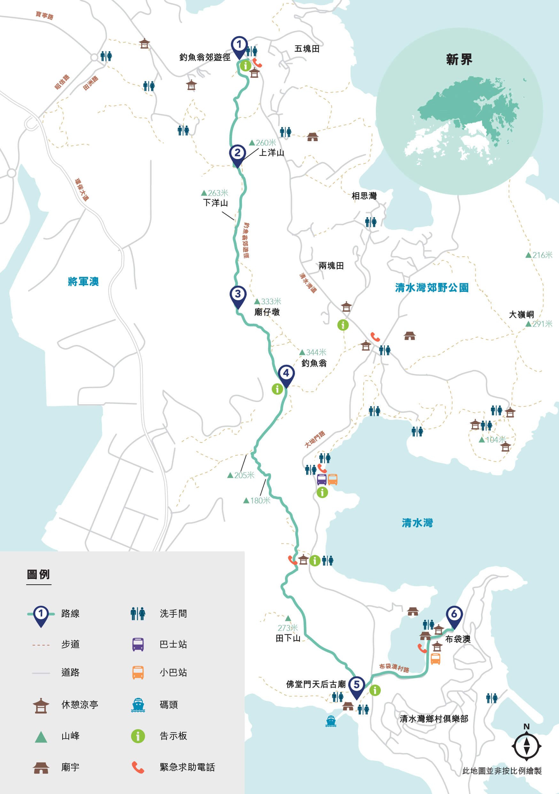
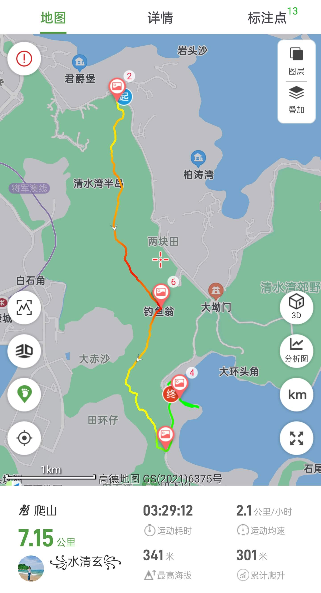
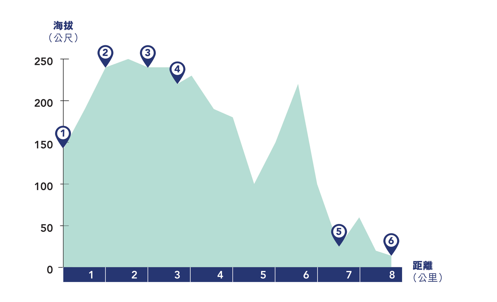

# 香港钓鱼翁攻略

钓鱼翁因山峰外形神似一个披着蓑笠的渔翁而得名，其位于新界东南部西贡区清水湾半岛上，海拔345米，是清水湾半岛最高山峰。

## 装备

- 购买户外保险（可选，但推荐）

支付宝搜索户外保险，自行选购保一天一般1-2块钱  

- 身份证，港澳通行证（含有效签注），建议100-200现金港币打车和补给

香港地铁和巴士均可刷支付宝乘车码   

- 手机，充电宝，香港流量卡或漫游流量包
- 2-3L水，零食干粮若干（中午一顿），垃圾袋(垃圾带走，无痕户外)
- 防晒服，长裤，帽子，遮阳伞，墨镜，防晒霜，<strong style="color:red;">驱虫喷雾， 登山杖</strong>，一次性雨衣(视天气情况而定)

<strong style="color:red;">一次性雨衣或雨伞，双肩背包</strong>

## 去程

- 方案1:**福田口岸过关**   

东铁线： 落马洲地铁站 --> 大围站B口  
屯马线屯门方向： 大围站 --> 钻石山地铁站C2口  
91路大巴: 地铁口附近公交站乘坐91路大巴到五块田公交站(可用支付宝乘车码)，下车即为登山口  

## 徒步路线

  
  
  

## 返程

清水湾沙滩旁，清水湾总站乘坐91路巴士到达钻石山总站
