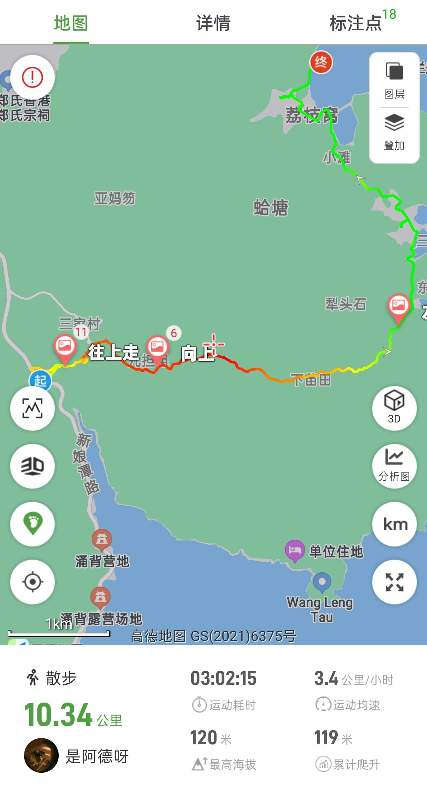

# 香港荔枝窝徒步

孤独星球推荐的户外徒步秘境！客家村落荔枝窝，是香港历史最悠久、规模最大、保存最完好的乡村之已经有400多年的历史!  

本次路线： 新娘潭 --> 乌蛟腾村 --> 翠三古道 --> 三桠村 -->荔枝窝
全程： 约10公里， 爬升不高， 难度 ⭐⭐⭐☆☆

## 装备

- 购买户外保险（可选，但推荐）

支付宝搜索户外保险，自行选购保一天一般1-2块钱  

- 身份证，港澳通行证（有效签注），100~200HKD港币现金

香港地铁可刷支付宝乘车码， 大巴、小巴大部分仅支持现金(不找零)或八达通；  
打车，小巴，轮渡，补给点等需要现金

- 手机，充电宝，香港流量卡或漫游流量包(可以好友共用)
- 2 ~ 3L水，零食干粮若干(午餐)，垃圾袋
- 防晒服，长裤，帽子，墨镜，防晒霜，驱虫喷雾，登山鞋  

## 去程：

- 打车方案（人多推荐, 省时间）

4人一组，打车到新娘潭   

- 公共交通

过关落马洲地铁站 --> 沙田站 --> 巴士总站坐289R --> 北潭涌换乘 小巴9A --> 万宜水库东坝
东铁线： 落马洲站 --> 大埔墟地铁站A1口  
直行进入地下隧道，按公交指示牌抵达大埔墟巴士总站  
九巴275R： 大埔墟巴士总站 --> 乌蛟腾巴士总站(50min)  
或从B口出口乘坐小巴20R --> 新娘潭自然教育径下车(11.7HKD)。车程约40分钟，每40分钟一班，沿途可以欣赏到香港乡村的宁静美景

## 徒步路线：破边洲+麦理浩径二段

  

- 新娘潭：

传说清朝新娘坠潭悲剧地， 本地人称“香港四大鬼域之首”， 傍晚谨慎独行，可打卡网红瀑布机位

- 乌蛟腾

森林奇境：参天古树盘根错节，藤蔓垂挂如绿帘，阴天雾气缭绕宛如《幽灵公主》场景！
历史印记：村口抗日英烈纪念碑，记录日军侵港时期的悲壮故事，肃穆感油然而生。

- 三桠村

客家古村：400年历史的隐秘村落，红砖老屋与田园交错，可买村民自酿凉茶&简易干粮。
湿地生态：村外红树林湿地，2月偶遇迁徙白鹭，手机长焦轻松出片！

- 荔枝窝

地质奇观：六角形火山岩柱群+海岸断层，地貌堪比冰岛黑沙滩（阴天暗调更显魔幻）

## 返程

在荔枝窝乘坐轮渡到马料水码头(45HKD, 90min)  
全天只有15:30一班船