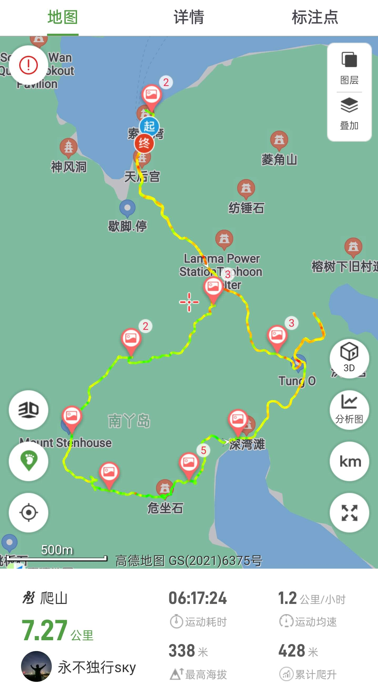
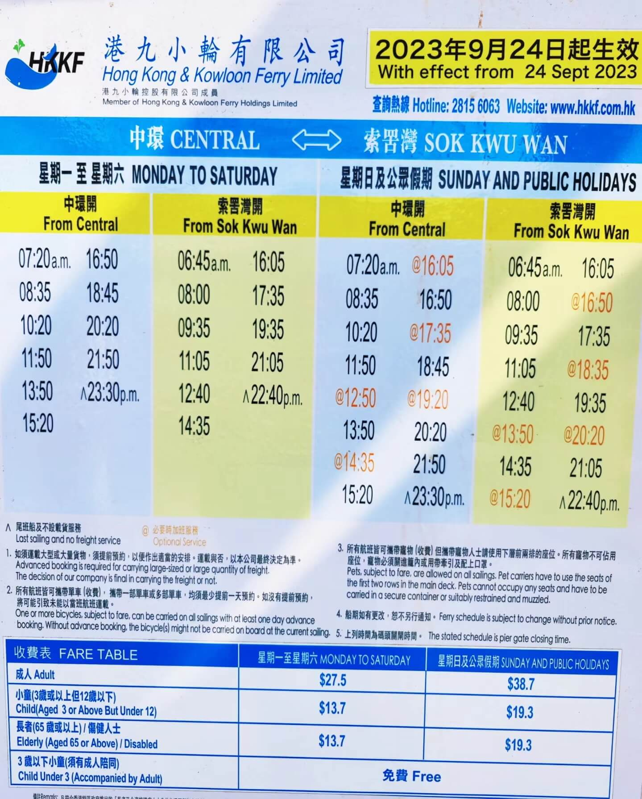

# 香港南丫岛索罟灣路线攻略

南丫岛是香港第三大岛，位于香港岛南部，因为形状像汉字“丫”而得名，南丫岛有着city walk和山海徒步多种路线。  
其中索罟灣有着形态各异的奇石，部分路段会比较陡峭，需要有具备一定徒步经验和体能才能前往  

## 装备

- 购买户外保险（可选，但推荐）

支付宝搜索户外保险，自行选购保一天一般1-2块钱  

- 身份证，港澳通行证（含有效签注），少量现金港币以备不时之需

离岛轮渡可刷支付宝乘车码  

- 手机，充电宝，香港流量卡或漫游流量包
- 2-3L水，零食干粮若干（中午一顿），垃圾袋(垃圾带走，无痕户外)
- 防晒服，长裤，帽子，遮阳伞，墨镜，防晒霜，<strong style="color:red;">手套，驱虫喷雾，登山杖</strong>，一次性雨衣(视天气情况而定)

<strong style="color:red;">中途无补给点，务必带足水和防暑降温装备</strong>

## 深圳市内去程

- 方案1:福田口岸出发

福田口岸过关  

东铁线：落马洲地铁站 --> 金钟站  
荃湾线(中环方向)/港岛线(坚尼地城方向) 金钟站 --> 中环站A口
步行至中环4号码头 --> 索罟灣  

- 方案2：深圳北出发

高铁： 深圳北 --> 西九龙  
屯马线（屯门方向）： 柯士甸站 --> 南昌站
东涌线（香港方向）： 南昌站 --> 香港站D口
步行至中环4号码头 --> 索罟灣  

## 徒步路线

遮阴率不到30%，务必注意防暑防晒，需穿越与人等高的灌木林，翻越巨大的石头，准备好手套，登山鞋等装备

1. 中环4号码头

从地铁口出来后步行至中环4号码头乘坐轮渡前往索罟灣(40min)  

2. 幽灵石

网红打卡点，位于路线上危坐石和深湾滩之间

## 返程

索罟灣 --> 中环4号码头  
随后选择自己方便的路线返程  
