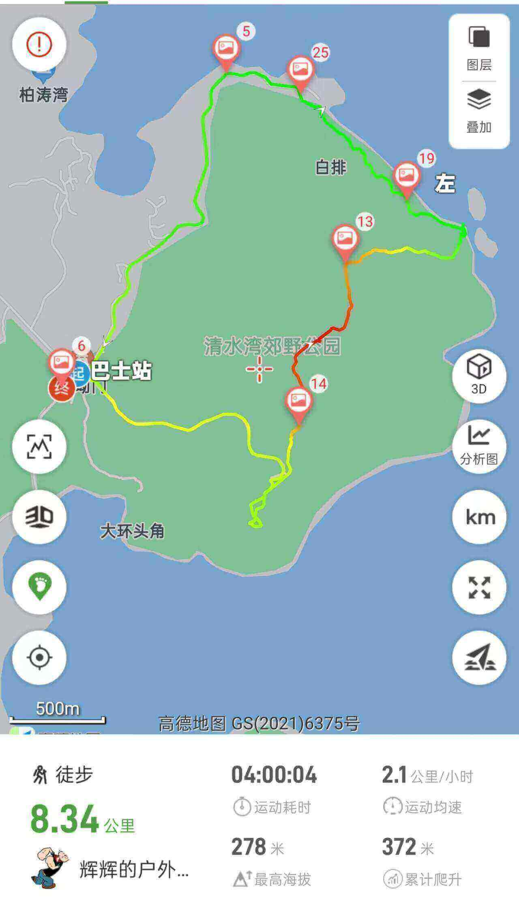

# 香港龙虾湾徒步攻略

位于清水湾郊野公园的一个徒步路线，连接龙虾湾与大坑墩，途中有不少奇石，毗邻皮划艇和新手浮潜打卡点绿蛋岛，能直接看到吊钟洲海景  
全程约9公里，最高点大岭峒海拔290米，路况为新手难度，夏天暴晒则上升为中等难度  

## 装备

- 购买户外保险（可选，但推荐）  

支付宝搜索户外保险，自行选购保一天一般1-2块钱  

- 身份证，港澳通行证（有效签注），200~300HKD现金  

香港地铁可刷支付宝乘车码， 大巴、小巴大部分仅支持现金(不找零)或八达通；  
打车，小巴，轮渡，补给点等需要现金  

- 手机，充电宝，香港流量卡或漫游流量包(可以朋友共用)  
- 2 ~ 3L水，零食干粮若干(午餐)，垃圾袋  
- 防晒服，长裤，帽子，墨镜，防晒霜，驱虫喷雾，防滑鞋， <strong style="color:red;">手套</strong>  

<strong style="color:red;">树荫路段较少，务必注意防暑防晒</strong>

## 去程

- 方案1:**福田口岸过关**  

东铁线： 落马洲地铁站 --> 大围站B口  
屯马线屯门方向： 大围站 --> 钻石山地铁站C2口  
91路大巴: 地铁口附近公交站乘坐91路大巴到大坳门站下车(可用支付宝乘车码)，下车即为登山口  

## [徒步路线](https://www.2bulu.com/track/track_detail.htm?trackId=Xia8IDqEuPPp/R2KBg5Tzw==)

下车后沿清水湾郊野公园直走，起点有全程唯一的补给及厕所

## 返程

回到大坳门站，乘坐91路原路返回或可乘坐103m小巴到将军澳地铁站
