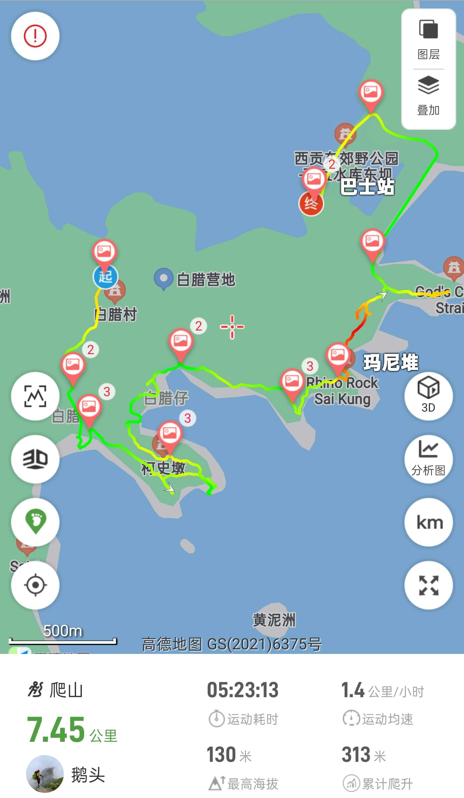

# 香港麦理浩径一段

麦理浩径一段路程短，全程为公路, 因此大部分人都走以下路线  

白蜡村 --> 木棉洞 --> 万柱海岸 --> 破边洲 --> 万宜水库东坝  

路况： 约8公里, 全程暴晒无遮蔽（<strong style="color:red;">注意防晒</strong>）  
部分路段野路, 乱石及灌木  

## 装备

- 购买户外保险（可选，但推荐）  

支付宝搜索户外保险，自行选购保一天一般1-2块钱  

- 身份证，港澳通行证（有效签注），200~300HKD现金  

香港地铁可刷支付宝乘车码， 大巴、小巴大部分仅支持现金(不找零)或八达通；  
打车，小巴，轮渡，补给点等需要现金  

- 手机，充电宝，香港流量卡或漫游流量包(可以朋友共用)  
- 2 ~ 3L水，零食干粮若干(午餐)，垃圾袋  
- 防晒服，长裤，帽子，墨镜，防晒霜，驱虫喷雾，防滑鞋， 手套  

包含野路，及灌木路段<strong style="color:red;">注意防晒，防滑，穿长裤</strong>

## 去程

- 打车方案（人多推荐, 省时间，与公共交通价格差不多）

福田口岸集合过关  
4人一组打车(绿色taxi)到西贡白蜡村，路程不堵车的情况下1h左右，加过关和排队，保守估计10:00抵达  

红色taxi到全市，但比绿色taxi贵点，绿色仅到新界  

## [徒步路线](https://www.2bulu.com/track/track_detail.htm?trackId=bJx/pV80Ahnp/R2KBg5Tzw==)

## 返程

返回点1： 万宜水库东坝乘坐9A(支持支付宝， 末班18:30)返回北潭涌 --> 289R到沙田地铁站--> 落马洲地铁站 --> 过关返深  

返回点2： 西湾亭乘坐小巴NR29（末班16:30） --> 西贡码头 --> 299x大巴到沙田地铁站 --> 落马洲地铁站 --> 过关返深

PS: 西贡码头也可坐1A到彩虹地铁站  
如遇时间过晚也可打车，但此地信号不太好，容易遇上宰客黑的士（正常价格为350hkd左右）  
的士平台电话（座机）： 27296600 | 27291199，或高德打车  

NR29时刻表:  

<picture>
  <source srcset="https://cdnjson.com/images/2024/05/13/NR29timeSheetce54f1f3b82baf0c.jpg"/>
  
</picture>
