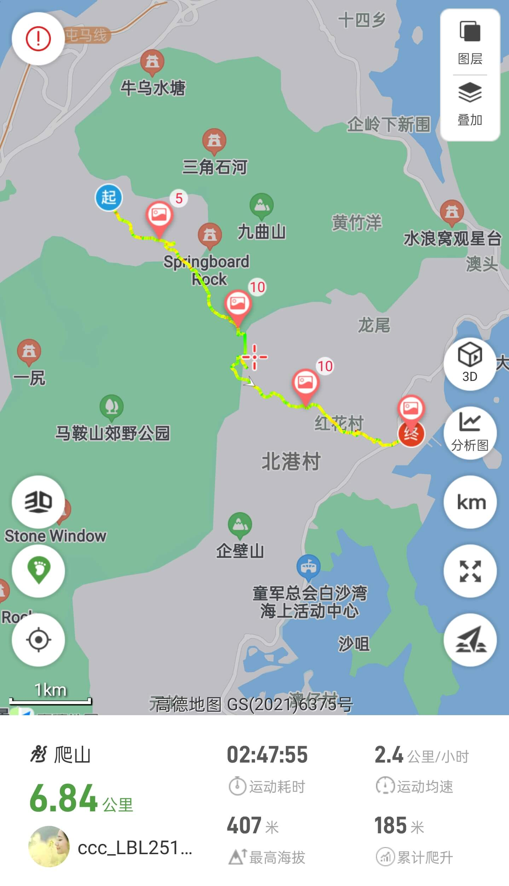
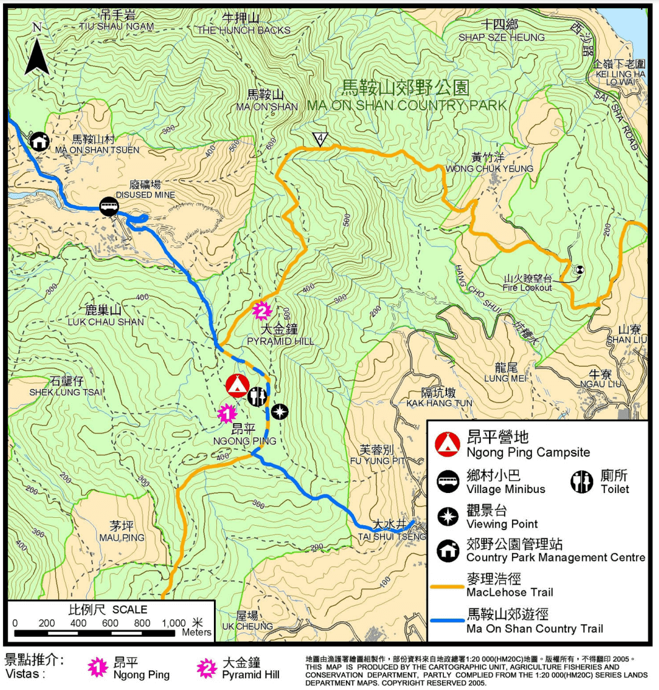

# 香港昂平营地攻略

香港昂平营地，位于马鞍山郊野公园，海拔400多米，香港少有的高原草原，有港版阿勒泰之称，其中部分路段与麦理浩径4段重叠  

## 装备

- 购买户外保险（可选，但推荐）

支付宝搜索户外保险，自行选购保一天一般1-2块钱  

- 身份证，港澳通行证（含有效签注），建议100-200现金港币打车和补给

香港地铁可刷支付宝乘车码  
出租车仅收现金  

- 手机，充电宝，香港流量卡或漫游流量包
- 2-3L水，零食干粮若干（中午一顿），垃圾袋(垃圾带走，无痕户外)
- 防晒服，长裤，帽子，遮阳伞，墨镜，防晒霜，<strong style="color:red;">驱虫喷雾， 登山杖</strong>，一次性雨衣(视天气情况而定)

<strong style="color:red;">一次性雨衣或雨伞，双肩背包</strong>

## 去程

- 方案1:**福田口岸过关**   

东铁线： 落马洲地铁站 --> 大学站B口  

87K巴士在恒安邨站下车， 下车后步行(30min, 2.3公里)导航至马鞍山烧烤场  
或出租车到马鞍山烧烤场(70+hkd, 15min)  

## 徒步路线

山顶仅旱厕，介意的尽量上山前上一趟厕所

  
  

## 返程

建议4点开始沿西贡方向下山  
在西贡巴士总站乘299x至沙田市中心总站，换乘东铁线落马洲方向过关返程  
