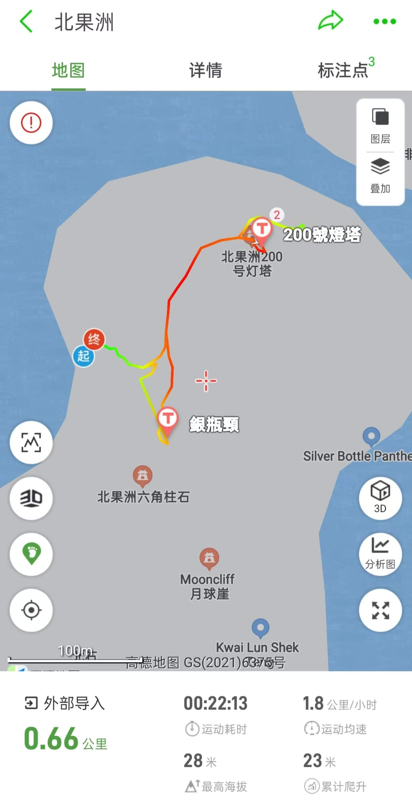

# 北果洲徒步攻略

北果洲是果洲群島其中一個島嶼，位於香港東南面，與南果洲及東果洲與其他衛星小島組成果洲群島。北果洲有世界罕見的大面積的六角柱狀節理火山岩，與糧船灣萬宜水庫六角石柱同屬糧船灣岩組，但北果洲六角柱岩石更加巨大，可媲美北愛爾蘭的巨人堤道 (Giant’s Causeway)。  
北果洲为无人荒岛，岛上无补给卫生间等设施。  

## 装备

- 购买户外保险（可选，但推荐）  

支付宝搜索户外保险，自行选购保一天一般1-2块钱  

- 身份证，港澳通行证（有效签注），200~300HKD现金  

香港地铁可刷支付宝乘车码， 大巴、小巴大部分仅支持现金(不找零)或八达通；  
打车，小巴，轮渡，补给点等需要现金  

- 手机，充电宝，香港流量卡或漫游流量包(可以朋友共用)  
- 2 ~ 3L水，零食干粮若干(午餐)，垃圾袋  
- 防晒服，长裤，帽子，墨镜，防晒霜，驱虫喷雾，防滑鞋， <strong style="color:red;">手套</strong>  

包含巨大的六角岩柱，部分打卡点需要徒手攀岩<strong style="color:red;">注意防晒，防滑</strong>

## 去程

- 口岸交通抵达西贡码头  

公共交通：地铁抵达沙田站，在商场中下到-1层，换乘299x在西贡总站下车即抵达西贡码头

- 西贡码头仅能包船出发,约30min抵达  

## [徒步路线](https://www.2bulu.com/track/track_detail.htm?trackId=mG6zPKZ0AgPp/R2KBg5Tzw==)

岛比较小，一眼可以望到头，上岛后自由活动，也可按照以下初级路线游玩  
  

包含景点：  
銀瓶頸、月球崖、大炮石、殼仔排、200號燈塔等等  
其中六角石柱、大炮石和月球崖需要徒手攀岩经过峡谷去到对面  

## 返程

按包船约定的时间抵达小码头，与船家对接返回西贡码头  
