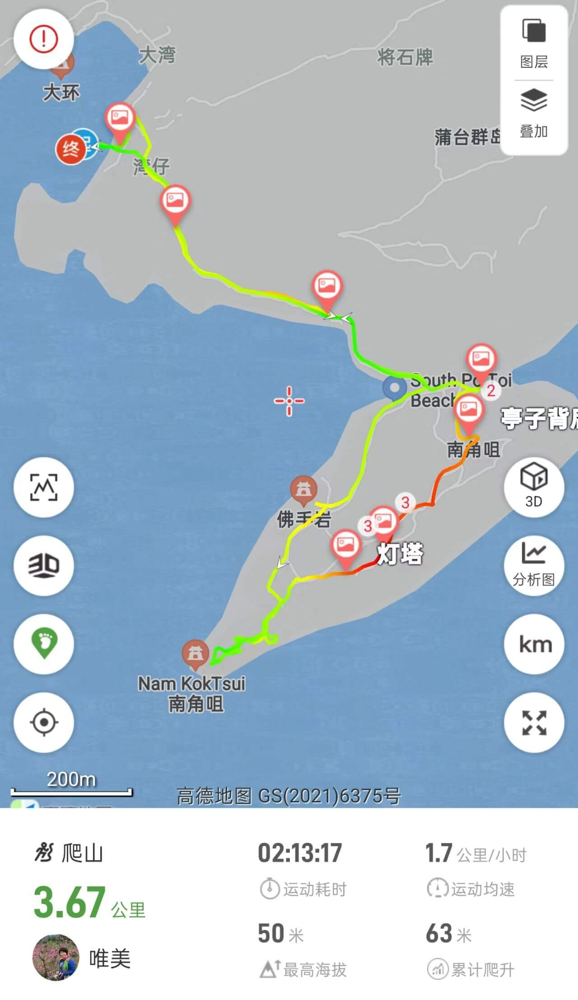

# 香港蒲台岛徒步攻略

蒲台岛位处香港南端，面积只有3.69平方公里，有20名左右原住民多数在南岸的大湾村，岛上遍布奇岩异石，如响螺石、佛手岩、灵龟石等。其中巫氏古宅更有灵异传说。  
环岛路线：5公里+， 爬升180米，难度2.5⭐️  
精华路线：4公里+， 爬升50米， 难度1.5⭐️  
若遇气温过高，增加1⭐️  

## 装备

- 购买户外保险（可选，但推荐）  

支付宝搜索户外保险，自行选购保一天一般1-2块钱  

- 身份证，港澳通行证（有效签注），100~200HKD现金  

香港地铁、大巴可刷支付宝乘车码，轮渡及小巴(现金不找零)大部分仅支持现金或八达通；  

- 手机，充电宝，香港流量卡或漫游流量包(可以朋友共用)  
- 1 ~ 2L水，零食干粮若干，垃圾袋  
- 防晒服，长裤，帽子，墨镜，防晒霜，驱虫喷雾，防滑鞋  

## 去程

- **福田口岸过关**

东铁线金钟方向： 落马洲站 ➡️ 金钟站  
南港岛线海怡半岛方向： 金钟站 ➡️ 黄竹坑站A1口  
69A数码港站： 数码港站 ➡️ 香港仔大道；香港仔海滨公园  

下车即为，香港仔码头  

船票单程30HKD每人  
[码头时刻表](https://www.td.gov.hk/tc/transport_in_hong_kong/public_transport/ferries/kaito_services_map/service_details/index.html#k10)：

| 出发地 | 时间 |
|--------|------|
| 香港仔 ➡️ 蒲台岛 | 周二/四/五：10:00 周六：10:00、15:00 周日/公众假期：08:15 |
| 赤柱（卜公码头）➡️ 蒲台岛 | 周二/四/五：10:30 周六：10:30、13:20 周日/公众假期：10:00、11:30、15:30、17:00 |
| 蒲台岛 ➡️ 赤柱 | 周六：12:40  周日/公众假期：09:15、10:45、15:00、16:30 |
| 蒲台岛 ➡️ 赤柱 ➡️ 香港仔 | 周二/四/五：15:30  周六：14:00、16:00  周日/公众假期：18:00 |

营办商：翠华船务（香港）有限公司  
联络电话：2272 2022  
船只编号：A4863、A5613、A7663、A7863、A142735、A142794、A144612  

## [徒步路线](https://www.2bulu.com/track/track_detail.htm?trackId=yvsJRdhncA7p/R2KBg5Tzw==)

  

## 返程

原路返回，务必提前赶到码头，避免错过最后一班船
