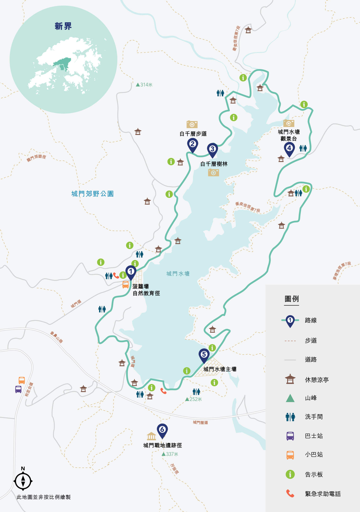

# 香港城门水塘一日徒步游攻略

城门水塘位于新界，是香港历史最悠久的水塘之一，全程13公里左右，90%林荫路段，基本无爬升。  
水塘附近一带有蝴蝶纷飞，还有猴子、黄牛以至野猪的身影。  
沿着水塘道或教育径漫步，无论身处山麓水波之间，或是深入白千层树林，都能拍出漂亮的打卡照。  
如果你对香港历史感兴趣，不妨走到城门战地遗迹径，探索二战期间的遗迹。  

## 装备

- 购买户外保险（可选，但推荐）

支付宝搜索户外保险，自行选购保一天一般1-2块钱  

- 身份证，港澳通行证（含有效签注），现金港币200左右

香港地铁可刷支付宝乘车码， 大巴、小巴大部分仅支持现金(不找零)或八达通  
打车，补给点等需要现金

- 手机，充电宝，香港流量卡或漫游流量包
- 2-3L水，零食干粮若干（中午一顿），垃圾袋(垃圾带走，无痕户外)
- 防晒服，长裤，帽子，遮阳伞，墨镜，防晒霜，<strong style="color:red;">驱虫喷雾</strong>，登山鞋， 一次性雨衣(视天气情况而定)

虽然林荫众多，但仍要注意防晒，防止中暑，着重方式蚊虫叮咬  

## 深圳市内去程

- 方案1:福田口岸出发

福田口岸过关  
东铁线：落马洲地铁到沙田站A口(32min, 33hkd)  
公交巴士：沙田市中心总站47A/47X/48X到可风中学巴士站(15min, 8.8hkd)  
下车后往前左转走一公里城门道郊野公园

- 方案2：香港市区出发

导航至城门水塘站

## 徒步路线

1. 菠萝坝自然教育径

巴士站到水塘起点路段有猴子拦路求食，可以用登山杖警示即可  
从城门水塘远足径起点（小巴站）拾级而上，随即进入被动植物环绕着的菠萝坝自然教育径。  
注意，进入郊野公园范围沿途都有机会遇上猴子，切勿投喂。  

1. 白千层步道

白千层植林区。白千层因褐白色的树干，被薄纸般的树皮层层叠叠包围着而得名。

3. 白千层树林

城门水塘最受欢迎的景点 -- 绿洲一般的白千层树林

4. 城门水塘观景台

从十字路口往山上走约两分钟，你便会到达山顶处的城门水塘观景台，上城门水塘的壮丽景色跃现眼前。从观景台可以180度饱览自然与都会融合的独特景致，近景是环绕城门水塘的山麓轮廓，到远方山幽之岭，以至葵涌区的城市天际线皆尽收眼底。

5. 城门水塘主坝

半水半坝，极佳的航拍点，此处可看到狮子山及大帽山

6. 城门战地遗迹径

从烧烤场轻松往上走一段梯级，便来到城门碉堡。置身于城门战地遗迹径，令人感觉时光倒流。醉酒湾防线是跨越葵青和沙田区的12英亩军事碉堡阵地的一小部分，于二战期间为了防御从北面来袭的军队而建，当中城门碉堡阵地是整条防线的重要据点，防御设施包括军事坐标、机枪堡等，内里以长约250米隧道连接。温馨提示，如需前往城门战地遗迹径，记得带备充足的饮用水，烧烤场的洗手间旁设有自动售卖机及饮用水机。

## 返程

可风中学站原路返回或乘坐278X(55min, 14.2hkd), 至上水站后换港铁到落马洲(12min, 26.5hkd)

前往菠萝坝自然教育径
于港铁荃湾站B1出口，越过青山公路的人行天桥并步行至兆和街，搭乘82号小巴直达城门水塘。

从城门战地遗迹径离开
于城门水塘小巴总站，搭乘82号小巴至兆和街，再搭乘港铁前往各区。

#### 行程简介：
- **起点**：城门水塘停车场
- **终点**：大围火车站（或原路返回停车场）

#### 1. 如何到达
你可以从市区搭乘巴士或小巴前往城门水塘。常用路线如下：
- 从**荃湾**搭乘巴士**72号**或小巴**82号**，在城门水塘停车场下车。
- 从**沙田**乘坐巴士**47X**到达，步行几分钟到达起点。

建议早上8-9点开始行程，避开正午最热的时候。

#### 2. 徒步路线推荐

**城门水塘环水塘路线**是最受欢迎的路线，环绕城门水塘一周，途经多个景观点。

##### 2.1 城门水塘主坝
进入城门水塘的第一站是水塘的主坝，这里可以欣赏到壮丽的水塘全景，尤其在清晨时分，水面平静如镜，倒映出四周的山峦和树木，是绝佳的拍照地点。

##### 2.2 大帽山自然教育径
沿着主坝走几分钟后，你会进入大帽山自然教育径。这条小径风景秀丽，沿途有许多树木介绍牌，可以了解这里丰富的植被和生态系统。这里空气清新，适合慢步欣赏大自然。

##### 2.7 结束徒步
如果选择原路返回，可以回到主坝，结束徒步之旅；若想继续挑战，可以选择沿着路线通往**大围火车站**，这一段路相对较长，但途中风景宜人，也是一个不错的选择。

#### 3. 注意事项
- **补给**：沿途没有小卖部或饮水设施，请携带足够的饮用水和零食。
- **防晒和防蚊措施**：山上阳光强烈，建议戴帽子和涂抹防晒霜；同时，这里植被茂密，可能有蚊虫，建议涂抹防蚊水。
- **舒适的衣物和鞋子**：徒步过程中有上坡和下坡的路段，建议穿着合适的登山鞋和轻便透气的衣物。
- **环保意识**：请勿随意丢垃圾，保持自然环境的整洁。

#### 4. 推荐时间
最佳游玩时间为秋冬季节（10月至3月），天气凉爽舒适，徒步体验最佳。夏季相对炎热，可能不适合长时间户外活动。

#### 总结
城门水塘徒步游是一条充满自然景观与历史气息的徒步路线，无论是喜欢探险的徒步爱好者，还是喜欢慢步享受大自然的游客，都可以在这里度过一个充实且愉快的户外时光。