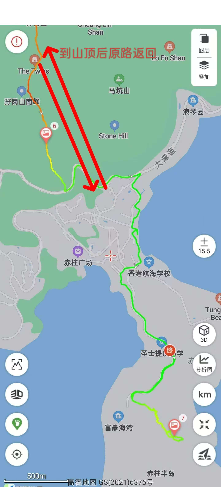

# 香港赤柱徒步攻略

本次香港赤柱路线包含赤柱半岛的斜炮顶，犀牛石打卡点、赤柱孖岗山、赤柱广场等主要打卡点  
一半citywalk，一半行山路线，行山路线主要为台阶，总长度预估6~8公里，属于简单休闲型  
难度2⭐️  

## 装备

- 购买户外保险（可选，但推荐）  

支付宝搜索户外保险，自行选购保一天一般1-2块钱  

- 身份证，港澳通行证（有效签注），100~200HKD现金  

香港地铁、大巴可刷支付宝乘车码，小巴大部分仅支持现金(不找零)或八达通；  

- 手机，充电宝，香港流量卡或漫游流量包(可以朋友共用)  
- 1 ~ 2L水，零食干粮若干，垃圾袋  
- 防晒服，长裤，帽子，墨镜，防晒霜，驱虫喷雾，防滑鞋， <strong style="color:red;">登山杖</strong>  

## 去程

- 方案1：**西九龙过关**

搭乘高铁到西九龙站，出站后站外步行至荃湾线佐敦站  
荃湾线中环方向：佐敦站 ➡️ 金钟站C1口  
金钟公交站：乘坐6、6x、260到终点站赤柱广场站(30~40min)巴士建议坐二层右边风景好  

- 方案2： **福田口岸过关**

东铁线金钟方向： 落马洲站 ➡️ 金钟站C1口  
金钟公交站：乘坐6、6x、260到终点站赤柱广场站(30~40min)巴士建议坐二层右边风景好  

## [徒步路线](https://www.2bulu.com/track/track_detail.htm?trackId=vX1+dE8ykcLp/R2KBg5Tzw==)

赤柱广场下车后可先在赤柱广场citywalk打卡后再前往犀牛石方向  

## 返程

赤柱交通比较方便，可现场随意规划返程
