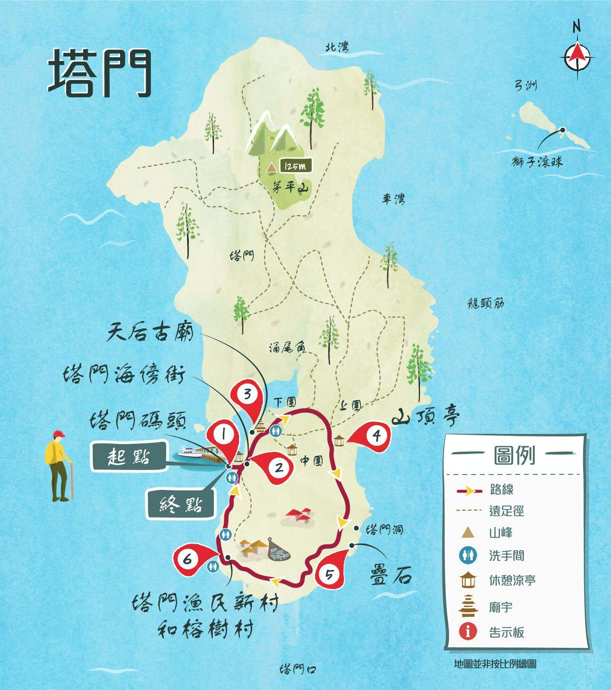
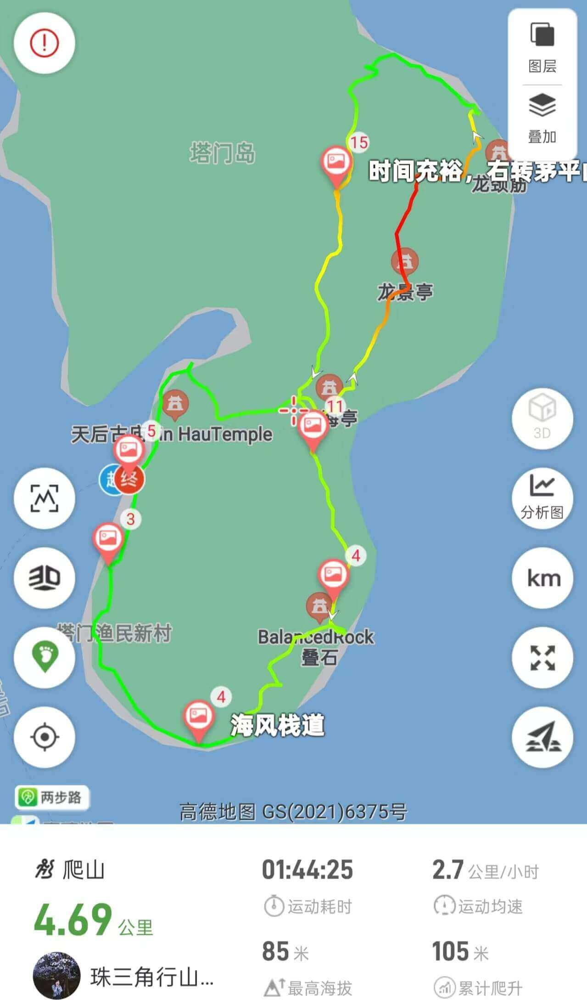

# 香港塔门岛徒步攻略

塔门岛位于香港西贡，有着草原与大海，属于休闲型路线，岛上有野牛、野猪出没。  
大环线5公里不到，小环线2公里左右，难度2⭐️， 考虑天气因素，过热可增加一颗⭐️  

## 装备

- 购买户外保险（可选，但推荐）  

支付宝搜索户外保险，自行选购保一天一般1-2块钱  

- 身份证，港澳通行证（有效签注），100~200HKD现金  

香港地铁、大巴可刷支付宝乘车码，小巴大部分仅支持现金(不找零)或八达通；  
轮渡仅支持八达通或现金  

- 手机，充电宝，香港流量卡或漫游流量包(可以朋友共用)  
- 1 ~ 2L水，零食干粮若干，垃圾袋  
- 防晒服，长裤，帽子，墨镜，防晒霜，驱虫喷雾，防滑鞋  
- 视天气情况带雨衣雨伞

## 去程

福田口岸过关

- **马料水码头乘船方案**

东铁线金钟方向： 落马洲站 ➡️ 大学站B口  
步行至马料水码头(1.3公里， 19min)

[马料水码头乘船时刻表](https://www.td.gov.hk/tc/transport_in_hong_kong/public_transport/ferries/kaito_services_map/service_details/index.html#k04)

票价30HKD, 耗时1h30min左右  
周六日及公众假期  
| 地点 | 出发时间 |
| ---- | - |
| 马料水 | 08:30, 12:30, 15:00 |
| 塔门(马料水方向)  | 11:10, 13:45, 17:30 |

- **马料水码头乘船方案**

东铁线金钟方向： 落马洲站 ➡️ 沙田站A3出口
289R：沙田市中心巴士总站 ➡️ 黄石码头 (1h29min)

[黄石码头乘船时刻表](https://www.td.gov.hk/tc/transport_in_hong_kong/public_transport/ferries/kaito_services_map/service_details/index.html#k03)  

票价16HKD 耗时30min左右  
周六日及公众假期  
| 出发地点     | 出发时间   |
| ---- | ---------- |
| 塔门   | 08:00, 09:00 , 10:00 \*, 11:00 , 12:00 , 13:05 , 14:00 , 15:05 , 16:05 , 16:20 \*, 17:05 , 18:05  |
| 黄石码头 | 08:30 , 09:30 , 10:35 \*, 11:30 , 12:30 , 13:30 , 14:35 , 15:35 , 16:35 , 16:55 \*, 17:35 , 18:35  |

## [徒步路线](https://www.2bulu.com/track/track_detail.htm?trackId=WOpDvqXl5hvp/R2KBg5Tzw==)

  
  

## 返程

需提前半小时以上赶到塔门码头乘坐返回的轮渡  
