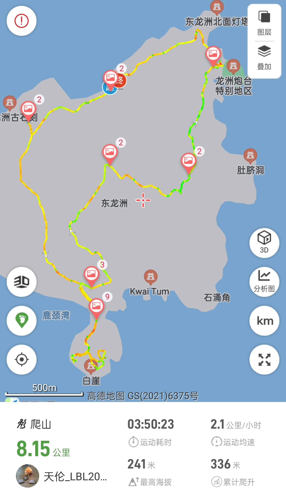

# 香港东龙洲攻略

东龙岛，又名东龙洲，古称南堂。    
环岛路线约8+公里，难度中等，岛上小灌木多，穿长裤防止划伤，遮阴少，注意防晒，海边礁石很滑，防滑鞋必备

## 装备

- 购买户外保险（可选，但推荐）

支付宝搜索户外保险，自行选购保一天一般1-2块钱  

- 身份证，港澳通行证（含有效签注），100-200现金港币乘船和补给

香港地铁直达可刷支付宝乘车码  
轮渡和岛上商店需要现金或八达通  

- 手机，充电宝，香港流量卡或漫游流量包
- 2-3L水，零食干粮若干（中午一顿），垃圾袋(垃圾带走，无痕户外)
- 防晒服，长裤，帽子，遮阳伞，墨镜，防晒霜，<strong style="color:red;">驱虫喷雾，防滑鞋</strong>，一次性雨衣(视天气情况而定)

<strong style="color:red;">环岛路线灌木较多，穿长裤，双肩背包</strong>

## 去程

- 方案1:**福田口岸出发**   

福田口岸过关   

方案1a：**西湾河筲箕湾码头坐船**  
1h16min 57hkd  
东铁线金钟方向：落马洲地铁站 --> 金钟站  
港岛线柴湾方向： 金钟站内换乘 --> 西湾河站A口  
导航至筲箕湾避风塘码头(嘉亨湾公交总站旁边, 步行6min)   

方案1b：**三家村码头坐船**  
1h15min 52hkd  
东铁线金钟方向：落马洲地铁站 --> 九龙塘  
观塘线调景岭方向： 九龙塘站内换乘 --> 油塘地铁站A2口   
导航至三家村轮渡码头(步行14分钟)   

- 方案2：**深圳北出发** 

高铁： 深圳北 --> 西九龙 

方案2a：**三家村码头坐船**  
45min 10.5hkd   
屯马线： 柯士甸站乌溪沙方向 --> 钻石山站   
观塘线调景岭方向： 钻石山站内换乘 --> 油塘地铁站A2口   
导航至三家村轮渡码头(步行14分钟)   

方案2b：**西湾河筲箕湾码头坐船**  
41min 16hkd   
荃湾线中环方向： 佐敦地铁站A口 --> 金钟站   
港岛线柴湾方向： 金钟站内换乘 --> 西湾河地铁站A口   
导航至筲箕湾避风塘码头(嘉亨湾公交总站旁边, 步行6min)  

### 西湾河 - 东龙岛航线信息

| 项目             | 详情                                           |
|------------------|------------------------------------------------|
| **承运**       | 碧海船务有限公司 2337 6568                             |
| **登船地点**     | 筲箕湾避风塘十号梯台、东龙洲公众码头、东龙洲北码头 |
| **来回程收费**   | **乘客 (来回程收费)** 成人：¥55 东龙岛居民、5至12岁儿童：¥40 |
| **单程收费**     | **乘客 (单程每次收费)** 65岁或以上人士及伤残人士：¥27.5 60至64岁持乐悠卡人士：¥27.5 由东龙岛往西湾河：¥30 |
| **服务时间**     | 每周六、周日及公众假期（农历年初一及初二除外） |
| **西湾河开出时间** | 上午 9:00、9:45、10:30、11:15、12:00、 下午 12:45、1:30、3:15、4:45 |
| **东龙岛开出时间** | 上午 9:45、10:30、11:15、12:00、 下午 12:45、2:30、4:00、4:45、5:30 |
| **船只编号** | A3573, A4003, A4033|

### 三家村 - 东龙岛航线信息

| 项目          | 详情                                                                                                        |
| ----------- | --------------------------------------------------------------------------------------------------------- |
| **承运**      | 珊瑚海航运有限公司 2368 8885                                                                                       |
| **登船地点**    | 三家村渡轮码头、东龙洲公众码头                                                                                           |
| **收费**      | **乘客 (单程每次收费)** 东龙岛居民：¥0 （持有东龙岛居民证，可享免收费优惠至2027年11月30日） 非东龙岛居民（包括65岁或以上长者及伤残人士）：¥22.50 3岁以下儿童：免费 |
| **注意**      | 乘客在购买去程票时必须一并购买回程票                                                                                        |
| **服务时间**    | 只在星期六、星期日及公众假期提供服务                                                                                        |
| **三家村开出时间** | 上午 8:20、9:25、10:40、11:50 下午 1:20、2:35、3:45、4:55                                                        |
| **东龙岛开出时间** | 上午 8:50、10:00、11:10 下午 12:25、2:00、3:10、4:20、5:40                                                       |
| **船只编号**    | A3273、A3473                                                                                               |

## [徒步路线](https://www.2bulu.com/track/track_detail.htm?trackId=RTdbL8E7lfzp/R2KBg5Tzw==)

  

### 推荐打卡景点

- **北线景点**：
东龙洲灯塔  
攀岩区域  
石滩  
崖下秘洞  
喷水岩  
东龙洲营地  

- **南线景点**：  
东龙洲石刻  
白崖  
南堂顶  
停机坪   
肚脐洞  
## 返程

建议提前半小时去码头等船  
西湾河或三家村码头均可，随后按照原交通路线返回
 