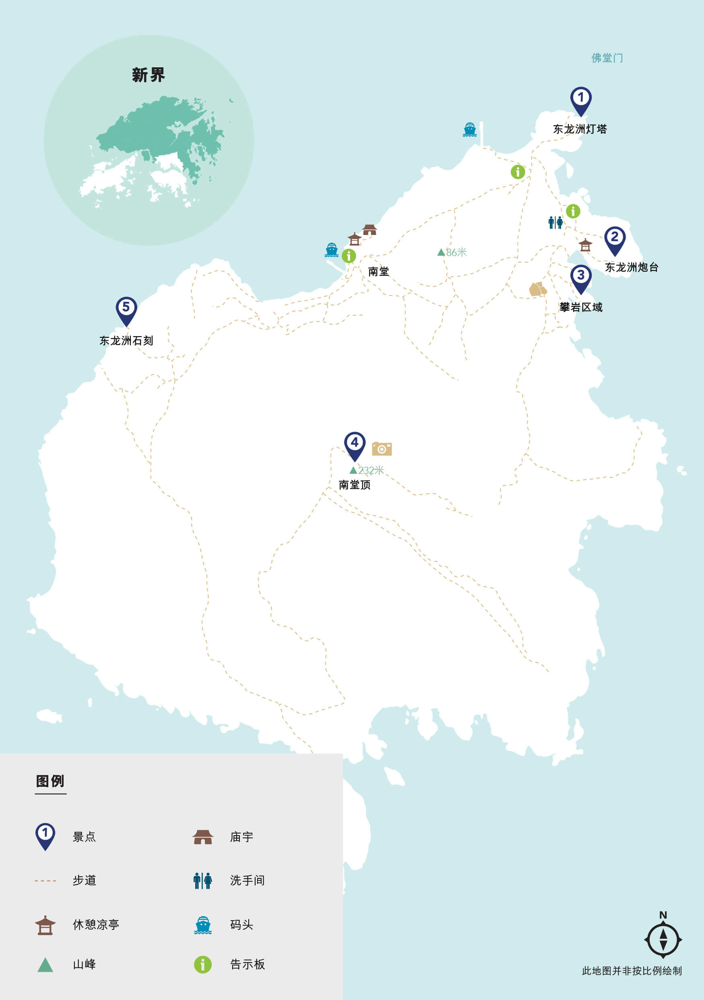

# 香港东龙洲攻略

东龙岛，又名东龙洲，古称南堂。据说东龙之名源于天然形成的海蚀洞。岛上建有一座已有三百多年历史的炮台及古石刻。现时东龙岛已成为烧烤、露营、攀崖及放风筝胜地。

## 装备

- 购买户外保险（可选，但推荐）

支付宝搜索户外保险，自行选购保一天一般1-2块钱  

- 身份证，港澳通行证（含有效签注），少量现金港币以备不时之需

香港地铁直达可刷支付宝乘车码  

- 手机，充电宝，香港流量卡或漫游流量包
- 2-3L水，零食干粮若干（中午一顿），垃圾袋(垃圾带走，无痕户外)
- 防晒服，长裤，帽子，遮阳伞，墨镜，防晒霜，<strong style="color:red;">手套，驱虫喷雾，防滑鞋</strong>，一次性雨衣(视天气情况而定)

<strong style="color:red;">绳索攀岩路段需要手脚并用，推荐携带背包方便腾出手来</strong>

## 去程

- 方案1:福田口岸出发

福田口岸过关  

落马洲地铁站 --> 金钟站  

港岛线到西湾河站A口， 导航至筲箕湾避风塘码头(嘉亨湾公交总站旁边)

观塘线或将军澳线坐到油塘站A2口，导航至三家村轮渡码头

- 方案2：香港市区出发

导航到南港岛线利东地铁站B口下车

- 方案3：深圳北出发

高铁： 深圳北 --> 西九龙  
屯马线： 柯士甸站乌溪沙方向 --> 红磡站
东铁线： 红磡站金钟方向 --> 金钟站
南港岛线： 金钟站海怡半岛方向 --> 利东站
港铁南港岛线利东B口

## 徒步路线

  

东龙洲灯塔
南堂顶
东龙洲石刻
攀岩区域

## 返程

美食区域： 鲤鱼门三家村

