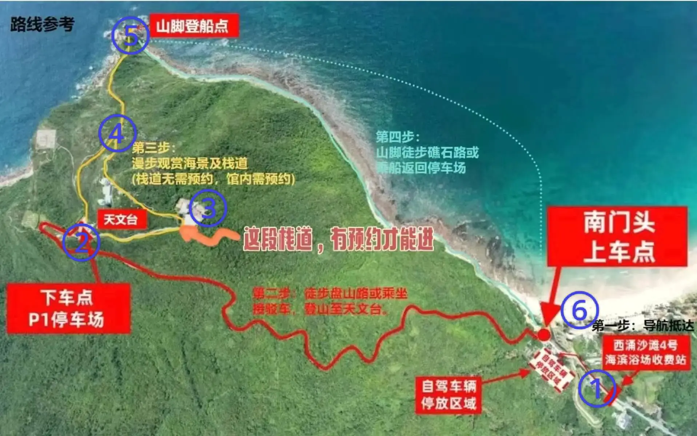
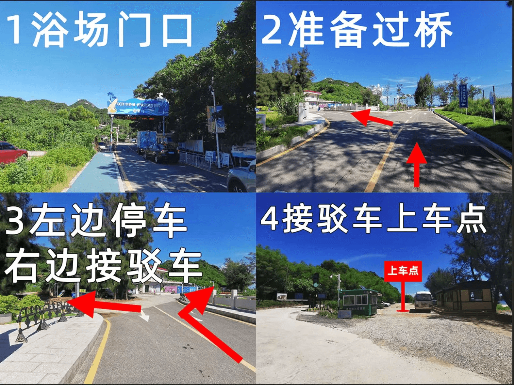
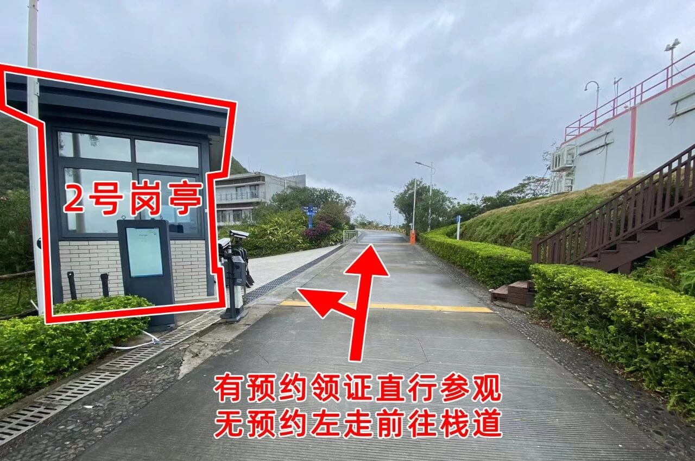
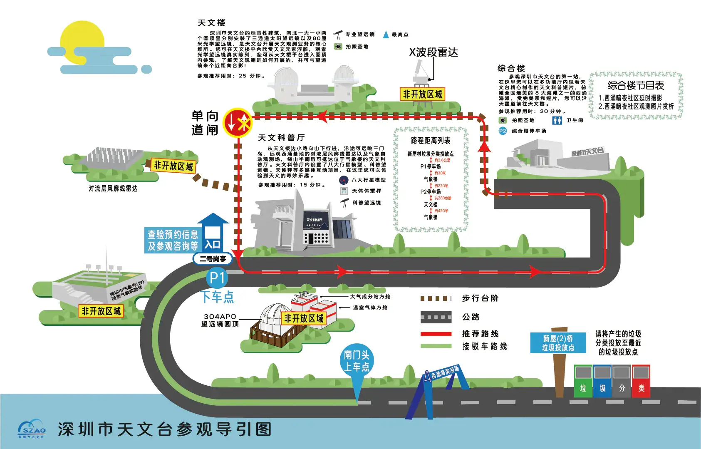

# 深圳天文台一日游攻略

深圳天文台，中国最美海岸线之一。 海天栈道是其中的精华，栈道后半段不用预约，前半段需要在“深圳天文”微信公众号上预约， 周末和节假日栈道后半段游客巨多，强烈推荐尝试预约天文台。  
预约后的区别在于可以登顶天文台，参观展厅，向下走完整的栈道，且因为预约门槛，天文台人少，更容易出片。  

- 预约指南

每周一上午10点释放当周的预约名额，除周一闭馆外其他时段均可预约，上午9:00-12:00，下午14:30-17:30，闭馆提前半小时停止入场。  
周一10点前，先填好个人预约信息，可添加同行人帮朋友一起抢，准点刷新选择想要的时段，点击提交即可  
预约十分火爆，堪比春运抢票，没预约上也可前往走栈道后半段。  

## 装备

- 购买户外保险（可选，但推荐）

支付宝搜索户外保险，自行选购保一天一般1-2块钱  

- 身份证(已预约的话需要带上)， 手机，充电宝
- 2-3瓶水， 水果，零食，干粮若干(作为午餐)， 垃圾袋
- 防晒伞，防晒衣，长裤，帽子，墨镜，手套，防晒霜，扇子，驱虫喷雾，软底登山鞋，拖鞋（如有需要玩水）

7月气温高，紫外线强，防晒请务必“武装到牙齿”，衣服推荐选择亮色，比较出片

## 市内去程

- 非公共交通

推荐自驾，或报一日团。导航地点西冲沙滩4号停车场  
因为大鹏半岛节假日或周末比较堵，无论是自驾一日团还是公共交通出行，均需早起，避开拥堵时段。(前一天晚上住西冲沙滩附近的，当我没说)  
强烈推荐一日团，价格40~70之间往返大巴包车，省时间  
成功预约上了天文台的自驾游客，可根据天文台的指引免费停车一天。

- 公共交通

TODO: 

## 徒步路线

- 路径概览

西冲沙滩4号停车场 --> 天文台2号岗亭 --> 天文台(需预约) --> 海天栈道 --> 海边礁石 --> 西冲沙滩

<picture>
  <source srcset="https://cdnjson.com/images/2024/07/10/mainMap.webp"/>
  
</picture>

- 路径详解

1. 西冲沙滩4号停车场

徒步起点，附近有厕所，可选择盘山公路徒步上山去往2号点(耗时约0.5~1小时)。也可选择摆渡车10块(车程8分钟，但遇人多时需要排队)  
<strong style="color:red;">全程除3号点外无厕所</strong>  

<picture>
  <source srcset="https://cdnjson.com/images/2024/07/10/node01.png"/>
  
</picture>

2. 天文台2号岗亭

摆渡车下车点，已预约由此去3号点天文台，未预约从旁边栈道绕行去4号点栈道后半段  
注意预约截止时间提前半小时停止入场， 需11:30或17:00前抵达

<picture>
  <source srcset="https://cdnjson.com/images/2024/07/10/node02.jpg"/>
  
</picture>

3. 天文台(需预约)

天文台内有厕所， 可参观展厅，天文望远镜，以及栈道前半段，最佳打卡点

<picture>
  
</picture>

4. 海天栈道

打卡点，沿栈道下行至海边

5. 海边礁石

栈道末端，左手边的打卡点不容错过。  
此处可向右沿着海边徒步至6号点西冲沙滩(耗时1~2小时)  
也可乘坐快艇(50左右一人)直接返回西冲沙滩  
乘坐快艇一定要问好下船点，以防被坑  

6. 西冲沙滩

此处可买票进入沙滩，也可以导航直接返回西冲沙滩4号停车场准备返程

## 返程

报团的按导游集合点返程  
自驾的建议早点出发，返程路上也会很堵，(17:00出发，21:40才抵达的市区)

- 公共交通

TODO:
