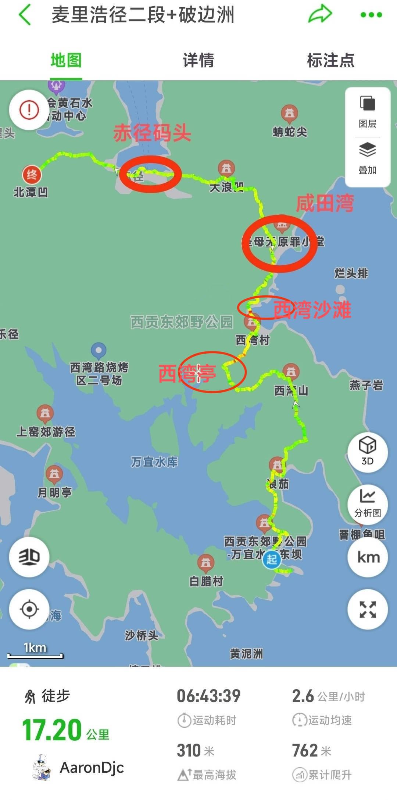
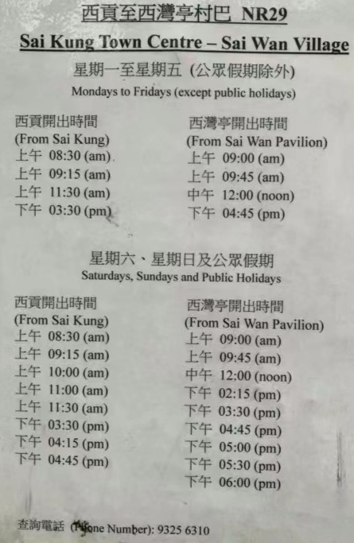
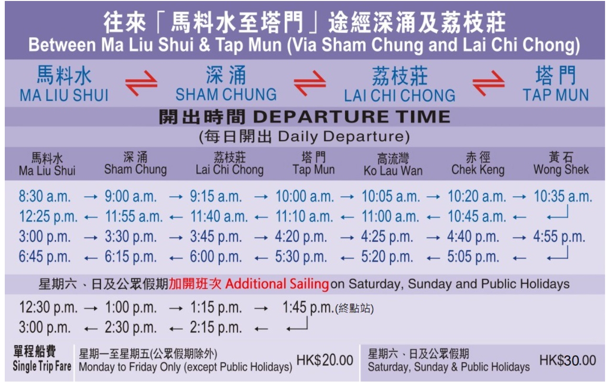

# 破边洲+麦理浩径二段

## 装备

- 购买户外保险（可选，但推荐）

支付宝搜索户外保险，自行选购保一天一般1-2块钱  

- 身份证，港澳通行证（有效签注），港币300~400现金

香港地铁可刷支付宝乘车码， 大巴、小巴大部分仅支持现金(不找零)或八达通  
打车，补给点等需要现金， 补给点的水都是20起  

- 手机，充电宝，香港流量卡或漫游流量包
- 3-4L水，零食干粮若干，垃圾袋
- 防晒服，长裤，帽子，墨镜，防晒霜，驱虫喷雾，登山鞋， 一次性雨衣(视天气情况而定)

如有需要玩水，建议携带拖鞋，纸巾或一次性毛巾，<strong style="color:red;">附近没有救生员，安全起见不要下海游泳</strong>

## 市内去程：

- 打车方案（人多推荐, 省时间，与公共交通价格差不多）

福田口岸8:00集合过关  
4人一组打车到万宜水库东坝，路程不堵车的情况下1h左右，加过关和排队，保守估计10:00抵达  
红色taxi到全市，但比绿色taxi贵点，绿色仅到新界  
早到可节省排队时间 300~350hkd 左右 人均80+hkd  
沟通时也可说：新界的东坝  

- 公共交通

过关落马洲地铁站 --> 沙田站 --> 巴士总站坐289R --> 北潭涌换乘 小巴9A --> 万宜水库东坝

## 徒步路线：破边洲+麦理浩径二段

尽量10点抵达万宜水库，<strong style="color:red;">不一定要走完全程，但破边洲、浪茄湾是精华必去</strong>， 后续节点根据体力和时间决定那个点撤离

- 路径概览

万宜水库东坝 --> 破边洲 --> 返回东坝 --> 浪茄湾 --> 西湾山 --> 吹筒坳(近西湾亭) --> 西湾沙滩 --> 咸田湾 --> 赤径码头 --> 北潭凹  

  

- 路径详解

1. 万宜水库东坝：

徒步起点，有厕所，预计10:00开始  
前往破边洲有两条路线：  
官方路线: 较安全，需沿着台阶上下坡，大约耗时两小时，对体力要求较高。;  
小路：开始时是下坡，有许多巨锚形防波堤，直走至尽头，然后越过铁网，横穿山体。不要选择带绳子的上升路线。沿着唯一的上山路走，大约10分钟即可到达破边洲，往返约一小时，但存在一定的危险性。

2. 破边洲

打卡点，拍拍拍，1-3预算时长2h（含拍拍拍时长）
部分区域封闭，但不影响通行，扶梯相对好走
近路和观景台被封闭，走官道(有台阶的大路，但要上下坡)

3. 返回东坝

返回东坝开启麦理浩径二段

4. 浪茄湾

打卡点，拍拍拍

5. 西湾山

海拔314米，高且陡，无遮挡，野猪出没，注意防晒，全程最难点 预算1.5h

6. 西湾亭

第一个撤离点，视体力和到达时间情况，可提前撤离，路线参见返程

7. 西湾沙滩

西湾营地可补给水和食物，有厕所，也可通过私人快艇撤离

8. 咸田湾

有营地可补给，有厕所，也可快艇撤离。

9. 赤径码头

有补给和厕所，推荐在此处乘轮渡撤退，约1.5h到达马料水码头，可欣赏海上日落

10. 北潭凹

麦理浩径二段终点，可乘坐巴士离开，抵达不要太晚留意末班车时间

## 返程

返程根据实际体力和剩余时间，按到达顺序分以下几个撤退点

- 万宜水库：9A返回北潭涌 --> 289R到沙田地铁站--> 落马洲地铁站 --> 过关返深

起点返回，嗯。。。 最轻松的路线，1-->2-->3-->4-->3

- 西湾亭：小巴NR29（末班16:30） --> 西贡码头 --> 299x大巴到沙田地铁站 --> 落马洲地铁站 --> 过关返深

PS: 西贡码头也可坐1A到彩虹地铁站  
如遇时间过晚也可打车，但此地信号不太好，容易遇上宰客黑的士（正常价格为350hkd左右）  
的士平台电话（座机）： 27296600 | 27291199，或高德打车  

NR29时刻表:  

- 咸田湾快艇：私人快艇（180hkd，末班17:30） --> 西贡码头 --> 299x大巴到沙田地铁站 --> 落马洲地铁站 --> 过关返深

快艇名片：  

- 赤径轮渡：赤径轮渡（30hkd） --> 马料水码头 --> 步行15分钟到大学地铁站 --> 落马洲地铁站 --> 过关返深

- 北潭凹

289R（25hkd 末班18:45） --> 沙田地铁站 --> 落马洲地铁站 --> 过关返深  
94路 --> 西贡码头 --> 299X到沙田市中心坐沙田地铁站 -->  落马洲地铁站 --> 过关返深  

