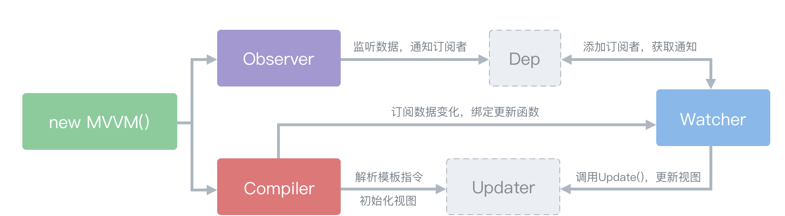
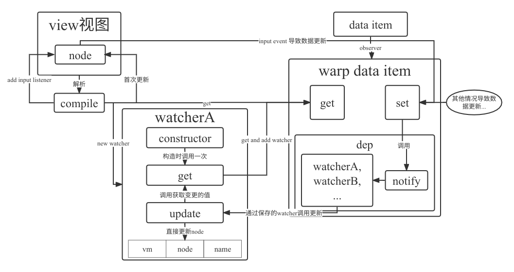

# vue2进阶知识汇总整理

## 双向绑定与响应式

- 响应式原理  

vue2通过数据劫持，利用`Object.defineProperty(target, key, descriptor)`方法，设置get，set拦截读取和设置操作，通过发布订阅模式通知更新实现响应式  
Vue中双向数据大致可以划分三个模块：Observer、Compile、Watcher，如图：  
  

- 数据劫持

>Object.defineProperty(target, key, descriptor)参数描述：  
>target目标对象  
>key目标对象的属性  
>descriptor属性描述符，格式如下：  

```js
{
  value: undefined, // 属性的值
  get: undefined,   // 获取属性值时触发的方法
  set: undefined,   // 设置属性值时触发的方法
  writable: false,  // 属性值是否可修改，false不可改
  enumerable: false, // 属性是否可以用for...in 和 Object.keys()枚举
  configurable: false  // 该属性是否可以用delete删除，false不可删除，为false时也不能再修改该参数
}
var obj = { name:'Vue是响应式吗？' }
Object.defineProperty(obj, "name",{
    get(){       
        console.log("get方法被触发");
        dep.depend(); // 这里进行依赖收集
        return value;
    },
    set(val){       
        console.log("set方法被触发");
        value = newValue;
        // self.render();
        dep.notify();  // 这里进行virtualDom更新，通知需要更新的组件render
    }
})
var str = obj.name;         // get方法被触发
obj.name = "Vue是响应式的";  // set方法被触发
```

- 发布订阅

Observer对象利用Object.defineProperty()方法对数据进行监听，并借助dep对象添加订阅者，或发布更新，而watcher对象即为订阅者，初始化时利用get触发Observer中的get并强制将自己添加到dep对象中，完成订阅，当收到订阅消息后dep依次执行存储的watcher对象中的更新函数

每个data声明的属性，都拥有一个的专属依赖收集器Dep.subs，依赖收集器subs保存的依赖是watcher，watcher可进行视图更新

至此当数据变动时，会触发set方法，而set中通过dep.notify方法遍历watcher数组，并调用其update方法更新视图完成响应式  
而当视图发生更新时，仅需在compile增加input事件监听，完成数据修改即可

流程图如下：  
  

::: tip 简单手写实现演示如下
<iframe id="reactive-demo" height=100 width=100% frameborder=0 src="/demo/reactive.html"></iframe>

[代码](./reactive.md)  
:::

[参考文档1](https://blog.nowcoder.net/n/8517450fe4fd4220b4078f9c61e42ec1)  
[参考文档2](https://segmentfault.com/a/1190000023824423)  

## computed原理

computed属性在响应式的基础上增加了缓存，当computed捕获到依赖变化时会将缓存控制位dirty置为true，重新读取computed时会执行get进行重新计算，并将计算值进行缓存，计算完成后翻转dirty状态，方便再次读取时使用缓存  
computed会让依赖的data数据项收集到computed的watcher，从而对应data数据项变化时，会同时通知computed和依赖computed(页面等)的地方。  

1. 页面更新，读取computed的时候，Dep.target会设置为页面watcher，从而让computed的watcher中的get方法收集到页面watcher的dep对象。
2. computed被读取，createComputedGetter包装的函数触发，第一次会进行计算。  
computed-watcher.evaluted被调用，进而computed-watcher.get被调用，Dep.target被设置为computed-watcher，旧值页面watcher被缓存起来。  
3. computed计算会读取data，此时data就收集到computed-watcher。
也就是computed-watcher也会被保存到data的依赖收集器dep中（用于下一步）。  
computed计算完毕，释放Dep.target，并且Dep.target恢复上一个watcher（页面watcher）。
4. 在computed.watcher.get退出之前，手动watcher.depend，让data再收集一次Dep.target，于是data又收集到之前缓存了的页面watcher。

综上，此时data的dep依赖收集器=[computed - watcher，页面-watcher]
data改变，正序遍历通知，computed先更新，页面再更新。  
data改变首先调用computed - watcher的update方法，将dirty更改为true，表示缓存已无效，注意：此时不会重新计算。
在调用computed - watcher.update之后，再调用 页面-watcher，通知页面更新。页面更新时，会重新读取computed的值。此时，由于dirty=true，执行computed - evaluate方法，重新计算computed。  

[参考文档](https://zhuanlan.zhihu.com/p/357250216)

## watch监听原理

接上文响应式基础简单理解：  

- 监听的数据改变的时，watch 如何工作

watch在一开始初始化的时候，会读取一遍监听的数据的值，于是，此时那个数据就收集到watch的watcher了  
然后给watch设置的handler，watch会放入watcher的更新函数中  
当数据改变时，通知watch的watcher进行更新，于是你设置的handler就被调用了  

- 设置 immediate 时，watch 如何工作

当设置了immediate时，就不需要在数据改变的时候才会触发。  
而是在初始化watch时，在读取了监听的数据的值之后，便立即调用一遍你设置的监听回调，然后传入刚读取的值  

- 设置了deep时，watch如何工作

因为读取了监听的data的属性，watch的watcher被收集在这个属性的收集器中  
当设置了deep时  
在读取data属性的时候，发现设置了deep而且值是一个对象，会递归遍历这个值，把内部所有属性逐个读取一遍，于是属性和它的对象值内每一个属性都会收集到watch的watcher  

## AST(abstract syntax tree)抽象语法树

将字符串转换为可利用的树状数据结构，为后续的DOM API和js处理提供支持，过滤不安全的DOM结构，便于浏览器渲染

### 预设算法题

解码字符串压缩算法，如：`3[a]`复原为`aaa`,`2[1[a]2[b]]`复原为`abbabb`  

- 思路：利用栈数据结构存入重复频次，缓存栈存入字符容器，遍历字符串，每次入栈数字则缓存栈一起入栈空字符串容器，遇到字符则将字符放入缓存栈顶容器内，若遇到`]`号，则出栈频次，出栈缓存，并将出栈的缓存字符串冲入频次数后添加到新的栈顶容器中
  遍历结束后将缓存栈顶(也是最后一个容器)中的字符串重复最后一个频次数返回即可

- js实现

```js
class Solution {
  static repeatStr(str) {
    let p = 0;
    let stack = [], cache = [];
    let rest = str;
    let regNum = /^(\d+)\[/; // 匹配并捕获数字开头的正括号模式
    let regWord = /^(\w+)\]/; // 匹配并捕获字符开头的反括号模式
    while(p < str.length - 1) {
      rest = str.substring(p); // 跟随p指针每次返回剩余的字符串
      if(regNum.test(rest)){ // 匹配到数字模式
        let times = rest.match(regNum)[1]; // 提取数字
        stack.push(Number(times)); // 字符转数字入栈
        cache.push(''); // 使用空字符串作为容器压入缓存栈中
        p += times.length + 1; // 移动指针数字长度外加'['长度
      } else if (regWord.test(rest)){ // 匹配到字符模式
        let word = rest.match(regWord)[1]; // 提取字符
        cache[cache.length - 1] = word; // 将字符放入栈顶容器
        p += word.length; // 移动指针字符长度
      } else if (rest[0] == ']') { // 匹配到反括号
        let times = stack.pop(); // 出栈频次
        let word = cache.pop(); // 出栈字符容器
        // 将出栈字符word重复times次放入新的栈顶
        cache[cache.length - 1] += word.repeat(times);
        p++ // 移动指针']'长度
      }
    }
    return cache[0].repeat(stack[0]); // 遍历结束后还剩最后的容器和频次
  }
  static test() { // 测试用例
    let data = '03[02[3[a]1[b]]4[d]]';
    console.log(Solution.repeatStr(data)==='aaabaaabdddd'.repeat(3));
  }
}
Solution.test();
```

### html解析

对html的AST解析思路与上述预设算法基本相同，利用栈的先进后出特性对标签进行配对和对中间结果进行缓存整理  
使用正则表达式进行词法分析

```js
class Solution {
  static parse(str) {
    let p = 0;
    let rest = '';
    let startRegExp = /^\<([a-z]+[1-6]?)(\s[^\<]+)?\>/; // 开始标记;
    let endRegRxp = /^\<\/([a-z]+[1-6]?)\>/; // 结束标记
    let wordRegExp = /^([^\<]+)\<\/[a-z]+[1-6]?\>/; // 结束标记结束前的文字;
    let stack = [];
    let cache = [ { 'children': [] } ]; // 初始容器中预设children属性
    while(p < str.length - 1) {
      rest = str.substring(p);
      if(startRegExp.test(rest)){ // 处理开始标签
        let tag = rest.match(startRegExp);
        let attrsString = tag[2]; // 提取标签中的属性
        tag = tag[1];
        stack.push(tag); // 入栈标签名
        cache.push({
          'tag':tag, 'children':[], 'attrs': Solution.parseAttrs(attrsString) // 解析标签中的属性
        })
        const attrsLength = attrsString != null ? attrsString.length : 0;
        p += tag.length + 2 + attrsLength; // 移动指针，'<>'长度为2所以加2
      } else if (endRegRxp.test(rest)){ // 处理结束标签
        let tag = rest.match(endRegRxp)[1];
        let pop_tag = stack.pop();
        if(tag === pop_tag){ // 检查结束标签是否与栈顶弹出的标签相同，相同则继续处理
          let pop_arr = cache.pop();
          if(cache.length > 0) { // 将弹出的标签对象添加到新栈顶的children属性上
            cache[cache.length - 1].children.push(pop_arr);
          }
        } else { // 不同则抛出语法错误
          throw new Error(pop_tag + '标签未封闭!!');
        }
        p += tag.length + 3; // 移动指针 '</>'长度为3，需要额外移动3个单位
      } else if (wordRegExp.test(rest)) { // 处理文本节点
        let word = rest.match(wordRegExp)[1];
        if(!/^\s+$/.test(word)) { // 若文本节点不为空，则进行处理
          cache[cache.length - 1].children.push({ // 对于文本节点直接加入栈顶children属性中即可
            'text': word, 'type':3
          });
        }
        p += word.length; // 移动指针
      }else{
        p++;
      }
    }
    return cache[0].children[0]; // 遍历结束后返回最初容器中的内容
  }
  static parseAttrs(str){ // 解析标签的属性字符串
    if(str == undefined) return [];
    let inQuotes = false; // 是否处于引号中的标志位
    let point = 0; // 断点位置指针
    let result = [];
    for(let i =0; i < str.length; i++){
      let char = str[i];
      if(char == '"'){ // 若遇到引号则将引号中标志位进行翻转，保证引号内为true
        inQuotes = !inQuotes; // 保证属性值中出现空格不会出错，但出现引号则会有问题
      } else if (char == ' ' && !inQuotes){ // 发现空格且不在引号内则断点至当前位置需要处理
        if(!/^\s*$/.test(str.substring(point, i))) { // 断点至当前位置子串不为空则处理
          result.push(str.substring(point, i).trim()); // 直接取的key="value"键值对
          point = i; // 移动断点指针继续遍历
        }
      }
    }
    result.push(str.substring(point).trim()); // 将最后的键值对推入结果数组
    result = result.map(item => { // 将key="value"键值对进行分离形成新数组
      let cache = item.match(/^(.+)="(.+)"$/);
      return {
        name: cache[1],
        value: cache[2]
      };
    });
    return result;
  }
  static test() {
    var templateString = `<div>
      <h3 class="aa bb cc" data-n="7" id="mybox">你好</h3>
      <ul>
        <li>A</li>
        <li>B</li>
        <li>C</li>
      </ul>
    </div>`;
    console.log(Solution.parse(templateString));
  }
}
Solution.test();
```

## 模板引擎mustache

模板引擎用于将数据变为视图，如：  

- 模板

```html
<div>
  <ul>
    {{#students}}
    <li class="myli">
      学生{{name}}的爱好是
      <ol>
        {{#hobbies}}
        <li>{{.}}</li>
        {{/hobbies}}
      </ol>
    </li>
    {{/students}}
  </ul>
</div>
```

- 数据

```js
let data = {
  students: [
    { 'name': '小明', 'hobbies': ['编程', '游泳'] },
    { 'name': '小红', 'hobbies': ['看书', '弹琴', '画画'] },
    { 'name': '小强', 'hobbies': ['锻炼'] }
  ]
}
```

- 转换为

```html
<div>
  <ul>
    <li class="myli">学生小明的爱好是<ol>
        <li>编程</li>
        <li>游泳</li>
      </ol>
    </li>
    <li class="myli">学生小红的爱好是<ol>
        <li>看书</li>
        <li>弹琴</li>
        <li>画画</li>
      </ol>
    </li>
    <li class="myli">学生小强的爱好是<ol>
        <li>锻炼</li>
      </ol>
    </li>
  </ul>
</div>
```

除mustache之外，通过 a) 纯DOM的方法 b) 数组join方法 c) es6的模板字符串等方法也可进行转换  

mustache算法 首先将模板字符串解析分词为 tokens 形式，然后将 tokens 结合数据解析为新的 dom 字符串  
mustache 先于 vue 出现，后来被 vue 所采用，mustache官方[项目地址](https://github.com/janl/mustache.js)  
::: tip 实现简单的mustache
[源码](./mustache.md)
:::

## 虚拟DOM和Diff算法

snabbdom是著名的虚拟DOM库，diff算法的鼻祖，vue源码借鉴了snabbdom，[snabbdom地址](https://github.com/snabbdom/snabbdom)  
虚拟DOM:用JavaScript对象描述DOM的层次结构。DOM中的一切属性都在虚拟DOM中有对应的属性。
snabbdom使用渲染函数(h函数)生成虚拟DOM，通过diff算法将虚拟DOM转换为真实DOM

### h函数

h函数使用解析好的tokens来递归的生成虚拟节点VNode对象，便于后续diff算法比较

### diff算法

新旧节点的key和标签的标签名相同则认为是同一节点，同一个VNode才进行精细化比较，只进行同层比较不进行跨层比较  

- 更新策略：
- TODO

::: tip 简单手写实现演示如下
<iframe id="vDom-demo" height="100px" width="100%" frameborder=0 src="/demo/vDom.html"></iframe>

[源码](./vDom.md)
:::
