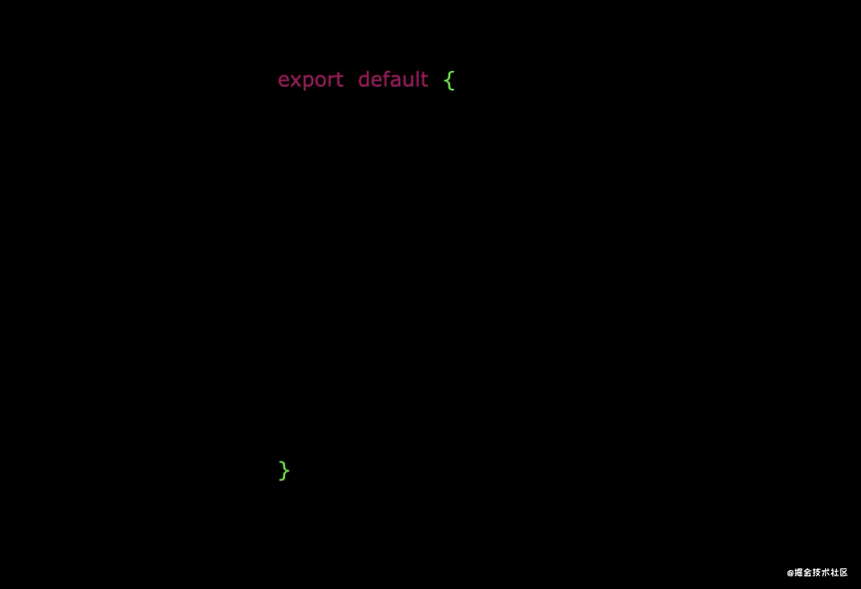
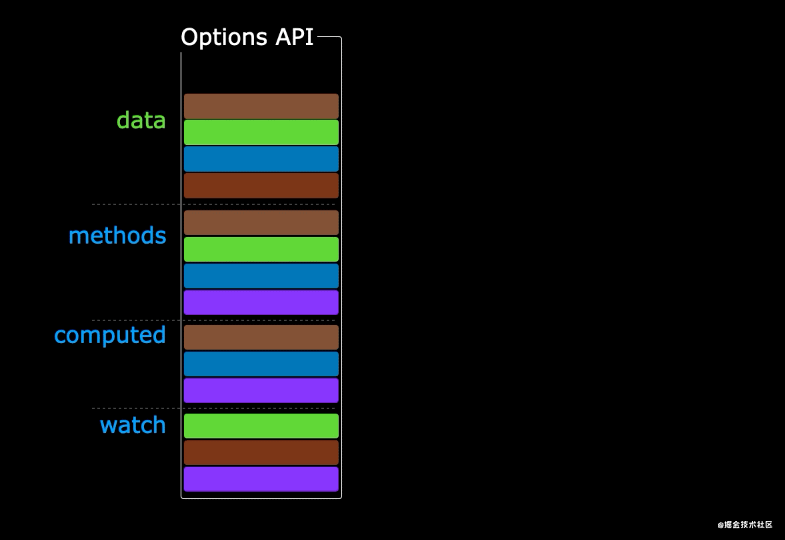

# Vue3快速上手

## 与vue2相比

vue3相对于vue2进行了一次大的升级, 仓库地址[github](https://github.com/vuejs/core)|[官方文档](https://cn.vuejs.org/guide/introduction.html)(ps:搜索栏下方可切换vue3语法风格)  
在语法上vue3目前同时支持选项式api和组合式api两种风格，选项api与vue2中的语法大同小异，但组合式api则是全新的写法，本文将以官方推荐的组合式api展开，浓缩、对比vue2学习vue3的基础用法。  

- 1.性能的提升
  - 打包大小减少41%
  - 初次渲染快55%, 更新渲染快133%
  - 内存减少54%
- 2.源码的升级
  - 使用Proxy代替defineProperty实现响应式
  - 重写虚拟DOM的实现和Tree-Shaking
- 3.拥抱TypeScript
  - Vue3可以更好的支持TypeScript
- 4.新的特性
  - 1. Composition API（组合API）
    - setup配置
    - ref与reactive
    - watch与watchEffect
    - provide与inject
  - 2. 新的内置组件
    - Fragment
    - Teleport
    - Suspense
  - 3. 其他改变
    - 新的生命周期钩子
    - data 选项应始终被声明为一个函数
    - 移除keyCode支持作为 v-on 的修饰符

## 一、创建Vue3.0工程

确保已安装最新版nodejs

### 1.使用 create-vue 创建(推荐方式)

在命令行中运行命令`npm init vue@latest`  
此过程会安装create-vue创建vue3项目，依照命令行提示即可创建项目  
其中推荐启用typescript; Pinia 是用于替换vuex的下一代状态管理库  
项目默认构建工具由webpack换成了基于Rollup的vite构建工具  

### 2.使用 vite 创建

通过模板进行创建`npm create vite@latest <you-vue-app-name> --template vue`  

vite官网：<https://cn.vitejs.dev/guide/>

- 什么是vite？—— 新一代前端构建工具。
- 优势如下：
  - 开发环境中，无需打包操作，可快速的冷启动。
  - 轻量快速的热重载（HMR）。
  - 真正的按需编译，不再等待整个应用编译完成。

## 创建vue应用

在vue2中有个main.js入口文件中导入相关插件与依赖，`new Vue()`的方式创建应用实例，而vue3中需要通过createApp()的方式创建根实例

- vue2的main.js中

```js
import Vue from 'vue';
import App from './App.vue'; // 导入根组件
// import router , store...
// Vue.use() 使用插件
new Vue({
  // router, store
  render:h=>h(App), // 基于根组件创建渲染函数
}).mount('#app') // 挂载到id为app的dom上
```

- vue3的main.(js|ts)中

```js
import { createApp } from 'vue'; // 导入函数用于创建应用实例
import App from './App.vue'; // 导入根组件
const app = createApp(App);
// 通过app.config配置应用级选项，如增加模板语法作用域中能访问的变量
// app.component() // 注册全局组件
// app.use()
app.mount('#app') // 挂载应该在应用配置和资源注册完成后调用
```

## 模板语法

vue3中的模板语法风格与[vue2的](../vue2base.md#模板语法)基本一致;  
模板中支持的表达式将被沙盒化, 只能访问[有限的全局对象](https://github.com/vuejs/core/blob/main/packages/shared/src/globalsWhitelist.ts#L3), 也可以通过`app.config.globalProperties`添加拓展的属性或方法  

## 响应式

此部分对应vue2的data配置项相对应，vue3中使用了es6中的 proxy 对象代替vue2中的 defineProperty 来实现响应式，克服了vue2中操作数组索引和添加新属性等场景响应式丢失等问题  
vue3中的选项式api中的data和methods配置项与vue2中基本一致，但组合式api大有不同，且本质上选项式api是在组合式api基础上实现的  

```vue
<template>
  <div @click="add">{{state.count}}</div>
</template>
<script>
import { reactive } from 'vue'; // 导入reactive函数用于创建响应式对象
export default {
  setup(){
    const state = reactive({count:0});
    // reactive创建的响应式对象state != {count:0}原对象，state时es6中的proxy类型的对象
    function add(){state.count++;} // 相当于method中定义的方法
    return {state, add} // 返回的变量才能在模板中访问
  }
}
</script>
```

在使用构建工具和单文本组件(SFC)的情况下上述js代码通常写作(强烈推荐的写法)  

```vue
<script setup>
  import { reactive } from 'vue';
  const state = reactive({count:0}); // 顶层的导入和声明都可以在同一组件的模板中使用
  function add(){state.count++;}
</script>
```

reactive默认创建深层的响应式，使用shallowReactive函数可以创建只有顶层响应式的对象  
对一个proxy对象应用reactive返回的是proxy对象本身  

响应式是通过对属性对象的访问进行追踪的，因此使用属性赋值`let count = state.count`或解构至本地变量`let {count} = state`, 又或者使用属性传参`fn(state.count)`都会让被赋值的变量不具有响应式，即`count++`不会响应式更新`state.count`  
同样对state整体赋值 `state = {count:0}`, 会让state指向另一个对象,从而丢失对原先的proxy对象的引用, 后续对state操作将不具有响应式  

另外reactive仅对对象类型有效，对string、number、boolean等原始类型无效  
vue中引入了`ref`来解决原始类型响应式的问题, 使用方法同reactive, ref将入参包装为一个带有value属性的Ref对象, 如果入参为对象类型，则会调用reactive方法挂载到Ref对象的value属性上  
ref和reactive生成的对象在解构、传参、赋值时的响应式丢失情况相同，即传递对象本身，被赋值的变量响应式被保留，但传递普通属性，则响应式丢失  

```vue
<script setup>
  import { ref, reactive } 'vue';
  const count = ref(0);
  console.log(count.value); // setup作用域中count为{value:0}对象，访问其值需要用.value
  let state = ref({count:0});
  function add(){ // 操作对象时先使用value，再访问属性
    state.value.count++;
  };
  function stop(){state = {count:0};}; // 同样改变state引用的对象会导致响应式丢失
  state.value = {count:9} // 响应式替换
  // let {count} = state // 这种方式解构 count 为 undefined
  let {count} = state.value // 这种方式解构count无响应式

  const data = reactive({count:ref(0)})
  console.log(data.count) // 深层的reactive响应式对象中嵌套ref，则对应ref会自动解包，无须data.count.value访问
  // 当ref作为响应式的数组、map等集合类型的元素访问时则不会自动解包
  const dataArr = reactive([ref('list')]);
  console.log(dataArr[0].value);
</script>
<template>
  <!-- 模板中使用顶层属性count会自动解包，不需要.value
   对于非顶层Ref对象，模板表达式仅为简单取值时才会进行自动解包，其他情况会被渲染为Object -->
  <button @click="add">{{count}},state Count: {{state.count}}</button> 
  <button @click="stop">阻断响应式</button>
</template>
```

## 计算属性computed

与vue2中基本一致，组合式api写法:

```vue
<script setup>
import { ref, computed } from 'vue'
const name = ref('Join');
const id = ref(123456);
const nameNumber = computed({ // 返回的将是一个Ref对象
  get(){return name.value + '/' + id.value}, 
  set(val) {[name.value, id.value] = val.split('/')}
})
console.log(nameNumber.value)
</script>
```

## 类与样式的绑定

vue2中`<template></template>`中仅支持一个根节点，但vue3中可以有多个根节点，即
因此在自定义的组件中，单根节点时绑定的class与vue2相同，class会被编译到根节点上，多根节点时，需要手动通过`$attrs`指定到目标节点上  
其他方面与vue2中基本一致  

```vue
<template>
  <div></div>
  <div></div>
</template>
```

## 指令

常用内置指令与vue2中基本一致，参见vue2中[指令](../vue2base.md#指令)  
自定义指令则略有不同, 除`<script setup>`形式，其他情况指令的注册均需通过directives选项  
这点与vue2类似，全局注册则是通过`app.directive()`

```vue
<script setup>
// 任何以v开头的驼峰式命名变量都可以被用作一个自定义指令，在模板中则可改为kebab-case的写法使用
const vFocus = { mounted: (el) => el.focus() } //在模板中启用 v-focus
</script>
<template>
  <input v-focus />
</template>
```

指令的回调函数(hook)则与vue2中不同，vue3中的指令定义对象hook均为可选

```js
const myDirective = {
  // 在绑定元素的 attribute 前或事件监听器应用前调用
  created(el, binding, vnode, prevVnode) {
    // el为指令绑定到的元素，可操作DOM
    // vnode 绑定元素的底层VNode
    // prevNode 上次渲染中绑定的VNode，仅在beforeUpdate, updated中可用
    // binding参数较为复杂，见代码下方
  },
  // 在元素被插入到 DOM 前调用
  beforeMount(el, binding, vnode, prevVnode) {},
  // 在绑定元素的父组件及他自己的所有子节点都挂载完成后调用
  mounted(el, binding, vnode, prevVnode) {},
  // 绑定元素的父组件更新前调用
  beforeUpdate(el, binding, vnode, prevVnode) {},
  // 在绑定元素的父组件及他自己的所有子节点都更新后调用
  updated(el, binding, vnode, prevVnode) {},
  // 绑定元素的父组件卸载前调用
  beforeUnmount(el, binding, vnode, prevVnode) {},
  // 绑定元素的父组件卸载后调用
  unmounted(el, binding, vnode, prevVnode) {}
}
```

- binding参数
  - value, 传递给指令的值`v-your-directive="value"`
  - oldValue, 旧值，仅在beforeUpdate, updated中可用
  - arg, 指令的参数`v-your-directive:arg="value"`
  - modifiers, 修饰符对象如`v-my-directive.foo.bar`，modifiers为`{ foo: true, bar: true }`
  - instance, 使用该指令的组件实例
  - dir 指令的定义对象

简化形式`app.directive('demo', (el, binding) => {})`,传入函数默认为常见的mounted和updated  
在自定义组件上使用时，会总用于组件的根节点，与[透传规则](#入参props)类似，但无法通过`v-bind="$attrs"`来传递给不同的元素  

## 条件渲染

与vue2基本一致

## 列表渲染

列表渲染与vue2中基本一致

## 事件处理

与vue2基本一致

## 表单

与vue2基本一致

## 生命周期

  
vue3的生命周期函数与vue2中大同小异,对比表格如下：  

|调用时机|vue3组合式api|vue3选项式api|vue2|
|-|-|-|-|
|最早调用|setup|无|无|
|组件实例初始化(处理props，事件等)完成之后立即调用|被setup替代|beforeCreate|beforeCreate|
|组件实例处理完所有与状态相关的选项后调用(data,methods等可用)|被setup替代|created|created|
|组件被挂载之前被调用|onBeforeMount()|beforeMount|beforeMount|
|组件挂载完成后执行|onMounted()|mounted|mounted|
|响应式状态变更而更新其 DOM 树之前调用|onBeforeUpdate()|beforeUpdate|beforeUpdate|
|响应式状态变更导致DOM树更新之后|onUpdated()|updated|updated|
|组件实例被卸载/销毁之前调用|onBeforeUnmount()|beforeUnmount|beforeDestroy|
|组件实例被卸载/销毁后调用|onUnmounted()|unmounted|destroyed|

组合式api中的生命周期函数均需import后使用，并且写在setup词法作用域中  
父子组件间的生命周期函数执行顺序参见[vue2生命周期](../vue2base.md#生命周期)

- setup函数的返回值：
  1. 若返回一个对象，则对象中的属性、方法, 在模板中均可以直接使用。
  2. 若返回一个渲染函数：则可以自定义渲染内容。
  3. 使用async setup()或`<script setup>await fun()</script>`的方式会让组件变为异步组件，并返回promise，需要配合内置组件`<Suspense>`使用

## 侦听器watch

```vue
<script setup>
import { reactive, watch, watchEffect } from 'vue'
const obj = reactive({count:0});
const unWatch = watch( // 第一个参数为要侦听的对象，可以取String|Function|Object|Array
  () => obj.count, // 不可直接侦听一个响应式对象的属性值如obj.count，使用函数替换
  async (newCount, oldCount) => {}, // 在vue2中使用箭头函数无法保留上下文
  {
    deep:true, // 绑定响应式对象时默认时深层侦听的，但也可以通过配置deep强制转换为深层侦听
    flush:'post' // 状态变化时，回调调用默认在DOM更新之前，flush选项可指定在DOM更新之后调用
  }, 
)
const url = ref('http://..');
const data = ref(null);
const unWatchEffect = watchEffect(async () => { // watch仅当数据源变化时才会执行
  // watchEffect则可以在创建侦听器时立即执行
  // 如果传入函数产生了副作用effect则，vue会自动分析以依赖，并当依赖发生变化时再次执行回调
  const res = await fetch(url.value); // url.value会被自动加入侦听
  data.value = await res.json();
}, {flush:'post'}) // 同watch，指定了flush选项的watchEffect()别名watchPostEffect()
// 同步的语句中创建的侦听器才会自定绑定到当前组件实例上
unWatch() // 手动停止侦听器
unWatchEffect()
</script>
```

## 模板引用

vue2中通过模板中指定ref="refName"在js中通过this.$refs['refName']的方式访问，在vue3中则不同

```vue
<template>
  <input ref="customName"/>
  <div v-for="n in 10" ref="itemRefs"></div>
  <!-- 也可绑定函数，函数第一个参数el为该组件的引用
  当元素卸载时函数也会被调用一次，此时el=null -->
  <div :ref="(el)={}"></div>
  <!-- 引用setup方式自定义的组件时，仅能访问到子组件通过defineExpose()暴露的属性方法 -->
  <!-- 引用选项式api定义的子组件时则，能获取到子组件的this -->
  <customComponent ref="customComponent"/>
</template>
<script setup>
import {ref, onMounted } from 'vue';
const customName = ref(null); // 定义同名的变量访问ref引用的组件
const itemRefs = ref([]); // 绑定v-for的对应变量为数组，数组并不保证与源数据相同顺序
onMounted(()=>{ // 仅在组件挂载后才能保证访问到模板引用
  customName.value.focus();
  console.log(itemRefs.value);
})
</script>
```

## 组件化开发

组件可类比于html标签或片段，通过组件可将界面UI划分成独立可重用的部分，一个单页应用(包括但不限于VUE)通常是基于组件嵌套的树状结构，组件构成了单页应用的基本单位，并能与[原生web components](https://developer.mozilla.org/zh-CN/docs/Web/Web_Components)相互配合使用  

SFC组件示例：

```vue
<!-- ButtonCounter.vue --> 
<script setup>
import { ref } from 'vue'
const count = ref(0)
</script>
<template>
  <button @click="count++">You clicked me {{ count }} times.</button>
</template>
<!-- 也可写作纯js文件(不推荐) -->
<script>
import { ref } from 'vue'
export default {
  setup() {
    const count = ref(0)
    return { count }
  },
  template: `
    <button @click="count++">
      You clicked me {{ count }} times.
    </button>`
  // 或者 `template: '#my-template-element'`
}
</script>
```

在父组件中引入并使用

```vue
<script setup> // 导入即可直接使用，使用setup()函数时则需要components选项注册
import ButtonCounter from './ButtonCounter.vue' // 此处为局部注册
</script>
<template>
  <h1>Here is a child component!</h1>
  <ButtonCounter />
</template>
```

全局注册方式参见[创建vue应用](#创建vue应用)中的代码注释部分  

### 入参props

```vue
<!-- MyComponent.vue -->
<script setup>
const props = defineProps({ // defineProps()宏无需引入即可使用
  title:String, // 基础类型检查，若指定null或undefined，则会跳过类型检查
  propA:[String, Number], // 多类型，Boolean类型存在特殊的类型转换
  propC:{
    type:String, // 可以时常见的原生构造函数，也可以时自定义的类
    required:true, // 所有的prop默认都是可选的，定义required表明参数必传
    default:'默认值', // 未指定default的props默认值为undefined，Boolean类型则为false
    // default:(rowProps){return {message:''}} 
    // 若为Object或数组类型，则默认值必须从函数中返回
    validator(value){ return ['success', 'warning', 'danger'].includes(value)},
    // 自定义校验规则，函数返回值必须上上述数组中，校验失败在开发模式下会抛出控制台警告
  }
});
// 以对象的形式声明key为prop属性名称,value为其类型的构造函数
// 此处大写String表示字符串包装类构造函数，注意与ts中的小写类型string表示的类型区分开
console.log(props.title);
</script>
<!-- 没有使用setup的需要通过props选项来声明 -->
<script>
export default { // 两种实现方式都是基于props选项
  props: ['foo'], // 也可以以数组形式声明，但以对象形式带有校验效果因此更为推荐
  setup(props){console.log(props.foo)}
}
</script>
<!-- 父组件中 -->
<template>
 <MyComponent :title="reactiveTitle" v-bind="{foo:'解构传参'}"></MyComponent>
</template>
```

为了与Html的attribute对齐props属性名称推荐使用kebab-case的风格  
与vue2中一样父组件模板通过`v-bind:propsKey`的方式向子组件中传入props参数，子组件中不应该直接修改传入的props，vue无法检测子组件到对传入对象、数组等引用类型的修改，且这些修改将反馈到父组件中  

- 透传attribute

对于单根节点组件，未声明的props,emit会自动透传到子组件模板的根节点上, 与vue2中指定`$attrs`和`$listeners`类似，但vue3中只能在模板中访问`$attrs`，并且该变量包含了未声明的props和emits  
通过`export default {inheritAttrs:false}`配置向可禁用attributes继承，并在模板中使用`v-bind="$attrs"`绑定到指定的元素上  

TODO:此处`v-bind`是否会同时绑定监听事件，有待验证

js中使用透传attributes

```vue
<template>
  <SingleRoot v-bind="$attrs"></SingleRoot>
  <!-- <Multi-Root1/> 多根节点时若不指定attrs则会警告
  <Multi-Root2/> -->
</template>
<script setup>
// setup中情况下无法指定inheritAttrs属性，需要额外的<script>标签指定配置
// 也就是说SFC中支持多<script>标签，但注意减少setup和setup()混用，更不能和选项式api混用
import { useAttrs } from 'vue';
const attrs = userAttrs(); // attrs总是反映为最新的透传，但不是响应式对象
</script>
<script>
export default { // 无setup时，attrs被暴露在上下文上
  setup(props, ctx){console.log(ctx.attrs)}
}
</script>
```

### 监听事件

自定义组件的事件使用与vue2中的[自定义事件](../vue2base.md#事件处理)基本一致  
需要补充的是，vue3中自定义组件触发内触发的事件可以通过`defineEmits()`宏进行声明  

```vue
<template>
  <button @click="$emit('increaseBy', params)"></button>
</template>
<script setup>
// setup 下无法想模板中一样使用$emit触发事件，需要使用defineEmits声明后使用
const emit = defineEmits({ // 也支持Array<string> 的方式定义
  submit(payload){return true}, // 对象形式定义支持对触发事件的参数与进行验证
  (e:'change', id:numebr):void, // 配合ts可直接写成函数type的形式
});
// defineEmits只可在setup顶级作用域下使用
emit('submit');
</script>
<script>
export default { // setup()函数情况下则通过emits配置定义，与props类似
  emits:['inFocus', 'submit'],
  setup(props, ctx){ ctx.emit('submit')} // emit被暴露在上下文对象上
}
</script>
```

v-model与v-bind.sync区别及原理见vue2[指令](../vue2base.md#指令)  
在vue3自定义组件中没有响应的model配置项，可通过`defineProps(['modelValue'])`和`defineEmits(['update:modelValue'])`的方式实现，而父组件在使用时`<CustomComponent v-model:modelValue="reactiveValue"/>`，因此vue3也支持自定义组件同时绑定多个v-model  
更多v-model及修饰符相关参见[官方文档](https://cn.vuejs.org/guide/components/events.html)及[vue2指令章节](../vue2base.md#指令)  

监听事件也可透传，详见上一小节，透传  

### 插槽

与vue2基本相同

### 组件间通信

与vue2基本相同

provide/inject 使用示例：

```vue
<script setup>
import { provide, inject, readonly } from 'vue'; // 推荐使用readonly包装provide的值
provide(key:string|Symbol, readonly(value:any)) // 给后代组件提供数据，可多次调用
// 注入父级组件provide的数据
const message = inject(ParentKey:string|Symbol, defaultValue)
// 在setup()中provide/inject都要要保证在同步代码中调用，对注入的数据推荐仅在提供方组件中进行修改
</script>
```

另外app.provide()将在应用层级提供数据

### 动态组件

`<component></component>`与vue2中基本一致

### 异步组件

在大型项目中，某些组件可能是通过服务器加载的，通过`defineAsyncComponent`方法可生成异步组件  
通常情况下异步组件会搭配内置组件`<Suspense></Suspense>`使用

```vue
<template>
  <AsyncComp/>
</template>
<script setup>
import { defineAsyncComponent } from 'vue';
const AsyncComp = defineAsyncComponent(() => {
  // 此处可通过异步请求获取组件或import方式动态导入组件
  return import('./url/yourComponent.vue') // 需要返回Promise对象
}) // 异步组件也可以通过app.component()的方式全局注册
const SafeAsyncComp = defineAsyncComponent({ // 对象配置形式入参
  loader:()=>import('./Foo.vue'), // 加载函数
  loadingComponent: Loading, // 异步组件loading状态下只用Loading组件占位
  delay:200, // 展示组件前的延迟时间, 默认200ms
  errorComponent:ErrorComponent, // 加载失败后展示ErrorComponent
  timeout:3000 // 超时限制，超时后展示ErrorComponent，默认值为Infinity
})
</script>
```

## 组合式函数

组合式函数时vue3中利用组合式api来封装和复用有状态逻辑的函数，如封装跟踪鼠标在当前页面中的位置功能  

```js
// mouse.js
import { ref, isRef, unref, watchEffect, onMounted, onUnmounted } from 'vue';
import { useEventListener } from './event'; // 组合式函数可嵌套其他组合式函数
export function useMouse(url) { // 接收一个参数可以是ref对象
  const x = ref(0) // 被组合式函数封装和管理的状态
  const y = ref(0);
  function update(event) { // 状态更新方法
    x.value = event.pageX
    y.value = event.pageY
  }
  useEventListener(window, 'mousemove', (event) => {
    x.value = event.pageX
    y.value = event.pageY
  })
  const data = ref(null);
  const error = ref(null);
  function doFetch(){ // 异步状态更新方法
    data.value = null; error.value = null; // 初始化状态
    // unref解包可能为ref的值，避免使用url.value访问时与普通对象url访问时的冲突
    fetch(unref(url)).then(r=>r.json()).then(json=>data.value=json).catch(e=>error.value=e);
  }
  // 若url为ref，则启动响应式请求,即外部url变化时更新状态
  if(isRef(url)) watchEffect(doFetch); 
  else doFetch(); // 否则仅请求一次，避免监听器开销
  return { x, y, data, error } // 通过返回值暴露所管理的状态，返回整体为普通对象，方便解构
}
// event.js
import { onMounted, onUnmounted } from 'vue'
export function useEventListener(target, event, callback) {
  // 一个组合式函数也可以挂靠在所属组件的生命周期上来启动和卸载副作用
  onMounted(() => target.addEventListener(event, callback))
  onUnmounted(() => target.removeEventListener(event, callback))
}
```

在组件中使用

```vue
<script setup>
import { useMouse } from './mouse.js'
// 保证在同步代码中调用组合式函数，以保证函数中的生命周期hook、计算属性等能绑定到正确的组件实例上
const { x, y } = useMouse()
</script>
<template>Mouse position is at: {{ x }}, {{ y }}</template>
```

在选项式api中只能通过setup()的方式使用组合式函数，此时可以将setup()看做最早的生命周期函数，函数返回的状态也必须在setup()中返回，以便暴露给this和模板(不推荐的写法)  

- 与vue2比较

vue2中与组合式函数相类似的时mixins配置，vue3为了兼容项目迁移保留了mixins配置但不推荐主动使用  
与mixins相比，mixins的缺点有：不清晰的数据来源；命名空间冲突；隐式的跨mixin通信；  
与无渲染组件(类似于代理工作方式的组件)对比，组合式函数不会产生额外的组件实例开销  

PS：组合式函数的逻辑功能上与React hooks相近，组合式api与组合式函数在思想上借鉴了React

## 二、常用 Composition API

### 2.ref函数

- 作用: 定义一个响应式的数据
- 语法: ```const xxx = ref(initValue)```
  - 创建一个包含响应式数据的<strong style="color:#DD5145">引用对象（reference对象，简称ref对象）</strong>。
  - JS中操作数据： ```xxx.value```
  - 模板中读取数据: 不需要.value，直接：```<div>{{xxx}}</div>```
- 备注：
  - 接收的数据可以是：基本类型、也可以是对象类型。
  - 基本类型的数据：响应式依然是靠``Object.defineProperty()``的```get```与```set```完成的。
  - 对象类型的数据：内部 <i style="color:gray;font-weight:bold">“ 求助 ”</i> 了Vue3.0中的一个新函数—— ```reactive```函数。

### 3.reactive函数

- 作用: 定义一个<strong style="color:#DD5145">对象类型</strong>的响应式数据（基本类型不要用它，要用```ref```函数）
- 语法：```const 代理对象= reactive(源对象)```接收一个对象（或数组），返回一个<strong style="color:#DD5145">代理对象（Proxy的实例对象，简称proxy对象）</strong>
- reactive定义的响应式数据是“深层次的”。
- 内部基于 ES6 的 Proxy 实现，通过代理对象操作源对象内部数据进行操作。

### 4.Vue3.0中的响应式原理

### vue2.x的响应式

- 实现原理：
  - 对象类型：通过```Object.defineProperty()```对属性的读取、修改进行拦截（数据劫持）。
  
  - 数组类型：通过重写更新数组的一系列方法来实现拦截。（对数组的变更方法进行了包裹）。
  
    ```js
    Object.defineProperty(data, 'count', {
        get () {}, 
        set () {}
    })
    ```

- 存在问题：
  - 新增属性、删除属性, 界面不会更新。
  - 直接通过下标修改数组, 界面不会自动更新。

### Vue3.0的响应式

- 实现原理:
  - 通过Proxy（代理）:  拦截对象中任意属性的变化, 包括：属性值的读写、属性的添加、属性的删除等。
  - 通过Reflect（反射）:  对源对象的属性进行操作。
  - MDN文档中描述的Proxy与Reflect：
    - Proxy：<https://developer.mozilla.org/zh-CN/docs/Web/JavaScript/Reference/Global_Objects/Proxy>

    - Reflect：<https://developer.mozilla.org/zh-CN/docs/Web/JavaScript/Reference/Global_Objects/Reflect>

      ```js
      new Proxy(data, {
       // 拦截读取属性值
          get (target, prop) {
           return Reflect.get(target, prop)
          },
          // 拦截设置属性值或添加新属性
          set (target, prop, value) {
           return Reflect.set(target, prop, value)
          },
          // 拦截删除属性
          deleteProperty (target, prop) {
           return Reflect.deleteProperty(target, prop)
          }
      })
      
      proxy.name = 'tom'   
      ```

### 两种响应式实现方案对比

vue3中proxy只代理外层属性，节省内存空间，  
对于想要深层的响应式对象的可使用reactive函数，  
proxy能够拦截属性的增加与删除等13种操作，能够对数组的索引操作进行拦截  

而vue2中Object.defineProperty(target, props, descriptor)直接在对象上定义新的属性或修改现有的属性,descriptor对象中包含configurable,enumerable,value,set,get,writable等属性用于描述target.props的一些行为，  
vue2中需要对data中的对象进行深度遍历，对每个属性设置响应式，占用大量内存空间，在对象上设置新的属性时新属性不具有响应式，对于数组直接通过索引操作也不具有响应式  
TODO：

### 5.reactive对比ref

- 从定义数据角度对比：
  - ref用来定义：<strong style="color:#DD5145">基本类型数据</strong>。
  - reactive用来定义：<strong style="color:#DD5145">对象（或数组）类型数据</strong>。
  - 备注：ref也可以用来定义<strong style="color:#DD5145">对象（或数组）类型数据</strong>, 它内部会自动通过```reactive```转为<strong style="color:#DD5145">代理对象</strong>。
- 从原理角度对比：
  - ref通过``Object.defineProperty()``的```get```与```set```来实现响应式（数据劫持）。
  - reactive通过使用<strong style="color:#DD5145">Proxy</strong>来实现响应式（数据劫持）, 并通过<strong style="color:#DD5145">Reflect</strong>操作<strong style="color:orange">源对象</strong>内部的数据。
- 从使用角度对比：
  - ref定义的数据：操作数据<strong style="color:#DD5145">需要</strong>```.value```，读取数据时模板中直接读取<strong style="color:#DD5145">不需要</strong>```.value```。
  - reactive定义的数据：操作数据与读取数据：<strong style="color:#DD5145">均不需要</strong>```.value```。

### 6.setup的两个注意点

- setup执行的时机
  - 在beforeCreate之前执行一次，this是undefined。
  
- setup的参数
  - props：值为对象，包含：组件外部传递过来，且组件内部声明接收了的属性。
  - context：上下文对象
    - attrs: 值为对象，包含：组件外部传递过来，但没有在props配置中声明的属性, 相当于 ```this.$attrs```。
    - slots: 收到的插槽内容, 相当于 ```this.$slots```。
    - emit: 分发自定义事件的函数, 相当于 ```this.$emit```。

### 7.计算属性与监视

### 1.computed函数

- 与Vue2.x中computed配置功能一致

- 写法

  ```js
  import {computed} from 'vue'
  
  setup(){
      ...
   //计算属性——简写
      let fullName = computed(()=>{
          return person.firstName + '-' + person.lastName
      })
      //计算属性——完整
      let fullName = computed({
          get(){
              return person.firstName + '-' + person.lastName
          },
          set(value){
              const nameArr = value.split('-')
              person.firstName = nameArr[0]
              person.lastName = nameArr[1]
          }
      })
  }
  ```

### 2.watch函数

- 与Vue2.x中watch配置功能一致

- 两个小“坑”：

  - 监视reactive定义的响应式数据时：oldValue无法正确获取、强制开启了深度监视（deep配置失效）。
  - 监视reactive定义的响应式数据中某个属性时：deep配置有效。
  
  ```js
  //情况一：监视ref定义的响应式数据
  watch(sum,(newValue,oldValue)=>{
   console.log('sum变化了',newValue,oldValue)
  },{immediate:true})
  
  //情况二：监视多个ref定义的响应式数据
  watch([sum,msg],(newValue,oldValue)=>{
   console.log('sum或msg变化了',newValue,oldValue)
  }) 
  
  /* 情况三：监视reactive定义的响应式数据
     若watch监视的是reactive定义的响应式数据，则无法正确获得oldValue！！
     若watch监视的是reactive定义的响应式数据，则强制开启了深度监视 
  */
  watch(person,(newValue,oldValue)=>{
   console.log('person变化了',newValue,oldValue)
  },{immediate:true,deep:false}) //此处的deep配置不再奏效
  
  //情况四：监视reactive定义的响应式数据中的某个属性
  watch(()=>person.job,(newValue,oldValue)=>{
   console.log('person的job变化了',newValue,oldValue)
  },{immediate:true,deep:true}) 
  
  //情况五：监视reactive定义的响应式数据中的某些属性
  watch([()=>person.job,()=>person.name],(newValue,oldValue)=>{
   console.log('person的job变化了',newValue,oldValue)
  },{immediate:true,deep:true})
  
  //特殊情况
  watch(()=>person.job,(newValue,oldValue)=>{
      console.log('person的job变化了',newValue,oldValue)
  },{deep:true}) //此处由于监视的是reactive素定义的对象中的某个属性，所以deep配置有效
  ```

### 9.自定义hook函数

- 什么是hook？—— 本质是一个函数，把setup函数中使用的Composition API进行了封装。

- 类似于vue2.x中的mixin。

- 自定义hook的优势: 复用代码, 让setup中的逻辑更清楚易懂。

### 10.toRef

- 作用：创建一个 ref 对象，其value值指向另一个对象中的某个属性。
- 语法：```const name = toRef(person,'name')```
- 应用:   要将响应式对象中的某个属性单独提供给外部使用时。

- 扩展：```toRefs``` 与```toRef```功能一致，但可以批量创建多个 ref 对象，语法：```toRefs(person)```

## 三、其它 Composition API

### 1.shallowReactive 与 shallowRef

- shallowReactive：只处理对象最外层属性的响应式（浅响应式）。
- shallowRef：只处理基本数据类型的响应式, 不进行对象的响应式处理。

- 什么时候使用?
  - 如果有一个对象数据，结构比较深, 但变化时只是外层属性变化 ===> shallowReactive。
  - 如果有一个对象数据，后续功能不会修改该对象中的属性，而是生新的对象来替换 ===> shallowRef。

### 2.readonly 与 shallowReadonly

- readonly: 让一个响应式数据变为只读的（深只读）。
- shallowReadonly：让一个响应式数据变为只读的（浅只读）。
- 应用场景: 不希望数据被修改时。

### 3.toRaw 与 markRaw

- toRaw：
  - 作用：将一个由```reactive```生成的<strong style="color:orange">响应式对象</strong>转为<strong style="color:orange">普通对象</strong>。
  - 使用场景：用于读取响应式对象对应的普通对象，对这个普通对象的所有操作，不会引起页面更新。
- markRaw：
  - 作用：标记一个对象，使其永远不会再成为响应式对象。
  - 应用场景:
    1. 有些值不应被设置为响应式的，例如复杂的第三方类库等。
    2. 当渲染具有不可变数据源的大列表时，跳过响应式转换可以提高性能。

### 4.customRef

- 作用：创建一个自定义的 ref，并对其依赖项跟踪和更新触发进行显式控制。

- 实现防抖效果：

  ```vue
  <template>
   <input type="text" v-model="keyword">
   <h3>{{keyword}}</h3>
  </template>
  
  <script>
   import {ref,customRef} from 'vue'
   export default {
    name:'Demo',
    setup(){
     // let keyword = ref('hello') //使用Vue准备好的内置ref
     //自定义一个myRef
     function myRef(value,delay){
      let timer
      //通过customRef去实现自定义
      return customRef((track,trigger)=>{
       return{
        get(){
         track() //告诉Vue这个value值是需要被“追踪”的
         return value
        },
        set(newValue){
         clearTimeout(timer)
         timer = setTimeout(()=>{
          value = newValue
          trigger() //告诉Vue去更新界面
         },delay)
        }
       }
      })
     }
     let keyword = myRef('hello',500) //使用程序员自定义的ref
     return {
      keyword
     }
    }
   }
  </script>
  ```

### 5.provide 与 inject


- 作用：实现<strong style="color:#DD5145">祖与后代组件间</strong>通信

- 套路：父组件有一个 `provide` 选项来提供数据，后代组件有一个 `inject` 选项来开始使用这些数据

- 具体写法：

  1. 祖组件中：

     ```js
     setup(){
      ......
         let car = reactive({name:'奔驰',price:'40万'})
         provide('car',car)
         ......
     }
     ```

  2. 后代组件中：

     ```js
     setup(props,context){
      ......
         const car = inject('car')
         return {car}
      ......
     }
     ```

### 6.响应式数据的判断

- isRef: 检查一个值是否为一个 ref 对象
- isReactive: 检查一个对象是否是由 `reactive` 创建的响应式代理
- isReadonly: 检查一个对象是否是由 `readonly` 创建的只读代理
- isProxy: 检查一个对象是否是由 `reactive` 或者 `readonly` 方法创建的代理

## 四、Composition API 的优势

### 1.Options API 存在的问题

使用传统OptionsAPI中，新增或者修改一个需求，就需要分别在data，methods，computed里修改 。
<div style="display:flex;flex-direction:row;overflow:auto">
<div style="flex:0 0 auto;width:600px;height:370px;overflow:hidden;">
    
</div>
<div style="flex:0 0 auto;width:300px;height:370px;overflow:hidden;">
    
</div>
</div>
### 2.Composition API 的优势

我们可以更加优雅的组织我们的代码，函数。让相关功能的代码更加有序的组织在一起。
<div style="display:flex;flex-direction:row;overflow:auto">
<div style="flex:0 0 auto;width:500px;height:340px;">
  
</div>
<div style="flex:0 0 auto;width:430px;height:340px;">
  
</div>
</div>
## 五、新的组件

### 1.Fragment

- 在Vue2中: 组件必须有一个根标签
- 在Vue3中: 组件可以没有根标签, 内部会将多个标签包含在一个Fragment虚拟元素中
- 好处: 减少标签层级, 减小内存占用

### 2.Teleport

- 什么是Teleport？—— `Teleport` 是一种能够将我们的<strong style="color:#DD5145">组件html结构</strong>移动到指定位置的技术。

  ```vue
  <teleport to="移动位置">
   <div v-if="isShow" class="mask">
    <div class="dialog">
     <h3>我是一个弹窗</h3>
     <button @click="isShow = false">关闭弹窗</button>
    </div>
   </div>
  </teleport>
  ```

### 3.Suspense

- 等待异步组件时渲染一些额外内容，让应用有更好的用户体验

- 使用步骤：

  - 异步引入组件

    ```js
    import {defineAsyncComponent} from 'vue'
    const Child = defineAsyncComponent(()=>import('./components/Child.vue'))
    ```

  - 使用```Suspense```包裹组件，并配置好```default``` 与 ```fallback```

    ```vue
    <template>
     <div class="app">
      <h3>我是App组件</h3>
      <Suspense>
       <template v-slot:default>
        <Child/>
       </template>
       <template v-slot:fallback>
        <h3>加载中.....</h3>
       </template>
      </Suspense>
     </div>
    </template>
    ```

## 六、其他

### 1.全局API的转移

- Vue 2.x 有许多全局 API 和配置。
  - 例如：注册全局组件、注册全局指令等。

    ```js
    //注册全局组件
    Vue.component('MyButton', {
      data: () => ({
        count: 0
      }),
      template: '<button @click="count++">Clicked {{ count }} times.</button>'
    })
    
    //注册全局指令
    Vue.directive('focus', {
      inserted: el => el.focus()
    }
    ```

- Vue3.0中对这些API做出了调整：

  - 将全局的API，即：```Vue.xxx```调整到应用实例（```app```）上

    | 2.x 全局 API（```Vue```） | 3.x 实例 API (`app`)                        |
    | ------------------------- | ------------------------------------------- |
    | Vue.config.xxxx           | app.config.xxxx                             |
    | Vue.config.productionTip  | <strong style="color:#DD5145">移除</strong> |
    | Vue.component             | app.component                               |
    | Vue.directive             | app.directive                               |
    | Vue.mixin                 | app.mixin                                   |
    | Vue.use                   | app.use                                     |
    | Vue.prototype             | app.config.globalProperties                 |
  
### 2.其他改变

- data选项应始终被声明为一个函数。

- 过度类名的更改：

  - Vue2.x写法

    ```css
    .v-enter,
    .v-leave-to {
      opacity: 0;
    }
    .v-leave,
    .v-enter-to {
      opacity: 1;
    }
    ```

  - Vue3.x写法

    ```css
    .v-enter-from,
    .v-leave-to {
      opacity: 0;
    }
    
    .v-leave-from,
    .v-enter-to {
      opacity: 1;
    }
    ```

- <strong style="color:#DD5145">移除</strong>keyCode作为 v-on 的修饰符，同时也不再支持```config.keyCodes```

- <strong style="color:#DD5145">移除</strong>```v-on.native```修饰符

  - 父组件中绑定事件

    ```vue
    <my-component
      v-on:close="handleComponentEvent"
      v-on:click="handleNativeClickEvent"
    />
    ```

  - 子组件中声明自定义事件

    ```vue
    <script>
      export default {
        emits: ['close']
      }
    </script>
    ```

- <strong style="color:#DD5145">移除</strong>过滤器（filter）

  > 过滤器虽然这看起来很方便，但它需要一个自定义语法，打破大括号内表达式是 “只是 JavaScript” 的假设，这不仅有学习成本，而且有实现成本！建议用方法调用或计算属性去替换过滤器。

- ......
